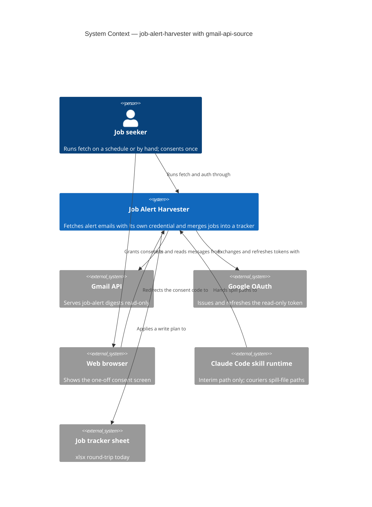
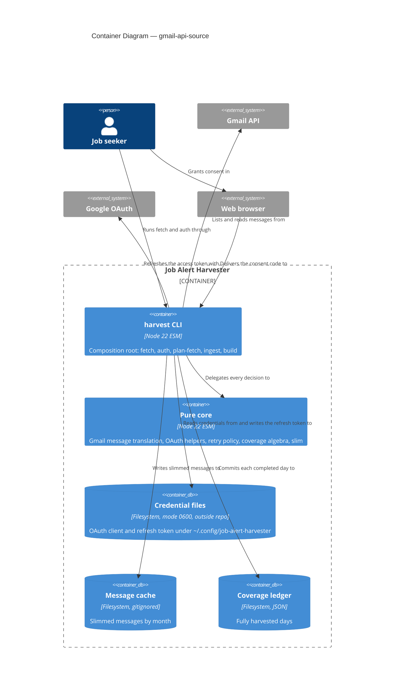

# Feature Delta — gmail-api-source

Narrative record of the DESIGN wave for `gmail-api-source`. Architecture detail lives in
`docs/product/architecture/brief.md` (`## Application Architecture`, section 12). Decisions
live in `docs/decisions/DR-NNNN-*.md`. Mode: propose. Items under *Open Questions* await the human;
nothing there is decided.

---

## Wave: DESIGN / [REF] Upstream Consultation

| Artifact | Read | Bearing on this wave |
|---|---|---|
| `docs/feature/gmail-api-source/BRIEF.md` | ✓ | Scope; stands in for DISCUSS |
| `docs/decisions/DR-0011-gmail-credential-is-internal-oauth-readonly.md` | ✓ | Proposed; its settled points are treated as constraints, not re-litigated |
| `docs/decisions/DR-0002` (coverage intervals, one-day windows) | ✓ | Window discipline; fail-closed commit |
| `docs/decisions/DR-0003` (agent couriers paths) | ✓ | `MessageSource` port; named successor obligation; probe contract |
| `docs/decisions/DR-0005` (target sheet plan port) | ✓ | Sheets adapter shares credential work; scoped out here |
| `docs/decisions/DR-0007` (spill contract is what the harness writes) | ✓ | Lesson: test models are copied from real payloads, never composed |
| `docs/decisions/DR-0009` (build derives from whole cache) | ✓ | Unaffected: fetching changes, derivation does not |
| `docs/product/architecture/brief.md` | ✓ | Extended, not recreated |
| `docs/architecture/atdd-infrastructure-policy.md` | ✓ | Gmail API becomes the first Driven external/non-deterministic port |
| `src/adapters/raw-spill-source.mjs`, `src/cli/fetch-loop.mjs`, `src/core/gmail-query.mjs`, `src/cli/harvest.mjs`, `src/adapters/ledger-store.mjs`, `src/adapters/message-cache.mjs`, `src/core/slim.mjs`, `src/core/coverage.mjs`, `src/core/sources/linkedin.mjs` | ✓ | Basis of the Reuse Analysis |
| `tests/acceptance/job-alert-harvester/fetch-loop.test.mjs`, `probe-contracts.test.mjs` | ✓ | Current truth for the loop and for probe-test style |
| `docs/feature/job-alert-harvester/feature-delta.md` | ✓ | Format precedent |
| DISCUSS artifacts | ⊘ | Deliberately skipped; `BRIEF.md` stands in |

---

## Wave: DESIGN / [REF] Domain Language

No separate DDD pass: one bounded context (Acquisition) is being filled in behind an existing port.

| Term | Meaning here |
|---|---|
| **Window** | One inclusive UTC calendar day (DR-0002 one-day windows, amended 2026-09-13) |
| **Listing** | Every message id Gmail reports for a window, paginated to exhaustion |
| **Settled day** | A UTC day that has fully ended; the only kind `fetch` may cover |
| **Refusal** | A named, dotted error code (`gmail.*`, `auth.*`, `fetch.*`); never a raw HTTP error |
| **Credential** | The OAuth client file plus the refresh-token file under `~/.config/job-alert-harvester/` |

Anti-corruption layer: `core/gmail-message.mjs` is the only place that knows Gmail's resource
shape. Everything downstream sees the cache record shape (`date, id, plaintextBody, sender,
snippet, subject`) that `slim` already consumes (DR-0007 fixture parity). Nothing in core learns
the word "Gmail" beyond that one module and `gmail-query.mjs`.

---

## Wave: DESIGN / [REF] Component Decomposition

Style unchanged: Pure Core / Imperative Shell (ports-and-adapters), functional paradigm.

| Component | Path | Layer | Change | Contract shape |
|---|---|---|---|---|
| Gmail resource to cache record | `src/core/gmail-message.mjs` | core | new | pure |
| OAuth helpers (auth URL, callback parse, token request/response parse, expiry, PKCE challenge, credential-file shape) | `src/core/oauth.mjs` | core | new | pure |
| Retry decision | `src/core/retry-policy.mjs` | core | new | pure |
| Settled-day clamp | `src/core/coverage.mjs` | core | extended (one function) | pure |
| Source descriptor exposes its sender | `src/core/sources/linkedin.mjs` | core | extended (data field) | pure |
| Credential store | `src/adapters/credential-store.mjs` | shell | new | bounded-change: `~/.config/job-alert-harvester/{client,token}.json` + sibling tmp |
| Access-token source | `src/adapters/google-token-source.mjs` | shell | new | bounded-read except one POST to the token endpoint; writes only through the injected store |
| Gmail API source | `src/adapters/gmail-api-source.mjs` | shell | new | bounded-read: receives a GET-only capability, so a write is unrepresentable |
| Loopback callback listener | `src/adapters/oauth-loopback.mjs` | shell | new | bounded-change: one `127.0.0.1` socket, closed on return |
| Fetch loop | `src/cli/fetch-loop.mjs` | shell | **amended (see Open Question OQ-1)** | orchestration |
| `auth` orchestration | `src/cli/auth.mjs` | shell | new | imperative |
| Composition root | `src/cli/harvest.mjs` | shell | extended: `fetch`, `auth`, async main | imperative |

Adapters do not import each other. `google-token-source` and `gmail-api-source` receive their
collaborators (store, token provider, `fetch`, `now`, `sleep`) as arguments; `cli/harvest.mjs`
wires them.

---

## Wave: DESIGN / [REF] Driving Ports

| Surface | Effect |
|---|---|
| `harvest fetch --source <id> --from <d> --to <d>` | Clamps the range to settled days, then runs the fetch loop: one UTC day at a time, cache writes, coverage commit per day. Prints one progress line per committed window. Exit 1 with a named refusal on any failure. |
| `harvest auth` | One-off consent. Writes the token file. Prints the consent URL; never prints a token. |
| `plan-fetch`, `ingest`, `build`, `--in/--out` | Unchanged. `ingest` and the harvest skill remain the interim path until the operator retires them. |

Read/write split: `plan-fetch` stays read-only. `fetch` is a separate driving port because it
writes; it does not add a `--dry-run` (that is what `plan-fetch` is).

---

## Wave: DESIGN / [REF] Driven Ports and Adapters

### Port contract (Q1): `MessageSource` for Gmail

The port is unchanged: `list(window) -> [{id, date}]`, `read(id) -> payload | null`, `probe()`.
The one contract relaxation is that any of the three may return a Promise (see OQ-1); the
spill adapter stays synchronous.

| Port operation | Gmail calls | Mapping |
|---|---|---|
| `list(window)` | `users.messages.list` with `q = gmailWindowQuery(window, {sender})`, `maxResults=500`, follow `nextPageToken` until absent; then `users.messages.get?format=minimal` per id | `[{id, date}]` where `date` is `internalDate` (epoch ms) as second-precision UTC ISO, the same instant the `after:`/`before:` epoch bounds use |
| `read(id)` | `users.messages.get?format=full` | `toMessage(resource)` returns the spill-shaped message; 404 returns `null`, which the loop already refuses as unreadable |
| `probe()` | see below | see below |

Choices and why:

- **`format=full`, not `raw`.** `raw` is RFC 822 and needs a MIME parser (a new dependency, the thing DR-0011 avoids). `full` gives a parts tree; `toMessage` walks it to the `text/plain` part, base64url-decodes it, and takes `subject`/`From` from headers. `sender` is reduced to the bare lowercase address, because `linkedin.matches` is exact-equality on the bare address.
- **`list` returns dates via `format=minimal`.** The port stays identical to the spill adapter's (`{id, date}`), and `list` can refuse `gmail.outside-window` exactly as the spill adapter does. Cost is one extra 5-unit call per message; a day is about 6 messages.
- **Envelope check.** Gmail omits `messages` when a window is empty, so absence alone proves nothing. A list response must carry a numeric `resultSizeEstimate`; otherwise `gmail.list-malformed`. This is what stops an error page or `{}` reading as an empty, committable day.
- **`resultSizeEstimate` is never used as a count.** Gmail documents it as an estimate.
- **`includeSpamTrash` stays at its default (false).** Alerts in spam or trash are not harvested; the same was true of the connector search.
- **Missing `text/plain` refuses** `gmail.missing-plaintext-body`, naming the id (DR-0007 spill contract, item 3: same rule, same reasoning).

### What the count check compares (Q1)

Unchanged in `runFetchLoop`, and it is the whole guarantee now that `--expect` is gone:
the ids **the source listed** (paginated to exhaustion, de-duplicated across pages) against the ids
**the cache reader reports after the writes**, quarantined ids excepted. `list`, `read`, `ids()` are
three independent calls, so the source cannot self-certify. `messageCount` on the interval is the
listed count including already-cached ids, as with the spill path.

The adapter adds three pre-conditions that make "listed" trustworthy: the list envelope check; a
page that fails mid-listing refuses `gmail.list-incomplete` rather than returning a prefix (a repeated
`nextPageToken` refuses the same way); and `read` refuses `gmail.id-mismatch` if the returned
resource's id differs from the requested one (DR-0003 Rule 2, keyed by the id inside the payload).

### `probe()` contract (Q2)

Wire, then probe, then use. Everything is read-only, so a failed probe leaves nothing half-done.

| Proves | Minimal call | Named refusal |
|---|---|---|
| Client file present, parseable, mode not wider than 0600 | none (filesystem) | `gmail.credential-missing`, `gmail.credential-invalid`, `gmail.credential-permissions` |
| Token file present, parseable, mode not wider than 0600 | none (filesystem) | same three |
| Token refreshes | `POST oauth2.googleapis.com/token`, `grant_type=refresh_token` | `gmail.reauth-required` on `invalid_grant`; `gmail.token-endpoint-error` otherwise |
| Granted scope is exactly `gmail.readonly` | `scope` field of the token response | `gmail.scope-mismatch` (narrower or wider) |
| Token really works and is for the recorded mailbox | `GET users/me/profile` | `gmail.unauthorized` (401/403), `gmail.wrong-mailbox` (address differs from the one recorded at `auth`) |
| Query resolves, quota not exhausted, sender matches something | `GET users/me/messages?q=from:<sender>&maxResults=1` | `gmail.query-rejected` (400), `gmail.quota-exhausted` (429 or 403 rate reasons), `gmail.list-malformed`, `gmail.sender-matches-nothing` |

The last row exists because an empty window commits coverage. A wrong sender or a wrong mailbox would
otherwise mark every day "covered, zero messages": the silent-loss shape DR-0002 exists to prevent.
Gmail has no quota introspection, so "quota not exhausted" can only be shown by making a call; this is
stated, not hidden.

The three probe-fault-injection layers: (1) a test that every module in `src/adapters/` exports
`probe`; (2) a fault suite per adapter against the fake HTTP boundary, one scenario per refusal above;
(3) a sentinel test that seeds a recognisable token string and asserts it appears in no stdout, stderr,
cache file, or refusal message across every scenario (DR-0011: no credential value in output).

### Auth (Q3): where each piece lives

| Piece | Home | Notes |
|---|---|---|
| PKCE challenge (SHA-256 of verifier, base64url) | core, `oauth.mjs` | hash function injected; core imports no `node:` builtin |
| Consent URL builder | core | includes `access_type=offline`, `prompt=consent`, `code_challenge_method=S256`, `state`, scope `gmail.readonly` |
| Callback parse and state check | core | refuses `auth.state-mismatch`, `auth.consent-denied`, `auth.no-code` |
| Token request/response parsing, `invalid_grant` mapping, expiry with skew | core | pure decisions over `(status, json, now)` |
| Random verifier and state, SHA-256 | `cli/auth.mjs` (node:crypto) | composition root may use builtins |
| Listener on `127.0.0.1:0`, timeout, single-use, closed on return | adapter `oauth-loopback.mjs` | binds loopback only; serves one static "you can close this tab" page |
| Code exchange, refresh | adapter `google-token-source.mjs` | code exchange is never retried (single-use code) |
| Token and client files, atomic 0600 write, mode check | adapter `credential-store.mjs` | directory created 0700; symlinks and non-regular files refused |

`auth` sequence: read client file (refuse if wider than 0600) → listen → print consent URL (no browser
spawn) → await callback → verify state → exchange code with verifier → refuse `auth.no-refresh-token` if
absent → confirm granted scope → `users/me/profile` to record the mailbox → write the token file.
Token file: `{version, refreshToken, scope, emailAddress, obtainedAt}`. The access token is **not
persisted**: it is refreshed once per process and re-checked with a pure `isExpired(now, skew)`; a 401 mid-run
triggers one refresh and one retry. A rotated refresh token in a refresh response is persisted.

Client file is the JSON as downloaded from Google Cloud (`installed` shape). Desktop clients still need
`client_secret` at the token endpoint, which is why the client file is mode-checked too (DR-0011).

### Retry, backoff, quota (Q5): see OQ-3

Whichever option is chosen, the decision is a **pure function** (`retry-policy.mjs`) returning
`{retry, delayMs}` or `{retry:false, refusal}`; the adapter only sleeps (injected `sleep`, injected
jitter) and re-issues. Only idempotent GETs and the refresh POST are retried. Scale check: about 6
messages a day means about 15 calls a day against a 250 units/s per-user quota; quota is a correctness
question, not a capacity one.

Resume idempotency is already in the loop: ids present in the cache are skipped without a `read`, and
still counted in `messageCount`. An interrupted run leaves the cache warm and coverage uncommitted for the
open day; the next run re-lists that day and completes it.

### Wiring the `fetch` subcommand (Q4)

`fetch --source <id> --from <d> --to <d>`:

1. Parse and `validateInterval`; resolve the source descriptor and its `sender`; unknown source refuses `fetch.unknown-source`.
2. Clamp `to` to the last settled day (OQ-4); an empty range prints "nothing settled to fetch" and exits 0.
3. Wire: credential store → token source → Gmail source; ledger, cache, reader as in `ingest`.
4. `runFetchLoop` probes ledger, cache, source, then walks one UTC day at a time. Coverage commits per day, only after every listed id is cached or quarantined (DR-0002). `ledger.commit` is the only coverage writer.
5. `harvest.mjs` main becomes async; a refusal prints `code: detail` to stderr and exits 1, as today.

`build` is untouched (DR-0009: fetching windows never narrow derivation).

### Test seam (Q6): see OQ-2

The Gmail API and the Google token endpoint are **Driven external / non-deterministic** ports and
need a fake. Existing CLI-level acceptance tests drive a real subprocess with `spawnSync`, which
blocks the test process's event loop, so an in-process HTTP fake cannot answer while the CLI runs.
That constraint shapes the options.

The fake's payloads are **copied from a real `users.messages.get?format=full` response** by script
(redacted, htmlBody truncated), following DR-0007: a test model composed from memory is how the spill
contract went wrong. The fake also models Gmail's lies: absent `messages` on empty windows,
`resultSizeEstimate` that disagrees with reality, a repeated page token, 429 with `Retry-After`, 403
with a rate reason versus an authorisation reason, `invalid_grant`, a token response with no refresh
token.

Proposed row for `docs/architecture/atdd-infrastructure-policy.md` (DISTILL owns the edit):
`MessageSource — Gmail API | fake at the HTTP boundary (see OQ-2) | fixtures copied from a real response`.

---

## Wave: DESIGN / [REF] Technology Choices

| Choice | Version | License | Status |
|---|---|---|---|
| Native `fetch`, `node:http`, `node:crypto`, `node:fs` | Node 22 | — | existing runtime; **no new dependency** |
| Google OAuth 2.0 (loopback + PKCE S256) | — | — | per DR-0011 |
| Gmail REST API v1 (`gmail.readonly`) | v1 | — | per DR-0011 |
| `googleapis`, `google-auth-library` | — | Apache-2.0 | **not adopted**, per DR-0011; brief's earlier "future" row corrected |
| `fast-check` | ^4.10.2 | MIT | already a dev dependency; use for base64url/parts-tree walking and retry-schedule properties |
| dependency-cruiser | ^16 | MIT | dev-only; rules below |

Runtime dependencies stay at one (`xlsx`). Cognitive Load Tax: the hand-written surface is four endpoints
(token, `profile`, `messages.list`, `messages.get`); see the DR-0011 flag below.

### Architecture enforcement

Style: Pure Core / Imperative Shell. Language: JavaScript (ESM). Tool: dependency-cruiser.
Rules: `src/core/**` imports no `node:` builtin and no adapter; adapters import no other adapter;
`gmail-api-source` imports no `node:fs`, `node:http`, or `node:child_process`; `credential-store` is the only
module that touches `~/.config`. Beyond dependency-cruiser: an AST check that core never references
global `fetch` and that `gmail-api-source` issues GET only.

---

## Wave: DESIGN / [REF] Design Decisions

Settled by DR-0011 (proposed) or by the existing DRs; recorded here as constraints.

| ID | Decision | Rationale | Source |
|---|---|---|---|
| GD-01 | Internal OAuth Desktop client, `gmail.readonly`, loopback + PKCE `auth`, native `fetch`, 0600 files under `~/.config/job-alert-harvester/` | Least authority; no dependency | DR-0011 |
| GD-02 | The port is unchanged: `list`, `read`, `probe`; the source's own listing is the expected set | `--expect` leaves with the agent | DR-0003 successor obligation |
| GD-03 | `format=full` decoded in a pure core ACL; `raw` rejected | `raw` needs a MIME parser | this wave |
| GD-04 | `list` returns `{id, date}` via `format=minimal`; date is `internalDate` | Port parity; query bounds are `internalDate` | this wave |
| GD-05 | Empty-window guards: list envelope check plus sender-matches-something probe | An empty window commits coverage | DR-0002 |
| GD-06 | Missing `text/plain` refuses, named | Same rule as the spill contract | DR-0007 |
| GD-07 | Access token in memory only; refresh once per process | Fewer secrets at rest | DR-0011 |
| GD-08 | Only `credential-store` touches `~/.config`; adapters receive collaborators, never import each other | Capability injection; enforceable | project rule |
| GD-09 | The Gmail source receives a GET-only capability | "Read-only adapter wrote" is unrepresentable | Effect isolation |
| GD-10 | Retry decision is a pure function; the adapter only sleeps | Testable without a clock | functional paradigm |
| GD-11 | `build`, `plan-fetch`, `ingest`, the skill: unchanged | Swap touches wiring only | DR-0003, DR-0009 |
| GD-12 | The Sheets adapter is out of scope; `auth` and the token file are scope-parameterised only in that the scope is a single constant | Undecided; see OQ-5 | DR-0005 |

---

## Wave: DESIGN / [REF] Reuse Analysis

**Hard gate.** Default is EXTEND.

| Capability | Existing code | Verdict | Evidence and contract shape |
|---|---|---|---|
| Walk uncovered days, fail-closed commit | `src/cli/fetch-loop.mjs` | **EXTEND** (one mechanical change, OQ-1) | Logic unchanged. It calls `source.list/read/probe` synchronously (`fetch-loop.mjs:26-49`); a network source cannot satisfy that. Universe: cache + ledger; assertion: `assertStateDelta` as in `ingest-fail-closed.test.mjs` |
| Window to Gmail query | `src/core/gmail-query.mjs` | **EXTEND**, unchanged | Epoch-second bounds already match `internalDate`. Pure. Sender comes from the descriptor |
| Sender for the query | `src/core/sources/linkedin.mjs:8` | **EXTEND** | `SENDER` is module-private; expose it as a data field on the descriptor and derive `matches` from it. Pure |
| Slim and quarantine | `src/core/slim.mjs` | **EXTEND**, unchanged | The Gmail ACL emits the spill-shaped message, so `slim` and its quarantine checks apply as-is |
| Interval algebra | `src/core/coverage.mjs` | **EXTEND** | Add the settled-day clamp beside `nextUncoveredDay`; reuses its day arithmetic. Pure |
| Ledger, cache writer, cache reader | `ledger-store.mjs`, `message-cache.mjs`, `json-message-reader.mjs` | **EXTEND**, unchanged | Used exactly as `ingest` uses them |
| Composition root | `src/cli/harvest.mjs` | **EXTEND** | Adds `fetch` and `auth`; async main. The `ingest` block at `harvest.mjs:45-92` duplicates the loop's per-window work and is left alone: it serves the agent path |
| Gmail resource to cache record | none | **CREATE NEW** `core/gmail-message.mjs` | Challenged against `slim`: slim assumes the spill shape; translating Gmail's parts tree there would put connector and API knowledge in one module. Pure |
| OAuth pure helpers | none | **CREATE NEW** `core/oauth.mjs` | No existing home. Pure |
| Retry decision | none | **CREATE NEW** `core/retry-policy.mjs` | No existing home. Pure |
| Credential files | none | **CREATE NEW** `adapters/credential-store.mjs` | Challenged against `ledger-store`: different path, mode rule, and secret-handling contract. Bounded-change: `~/.config/job-alert-harvester/**` |
| Token endpoint client | none | **CREATE NEW** `adapters/google-token-source.mjs` | Network plus refresh state; kept out of the Gmail source so a Sheets adapter can reuse it later |
| Gmail HTTP source | `raw-spill-source.mjs` (same port) | **CREATE NEW** `adapters/gmail-api-source.mjs` | Same port, different substrate; the spill adapter stays for the interim path |
| Loopback listener | none | **CREATE NEW** `adapters/oauth-loopback.mjs` | Only place a socket is opened |

**7 CREATE NEW modules, 8 EXTEND rows.** No existing module is discarded.

---

## Wave: DESIGN / [REF] Open Questions

Resolved by the human on 2026-09-29 unless marked otherwise.

| # | Question | Resolution |
|---|---|---|
| OQ-1 | Make the fetch loop async? | **Resolved: option A.** `runFetchLoop` becomes `async`. The two `toThrowError` assertions in `fetch-loop.test.mjs` become `rejects.toThrowError`; the human approved that mechanical edit, and it must not change what the tests assert |
| OQ-2 | Test seam for the Gmail/token HTTP boundary | **Taken as recommended, not yet ratified: option C.** Injected `fetch` for adapter and auth fault suites, one CLI scenario against a loopback-only local fake. The override must refuse non-loopback hosts |
| OQ-3 | Retry/backoff for 429 and 5xx | **Resolved: option B.** Three attempts, exponential backoff with jitter, honour `Retry-After`, 403 rate reasons treated as 429; a pure decision function in core |
| OQ-4 | Never cover a day that has not ended | **Resolved: option B.** Clamp `--to` to yesterday UTC |
| OQ-5 | Sheets API target adapter in scope? | **Taken as recommended, not yet ratified: defer.** It needs a wider scope, a second consent and its own decision record |
| OQ-6 | DR-0011 wording | **Amended to 0.3.0:** three REST calls including `users/me/profile`; the permission rule is any group or other bit refused plus a `0700` directory. DR-0011 stays `proposed` |

---|---|---|---|
| OQ-1 | **Make the fetch loop async?** `runFetchLoop` is synchronous; native `fetch` is not. "Reuse unchanged" cannot hold. | A: `async` loop, `await` on the three source calls (awaiting a sync value is harmless, so the spill source and the ledger/cache are untouched). Existing `fetch-loop.test.mjs` assertions change from `toThrowError` to `rejects.toThrowError`: equivalent, but it edits tests. B: a sync-over-async worker process. C: a second async loop beside the first. | **A.** B hides latency and adds a process; C duplicates the fail-closed logic that must have one copy. The test edit is mechanical, but it is yours to approve given the no-weakening rule |
| OQ-2 | **Test seam for the Gmail/token HTTP boundary** | A: injected `fetch` only (fast, direct adapter tests; the CLI wiring is unpinned). B: local `node:http` fake only, with a loopback-only base-URL override env var (real `fetch`, real CLI subprocess; needs an async spawn or a fake in a child process because `spawnSync` blocks). C: both. | **C**: injected `fetch` for adapter and auth fault suites, one CLI-level scenario against the local fake. B alone makes 20 fault scenarios slow and awkward; A alone leaves `fetch` wiring untested. The override must refuse non-loopback hosts, or it becomes a token-exfiltration switch |
| OQ-3 | **Retry/backoff for 429 and 5xx** | A: none; refuse and let the next run resume (idempotent). B: bounded retry: 3 attempts, exponential backoff with jitter, honour `Retry-After`, treat 403 rate reasons like 429; pure decision function. C: B plus a circuit breaker. | **B.** An unattended scheduled run that dies on one 503 is a poor trade for about 20 lines of pure code. A is defensible at this volume; C is overbuilt |
| OQ-4 | **Never cover a day that has not ended** | A: no clamp. B: clamp `--to` to yesterday UTC (days ending before now). C: B plus a settle lag (e.g. 6 h). | **B.** With A, a scheduled run at 10:00 UTC after the digest arrives commits today as covered and the rest of the day is silently lost. `internalDate` is receive time, so a lag buys little |
| OQ-5 | **Sheets API target adapter: in scope now?** Not designed here. | A: defer. B: do it with this feature, sharing the token source. | **A.** It needs a wider scope and a second consent (DR-0011 says the token is not shared), its own decision record, and `TargetSheet` already accepts a plan, so it is a swap when built. B removes the stale-upload hazard sooner but doubles the untested surface before the Gmail path has run against live mail |
| OQ-6 | **DR-0011 wording**: see the next section; needs your amendments or acceptance | — | — |

---

## Wave: DESIGN / [REF] DR-0011 and Neighbouring Records: Flags

Flags 1 and 2 are resolved by the DR-0011 0.3.0 amendment; the rest stand.

1. **DR-0011 says "two REST calls".** Design needs `users.messages.list`, `users.messages.get` (two formats), and `users/me/profile` for the wrong-mailbox and scope probe. DR-0011's Exception 3 revisits the dependency tradeoff if hand-written handling "grows past the two operations". `profile` is a third; drop it (losing `gmail.wrong-mailbox`) or amend the record.
2. **"Mode wider than 0600" is ambiguous.** Design refuses any group or other permission bit and tolerates owner bits beyond `rw`. It also requires the directory to be 0700. Amend to say so.
3. **BRIEF.md and `brief.md` say "label/query resolves" and "service account".** The design uses a sender query, no label, and DR-0011 chose OAuth. The stale statements in `brief.md` are corrected in this wave; the prior feature's `feature-delta.md` is history and untouched.
4. **DR-0003 Exceptions:** "the skill then becomes optional convenience". Design keeps `ingest` and the skill, so nothing retires yet. When it does, DR-0007's spill contract retires with it (its own Exception says so).
5. **`ingest` hard-codes `source: 'linkedin'`** (`harvest.mjs:79`); `fetch` takes `--source`. Harmless with one registered source; the mismatch is real when a second lands.
6. **Highest residual risk, not a contradiction: parity of `plaintextBody`.** The connector's `plaintextBody` and the API's `text/plain` part may differ in whitespace or rendering, and `sender` must be normalised to the bare address or `linkedin.matches` silently routes mail to `Unmatched`. DELIVER should close it with a one-off check: fetch one already-cached message through the API and compare both the record and the `extractJobs` output.

---

## Wave: DESIGN / [REF] External Integrations

```
External Integrations Requiring Contract Tests:
- Gmail REST API v1 (users.messages.list, users.messages.get, users/me/profile): message ids, internalDate, parts tree
  Recommended: consumer-driven contracts via Pact-JS in CI acceptance stage; for a single-user tool, record-and-replay fixtures copied from real responses are the cheaper first step
- Google OAuth 2.0 token endpoint (refresh_token and authorization_code grants): token response, invalid_grant
  Recommended: same fixtures-first approach; the invalid_grant and no-refresh-token responses are the ones worth pinning
```

---

## Wave: DESIGN / [REF] C4 Level 1: System Context



## Wave: DESIGN / [REF] C4 Level 2: Container



L3 is not drawn: the fetch subsystem's components are listed in *Component Decomposition* and are
each one function group behind an existing port.

---

## Wave: DESIGN / [REF] Handoff to DISTILL

Acceptance scenarios worth pinning (behaviour, not HTTP): probe refuses on each named refusal; `invalid_grant`
names `auth`; a credential file wider than 0600 refuses; an empty day commits only when the envelope is
valid and the sender resolves; a mid-listing failure commits nothing; an id listed but not cached commits
nothing; a resumed day skips cached ids and still commits once; today's UTC day is never covered
(pending OQ-4); the sentinel token appears nowhere; the consent flow refuses a state mismatch and a missing
refresh token. Fixtures are copied from a real response, not composed.

---

## Wave: DEVOPS / [REF] Skipped

`NOT_APPLICABLE:` no deployment target — a local CLI run by one operator. Scheduling, CI and the `xlsx` advisory remain open project-level items, out of scope for this feature. Skipped on the human's instruction, 2026-09-29.
