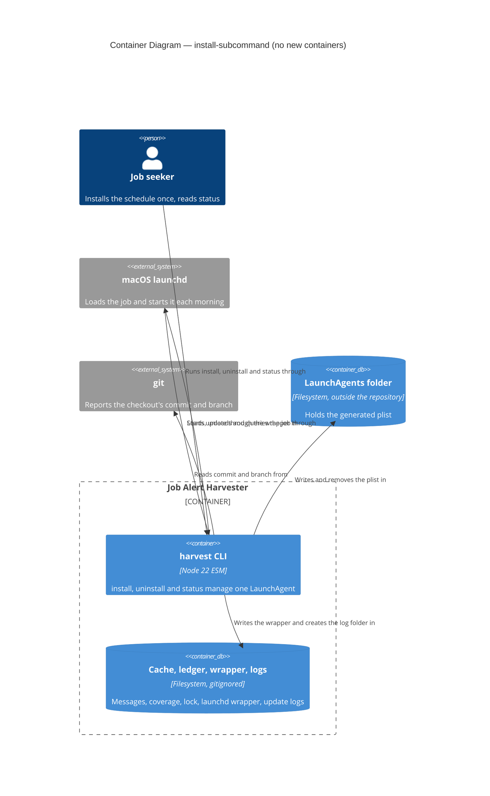
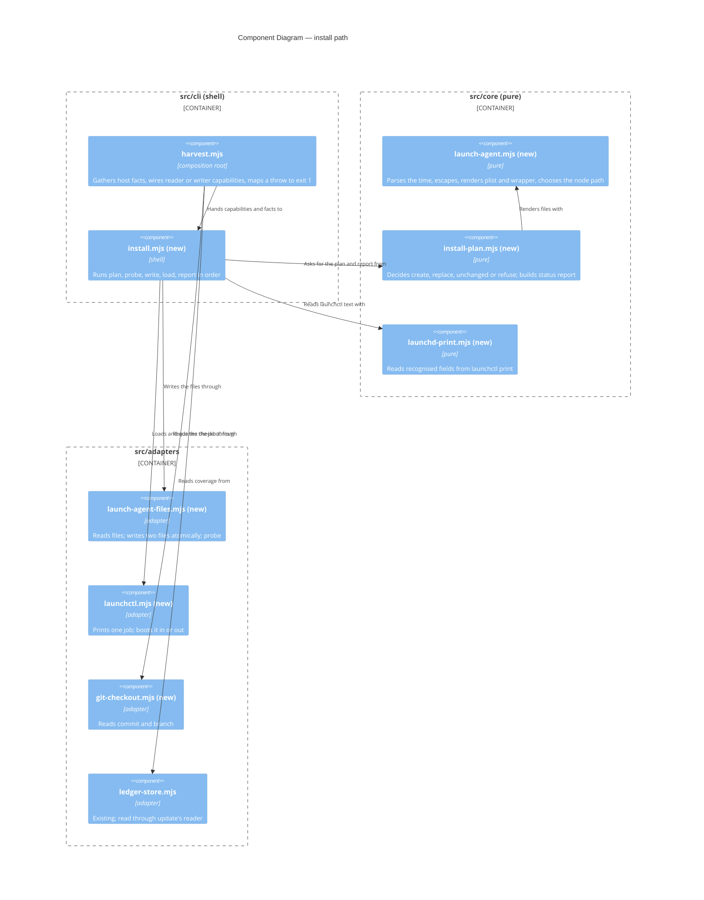

# Feature Delta — install-subcommand (DESIGN)

Doc type: Explanation plus Reference (same mix as `docs/feature/update-subcommand/feature-delta.md`). Assumed background: `harvest update` fetches new alert mail and builds the tracker Sheet in one command and fails closed (DR-0016, update owns the sequence); the operator runs it on macOS from a launchd LaunchAgent, which today is nine manual steps in `docs/how-to/run-update-on-a-schedule.md`.

Mode: propose. The human decided the scope on 2026-10-06 ("Option A": `install` writes the wrapper script and the LaunchAgent plist for the checkout it runs from; no pinned clone, no bundled app, no new runtime dependency; three subcommands `install`, `uninstall`, `status`; files by default, `launchctl` only with `--load`; `--dry-run`; `--at HH:MM` defaulting to 05:30; a refusal when the checkout is not on `main`). Every item under *Open questions* was ratified as recommended by the human on 2026-10-06. Nothing was built and no decision record was written yet.

Warnings carried by this wave:

- DISCUSS and DISCOVER were skipped by instruction; acceptance criteria are derived from the brief.
- No shell was available to this wave: nothing was run, `git` was not queried, `npm test` and `npm run check:arch` were not re-run, and the 1307-test baseline is the caller's figure. Every claim below comes from reading files.
- `.cache/` and `~/.config/job-alert-harvester/` were not read. Every path in this file is a placeholder.
- `launchctl print` output, `process.execPath` under version managers, and the macOS protected-folder behaviour are described from general knowledge and are **unconfirmed** here. Each has a manual probe in the slice plan.
- The branch `feat/update-lookback` and its parked design were not readable (no `git`). The claim that it requests the next record number is the caller's.
- Peer review by `nw-solution-architect-reviewer` was not run; the caller should dispatch it.

---

## Upstream consultation

| Input | Bearing |
|---|---|
| `src/cli/harvest.mjs` (read in full) | `SUBCOMMANDS` `:57`; `homedir()` for credentials `:152`; `LEDGER_PATH` `:66`; reader-only versus writer wiring `:493`; update's `readLedger` lambda `:534-538`; `runSubcommand` `:550-558`; dispatch and usage line `:564-587` |
| `src/cli/update.mjs`, `src/adapters/run-lock.mjs` | the preview-has-no-write-capability split `update.mjs:58-84`; an adapter with a probe, `node:fs` only `run-lock.mjs:4,85-110` |
| `src/core/cli-options.mjs` | tables `:16-25`; `DATE_OPTIONS` `:33-38`; validation after parsing `:118-122`; codes `:5-11` |
| `.dependency-cruiser.cjs` | six rules; `CAPABILITY_ADAPTERS` is a closed list `:2`; no rule mentions `child_process` |
| `tests/regression/job-alert-harvester/unknown-options-refused.test.mjs` | the option-table list `:275`; the any-valid-combination property `:292-321` |
| `tests/acceptance/update-subcommand/support/update-domain-types.mjs`, `gmail-api-source/support/gmail-domain-types.mjs:240-272`, `search-yield-summary/support/fixed-clock.mjs` | subprocess runners, preload seam, workspace builders |
| `docs/how-to/run-update-on-a-schedule.md`, DR-0016 decisions 9, 10, 12, `brief.md:466`, `docs/evolution/2026-10-05-update-subcommand.md:52` | the manual procedure to reproduce; the stance this feature reverses; the how-to was never run |

## Findings from the code

1. **No `child_process` exists anywhere in `src/` or `scripts/`** (searched for `child_process`, `launchctl`, `osascript`, `process.platform`, `getuid`, `execPath`: no matches). The feature introduces the first process-spawning code, and `.dependency-cruiser.cjs` has no rule about it.
2. **The layering rules already allow what is needed.** `core-imports-no-node-builtin` binds `src/core` only (`.dependency-cruiser.cjs:7-12`); the closed `CAPABILITY_ADAPTERS` list (`:2`) names three adapters; any other adapter may import `node:fs` and `node:child_process` (as `run-lock.mjs:4` imports `node:fs`). `adapter-imports-no-sibling-adapter` (`:26-31`) forces one capability per adapter file and composition in `src/cli`. No rule *must* change; one *should* be added (Q-spawn).
3. **`.cache/` resolves against the working directory** for every subcommand (`cli.md:27`; `harvest.mjs:66`). `install` must therefore be tied to the cwd, not to the location of the script, or acceptance tests (which run the real `src/cli/harvest.mjs` from a temp workspace, `gmail-domain-types.mjs:240-243`) would read the repository's own `.cache` and `.git`.
4. **An option value is validated after tokens are parsed** (`cli-options.mjs:118-122`), and the regression property generates arbitrary text for every value option that is not in `DATE_OPTIONS` and expects it to parse back verbatim (`unknown-options-refused.test.mjs:298-301,313-317`). A time-valued option checked inside `parseCommandLine` turns that property red unless its generator is edited.
5. **HOME is `os.homedir()`** (`harvest.mjs:152`), which honours `$HOME`; the acceptance helpers already set `HOME` to a temp directory (`sheets-domain-types.mjs:242`). `~/Library/LaunchAgents` can therefore be redirected in tests, and the danger is a test that forgets to set it (see Testing).
6. **The how-to's wrapper splices stderr into AppleScript text** (`how-to:43-44`): it deletes `"` and `\` and then interpolates the rest into an `osascript -e` string. Shell injection is not possible (a variable's value is not re-parsed by `sh`), and with quotes and backslashes removed the AppleScript literal cannot be closed, so it is probably safe, but its safety rests on one `tr` and no test. Passing the message as an argument to an AppleScript `on run` handler removes the question (Q-notify).
7. **The wrapper uses a relative `src/cli/harvest.mjs`** (`how-to:39`) and relies on `WorkingDirectory`. A generated wrapper should also `cd` to the checkout so it behaves the same when run by hand.
8. **The how-to has never been run** (`evolution:52`). The generator would automate unverified text, which is the riskiest unknown of this feature, more than the generator itself.
9. **DR-0016 and the brief say the opposite of this feature.** DR-0016 decisions 9, 10 and 12 give logging, notification and the scheduler "no harvester code"; `brief.md:466` states "Nothing darwin-specific enters `src/`". `install` puts platform-specific code in `src/`. That is a reversal, so it needs a record (Decision record).

---

## Component decomposition

Style unchanged: Pure Core / Imperative Shell, functional paradigm (`CLAUDE.md`). Three small core modules, one shell module, four adapters. The names are proposals; the crafter may merge the three core modules if the result is under about 150 lines each.

| Component | Path | Layer | Change | Contract shape |
|---|---|---|---|---|
| Launch agent text | `src/core/launch-agent.mjs` | core | **new** | pure-function. Constants (`LABEL`, `DEFAULT_AT`, relative paths of wrapper and logs); `parseAt(text)` returns `{ hour, minute }` or a refusal value; `renderPlist(spec)`, `renderWrapper(spec)`; `shellQuote`, `xmlEscape`; `pathsFor(root, home)`; `chooseNodePath(candidates, execPath)` |
| Install planning | `src/core/install-plan.mjs` | core | **new** | pure-function. `planInstall(facts, options)` returns an install plan value or a refusal value; `planUninstall(facts, options)`; `reportStatus(facts, printed)`; `InstallRefusal` enum; the summary lines of each |
| Launchd print reading | `src/core/launchd-print.mjs` | core | **new** | pure-function. `readLaunchdPrint(text)` returns the recognised fields; never throws on unknown text |
| Install shell | `src/cli/install.mjs` | shell | **new** | imperative, capability-injected: `runInstall`, `runInstallPreview`, `runUninstall`, `runUninstallPreview`, `runStatus`. Previews and `status` are handed read capabilities only |
| Launch-agent files | `src/adapters/launch-agent-files.mjs` | adapter | **new** | `createLaunchAgentFiles()` returns a **reader** (read text, modification time, is-executable, real path) and a **writer** (atomic write with mode, remove, make directory). Writer universe: the plist, the wrapper, their `.tmp` siblings, `.cache/launchd/`, `.cache/logs/`. Probe on the writer only |
| Launchctl | `src/adapters/launchctl.mjs` | adapter | **new** | `createLaunchctl({ uid, label, plistPath })` returns a **reader** (`print`) and a **controller** (`bootstrap`, `bootout`). The factory closes over the label and plist path, so the capability cannot address any other job. Spawns the bare name `launchctl` |
| Git checkout | `src/adapters/git-checkout.mjs` | adapter | **new** | read-only. `read(root)` returns `{ commit, branch }` (branch null when detached) or null when not a checkout. Runs two fixed `git` invocations and nothing else |
| Composition root | `src/cli/harvest.mjs` | shell | extend | add three names to `SUBCOMMANDS` (`:57`), three cases in `runSubcommand` (`:550`), header lines, a host-facts gatherer. Extract update's inline `readLedger` lambda (`:534-538`) into a named function shared with install; no output change |
| Option tables | `src/core/cli-options.mjs` | core | extend | three entries (below); no `DATE_OPTIONS` change |

Pure versus effect:

| Pure (core) | Effect (shell or adapter) |
|---|---|
| Parsing and validating `HH:MM`; escaping for XML and for `sh`; rendering the plist and the wrapper | Reading `process.platform`, `process.getuid()`, `process.execPath`, `process.argv[1]`, `process.cwd()`, `os.homedir()`, the `PATH` entries (all in `harvest.mjs`, passed in as a facts value) |
| Choosing the node path from candidates; the not-on-`main` decision; comparing existing file text with the rendered text (create, replace, unchanged, foreign) | Reading git, the ledger, existing files, file times, the real path of `PATH` entries |
| The plan value: files to write, directories to make, commands to print, warnings; refusals | Writing files, `launchctl bootstrap` and `bootout` |
| Reading `launchctl print` text; the status report; every printed line | `launchctl print`; printing |

**Effect isolation (principle: non-representable, not tested-around).**

| Command | Capabilities it is handed | Cannot do |
|---|---|---|
| `install --dry-run`, `uninstall --dry-run` | facts, file reader, git reader, ledger reader, launchctl reader (uninstall only) | write, remove, bootstrap, bootout |
| `install` | the above plus file writer; **no launchctl at all** unless `--load` | any `launchctl` call |
| `install --load` | the above plus launchctl reader and controller | touching any label other than the constant one |
| `uninstall` | file reader and writer, launchctl reader and controller | writing, only removing the two named files |
| `status` | facts, file reader, launchctl reader | every write and every control call |

The preview functions mirror `runUpdatePreview` (`update.mjs:78-84`), which holds no fetch capability. A reviewer can confirm the guarantee by reading the signature: a preview that never receives a writer cannot write.

**Contract shape per effect.** File writer: bounded-change, aggregate-bounded to the two generated files and two directories; unchanged content writes nothing (no touch of the modification time). Launchctl controller: bounded-change, one job. Readers: observation only; a reader exposes no write method (driving ports that only read stay split from those that write).

**Dependency rules.** Core imports core only. `install.mjs` imports core, `run-lock`-style adapter types by name only where it needs a refusal enum, and cli peers; it does not import `harvest.mjs`. Each adapter imports itself and core only (`adapter-imports-no-sibling-adapter`). `npm run check:arch` needs no change to pass; Q-spawn proposes one added rule.

**Earned Trust (what happens if the environment lies).**

| Dependency | Lie considered | Probe or guard |
|---|---|---|
| `~/Library/LaunchAgents` | missing, a file, read-only, no permission | writer probe: make the directory, create then rename then remove a `.probe` file in each target directory; refuse `install.not-writable` before the first real write. The probe runs on the writer only, so a dry-run never creates a stray file |
| Atomic replace | rename across volumes or a symlinked `.cache` | temp file is a sibling of the target in the same directory; the probe renames inside the target directory |
| `launchctl` | absent; no `gui/<uid>` domain (an SSH session); `bootstrap` already loaded | controller probe (only with `--load`): `launchctl print gui/<uid>` must succeed, else refuse `install.launchctl-failed` naming the domain; a loaded job is booted out before bootstrap |
| `git` | absent; not a checkout; detached HEAD | `read` returns null or a null branch, both treated as "cannot confirm `main`", never as `main` |
| `process.execPath` | a versioned path that vanishes on upgrade; symlink resolved | `chooseNodePath` prefers a `PATH` entry whose real path equals the running binary; warns on a version-like segment; the wrapper checks the node file exists at each run and notifies if not; `status` reports a missing node |
| `launchctl print` text | format is not an API and may change | the loaded fact comes from the exit status; text fields are best effort, each reads `unknown` when absent; an unrecognisable loaded job is `install.unrecognised-output` with the raw first lines on stderr (Q-status) |
| macOS protected folders | a checkout or node under `~/Documents`, `~/Desktop` or `~/Downloads` may be unreadable to a launchd job | unconfirmed here; `install` warns when the root or node path is under one; the manual smoke probe settles it |
| `launchd` HOME | `update` reads credentials from `os.homedir()` | unconfirmed that a LaunchAgent has `HOME` set; the smoke probe checks the log for `gmail.credential-missing`; add an `EnvironmentVariables` entry only if it does |
| Adapters honour their probe | an adapter that claims a probe but has none | proposed: a structural test that the two writing or spawning adapters export `probe` (the brief names a probe-presence test, `brief.md:207-208`; I found no such test under `tests/architecture/`, so it may live elsewhere or not exist: unconfirmed) |

### Behaviour contracts

**Facts.** One read-only value gathered in the composition root: platform, uid, home, cwd, the running script path, node execPath, `PATH` candidates with their real paths, git state, ledger intervals (or an unreadable marker), existing plist and wrapper text (or null), file times. All pure functions take it as an argument.

**Platform (all three commands).** Not `darwin`: refuse `install.unsupported-platform` before reading anything else. The uid is read with `process.getuid()` in the root and passed in as data, so core never touches `process`.

**Paths and names (proposals, Q-label, Q-wrapper).**

| Item | Value |
|---|---|
| Label | constant `local.job-alert-harvester.update` (no personal data) |
| Plist | `<home>/Library/LaunchAgents/<label>.plist`, mode 0644 |
| Wrapper | `<root>/.cache/launchd/update.sh`, mode 0755 |
| Logs | `<root>/.cache/logs/update.out.log`, `update.err.log` (as the how-to; `.cache/` is gitignored, `.gitignore:7`) |
| WorkingDirectory | `<root>` = the cwd, after the checkout identity check |
| Domain | `gui/<uid>`; job target `gui/<uid>/<label>` |

**Checkout identity.** `<root>` is the cwd, and `install` refuses `install.wrong-directory` unless the real path of `<cwd>/src/cli/harvest.mjs` equals the real path of the running script. This keeps `.cache/` semantics identical to every other subcommand and lets acceptance tests point a temp workspace at the real code through a symlinked `src`. Every path embedded in generated text must be absolute, free of control characters and newlines (`install.unsafe-path` otherwise), and is escaped on output.

**`install [--at HH:MM] [--dry-run] [--load] [--force] [--allow-any-branch]`.**

1. Platform, then `--at` (pure, before any read: a refused command line reads and writes nothing), then identity, then git: branch not `main`, detached, or not a checkout refuses `install.not-on-main` unless `--allow-any-branch`.
2. Plan: render both files; compare with what exists. An existing plist carrying the generated marker (a constant XML comment line) and the same text is **unchanged**; the same marker and different text is **replace** (schedule or node path changed); no marker is **foreign** (a hand-made how-to plist), refused `install.foreign-plist` unless `--force`; a marked plist whose `WorkingDirectory` is another checkout is refused `install.other-checkout` unless `--force`.
3. Output (stdout): checkout root, short commit and branch, "the job runs whatever this checkout holds, not this commit"; per file `create`, `replace` or `unchanged`; the exact next command, `launchctl bootstrap gui/<uid> <plist>`; if replacing, the preceding `launchctl bootout gui/<uid>/<label>` is listed first, because new text takes effect only after a reload. With `--dry-run`, the full text of both files follows, and nothing is touched. Warnings go to stderr: versioned node path, protected folder, no baseline (Q-baseline).
4. Effects, in order: probe the writer; make `.cache/launchd/` and `.cache/logs/`; write the wrapper then the plist, each atomically; with `--load`, probe the controller, read `print`, `bootout` if loaded, `bootstrap`, then `print` once more to confirm and report. A failure after files were written leaves them in place and refuses `install.launchctl-failed`; re-running is idempotent.
5. `--dry-run` with `--load` is allowed: it prints the commands it would run and runs none (no conflict code needed).

**`uninstall [--dry-run] [--force]`.** Universe: the job `<label>` in `gui/<uid>`, the plist, the wrapper. Order: read `print`; if loaded, `bootout` and stop with `install.launchctl-failed` leaving files if it fails; then remove the plist and the wrapper. Logs, `.cache/`, the ledger and credentials are never touched. Nothing installed (no plist, no wrapper, not loaded) prints "nothing to remove" and exits 0. A plist without the generated marker is refused `install.foreign-plist` unless `--force`.

**`status`.** Reads only. Prints on stdout: installed (plist present, marked or foreign), schedule from the plist, whether the files equal what `install` would write now (drift, with the first differing field named), loaded or not, `state`, `runs`, `last exit code` and `pid` when launchd reports them, node path exists or is missing, wrapper present, the modification times of the two log files, the last line of the output log. "Loaded" is the exit status of `launchctl print`; the other fields are read by `readLaunchdPrint` from named `key = value` lines and read `unknown` when absent, with one stderr line naming the raw command. A loaded job whose text yields no recognised field refuses `install.unrecognised-output` and prints the first lines raw to stderr. Exit 0 whenever a report was produced, "not installed" and a non-zero last exit code included (Q-status); launchd does not report a last-run time, so log file times stand in for it.

**Output streams and exit codes.** stdout: plans, results, status report. stderr: refusals (last line, `code: detail`, as `refusalLine` prints at `harvest.mjs:560-562`) and warnings. A refused command prints nothing on stdout. Exit 0 or 1 only, as update (`cli.md:34-36`).

**The wrapper's contract** (the crafter owns the text; these are the behaviours the tests pin):

1. Changes to the checkout root and exits non-zero with a notification if it cannot.
2. Notifies and exits 127 if the pinned node file is not executable, saying to run `harvest install` again.
3. Runs `update`, passing stdout through and replaying stderr to the log, as the how-to does.
4. On a non-zero exit, notifies with the last non-empty stderr line (control characters removed, cut at a fixed length, "exit status N" when empty), **passed to `osascript` as an argument to an `on run` handler and never spliced into script text**; the wrapper then exits with node's status. A missing or failing `osascript` never changes that status.
5. Removes its temporary file on every exit path.
6. Every embedded path is single-quoted with embedded single quotes escaped; the plist's strings are XML-escaped; both are tested with paths holding spaces, quotes, `&`, `<`, `$`, backticks.
7. It sets no `PATH` of its own, so a test can place a fake `osascript` first.

Nothing here changes `update`: the job still runs `harvest update` unchanged, and the only touch on update's code is the pure extraction of its ledger reader.

**Shared constants** (Interaction 10). `LABEL`, `DEFAULT_AT` (05:30, the quiet hour chosen against DR-0012, Sheets write window risk) and the relative wrapper and log paths live in `src/core/launch-agent.mjs`. `LEDGER_PATH` and `UPDATE_LOCK_PATH` stay in `harvest.mjs`. The lock and its recovery are untouched (`kickstart -k` can still leave a stale claim, which `update` already recovers).

**Proposed option table entries** (`cli-options.mjs:16-25`):

```
install:   { at: VALUE, 'dry-run': FLAG, load: FLAG, force: FLAG, 'allow-any-branch': FLAG }
uninstall: { 'dry-run': FLAG, force: FLAG }
status:    {}
```

`--at` is **not** added to `DATE_OPTIONS`; it is validated by `parseAt` in core with `install.invalid-time` (Q-at). `HH:MM` means two digits, `00`-`23`, colon, `00`-`59`, as strict as dates (`2026-2-1` is refused, `cli.md:28`).

**Refusal codes (proposed, family `install.*` shared by the three commands):** `install.unsupported-platform`, `install.invalid-time`, `install.wrong-directory`, `install.not-on-main`, `install.foreign-plist`, `install.other-checkout`, `install.unsafe-path`, `install.not-writable`, `install.launchctl-failed`, `install.unrecognised-output`. Warnings are plain `harvest install: warning: ...` lines, not codes.

## Driving ports

| Surface | Effect |
|---|---|
| `harvest install [--at HH:MM] [--dry-run] [--load] [--force] [--allow-any-branch]` | New. Writes the wrapper and the plist; with `--load` loads the job |
| `harvest uninstall [--dry-run] [--force]` | New. Boots out the job and removes the two files |
| `harvest status` | New. Read-only report |
| All existing subcommands, including `update` | Unchanged. A first word of `install`, `uninstall` or `status` stops selecting the rebuild form (`harvest.mjs:566-582`); no test or doc names those words as bad subcommands (searched `tests/`) |

## C4 Level 1 and Level 2

L1 (`brief.md` section 2) is unchanged except that launchd and `git` are now touched by the CLI itself. No new container.



## C4 Level 3: Component (install path)



## Reuse analysis

| Capability | Existing | Verdict | Evidence, contract shape |
|---|---|---|---|
| Preview holds no write capability | `runUpdatePreview` (`update.mjs:78`) | EXTEND the pattern | Same split for install and uninstall; reader versus writer factories as `wiring.reader()` and `wiring.writer()` (`harvest.mjs:493`) |
| Adapter with a probe | `createRunLock` (`run-lock.mjs:98`) | EXTEND the pattern | Probe the directory is writable, then demonstrate the property the adapter relies on |
| Option parsing and refusals | `parseCommandLine`, `refuse` shape | EXTEND | Three table entries; the `install.*` codes follow `refusalLine` (`harvest.mjs:560`) |
| "Is there a baseline" | `planUpdateRange` returns `update.no-baseline` | EXTEND (reuse unchanged) | install calls it with the ledger and no override to ask "would update refuse"; no duplicated rule. Pure |
| Ledger reading | `createLedgerStore` + `probe` + `read` (`harvest.mjs:534-538`) | EXTEND | Extract the lambda; update's behaviour unchanged |
| Home resolution | `homedir()` (`harvest.mjs:152`) | EXTEND (reuse) | Same source as the credential directory |
| Atomic write | `ledger-store.mjs` temp-then-rename | EXTEND the pattern | Not imported (sibling-adapter rule); restated in the new adapter |
| Subprocess runners, workspace builders, loopback origin | `runHarvestWith` (`gmail-domain-types.mjs:240`), `runHarvestAsync` (`:246`), `aScratchWorkspace`, `useWorkspaceCleanup` | EXTEND, never parallel | install needs no loopback origin (no network); use the same runners with a PATH-first shim directory |
| Preload seam | `fixed-clock.mjs` (`NODE_OPTIONS=--import`) | EXTEND the pattern | A sibling `fixed-platform.mjs` preload (no platform seam exists today). One small new support file, flagged |
| `launchctl`, `osascript`, `git` fakes | none | CREATE NEW | PATH shims (below); there is no process fake to extend |
| Plist and wrapper text, `HH:MM`, escaping | none (the how-to is prose) | CREATE NEW | `launch-agent.mjs` |
| Process spawning | none | CREATE NEW | `launchctl.mjs`, `git-checkout.mjs`; no existing alternative |

**9 CREATE NEW or new-pattern rows (4 new adapters or core text, 3 test shims, platform preload, plan module), 8 EXTEND rows.** Every new component is justified by "no existing alternative" above.

## Walking skeleton and slices

Walking skeleton: `harvest install` as a real subprocess in an isolated workspace: a temp HOME, a temp workspace holding a real `git init` checkout on `main`, a symlinked `src`, a ledger with one covered day, `PATH` starting with a shim directory. It exits 0, writes the plist under `<HOME>/Library/LaunchAgents` and the wrapper under `.cache/launchd`, prints the `bootstrap` command, and makes **zero** `launchctl` calls (the shim log is empty). A universe-bound delta (`tests/common/state-delta.mjs`) shows only those two files and two directories changed. The plist passes `plutil -lint` (on darwin only; skipped elsewhere) and the wrapper passes `sh -n`.

| Slice | Content | Done when |
|---|---|---|
| 0. Manual probe first | Run the existing how-to's nine steps once by hand against a scratch label, capture one real `launchctl print` sample, sanitise it into placeholders for a fixture | The how-to is shown to work or its defects are listed; `print` format observed, not assumed |
| 1. Skeleton | Option tables, `launch-agent.mjs`, `install-plan.mjs`, `install --dry-run`, reader capabilities, facts gatherer | Dry-run scenario green, universe-bound zero change |
| 2. Write | Writer adapter and probe, idempotence, replace, foreign refusal, `--force`, branch guard, platform refusal, `--at` | Walking skeleton green; second install changes nothing |
| 3. Wrapper | Generated wrapper executed under a fake `node` and fake `osascript` with hostile stderr | Scenarios green |
| 4. `--load` | Controller adapter, loaded-then-reload, failure leaves files | Shim-recorded call order asserted |
| 5. `status` | `launchd-print.mjs` against the sanitised real sample, drift, missing node | Scenarios green |
| 6. `uninstall` | Order, not installed, foreign refusal | Scenarios green |
| 7. Docs and record | DR-0018 (proposed), how-to, reference pages, staleness check | Check passes |

Slice 0 and the real `launchctl kickstart` smoke test are **manual probes only**: the fakes cannot prove that launchd accepts the plist, provides `HOME`, reads the working directory, or can read the wrapper under the chosen folder.

## Testing without launchd

- **Shim directory.** A helper writes small executable `sh` scripts named `launchctl`, `git` (optional), and `osascript` into a temp directory placed first on `PATH` (`PATH=<shim>:<original>` so `node` still resolves). Each shim appends its argv to a call log and answers from staged files: a canned `print` text and exit status per verb (loaded, not loaded, format-changed, bootstrap failing). This is the "PATH shim recording calls" style; there is no existing process shim to extend.
- **Bare-name invariant.** The adapters spawn the bare name `launchctl`, never an absolute path, so a shim always wins. A structural scenario asserts this, because an absolute call from a test would reach the operator's real launchd. A support-level guard also refuses to run any scenario whose `HOME` is not under the temp root.
- **Platform.** `fixed-platform.mjs` (preload) sets `process.platform` and `process.getuid` so scenarios run identically on a Linux CI host and make the unsupported-platform refusal reachable.
- **Git.** Real `git init` in the temp workspace with `GIT_CONFIG_GLOBAL` and `GIT_CONFIG_NOSYSTEM` neutralised, so branch scenarios (`main`, a feature branch, detached, not a checkout) exercise the real adapter. Alternative: a `git` shim; rejected as less honest.
- **Node path.** A symlink `<tmp>/bin/node` to `process.execPath` placed first on `PATH` exercises "stable entry preferred"; a symlink under a folder named like `v22.0.0` exercises the version warning. No fake node is needed for install; the wrapper tests use a fake `node` script that writes a hostile line and exits 3.
- **Wrapper hostility.** The generated wrapper runs under `/bin/sh` with the shim `node` and `osascript`. Stderr lines contain `"`, `\`, backticks, `$(touch <sentinel>)`, `; touch <sentinel>`, a leading `-`, a very long line, an empty stderr. Assert: sentinel absent, the recorded argument equals the sanitised line, the exit status is 3, the temporary file is gone.
- **Property tests (`fast-check`, pure layer only).** `parseAt` accepts exactly valid `HH:MM`; `xmlEscape` and `shellQuote` never emit an unescaped metacharacter (checked structurally); `planInstall` never throws and its writes are a subset of the two named paths; a plan built with the same facts twice is equal; `chooseNodePath` returns a candidate or the exec path.

## Scenarios the change touches

Nothing below may be edited without the human's approval.

| Existing test | Effect | Exact change needed |
|---|---|---|
| `tests/regression/job-alert-harvester/unknown-options-refused.test.mjs:275` | **Turns red** when the three tables are added | The expected sorted list becomes `['auth', 'build', 'fetch', 'import', 'ingest', 'install', 'plan-fetch', 'rebuild', 'status', 'uninstall', 'update']` |
| same file `:292-321` (valid combinations parse back verbatim, `valueFor` at `:298-301`) | Stays green **only if** `--at` is not validated in `parseCommandLine` (Q-at). If it were, the generator needs a time-valued arbitrary for `at` | None with the recommendation |
| same file `:278-290` and `:323-342` | Green: the empty `status` table has no options to loop over; the unknown-option message for `status` lists `valid: ` with nothing after it (cosmetic; noted for the crafter) | None |
| `tests/architecture/layering.test.mjs:44-50` | Green iff the new modules obey the rules (`npm run check:arch`). If Q-spawn is ratified, `:34-41` gains a rule and `BROKEN_TREE` (`:22-32`) a fixture module | An addition, not a weakening; needs approval |
| `tests/acceptance/update-subcommand/*` (5 files) and `tests/acceptance/search-yield-summary/search-yield-summary.test.mjs:464-465` | Green; the extraction of update's ledger reader must keep them so | None |
| `tests/acceptance/update-subcommand/update-plan.test.mjs:177-178` | Green: pins only the `update` table | None |
| docs | No test reads `docs/` or the README (searched `tests/`) | None |

## Decision record

**Recommend yes, and propose DR-0018 (install manages the launchd job) for the human to confirm.** DR-0017 is requested by the parked `update-lookback` design (the caller's statement; its branch was not readable here), so this feature takes the next number to avoid a clash; if the lookback record lands under a different number, renumber. Reasons it clears the bar that earned DR-0016: it reverses DR-0016 decisions 9, 10 and 12 and `brief.md:466` ("Nothing darwin-specific enters `src/`"); it introduces the first process-spawning adapters and a persistent background job outside the repository; and it adds a command contract (three subcommands, ten refusal codes, the files-by-default rule, the main-branch guard). It should record that DR-0016's notification and scheduling text is **refined, not superseded**: `update` itself still has no scheduler or notification code. DR-0016 gains a pointer at DELIVER (a `relatedTo` and a changelog line); it is not edited now.

## Lean Pivot

The decided scope is sound, but the heavy part is not the generator. It is the three-command surface, four adapters and a process-fake harness around a job the operator has not yet seen run once. Two leaner shapes, in order of savings:

| Option | Keeps | Drops | Trade-off |
|---|---|---|---|
| L1. `install` only | the three error-prone values generated, files by default, `--load`, guard | `uninstall` and `status`; `launchctl print` parsing | Uninstall stays two documented commands; status is `launchctl print` by eye. Roughly half the adapters and no format risk |
| L2. `scripts/install-schedule.mjs` outside `src/` | the same generator, tested through its pure core | the subcommand surface, the option-table edit, the DR-0016 reversal, layering enforcement of the spawning code | Scripts are operator-run and not crawled by `depcruise src` (`package.json:11`), so the effect rules go unenforced; discoverability drops |

**Recommend the decided scope, built in the slice order above with slice 0 first.** If slice 0 shows the how-to is broken, or the `print` sample is unusable, cut to L1. The risk to look at first is whether launchd accepts the generated job at all, not the polish of status output.

---

## Open questions

All fourteen were **ratified as recommended by the human on 2026-10-06**, with three confirmations: `uninstall` removes the plist and the generated wrapper script; the human approved extending the exact list at `tests/regression/job-alert-harvester/unknown-options-refused.test.mjs:275` with `install`, `status` and `uninstall`, and adding a fixture entry to `tests/architecture/layering.test.mjs` for the `child_process` rule; the decision record is DR-0018 (standalone, recording the reversal of part of DR-0016's no-harvester-code stance for scheduling). Slice 0, a manual run of the how-to by the human, comes before DISTILL. Names stand in for numbers.

**Q-node. Node path.**

| Option | Trade-offs |
|---|---|
| A. `process.execPath` as is, warn if versioned | Simple; unconfirmed, but libuv probably resolves symlinks, so under Homebrew this is the versioned Cellar path that breaks on upgrade |
| B. The first `PATH` entry whose real path equals the running binary (so a stable symlink such as the package manager's `bin/node`), else `execPath` with a warning; wrapper checks existence per run; `status` flags a missing file | Stable under Homebrew; still versioned under nvm-style managers, so the warning stays; one more fact to gather |
| C. Re-resolve in the wrapper (`command -v`, login shell) | Survives upgrades; launchd's `PATH` is minimal and version managers load in interactive shells, so it fails silently |

**Recommend B.**

**Q-label. Label.** A. constant `local.job-alert-harvester.update`; B. derived from a hash of the root (several checkouts coexist, but a moved checkout orphans the job and the hash is opaque in `launchctl list`); C. a `--label` option (more surface). **Recommend A**; a second checkout hits `install.other-checkout`, overridable with `--force`.

**Q-wrapper. Wrapper location.** A. `<root>/.cache/launchd/update.sh` (beside the logs, gitignored, removed with the job; `rm -rf .cache` breaks the job, which `status` reports); B. `~/Library/Application Support/<name>/` (survives a deleted checkout, orphaned and outside every other artefact); C. inline in the plist's `ProgramArguments` (no wrapper file; the escaping nests and nothing is readable). **Recommend A**, and `uninstall` removes the wrapper along with the plist (the brief said only "deletes the plist": confirm).

**Q-overwrite. Overwrite and reload.** A. refuse any differing plist without `--force`; B. replace an install-generated one atomically, refuse a foreign (hand-made) one without `--force`, unchanged is a no-op; C. always replace. **Recommend B.** For `--load` on a loaded job: bootout then bootstrap, after reading `print` (launchctl's behaviour for bootstrap of a loaded label is unconfirmed; the read avoids depending on it). Without `--load`, `install` never calls launchctl and prints the reload commands instead.

**Q-baseline. Empty ledger or no `.cache/`.** A. refuse; B. warn on stderr and proceed; C. proceed silently. The job would refuse `update.no-baseline` every morning, loudly through the notification, not silently. **Recommend B** (reuse `planUpdateRange`; no new flag); A is defensible.

**Q-identity. Checkout identity.** A. the cwd, verified against the running script's real path (`install.wrong-directory`); B. the script's location; C. a `--root` option. B would make tests read the real repository's `.cache` and `.git`. **Recommend A.**

**Q-branch. Override flag name.** A. `--allow-any-branch`; B. `--any-branch`; C. reuse `--force`. C overloads overwrite with a different risk. **Recommend A.** `not on main` includes detached HEAD and not a git checkout. A dirty working tree is not checked (the job also runs uncommitted edits): say so if you want a warning added.

**Q-at. `--at` validation.** A. `parseAt` in core, code `install.invalid-time`, no table change; B. a `TIME_OPTIONS` table beside `DATE_OPTIONS`, code `cli.invalid-time`, which also needs the regression property's generator extended (human-approved edit at `unknown-options-refused.test.mjs:298-301`); C. both. **Recommend A.** Cost: the "refused before anything is read" guarantee holds by step order, pinned by a scenario, not by the parser.

**Q-status. Status exit code and parsing.** A. exit 0 whenever a report was produced, fields best-effort, fail loud only when a loaded job is unrecognisable; B. exit 1 when not installed or last exit non-zero (usable in scripts, but not-installed is not a refusal in this CLI's vocabulary, `cli.md:34-36`); C. A plus a `--check` flag later. **Recommend A.** "Loaded" is `launchctl print`'s exit status; text fields are read from named lines only, tested against a sanitised real sample from slice 0.

**Q-notify. Notification hardening.** A. keep the how-to's `tr -d` and interpolate; B. pass the message as an `osascript` argument to an `on run` handler (the data is never parsed as script) plus a test with hostile lines; C. drop notification. **Recommend B.** Unconfirmed against macOS here; the manual smoke probe fires one real notification.

**Q-spawn. Containing `child_process`.** A. no rule (as `fs` today); B. add a dependency-cruiser rule: only `launchctl.mjs` and `git-checkout.mjs` may import `child_process`, with a fixture in `layering.test.mjs`; C. B plus a named spawn allow-list. **Recommend B.** Spawning is the strongest capability in the tree; the rule costs one entry and follows DR-0013's closed-list style (layering rules enforced by dependency-cruiser). The exact module-name pattern for a `node:`-prefixed built-in is unconfirmed and must be tried against the tool.

**Q-record. Record.** A. DR-0018 as above; B. fold into DR-0016 as an amendment (it would then claim two opposite stances); C. none. **Recommend A.**

**Q-howto. The how-to.** A. rewrite it as the install flow and move "what the generated files contain" into the CLI reference, no manual procedure kept; B. keep the manual steps as a second how-to (two copies drift, and the manual one is unverified); C. keep the manual steps inside the new how-to as a fallback (mixes a tutorial-style procedure into one page). **Recommend A.**

**Q-extract. Update's ledger reader.** A. extract a named function shared with install (covered by update's acceptance suite); B. duplicate four lines. **Recommend A.**

## Contradictions and gaps found

1. **DR-0016 versus this feature.** DR-0016 decisions 9, 10 and 12 and `brief.md:466` say no harvester code for logging, notification or scheduling, and nothing darwin-specific in `src/`. Not a code conflict; a pinned decision that this feature reverses in part. Surfaced, not resolved: the record in Decision record handles it.
2. **"Pinning to a commit" is not what option A does.** The brief's wording (the guard "prints the commit and branch it is pinning to") implies a pin. The job follows whatever the checkout holds when it fires, which is the reason for the guard. The printed text should say "installing for the checkout at `<commit>` on `<branch>`; the job runs whatever it holds", not "pinned".
3. **The how-to is unverified** (`evolution:52`), so the generator inherits untested text. Slice 0 addresses it.
4. **The probe-presence test the brief describes** (`brief.md:207-208`) was not found under `tests/architecture/` (only `layering.test.mjs`). It may live elsewhere; unconfirmed.
5. **`harvest status` reads as the status of the harvest**, not of the schedule. The names were decided by the human; flagged only because a first-time reader may expect cache or ledger state. `status` could print the ledger's last covered day, at the cost of mixing two subjects.
6. **Not verified:** the `launchctl print` field names and exit codes, whether `bootstrap` of a loaded label errors, `HOME` in a LaunchAgent, protected-folder behaviour, `execPath` symlink resolution, and the `osascript` argument form. All are manual probes in slice 0 and the smoke test.
7. No other fact in the brief contradicts the code. Verified: subcommand list and dispatch (`harvest.mjs:57,550-587`); the regression list at `unknown-options-refused.test.mjs:275` already contains `update`; DR-0016 is the last record in `docs/decisions/`.

## Technology and enforcement

No new dependency; Node built-ins only (`node:child_process`, `node:fs`, `node:os`, `node:path`), all in the adapters or the composition root. dependency-cruiser (DR-0013, layering rules enforced by dependency-cruiser; MIT) enforces layering; Q-spawn proposes one rule. `plutil` and `sh -n` serve as test oracles only. External integrations: none new (`launchd` is the operating system, not a consumed service); no contract-test annotation beyond the existing Gmail and Sheets one (`brief.md:211-228`).

## Docs that go stale at DELIVER

| Doc | Change |
|---|---|
| `docs/how-to/run-update-on-a-schedule.md` | Rewritten as the install flow (Q-howto); keep "Why 05:30", "Overlapping runs", "Fail closed", the failure table (the node-path and `kickstart` rows) |
| `docs/reference/cli.md` | Subcommand list `:15`; exit-code table `:34-36`; three command sections; Files table `:231-247` gains the plist, wrapper, logs and `.cache/launchd/`; what the generated files contain |
| `docs/reference/refusals.md` | New `install.*` section beside Update (`:126`) |
| `README.md` | Row `:45` and a new row; decision list `:89` |
| `docs/product/architecture/brief.md` | New section 17; decision index `:230-247`; **correct `:466`** ("Nothing darwin-specific enters `src/`") and `:18` at source |
| `docs/decisions/DR-0016-*.md` | Pointer to the new record; not edited by this wave |
| `src/cli/harvest.mjs` header `:2-11` | Three usage lines |
| `docs/evolution/2026-10-05-update-subcommand.md` | Point-in-time; not edited |
