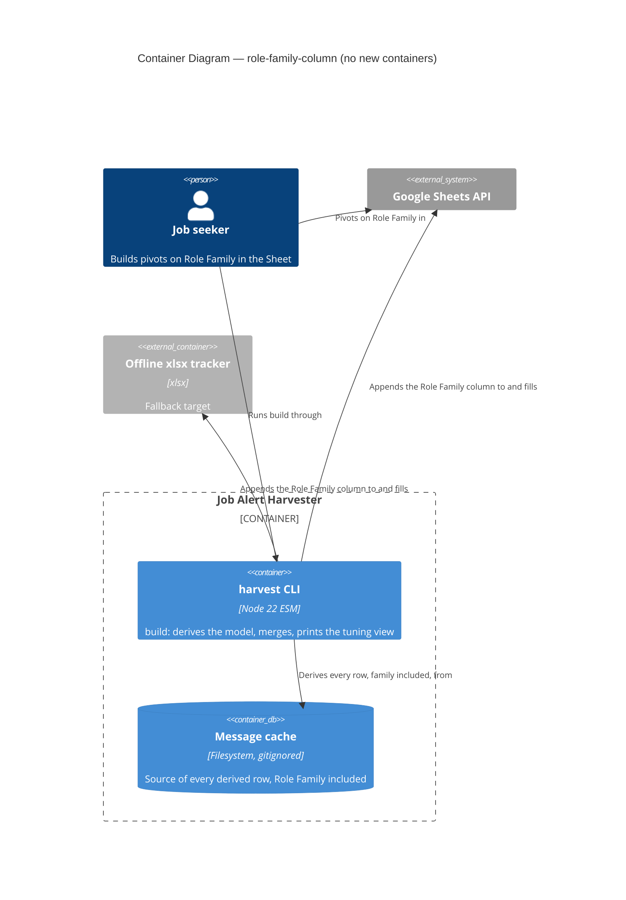
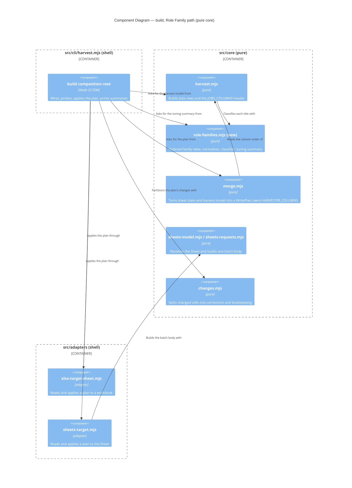

# Feature Delta — role-family-column

Narrative record of the DESIGN wave for `role-family-column`. Architecture summary lives in `docs/product/architecture/brief.md` (`## Application Architecture`, section 14). The decision is drafted as `docs/decisions/DR-0014-role-family-is-a-derived-column-classified-from-title-by-a-data-table.md` (accepted 2026-10-02). Mode: propose. The items under *Open Questions* were ratified as recommended on 2026-10-02. Nothing was built at DESIGN time.

Doc type: Explanation plus Reference (the sibling `sheets-api-target` delta uses the same mix). Assumed background: the harvester derives a Jobs tab from a local message cache and merges it into a tracker (xlsx or Google Sheet) under DR-0004 (one owner per column).

Warnings carried by this wave:

- DISCUSS was skipped by instruction. No discuss artifacts exist, so story-to-scenario traceability is absent. Acceptance criteria below are derived from the brief that started this wave.
- DEVOPS is `NOT_APPLICABLE:` (local CLI, one operator), as in prior features.
- The figures 3,050 cached adverts, 2,265 distinct adverts and 606 unclassified under the crude regex come from the operator's brief. They were not recomputed in this wave (no shell was available, and the titles are personal data). Which of 3,050 or 2,265 is the Sheet's current Jobs row count is also unverified.
- No company name, personal data or message content is recorded in this document. Titles below are generic examples.

---

## Wave: DESIGN / [REF] Upstream Consultation

| Input | Status | Bearing |
|---|---|---|
| Human brief (feature shape, families, options A, B, C) | read | Fixed: derived column, pure classifier, data table, first match, fallback `other`; no Trends tab, no report command |
| `docs/product/architecture/brief.md` | read | Extended with section 14, not rewritten |
| DR-0004 (one owner per column), DR-0006 (descriptors are data), DR-0009 (build derives from whole cache), DR-0010 (derived tab merges by own key), DR-0013 (dependency-cruiser layering) | read in full (DR-0010 first 80 lines) | Ownership, appending of missing columns, data-table precedent, layering rules |
| DR-0005 (plan-executing port), DR-0012 (Sheets `drive.file`) | DR-0012 header read; constraints taken from the `sheets-api-target` delta, which quotes both | Plan shape and Sheets write shape are unchanged |
| `docs/feature/sheets-api-target/feature-delta.md` and `deliver/live-findings.md` | read (delta in full; findings A6, A7 lines) | Format; write-path limits |
| `src/core/{merge,harvest,fit,classify,changes,sheets-model,sheets-requests,import-check}.mjs`, `src/adapters/{xlsx-target-sheet,sheets-target,change-report-writer}.mjs`, `src/cli/harvest.mjs` | read | Basis of every finding below |
| README design table, `docs/reference/cli.md`, `docs/how-to/build-the-tracker-workbook.md` | grepped | Which docs go stale (see Handoff) |
| `tests/` | listed and grepped for column-list use | Tests import the column lists, so most follow automatically |
| `.cache/` message titles | **not read** | Personal data; the priority order is argued from the brief's real cases and generic titles, not from a corpus pass |
| `docs/product/outcomes/registry.yaml`, `nwave-ai outcomes check-delta` | registry absent; CLI not run | See Validation |

---

## Wave: DESIGN / [REF] Domain Language

| Term | Meaning here |
|---|---|
| **Role Family** | A harvester-owned derived Jobs column holding exactly one family name per advert |
| **Family** | One member of the closed set: `agile coach`, `scrum master`, `engineering/delivery manager`, `product/product ops`, `transformation/change`, `AI transformation`, `other` |
| **Role-family table** | The ordered list of descriptors `{ family, patterns }`. Plain data in `src/core`. Order is the priority |
| **Pattern** | One phrase, held in normalised form, matched on whole-word boundaries against the normalised title |
| **Normalised title** | The title lower-cased, with accents folded and every run of non-alphanumeric characters collapsed to one space, trimmed |
| **Classifier** | The pure function title to family. Total: any input, including a missing title, returns a family |
| **Fallback** | `other`: the family of a title no pattern matches. Not a descriptor; it is always last and cannot be shadowed |
| **Tuning view** | The most frequent `other` titles, shown by `build` so the operator can add patterns |
| **Derived correction** | A changed harvester-owned cell that is not sighting bookkeeping (existing term, `core/changes.mjs`). A family changing because a pattern changed is one |

Bounded context: one (the harvester's Jobs derivation). No DDD pass is warranted; the classifier is a value-to-value function, not an aggregate.

---

## Wave: DESIGN / [REF] Component Decomposition

Style unchanged: Pure Core / Imperative Shell (ports-and-adapters), functional paradigm. No new adapter, port or I/O.

| Component | Path | Layer | Change | Contract shape |
|---|---|---|---|---|
| Role-family table, normaliser, classifier, tuning summary | `src/core/role-families.mjs` | core | **new** | pure-function (return-only). Exports `ROLE_FAMILIES` (frozen ordered descriptors), `OTHER_FAMILY`, `normaliseTitle(title) -> string`, `classifyRoleFamily(title) -> family`, `summariseRoleFamilies(rows, { limit }) -> { total, byFamily, otherTitles: [{ title, count }] }` |
| Jobs column list and row builder | `src/core/harvest.mjs` | core | extend: `JOBS_COLUMNS` (line 11) and `toJobsRow` (line 98) gain `Role Family` | pure |
| Harvester-owned column list | `src/core/merge.mjs` | core | extend: `HARVESTER_COLUMNS` (line 12) gains `Role Family` | pure, returns Plan |
| Tab ownership for the Sheets target | `src/core/sheets-model.mjs` | core | **unchanged**: `TAB_OWNERSHIP.Jobs.harvesterColumns` is `HARVESTER_COLUMNS` (line 10) | pure |
| Plan to Sheets request translation | `src/core/sheets-requests.mjs` | core | **unchanged** | pure; allow-list stays four kinds |
| Import verdict | `src/core/import-check.mjs` | core | **unchanged**: `KNOWN_JOBS_COLUMNS` (line 14) is built from the two lists | pure |
| Change classification | `src/core/changes.mjs` | core | **unchanged**: `Role Family` is not in `SIGHTING_BOOKKEEPING_COLUMNS`, so it is a correction | pure |
| xlsx target, Sheets target, change-report writer | `src/adapters/*` | shell | **unchanged** | as today |
| Composition root | `src/cli/harvest.mjs` | shell | extend: print the tuning view beside `summarizeChanges` in the three places that call it (`reportDryRun`, `runMergeBuild`, `runSheetsBuild`) | imperative |

Effect isolation. The classifier and the summary are pure and return values; the only new effect is one more `console.error` in the existing shell. `--dry-run` still returns a plan and writes nothing, and receives no write capability. The Sheets write path is not widened: the existing property (every `updateCells` target is a resolved row by a harvester-owned non-key column) already covers the new column because ownership is derived from `HARVESTER_COLUMNS`.

The declared contract shape of the derived cell is **bounded-change**: one harvester-owned, non-key column of the Jobs tab, overwritten on every run, cleared of nothing (the value is never null, because `other` is a value).

---

## Wave: DESIGN / [REF] Driving Ports

| Surface | Effect |
|---|---|
| `harvest build --out <f> --merge <f>` | Jobs gains `Role Family` through the append-missing-column path; every matched row gets its family |
| `harvest build --target sheets` | Same, through one `spreadsheets.batchUpdate` |
| `harvest build --dry-run` (either target) | Plan shows `columns to append: 1 (Role Family)`; prints the tuning view; writes nothing |
| `harvest build --out <f>` (create) and `harvest --in <dir> --out <f>` (rebuild) | New workbook carries the column at its `JOBS_COLUMNS` position |
| `build --report <f>` | Unchanged: lists changed cells, correction and bookkeeping alike. A file that is empty still means "nothing changed" |

No new subcommand, flag or tab. Read/write split unchanged.

## Wave: DESIGN / [REF] Driven Ports

`TargetSheet`, `MessageCacheReader` and every other driven port are unchanged, and so are their probes. Earned Trust (what happens if the environment lies): the only new dependency is a pure function over a string, so there is nothing to probe. The places a target could lie about the new column are the existing ones: a header that is not what the plan assumed (`sheets.header-changed`, `sheets.duplicate-header`) and a grid too narrow for the appended header (`appendDimension`, API assumption A7, verified live on a scratch Sheet). The design adds no new substrate assumption beyond the request-count item in Q2 below.

---

## Wave: DESIGN / [REF] Findings from the Code

### Q1. How a harvester-owned derived column is declared today, and the minimal EXTEND path

`Fit Score` and `Fit Reason` are the analogues. A derived column lives in three places in `src/core`, and nowhere else:

| Place | Evidence | What it does |
|---|---|---|
| Value computed in the row builder | `harvest.mjs:99` (`scoreFit(job.title)`), `harvest.mjs:122-123` (`'Fit Score'`, `'Fit Reason'`) | Produces the cell |
| Column named in the Jobs header list | `harvest.mjs:11-38` (`JOBS_COLUMNS`, `Fit Score` at line 32) | Header of a freshly created workbook; `model.jobs.columns` |
| Column named as harvester-owned | `merge.mjs:12-30` (`HARVESTER_COLUMNS`, `Fit Score` at line 25) | Merge overwrites it (`merge.mjs:49-52`), appends it if the header lacks it (`merge.mjs:90`) |

The Sheets target derives its ownership from the same list (`sheets-model.mjs:10`), so it needs no third declaration. `import-check.mjs:14` does likewise.

Minimal EXTEND path: (1) add the pure module `role-families.mjs`; (2) add `'Role Family'` to `JOBS_COLUMNS`; (3) add `'Role Family'` to `HARVESTER_COLUMNS`; (4) add the cell to `toJobsRow`. Four edits in core plus the new module. The shell change (the tuning view) is separate and optional to the column itself.

A finding for DISTILL: `JOBS_COLUMNS` and `HARVESTER_COLUMNS` (plus `HUMAN_COLUMNS` and `Dedup Key`) must describe the same set, and no test asserts that today (grep of `tests/` found none). A column added to one list only either is never merged (owned nowhere) or never appears in a new workbook. DISTILL should pin the agreement (scenario S9).

### Q2. A harvester-owned column missing from an existing target (the main risk)

**Answer: it is added, not refused and not ignored, in both targets, by code that exists. No header migration is needed and none is in scope.**

xlsx target:

- `planMerge` computes `appendColumns` as every `HARVESTER_COLUMNS` name absent from the target header (`merge.mjs:90`).
- `applyPlanToSheet` writes each appended header at the next free column to the right of the existing range (`xlsx-target-sheet.mjs:178-183`), then fills every matched row (`:192-201`) and every appended row (`:203-213`, nulls skipped).

Sheets target:

- Resolution reads the header fresh and records `headerWidth` and `columnIndex` by name (`sheets-model.mjs:115-135`).
- `plannedColumnNames` places an appended column at `headerWidth + offset` (`sheets-requests.mjs:98-105`); `columnIndexOf` resolves updates to it (`:113-118`).
- `widenRequests` issues `appendDimension` when the grid is too narrow (`:120-123`), and `headerRequests` writes the new header cell (`:125-128`). `appendCells` rows carry the new column too (`:107-111`).
- All of it is inside the one batch and the four-kind allow-list (`sheets-requests.mjs:7`). `updateRequests` only targets harvester-owned non-key columns of resolved rows (`:130-139`, `isOwnedNonKey` `:38-41`), so the new column is addressed and no human cell is.

This is DR-0004 rule 3 working as written: "New harvester columns are appended to the right of the existing header. Existing column order is the human's."

What it does to the operator's Sheet, each point checked against the code:

| Question | Answer |
|---|---|
| Where does the column go? | The far right, after the last header cell the Sheet holds, including any column the human added. It is **not** placed after `Fit Reason`. A fresh workbook or import places it at its `JOBS_COLUMNS` position (recommended: after `Fit Reason`; OQ-6). The human may drag the column anywhere: both targets locate by header name, and the Sheets adapter re-resolves before every write (`sheets-target.mjs:91-96`) |
| Existing column letters | Unchanged. Nothing before the new column moves |
| Existing pivots and filters | Not edited by the harvester. A pivot or filter whose range ends at the old last column (for a header of exactly the 26 names in `harvest.mjs:11-38`, column Z) may not include the new column; whether Google extends a basic filter or pivot source range when a column is appended is **not verified** (no live finding covers filters or pivots). The operator may need to extend the range by hand |
| Is the grid wide enough? | `JOBS_COLUMNS` has exactly 26 names, equal to Google's default grid width of 26 (`DEFAULT_GRID_COLUMNS`, `sheets-requests.mjs:15`). The converted Sheet's real `columnCount` is not known from the code. If it is 26, `appendDimension` is needed; A7 was verified live on a scratch Sheet (`live-findings.md:17`) |
| Size of the first write | About 3,050 single-cell `updateCells` requests (one per cell, `sheets-requests.mjs:134-138`), one header cell, at most one `appendDimension`. My estimate is about 200 bytes per request, so about 0.6 MB against `MAX_BATCH_BYTES` of 9 MiB (`sheets-requests.mjs:12`). The limit is applied to the serialised body (`:171-175`). The live check accepted 9.0 MB with no ceiling found (`live-findings.md:16`). It fits by a wide margin in bytes |
| Request count | **Unverified.** A6 measured bytes (3,000 by 20 and 6,000 by 20 cells). Whether it sent thousands of separate requests or a few large ones is not recorded there. No documented or measured ceiling on requests per batch exists in this repo. One apply is one write request against a measured quota of about 60 write requests per minute (DR-0012 changelog 1.2.0), so quota is not the concern |
| What do the change report and summaries show? | `planMerge` records a change for every matched row (existing value undefined differs from the new value, `merge.mjs:54-59`). `summarizePlan` and `summarizeApply` print that count as `cell changes` (`cli/harvest.mjs:339`, `:397`). The stderr summary and the `--report` file exclude it: `changes.mjs:30-35` drops changes to any column in `plan.appendColumns`. Result: stdout shows `columns to append: 1 (Role Family)` and a cell-change count near the row count; stderr shows `no derived corrections (<n> sighting bookkeeping change(s))`. The first population is **not itemised**; the stdout count is its only trace |
| Second run | Nothing to write for the column: unchanged cells are skipped (`sheets-requests.mjs:47-53`) |

Risks that remain, in order:

1. **First real exercise of the update path on the real tracker.** The brief's section 13 records that the first real build made 0 cell changes, so `updateCells` and `appendDimension` have not yet run on real changes against the real Sheet. The scratch-Sheet live check covers them, not the real Sheet. Bound: the new column is empty, so the worst outcome of a bad run is wrong or missing values in the new column, removable by deleting the column. The accepted residual risk (a human sort inside the write window) can only misplace a value into another row's `Role Family` cell, which the next run rewrites.
2. **Request count in one batch.** See the table. Recommended (OQ-7): before the first real run, extend the live-verification script to send about 3,050 single-cell updates to a scratch Sheet. If the count is refused, the contingency is to coalesce the contiguous new column into one multi-row `updateCells` in `sheets-requests.mjs`. That is a change to an existing pure function and is out of scope unless the check fails.
3. **A hand-typed `Role Family` header already in the real Sheet.** The operator may have created one to try pivots. Once declared, it is a harvester-owned column, so it is overwritten on every row, and because it is not in `appendColumns` the overwrites are listed as derived corrections, one stderr line per row (hundreds of lines). `build --dry-run` shows `columns to append: 0` in that case, which is the tell. Recommended (OQ-8): check the header before the first run; rename any hand-typed column first.
4. **Filters and pivots not following** (unverified, table above).

Not needed: no header migration, no new request kind, no change to the plan shape, no change to the allow-list, no change to `MAX_BATCH_BYTES`.

### Q3. Re-classification and DR-0009

Consistent, with no new mechanism. The family is a function of the title alone and nothing is persisted (DR-0001). `build` derives every row from the whole cache (`deriveHarvestModel`, `cli/harvest.mjs:298-301`, DR-0009), so a pattern edit re-derives every row on the next build and the merge overwrites each row whose value differs.

Reporting: `Role Family` is not in `SIGHTING_BOOKKEEPING_COLUMNS` (`changes.mjs:7-14`), so each changed family is a derived correction: one line on stderr and one in `--report`, in the form `Jobs<TAB><key><TAB>Role Family: <old> -> <new>`. A pattern edit that moves 600 adverts prints 600 stderr lines, because `summarizeChanges` lists every correction (`cli/harvest.mjs:355-363`). That is noisy and is also the signal DR-0004 rule 4 asks for. Recommended: accept (OQ-9).

A second reason the derivation must stay whole-cache: the title of a deduplicated row is the first sighting's (`upsertByDedupKey`, `harvest.mjs:67-89`, spreads the earliest row). A window-scoped harvest could choose a different sighting's title and change the family. DR-0009 already forbids that.

### Q4. Table location, classifier, normalisation, priority

**Location.** `src/core/role-families.mjs`, one module holding data and function, as `fit.mjs` holds `ROLE_MATCHES` and `scoreFit` (`fit.mjs:5-25`). It exports the ordered `ROLE_FAMILIES`. The data is frozen. Two modules for about 60 lines would be cognitive load with no reuse; the crafter may split later (OQ-3 concerns the representation, not the file count).

**Descriptor shape (interface contract only).** `{ family: string, patterns: string[] }`, each pattern a phrase already in normalised form. First descriptor with a matching pattern wins. Order in the list is priority.

**Classifier signature.** `classifyRoleFamily(title) -> family`. Total: a missing, empty or non-string title returns `other`. Never throws, never reads anything but its argument.

**Normalisation.** Lower-case; fold accents (NFKD then strip combining marks); replace every run of characters outside `a-z0-9` with one space; trim. A pattern matches when its words appear as a contiguous run of whole words in the normalised title. Consequences: `Scrum-Master`, `Scrum Master (Contract)`, `SCRUM MASTER - London` and `Scrum Master / Agile Coach` all contain the run `scrum master`; `AI` is matched as a word, so it never matches inside another word. Whether LinkedIn appends suffixes to titles was not verified (`parse-linkedin.mjs` was grepped for verification text and trimming only, not read in full). The normaliser is written so a suffix does not matter, because matching is by contained phrase, not by whole-title equality.

**Inputs.** Title only. Company is excluded: a recruiter and an employer advertising the same title are the same role family, and `Source Type` already holds that distinction. Search term is excluded: the same advert can surface under several saved searches and the row keeps only one, so using it would make the family depend on which alert arrived first. Recommended and stated in DR-0014; no evidence was found that would change it.

**Proposed order and rationale.** Principle: named practice roles first; qualifier-bearing families before generic manager nouns; `product` last, because it is the commonest qualifier on other titles.

| Order | Family | Illustrative patterns (proposed, not exhaustive) |
|---|---|---|
| 1 | `agile coach` | agile coach, enterprise agile coach, business agility, agile transformation coach |
| 2 | `scrum master` | scrum master |
| 3 | `AI transformation` | ai transformation, artificial intelligence transformation |
| 4 | `transformation/change` | transformation, change manager, change lead, business change |
| 5 | `engineering/delivery manager` | delivery manager, delivery lead, head of delivery, engineering manager, programme manager, project manager |
| 6 | `product/product ops` | product owner, product manager, product operations, product ops |
| fallback | `other` | (none) |

The real cases, with the family the order gives and the reason:

| Title | Family | Why |
|---|---|---|
| Agile Coach | `agile coach` | Rule 1 |
| Scrum Master / Agile Delivery Lead | `scrum master` | Contains `scrum master` (rule 2) and `delivery lead` (rule 5); the named practice role outranks the generic noun |
| AI Transformation Lead | `AI transformation` | Must precede rule 4, or `transformation` would claim it |
| Business Change Manager | `transformation/change` | `business change` (rule 4) |
| Head of Delivery | `engineering/delivery manager` | `head of delivery` (rule 5) |
| Programme Manager | `engineering/delivery manager` | `programme manager` (rule 5). A judgement call on the operator's taxonomy (OQ-2) |
| Senior Engineering Manager | `engineering/delivery manager` | `engineering manager` (rule 5); "senior" is ignored |
| Product Owner | `product/product ops` | Rule 6 |
| Technical Product Manager | `product/product ops` | `product manager` (rule 6); "technical" matches nothing earlier |
| Product Delivery Manager (generic example) | `engineering/delivery manager` | Contains `delivery manager` (rule 5) and, as a qualifier, `product`; rule 5 before rule 6 keeps it with delivery. The mirror problem: a transformation-qualified delivery title (for example Transformation Delivery Manager) goes to rule 4 by the same principle, which is arguable (OQ-1) |

Reuse of `fit.mjs`: its `ROLE_MATCHES` (`fit.mjs:5-12`) overlaps, but fit expresses suitability with points and labels and the classifier a neutral one-of-N label. They are kept separate; consolidation is not proposed now (OQ-10).

### Q5. Surfacing the most frequent `other` titles

The need is a tuning loop: run, see what fell through, add patterns, re-run and watch the list shrink. Options:

| Option | What | Trade-offs |
|---|---|---|
| **B. Stderr section on `build` and `--dry-run` (recommended)** | After the existing `summarizeChanges`, print `harvest build: <n> of <total> advert(s) classified other; most frequent:` then `  <count>  <normalised title>` lines, top 15 by count then title, preceded by one line of counts per family. Computed by the pure `summariseRoleFamilies(model.jobs.rows, { limit })`; printed by the shell in the three call sites | No new surface, no file, no flag, no tab. Shows on every run, so it is a little noisy once tuned (mitigation: print nothing when there are no `other` titles). Not persisted, so it cannot be diffed between runs. Titles are printed only to the operator's own terminal |
| A. Section in the `--report` file | Append the list to the change report | Rejected. The report is plan-derived and an empty file currently means "nothing changed" (`change-report-writer.mjs:7-10`); a tuning section would break that meaning. It also needs the model threaded into `writeReportIfRequested` |
| D. New opt-in flag writing a file | `--other-titles <f>` | Reasonable follow-on if the terminal list proves too ephemeral. Costs one registered option (unknown options are refused, so `cli-options` changes) and a second file to document. Not recommended first |
| C. New subcommand | `harvest titles` | Rejected: it is the report command the human already ruled out, under another name |

The grouping unit is one distinct advert (one Jobs row). Titles are grouped by normalised form so that case and punctuation variants count together, and the normalised form is what is displayed, because it is what the matcher sees. The pure core/adapter split holds: core computes, the shell prints (OQ-5).

### Q6. Test approach for DISTILL

Driving port: `build`. Layers: acceptance scenarios through `build` (subprocess or the existing seam, as the sibling features do); property tests on the pure module (layers 1 and 2, `fast-check`, as `sheets-api-target` does); a golden table; structural tests. Detail is in *Handoff to DISTILL*.

---

## Wave: DESIGN / [REF] Technology Choices

| Choice | Version | License | Status |
|---|---|---|---|
| Plain frozen data table plus a pure function, in `src/core` | Node 22 | none | DR-0006 precedent; no dependency |
| Phrase patterns matched on whole-word boundaries over a normalised title | none | none | Recommended over regular-expression literals (OQ-3) |
| `String.prototype.normalize` for accent folding | built in | none | no library |
| `fast-check`, `vitest` | existing | MIT | properties and golden table |
| `dependency-cruiser` (DR-0013) | existing | MIT | no rule change needed |

**No new runtime or dev dependency.** Cognitive Load Tax: one new module of about 60 lines and one more shell print. A fuzzy or scoring classifier, or a text-classification library, was considered and rejected: the operator asked for deterministic first-match, and a scorer makes "why did this land here" unanswerable.

### Architecture enforcement

Style: Pure Core / Imperative Shell. Language: JavaScript (ESM). Tool: `dependency-cruiser` (DR-0013, `.dependency-cruiser.cjs`, `npm run check:arch`). Rules, unchanged and sufficient: `src/core/**` imports no `node:` builtin and nothing from adapters or cli. `role-families.mjs` must import nothing; that is what the existing rule already checks. Table-level rules belong to tests, not to dependency-cruiser: see *Handoff to DISTILL*, structural tests.

---

## Wave: DESIGN / [REF] Design Decisions

| ID | Decision | Rationale | Source |
|---|---|---|---|
| SD-01 | `Role Family` is a harvester-owned, non-key, derived Jobs column | Pivots need a grouping column; derived values are harvester-owned | Human brief, DR-0004 |
| SD-02 | Title is the only classifier input | Determinism across sightings and saved searches | this wave |
| SD-03 | Ordered data table, first match wins, fallback `other`, closed set | Tunable, explainable, total | Human brief, DR-0006 |
| SD-04 | Nothing persisted; recomputed from the whole cache | Pattern edits re-derive every row | DR-0001, DR-0009 |
| SD-05 | Existing targets gain the column by the existing append path; no header migration | Code already does this in both targets (Q2) | DR-0004 rule 3 |
| SD-06 | Merge, plan shape, request builder, allow-list, batch limit unchanged | Ownership is derived from `HARVESTER_COLUMNS` | Q1, Q2 |
| SD-07 | No Trends tab, no report command, no new subcommand or flag | Human ruled out options B and C; analysis is in the Sheet | Human brief |
| SD-08 | Tuning view is part of `build` output, produced by a pure function | Keeps the core/shell split; no new surface | this wave, OQ-5 |
| SD-09 | The family strings are a contract with the operator's pivots | Renaming is a full rewrite reported as corrections | this wave |

---

## Wave: DESIGN / [REF] Reuse Analysis

**Hard gate.** Default is EXTEND.

| Capability | Existing code | Verdict | Evidence, contract shape, assertion |
|---|---|---|---|
| Declare a derived column | `harvest.mjs` `JOBS_COLUMNS`, `toJobsRow`; `merge.mjs` `HARVESTER_COLUMNS` | **EXTEND** | Three one-line edits (Q1). Pure. Assertion: the lists-agree scenario S9; `sheets-model.test.mjs:254` already pins header equality |
| Merge planning, append missing column, overwrite on change | `merge.mjs` `planMerge`, `planMergeAll` | **EXTEND**, unchanged | `merge.mjs:90` appends; `:54-59` reports changes. Pure, returns Plan |
| xlsx apply | `xlsx-target-sheet.mjs` | **EXTEND**, unchanged | `:173-213`. Bounded-change: target path and sibling temp |
| Sheets apply and request building | `sheets-target.mjs`, `sheets-requests.mjs`, `sheets-model.mjs` | **EXTEND**, unchanged | `sheets-requests.mjs:98-139`. Bounded-change: harvester-owned non-key cells, appended rows and columns. Assertion: the existing allow-list property over generated plans; extends over the new column because `TAB_OWNERSHIP` derives from `HARVESTER_COLUMNS` |
| Change classification and report | `changes.mjs`, `change-report-writer.mjs` | **EXTEND**, unchanged | New column is a correction once it exists; excluded on the run that appends it (`changes.mjs:30-35`) |
| Import recognition | `import-check.mjs` | **EXTEND**, unchanged | `:14` derives from the lists |
| Data-table precedent | `sources/registry.mjs` (DR-0006), `classify.mjs`, `fit.mjs` | **EXTEND** the pattern, **CREATE NEW** the module | No existing module holds title-to-family; `fit.mjs` returns points, not a label, and mixing them couples a neutral label to a suitability opinion |
| Classifier plus tuning summary | none | **CREATE NEW** `src/core/role-families.mjs` | Justified: no existing alternative (challenged `fit.mjs` and `classify.mjs`). Pure-function contract; assertion: totality, closed-set and order properties (Q6) |
| Stderr summary | `cli/harvest.mjs` `summarizeChanges` | **EXTEND** | Add a sibling print at the same three call sites. Imperative shell, one more stream write |

**1 CREATE NEW module, 9 EXTEND rows.** No existing module is discarded.

---

## Wave: DESIGN / [REF] Open Questions

All ten are **ratified by the human on 2026-10-02 as recommended** ("proceed. all good"). OQ-7 (scale check) is built in DELIVER; OQ-8 is an operator action (check the real Sheet for a hand-typed `Role Family` header before the first run). Each row lists what would have changed otherwise.

| # | Question | Recommendation | If the human chooses otherwise |
|---|---|---|---|
| OQ-1 | Ratify the family order (rows 1 to 6) and patterns, in particular: `product` after delivery; `transformation/change` before delivery; `agile coach` before `scrum master` | Take the order in Q4 | Only the table data changes, plus the golden table rows. No structural change. The contested cases are the ones with two qualifiers (Product Delivery Manager, Transformation Delivery Manager) |
| OQ-2 | Where do programme and project manager titles go? | `engineering/delivery manager` | Into `transformation/change` or `other`: table edit and golden rows only. A larger `other` share if left out |
| OQ-3 | Pattern representation | Normalised phrase lists matched on whole words | Regular-expression literals (the `fit.mjs` style): more expressive, but case, punctuation and word-boundary handling move into every pattern and shadowing is harder to lint. The descriptor shape and all tests stay the same except the lint test |
| OQ-4 | Family label spelling | Verbatim from the brief (`agile coach`, `AI transformation`, `other`, and so on) | A different spelling is free now and costs a full rewrite of the column, listed as corrections, once the column holds 3,050 cells |
| OQ-5 | How to surface frequent `other` titles | Option B: stderr section on `build` and `--dry-run`, top 15, grouped by normalised title | Option D (opt-in file flag): one registered option and one more documented file. Options A and C are not recommended |
| OQ-6 | Where the column sits in `JOBS_COLUMNS` and `HARVESTER_COLUMNS` | Immediately after `Fit Reason` (new workbooks, new imports). An existing Sheet gets it at the far right regardless (DR-0004 rule 3) | Anywhere else changes only fresh workbooks. Placing it beside `Fit Reason` in the existing Sheet would need a rule-3 exception and a column-insert request, which the allow-list does not contain; not recommended |
| OQ-7 | Verify the first Sheets write at scale before the real run | Extend the live-verification script: about 3,050 single-cell updates plus the appended header on a scratch Sheet at the real grid width (26) | Skip it and rely on `--dry-run` then the real run: saves a scratch run, leaves request count and the real grid width unverified. If it fails on the real Sheet, nothing is partially written (batch is atomic, A3 verified live) and the contingency in Q2 applies |
| OQ-8 | A hand-typed `Role Family` header in the real Sheet | The operator checks and renames it before the first run | If left, it becomes harvester-owned and is overwritten; the dry-run shows `columns to append: 0` |
| OQ-9 | One stderr line per re-classified row after a pattern edit | Accept as is | Cap or summarise corrections by column in `changes.mjs` and `summarizeChanges`: a change to existing pinned behaviour, separate work |
| OQ-10 | Share the pattern table with `fit.mjs` | No; keep separate | A later consolidation; needs a decision on whether fit should read the family |

---

## Wave: DESIGN / [REF] External Integrations

No new external integration. The Sheets API surface is unchanged (`spreadsheets.get`, `values.batchGet`, `spreadsheets.batchUpdate`, four request kinds). The existing annotation stands:

```
External Integrations Requiring Contract Tests:
- Google Sheets API v4: no new call or request kind. The first write of the new column is the
  first real exercise of updateCells and appendDimension on the real tracker.
  Recommended: extend the live verification script to the real grid width and ~3,050 single-cell
  updates before the first real run (OQ-7); fixtures stay as recorded
```

---

## Wave: DESIGN / [REF] C4 Level 2: Container

The container diagram is unchanged from brief section 13 (no new container, no new relationship). One relationship gains meaning: the CLI's derivation of the harvest model now includes the family.



## Wave: DESIGN / [REF] C4 Level 3: Component (core derivation and merge path)

Drawn because the change threads through five core modules. Every arrow is a verb.



Note: `Rel(merge, harvest, ...)` reflects that `merge.mjs` imports `COMPANIES_COLUMNS` and `SOURCES_COLUMNS` from `harvest.mjs` today (`merge.mjs:5`); it does not import `JOBS_COLUMNS`, which is why the two lists can drift (Q1).

---

## Wave: DESIGN / [REF] Handoff to DISTILL

Acceptance criteria below are derived from the human's brief; traceability to stories is absent (no DISCUSS). Scenarios are behaviour through the driving port `build`, never internals. Contract shape in brackets.

**Acceptance scenarios (through `build`)**

- S1. Given a cache holding adverts with the titles of the golden table, when `build` creates a workbook, then the Jobs header contains `Role Family` at its declared position and every row's cell is the expected family. [bounded-change]
- S2. Given an existing xlsx tracker whose Jobs header lacks `Role Family` and whose human columns hold typed values, when `build --merge` runs, then `Role Family` is appended to the right of the last existing header cell, every matched row is filled, every human and unknown cell is byte-identical, and stderr reports no derived correction for the new column. [bounded-change]
- S3. The same as S2 against the Sheets fake through `build --target sheets`: one batch, a header write at the old header width, `appendDimension` when the grid is exactly as wide as the old header, no request addressing a human-owned cell, no request kind outside the allow-list, and the batch within the limit at about 3,050 rows. [bounded-change]
- S4. `build --dry-run` (xlsx and Sheets) prints `columns to append: 1 (Role Family)` and a cell-change count, issues no write-class request, and writes no file. [unbounded-preservation]
- S5. Given a tracker whose `Role Family` already holds a stale value, when `build` runs, then the cell is overwritten and the change is one derived correction on stderr and in `--report`, not bookkeeping. Given a human-typed value in that column, the same (the column is harvester-owned). [bounded-change]
- S6. Second run against an up-to-date tracker: zero cells written for the column. Idempotence.
- S7. Tuning view: given adverts of which some fall through, `build` and `build --dry-run` print the count of `other` adverts and the most frequent `other` titles with counts, ordered by count descending then title ascending, at most the limit, grouped by normalised title; print nothing for the section when there are none; write nothing to the target and nothing to the `--report` file beyond what changed cells already produce (an empty report stays empty when nothing changed).
- S8. Whole-cache consistency (extends the existing whole-cache derivation scenario): a family does not depend on which sighting or saved search produced the advert.
- S9. The declared column sets agree: `JOBS_COLUMNS` equals `Dedup Key` plus `HARVESTER_COLUMNS` plus `HUMAN_COLUMNS`, as a set, and `Role Family` is in both the header and the harvester set. Closes the drift finding in Q1.

**Property tests (pure core, `fast-check`)**

- P1. Total and closed: for any string, and for `null`, `undefined`, numbers and objects, `classifyRoleFamily` returns one member of the closed set (the table's family names plus `other`) and never throws.
- P2. Deterministic and idempotent normalisation: `normaliseTitle(normaliseTitle(t))` equals `normaliseTitle(t)`; case, punctuation and whitespace variants of a title classify identically.
- P3. Priority: for a title containing a phrase from descriptor i and one from descriptor j with i before j, the result is descriptor i's family.
- P4. Order-independence of unrelated patterns: permuting the patterns within a descriptor never changes any result; permuting descriptors never changes the result of a title that matches exactly one descriptor.
- P5. Fallback: a title containing no pattern returns `other`.

**Structural tests on the table (the data is code, so it is linted)**

- No family name is repeated; `other` is not a descriptor; no pattern is empty or not already in normalised form (it could never match).
- No pattern appears in two descriptors; no pattern in a later descriptor contains a pattern of an earlier one as a word run (it would be shadowed and dead).
- Every pattern is exercised by at least one golden row. This also serves the project's mutation-testing strategy (nightly-delta): a mutated pattern must fail a golden row.

**Golden table** of real-shaped generic titles, at minimum one row per pattern, plus the brief's nine cases (Q4 table), variants of case and punctuation (`SCRUM MASTER (contract)`, `Scrum-Master`), both multi-qualifier ambiguities with the ratified answer, titles that must land in `other`, an empty title and a missing title.

**Docs that go stale at DELIVER** (per the standing staleness check each wave): README design table (add DR-0014 once accepted); `docs/reference/cli.md` (stderr summary lines for `build`, lines 121-125 and 136); `docs/how-to/build-the-tracker-workbook.md` (step 5, line 72, stderr description); `docs/product/architecture/brief.md` section 14 status. DR-0004's ownership table (line 85) already lags the code (it lacks the three derived-rate columns), so it is not a reliable list of harvester columns; a one-line note there is the honest fix and is not done here.

---

## Wave: DEVOPS / [REF] Skipped

`NOT_APPLICABLE:` no deployment target; a local CLI run by one operator.

## Validation

- `nwave-ai outcomes check-delta docs/feature/role-family-column/feature-delta.md`: **not run**. `docs/product/outcomes/registry.yaml` does not exist in this repository (no `docs/product/outcomes/` directory; the `sheets-api-target` DISTILL record lists it as not found too), and no shell was available to run the CLI.
- DR number: the highest existing DR is DR-0013. One sibling worktree exists (`project-value-survey`); its `docs/decisions/` holds DR-0001 to DR-0011 and no DR-0014. No file or text anywhere in either tree mentions DR-0014.

---

## Wave: DISTILL / [REF] Reconciliation and Inputs

Reconciliation passed: 0 contradictions. No `wave-decisions.md` exists for any wave of this feature; the DESIGN sections of this file, DR-0014 (accepted) and the ten open questions, all ratified by the human on 2026-10-02 as recommended, are the only upstream decisions, and they agree with one another and with DR-0004 (rule 3, append to the right), DR-0006, DR-0009 and DR-0010. Warnings: DISCUSS is absent by instruction, so acceptance criteria are derived from the DESIGN handoff and story-to-scenario traceability is skipped; DEVOPS is `NOT_APPLICABLE:` (local CLI), so the default environment matrix does not apply and a clean HOME is used.

Inputs: `+` read, `-` not found.

- `+` this file (DESIGN), `docs/decisions/DR-0014`, `DR-0004`, `DR-0006`, `DR-0009`, `DR-0010` (decision and rule sections), `docs/product/architecture/brief.md` (including section 14), `docs/architecture/atdd-infrastructure-policy.md`
- `+` `docs/feature/sheets-api-target/feature-delta.md` (DISTILL sections, the convention template) and its `distill/red-classification.md`
- `+` `tests/acceptance/sheets-api-target/**` (including `support/sheets-fake.mjs`, `sheets-domain-types.mjs`, `request-model.mjs`, `property.mjs`, and `red-gate.mjs` as it stood in commit `3fa177c`, since removed), `tests/acceptance/job-alert-harvester/support/domain-types.mjs`, `build-writes-tracker`, `changes-report`, `whole-cache-derivation`, `tests/acceptance/gmail-api-source/support/*`, `tests/common/state-delta.mjs`, `tests/architecture/layering.test.mjs`, `tests/regression/job-alert-harvester/*` (listed; none bears on this feature), `tests/integration/**` (listed; no new driven adapter, so none added)
- `+` `src/cli/harvest.mjs`, `src/core/{harvest,merge,changes,fit,classify,parse-linkedin,sheets-requests,sheets-model,sheets-refusals}.mjs`, `src/adapters/{xlsx-target-sheet,change-report-writer,json-message-reader}.mjs`, `.dependency-cruiser.cjs`, `vitest.config.mjs`
- `-` `discuss/`, `devops/`, `docs/product/kpi-contracts.yaml`, `docs/product/journeys/`, `docs/product/outcomes/`, `.nwave/des-config.json` (deliverable type resolves to `application`)
- Not read, by design: `.cache/` (personal data). Every title, company and saved search in the tests is generic and synthetic; none was copied from the cache.

Language: JavaScript (ESM), `vitest`, `fast-check` (`package.json`). The sheets-api-target convention is followed exactly: vitest `describe` and a pending-scenario helper, no `.feature` files, tags in scenario titles, `@contract-shape:` as a header comment per file or block, universe-bound `assertStateDelta` from `tests/common/state-delta.mjs` at the subprocess layer, `fast-check` at the pure layer only.

## Wave: DISTILL / [REF] Scenario List

164 scenarios in 5 files, plus 7 unskipped tests of the builders and the golden table. Every scenario is pending at DISTILL time through `scenario` from `support/red-gate.mjs` (`it.skip` unless `RED_GATE=1`), so `npm test` exits 0. 77 are tagged `@error` (47%, edge and sad paths), 17 `@property` (`fast-check`, pure core only: layers 1 and 2), 1 `@walking_skeleton`, 45 run through the real CLI in a subprocess (31 against the xlsx tracker, 14 against the Sheets fake), 10 are tagged `@real-io` in the title. Counts are from the vitest JSON report, not hand-added.

| File | Layer | Contract shape | Scenarios | `@error` | `@property` | Covers |
|---|---|---|---|---|---|---|
| `role-family-classifier.test.mjs` | pure core | pure-function | 88 | 33 | 0 | the golden table (45 generic titles: one or more per pattern, the nine contested cases, double-qualifier and whole-word cases, ten that fall through), ten case, punctuation, accent and symbol variants, six priority cases, totality (empty, blank, punctuation-only, non-text, other scripts, very long), the normaliser (11), the tuning summary (9) |
| `role-family-properties.test.mjs` | pure core | pure-function | 17 | 3 | 17 | P1 total and closed, determinism, long input, normalisation idempotence and alphabet, case/whitespace/separator/trailing-punctuation/accent invariance, priority, an oracle for first-match on whole words, glued letters, fallback, reachability of every pattern, five summary invariants |
| `role-family-table.test.mjs` | pure core | pure-function | 14 | 7 | 0 | table lint (ratified families and order, no repeat, no empty or non-normalised pattern, no shared pattern, no shadowed pattern, every pattern reachable and exercised by a golden title, frozen); S9 column agreement, `Role Family` position after `Fit Reason`, the 26-column legacy header, a harvest filling the column from the title |
| `role-family-build-workbook.test.mjs` | subprocess, real xlsx | bounded-change (2 dry-run scenarios unbounded-preservation) | 31 | 21 | 0 | new workbook (a scenario per family, the contested cases, header position, rebuild form), title-only (company, saved search, retitled advert, reposts, variants, punctuation-only, very long), merge (far-right append, human cells and tabs untouched, hand-added row, first population not itemised, re-classification itemised, human-typed value overwritten, hand-typed header, idempotence), dry-run (2), tuning view (5) |
| `role-family-build-sheets.test.mjs` | subprocess, loopback fake | bounded-change (dry-run and duplicate-header scenarios unbounded-preservation) | 14 | 13 | 0 | the walking skeleton, grid exactly 26 wide (`appendDimension`), a human column in between, a spare column (no widening), one batch inside the four-kind allow-list writing only `Role Family`, about 3,050 adverts, first population not itemised, re-classification itemised, hand-typed and moved header, second run sends nothing, dry-run, duplicate header refused, tuning view |
| `support-builders.test.mjs` | test infrastructure | n/a | 7 (active) | n/a | n/a | the golden table against an oracle that applies the DESIGN's illustrative table; every golden title survives the real parser; a tracker builder that never holds the answer; a tracker that matches the harvest merges with no change |

RED classification (`distill/red-classification.md`): 163 RED for the right reason (94 reach the scaffold's throw, 19 fail the table pin because the scaffold's table is empty, 50 assert against an existing module that lacks the behaviour), 1 GREEN today (the S9 column-agreement drift guard), 0 BROKEN. A throw-away reference implementation in a scratch copy of the repository (not committed) passed all 164; two deliberate mutations of it failed 13 and 108 scenarios. With the same implementation the existing suite stayed green except one test (see Pre-requisites).

Scenario to DESIGN scenario map (no stories exist, so this is the only traceability): S1 workbook file (family scenarios, header position, rebuild); S2 workbook file (merge); S3 Sheets file; S4 dry-run scenarios in both build files; S5 re-classification and human-typed value in both build files; S6 idempotence in both; S7 tuning-view scenarios in both build files plus the summary examples and properties; S8 title-only scenarios (company, saved search, retitled advert); S9 table file; P1 to P3 and P5 properties file; P4 not expressible (see Upstream Issues); the structural tests table file; the golden table with the nine contested cases classifier file and both build files.

## Wave: DISTILL / [REF] Walking Skeleton Strategy

One `@walking_skeleton`: `role-family-build-sheets.test.mjs`, "Operator builds into their Google Sheet and finds every advert grouped under a role family, their notes untouched". `build --target sheets` as an asynchronously spawned subprocess through the production composition root, against the loopback `sheets-fake.mjs` (Driven external), a synthetic tracker that predates the column and holds the operator's Status and qualifications, a synthetic cache of four adverts, real temp-HOME credential files, and `--report`. Per the Architecture of Reference this follows from port class, not a per-feature choice: the real CLI and the real filesystem are real, only the Sheets API is faked. The Sheets target is chosen over the xlsx one because the operator pivots in the Sheet (DR-0014 context) and it exercises the most adapters; the xlsx path is covered by the milestone scenarios in the workbook file.

Deviation from the skill, following the sheets-api-target precedent: the skill asks for a walking skeleton that is green before hand-off, which is impossible when the feature is unbuilt and the deliverable may not edit `src/` beyond the scaffold. The skeleton is pending like every other scenario (`scenario`, `it.skip`), is the first scenario DELIVER enables, and was run once under `RED_GATE=1` to confirm it fails for the right reason (it asserts that `Role Family` is appended and filled). The hand-off suite is green by construction. The human may overrule this choice.

## Wave: DISTILL / [REF] Adapter Coverage

| Adapter | Real-I/O scenario | Covered by |
|---|---|---|
| `xlsx-target-sheet` (read and apply, existing) | YES (real `.xlsx` file in an isolated workspace) | every merge, dry-run and idempotence scenario in `role-family-build-workbook.test.mjs` |
| `xlsx-workbook-writer` (create, existing) | YES | new-workbook and rebuild scenarios, same file |
| `sheets-target` reader and writer (existing) | YES (loopback fake behind a real socket) | the walking skeleton and every scenario of `role-family-build-sheets.test.mjs` |
| `json-message-reader` (cache, existing) | YES (real month-sharded cache on disk) | every scenario that runs `build` |
| `credential-store` Sheets slot and target record (existing) | YES (real files under a temp HOME) | every Sheets scenario |
| `change-report-writer` (`--report`, existing) | YES | first-population, re-classification and empty-report scenarios in both build files |
| `receipt-store` (stale-upload warning, existing) | YES | every xlsx merge scenario passes through it unchanged |
| stderr surface of the composition root (tuning view, derived corrections) | YES (captured from the subprocess) | tuning-view and correction scenarios in both build files |

No new driven adapter exists, so no new adapter-integration scenario or `tests/integration/` file is needed. What the Sheets fake cannot model, and the scenarios therefore do not prove: whether the real Sheet accepts about 3,050 single-cell updates in one batch by request count (A6 measured bytes only), and whether Google extends a filter or pivot range over an appended column. Both stay with the human as the DESIGN recorded (OQ-7 live check, DELIVER).

## Wave: DISTILL / [REF] Scaffolds

At DISTILL time `src/core/role-families.mjs` exports `__SCAFFOLD__ = true`; `OTHER_FAMILY` (the real value `'other'`, a contract); `ROLE_FAMILIES` as an empty frozen array (the table is DELIVER's, and the empty table is what makes the table-pin scenarios fail as RED); and `normaliseTitle`, `classifyRoleFamily` and `summariseRoleFamilies` with their final signatures, each throwing `RED scaffold: <name> is not implemented`. It imports nothing, declares no class and mutates nothing, so the `core-imports-no-node-builtin` rule and `npm run check:arch` stay green (verified). DELIVER removes `__SCAFFOLD__` when it replaces the module. No other file in `src/` was edited: `JOBS_COLUMNS`, `HARVESTER_COLUMNS`, `toJobsRow` and `cli/harvest.mjs` are DELIVER's.

## Wave: DISTILL / [REF] Test Placement

`tests/acceptance/role-family-column/` for pure-core, structural and subprocess scenarios (precedent: `tests/acceptance/sheets-api-target/`, `tests/acceptance/gmail-api-source/`). Support in `support/`: `role-family-domain-types.mjs` (nouns re-exported from production, builders, composition helpers, observers), `family-names.mjs` (the seven labels and the ratified order), `golden-titles.mjs` (the one golden table both layers read), `oracle.mjs` (the DESIGN's definition restated, independent of `src/`), `property.mjs`, `red-gate.mjs`. The Sheets work extends `sheets-api-target/support` without editing it: `sheets-fake.mjs`, `sheets-domain-types.mjs` and `property.mjs` are imported and used as they are; the feature adds only builders and observers beside them. No parallel fake was written.

## Wave: DISTILL / [REF] Driving Adapter Coverage

| Driving port | Subprocess scenarios |
|---|---|
| `harvest build --out <f>` (create) | a scenario per family over the golden table, the contested cases, header position, title-only, variants, punctuation-only, very long titles |
| `harvest --in <dir> --out <f>` (rebuild) | the column is carried by the rebuild form |
| `harvest build --out <f> --merge <f>` | far-right append with the operator's cells and tabs untouched, hand-added row, first population, re-classification, human-typed value, hand-typed header, idempotence, tuning view, report stays empty |
| `harvest build --dry-run` (with and without `--merge`) | `columns to append: 1 (Role Family)`, `columns to append: 0` for a hand-typed header, workspace byte-identical, tuning view |
| `harvest build --target sheets` | the walking skeleton, widening, no widening, one batch inside the allow-list, about 3,050 adverts, first population, re-classification, moved column, idempotence, tuning view, duplicate-header refusal |
| `harvest build --target sheets --dry-run` | names the column, zero write requests, tuning view |
| `build --report <f>` | no `Role Family` line for the first population, one line per re-classified advert, empty when nothing changed |

No new subcommand, flag or tab exists (SD-07), so none is added.

## Wave: DISTILL / [REF] Pre-requisites and Decisions Pinned by Tests

Environment: Node 22 (`engines`), `vitest`, `fast-check` and `xlsx` already installed, no new dependency. Offline scenarios need no credential; Sheets scenarios use a temp HOME. DEVOPS matrix not applicable.

Suggested DELIVER order (one scenario enabled at a time): (1) real `role-families.mjs` against the classifier, table and properties files; (2) the column lists and `toJobsRow` (S9, harvest rows); (3) the walking skeleton, then the workbook and Sheets scenarios; (4) the tuning view in the shell; (5) remove `support/red-gate.mjs` and the `scenario` indirection once every scenario is active, as the previous feature did; (6) the stale-docs list in *Handoff to DISTILL*. **One existing test collides with the feature**, found by running the full suite against the throw-away reference implementation (855 of 856 existing tests passed, 164 pending): `tests/acceptance/sheets-api-target/sheets-fake.test.mjs`, "answers spreadsheets.get with tab ids and grid sizes…" (line 55) hard-codes `columnCount: 26` for a fake built from `JOBS_COLUMNS`; the header becomes 27 wide, so the fake's grid becomes 27. The premise of that test is the width of the fixture header, not the feature; DELIVER edits the one expected number (or builds the fixture from `LEGACY_JOBS_HEADER`) as a human-approved test edit, as the previous feature did for two Gmail tests. No other existing test failed.

Decisions the tests pin. The first group is fixed by the DESIGN or by existing code and is listed so DELIVER matches it; the second group is new detail the DESIGN left open and was **ratified by the human on 2026-10-02**, together with the one-number edit of `tests/acceptance/sheets-api-target/sheets-fake.test.mjs:55` (`columnCount` 26 to 27); DELIVER may rename one only with a recorded reason.

| Pinned | Where | Status |
|---|---|---|
| Exports `ROLE_FAMILIES`, `OTHER_FAMILY` (`'other'`), `normaliseTitle`, `classifyRoleFamily`, `summariseRoleFamilies(rows, { limit })` from `src/core/role-families.mjs`, the DESIGN's names | scaffold, classifier, table, properties | matches DESIGN Component Decomposition |
| Header `Role Family`, immediately after `Fit Reason` in `JOBS_COLUMNS` and in `HARVESTER_COLUMNS`; `JOBS_COLUMNS` has 27 names, the legacy header 26 | table file | matches DESIGN OQ-6, detail pinned |
| Family labels exactly `agile coach`, `scrum master`, `AI transformation`, `transformation/change`, `engineering/delivery manager`, `product/product ops`, `other`, in that descriptor order (`other` last, not a descriptor) | `support/family-names.mjs`, table file | matches OQ-1, OQ-4 |
| First-match on whole words over the normalised title; the nine contested cases and the two double-qualifier titles land as the DESIGN's Q4 table and OQ-1 say (Transformation Delivery Manager goes to `transformation/change`) | golden table | matches DESIGN |
| Existing formats the new behaviour must keep: dry-run line `columns to append: 1 (Role Family)`; merge summary `Jobs: rows updated: <n>, rows appended: <n>, columns appended: <n>, cell changes: <n>`; correction line `Jobs<TAB><key><TAB>Role Family: <from> -> <to>` with `(blank)` for an empty cell; `no derived corrections`; `<n> derived correction(s)`; refusal `sheets.duplicate-header` for a doubled `Role Family` header | both build files | existing code |
| Sheets: header cell at `headerWidth` (index 26 for the legacy header, 27 after `My Notes`, 25 with a spare column), `appendDimension` on `COLUMNS` only when the grid is full, one `spreadsheets.batchUpdate`, kinds inside `updateCells`, `appendCells`, `appendDimension`, `addSheet`, the only column written `Role Family`, about 3,050 adverts under `MAX_BATCH_BYTES` | Sheets file | matches DESIGN Q2 |
| **New:** the tuning view is two groups of stderr lines: a counts line containing the words `role families` and, per family present, `<family>` then non-digits then `<count>` (exact punctuation not pinned), then `harvest build: <n> of <total> advert(s) classified other; most frequent:` followed by up to 15 lines of leading whitespace, `<count>`, whitespace, `<normalised title>`; count descending then title ascending; printed after the change summary; stderr only, never stdout, never the report | both build files | **ratified 2026-10-02** |
| **New:** the whole tuning view, the counts line included, is omitted when no advert is `other` | both build files | **ratified 2026-10-02** |
| **New:** the tuning view is printed by a merge build, a Sheets build, and `--dry-run` with or without `--merge`; presence on the create path and the `--in` rebuild is not pinned either way | build files | **ratified 2026-10-02** |
| **New:** `summariseRoleFamilies(rows, { limit })` takes Jobs rows, reads each row's `Job` and `Role Family` cells, returns `{ total, byFamily, otherTitles }` with `total` the row count, `byFamily` an object keyed by family name (a family with no advert may be absent or zero), `otherTitles` an array of `{ title, count }` of normalised titles, ordered by count descending then plain string order ascending, cut at `limit`; it never mutates its input; `limit` 0 gives an empty list | classifier and properties files | **ratified 2026-10-02** |
| **New:** `normaliseTitle` is total: anything that is not text normalises to `''`; `classifyRoleFamily` of anything that is not text, including a symbol, a bigint and a function, is `other`; normalisation is NFKD, strip combining marks, lower-case, runs outside `a-z0-9` to one space, trim | classifier and properties files | **ratified 2026-10-02** |
| **New:** `ROLE_FAMILIES` is a frozen array of frozen descriptors `{ family, patterns }` whose `patterns` are frozen, non-empty, already normalised, unique across the table, and unshadowed; every pattern is exercised by a golden title that lands in its family (DELIVER adds a golden row for any pattern it adds) | table file | **ratified 2026-10-02** |

## Wave: DISTILL / [REF] Upstream Issues

1. **`columns to append: 1` on stdout is the dry-run wording.** The hand-off brief and DESIGN Q2 say stdout shows `columns to append: 1 (Role Family)` for the first population. That text is `summarizePlan`, printed only by `--dry-run`. A real merge prints `columns appended: 1` (`summarizeApply`). The tests pin each wording where it occurs. DESIGN Q2 should name both lines.
2. **Create path and `--in` rebuild.** DESIGN names three print sites (`reportDryRun`, `runMergeBuild`, `runSheetsBuild`), so a first-time `build --out new.xlsx` and `harvest --in <dir>` would not show the tuning view. Probably intended (no merge, no change summary) but unstated; no scenario pins presence or absence.
3. **The counts-per-family line.** DESIGN Q5 says "one line of counts per family" and gives no format; pinned loosely (above). Whether it belongs to the section that disappears when nothing fell through is pinned as yes.
4. **Does the summary read the cell or re-classify the title?** DESIGN says `summariseRoleFamilies(model.jobs.rows, { limit })`. The tests feed rows whose `Job` and `Role Family` agree, so either reading passes; reading the cell keeps the view consistent with what the merge writes.
5. **P4 is not expressible through the DESIGN's exports.** Permuting the patterns of a descriptor, or the descriptors, needs a classifier that takes a table; `classifyRoleFamily(title)` takes none. Order-independence within a descriptor holds by definition and priority is covered by an oracle property. If the human wants P4 as written, DESIGN would add an optional `table` argument (default `ROLE_FAMILIES`); not pinned here.
6. **An empty title cannot reach `build`.** A blank line ends a card in the parser, so no cached advert has an empty title. Empty, blank, missing and non-text titles are covered at the pure layer; a title of only punctuation, and one in a script no pattern uses, are covered through the CLI.
7. **No change to `sheets-fake.mjs` was needed.** The fake already models a grid exactly as wide as the header, `appendDimension`, the allow-listed kinds and a request log with bodies; the request-count ceiling and filter or pivot behaviour stay unmodelled and unverified (see Adapter Coverage).

## Wave: DISTILL / [REF] AT Completeness Audit

Mechanical 15-item check (`nw-at-completeness-check`). Six items are not applicable to a stateless pure function behind a CLI that adds no I/O; each is passing with its rationale. 15 of 15 pass, so the verdict is COMPLETE; the nine applicable items are all covered by scenarios.

| Item | Result |
|---|---|
| C1a empty, zero, minimum input | covered: empty, blank and punctuation-only titles, no adverts, limit 0 |
| C1b boundaries | covered: the 15th and 16th distinct other title, long titles, a grid exactly full |
| C2a, C2b state machine | n/a: the classifier and the build have no state; idempotence stands in for it |
| C3 zero, one, many | covered: no adverts, one `other` title, many; one to 3,050 rows |
| C4a apply twice | covered: second build changes nothing, in both targets |
| C4b inverse without prerequisite | n/a: no inverse operation exists |
| C5a, C5b flag combinations and orthogonality | covered: `--dry-run` and `--report` over xlsx and Sheets, create and merge; the view is the same in a dry run and a real build. Gap accepted: `--dry-run --report` on the new column is existing behaviour and is not combined here |
| C6a, C6b, C6c malformed input and error set | covered: non-text titles, odd Unicode, a doubled header refused as `sheets.duplicate-header`, the classifier's closed family set |
| C7a degraded resource, C7b interruption, C7c concurrency | n/a: no new I/O; the batch is atomic (A3, existing); not claimed concurrent-safe |

`SPECIFICATION_AMBIGUITY` findings: none blocks DISTILL; the open points are the Upstream Issues above. Telemetry rows: `(role-family-column, C1, 0, none)`, `(…, C5, 1 accepted gap, low)`, other categories zero.

## Wave: DISTILL / [REF] Outcome Registry

`nwave-ai outcomes` exists but `docs/product/outcomes/` does not, so registration is skipped. Contract surfaces that would register: the `Role Family` derived column (operation on `build`), the closed family set with `other` as fallback (invariant), title-only classification (invariant), the first population is not itemised while a later re-classification is (invariant).

## Wave: DISTILL / [REF] Mandate-12 Evidence and Step-Reuse Ratio

- Types module: `support/role-family-domain-types.mjs` re-exports production nouns (column lists, ownership, request allow-list, the family table, `OTHER_FAMILY`) and `support/family-names.mjs` holds the test-side noun, the seven family labels with the ratified order. The golden table is data in one file read by both layers.
- Composition helpers take typed inputs and delegate: `aCacheOfAdverts`, `aCohortCached`, `aTrackerWorkbook`, `aSheetHoldingTheTracker`, and the CLI runners `operatorBuildsNewWorkbook`, `operatorMerges`, `operatorPreviews`, `operatorRebuildsFromTheCache`, `operatorBuildsIntoTheSheet`; observers `observeWorkbook` and `observeSheet` return port-exposed names only (header, cells by key, grid width, tab names, Drive files), never an internal field. Scenario bodies hold arrange, act and assert only. Where a scenario needs a tracker row set or a request body read back, a helper does it; there is one inline oracle for the tuning view's order (written out as a literal list, not computed). The AST criterion (at most two statements ending in a service call) is not met literally: bodies are arrange, act and assert blocks of the same shape the previous feature uses, in an `it`-style project with no step decorators.
- State-delta (Mandate 8): every subprocess scenario that mutates a tracker asserts through `assertStateDelta` over those observers; creation from nothing and the pure layer use direct assertions. PBT (`@property`) appears only in `role-family-properties.test.mjs`, which never starts a subprocess (Mandate 9); every subprocess sad path is a named example (Mandate 11). Tier B is not declared: the journey is one build, not three chained scenarios over a state machine.
- Informational step-reuse ratio: 205 helper call sites over 33 distinct helpers, about 6.2x. Not a gate.
- Pillar 2 (chained narrative): the Given of each merge scenario reuses `aCohortCached` and `anExistingTracker`, and the idempotence scenarios chain the first build into the second.

---

## Wave: DELIVER / [REF] Implementation Summary

Shipped 2026-10-02 in six steps (all RED, GREEN and COMMIT logged; `des-verify-integrity`: "All 6 steps have complete DES traces").

| Step | Commits | Result |
|---|---|---|
| 01-01 pure classifier | `8906352`, `27135e3`, `b9784b0`, `464e113` | `normaliseTitle`, `classifyRoleFamily`, `ROLE_FAMILIES` (six ordered families), in four slices: table, variants, priority and whole words, totality |
| 01-02 declare the column | `c7d9241` | `Role Family` in `JOBS_COLUMNS` (27 names, after `Fit Reason`), `toJobsRow` and `HARVESTER_COLUMNS` |
| 01-03 existing trackers | `78f5107`, `5e2bb1c` | xlsx merge and Sheets target scenarios activated; no production change was needed |
| 02-01 tuning view | `f347f4c`, `6005056` | `summariseRoleFamilies`, `formatTuningView`, `TUNING_LIMIT` 15; `printTuningView` at the three call sites |
| 03-01 scale check | `96a6d0e` | `S1` in `scripts/sheets-live-check.mjs`, operator-run |
| 03-02 retire scaffolding | `6544323` | red gate and `__SCAFFOLD__` removed; whole suite green |

The production diff is small: one new pure module (`src/core/role-families.mjs`), one line in `core/merge.mjs`, three in `core/harvest.mjs`, twelve in `cli/harvest.mjs`. `sheets-model`, `sheets-requests`, `import-check` and `changes` were not changed: ownership derives from `HARVESTER_COLUMNS`, which is the DESIGN claim step 01-03 confirmed (all 18 existing-tracker scenarios green on activation, proven non-vacuous by two scratch mutations).

## Wave: DELIVER / [REF] Files Modified

| Category | Files |
|---|---|
| Production, pure core | `src/core/role-families.mjs` (new), `src/core/harvest.mjs`, `src/core/merge.mjs` |
| Production, shell | `src/cli/harvest.mjs` (`printTuningView`) |
| Operator tooling | `scripts/sheets-live-check.mjs` (check `S1`; self-test 35 to 38 checks) |
| Acceptance tests (DISTILL files, activated) | `tests/acceptance/role-family-column/` (five scenario files, `support-builders.test.mjs`, `support/`); `support/red-gate.mjs` removed |
| Existing test edited | `tests/acceptance/sheets-api-target/sheets-fake.test.mjs:55`, `columnCount` 26 to 27, human-approved 2026-10-02 |
| Docs (orchestrator pass, not this wave's finalise) | `README.md`, DR-0004, DR-0014, `docs/how-to/{build-the-tracker-workbook,run-the-checks,use-a-google-sheet-as-the-tracker}.md`, `docs/reference/cli.md`, `docs/product/architecture/brief.md` |

## Wave: DELIVER / [REF] Scenarios Green

Full suite: 68 files, 1,020 tests passed, 0 skipped (849 in 62 files before the feature branch work: +171, which is the 164 DISTILL scenarios plus 7 builder tests). `npm run check:arch`: no violations, 48 modules. `scripts/sheets-live-check.mjs --self-test`: 38 checks (35 before). No `__SCAFFOLD__` remains in `src/`.

## Wave: DELIVER / [REF] Definition of Done Check

| DESIGN decision or ratified question | Result |
|---|---|
| SD-01 harvester-owned, non-key, derived column | Met: in `HARVESTER_COLUMNS`, not in the key |
| SD-02 title is the only input | Met: whole-title scenarios (company, saved search, retitled advert) green |
| SD-03 ordered table, first match, fallback `other` | Met: table lint, priority and fallback properties green |
| SD-04 nothing persisted | Met: no new stored state |
| SD-05 existing targets gain the column by the existing append path | Met: xlsx and Sheets scenarios green with no change to the append code |
| SD-06 merge, plan shape, request builder, allow-list, batch limit unchanged | Met: those modules untouched |
| SD-07 no new tab, subcommand or flag | Met |
| SD-08 tuning view in `build` output, pure function | Met: `formatTuningView` pure, `printTuningView` in the shell |
| SD-09 family strings are a contract | Met: labels pinned verbatim by `family-names.mjs` |
| OQ-1 to OQ-6, OQ-9, OQ-10 (ratified as recommended) | Met as written |
| OQ-7 scale check | Built (`S1`); run live 2026-10-05: `WORKS`, 3,052 requests, HTTP 200, 0.5 MB |
| OQ-8 hand-typed header | Operator checked 2026-10-05: none present |
| DISTILL pinned decisions (tuning-view format, summary shape, total normaliser, frozen table) | Met, ratified 2026-10-02 |

Open items against the DESIGN: the tuning view is not printed on the create path or the `--in` rebuild (unpinned by DESIGN and DISTILL).

## Wave: DELIVER / [REF] Demo Evidence

No separate demo file. The operator ran the classifier over their own 3,050 cached adverts through a scratch workbook (aggregates only; nothing was written to their Sheet): `engineering/delivery manager` 1,143, `other` 982 (32.2%), `scrum master` 541, `agile coach` 215, `transformation/change` 94, `product/product ops` 73, `AI transformation` 2. The `other` titles show generic pattern gaps (agile-qualified team-lead titles, release-train-engineer titles, director or head-of-engineering titles, and an agile-coach variant with a word between the two). The human then approved a tuning round (see the evolution record): `other` fell to 759 (24.9%). The scale check `S1` has not been run live.

## Wave: DELIVER / [REF] Quality Gates

- DISTILL reviewers (acceptance, architecture; Haiku): approved. The architecture reviewer caught a stale brief status, fixed.
- DELIVER roadmap reviewer: approved.
- Refactor pass: empty, nothing worth changing.
- Adversarial reviewer: approved, one low finding (`countBy` spreads inside a reduce, quadratic in distinct keys; harmless at 3,050 rows; left). Its claim that the scale check was "verified live" is wrong: it has not been run live.
- Mutation testing: skipped per `nightly-delta`.
- DES integrity: 6/6 steps complete. `check:arch` clean.

## Wave: DELIVER / [REF] Pre-requisites for the First Real Build

1. Check the real Sheet for a hand-typed `Role Family` header (OQ-8); rename it first, or the harvester takes it over and overwrites it.
2. Run `node scripts/sheets-live-check.mjs --only S1` (OQ-7). This settles the request count in one batch, which the fake does not model.
3. Unverified and not blocking: Google's behaviour for filters and pivots over an appended column.

## Wave: DELIVER / [REF] Outcome

Shipped 2026-10-02. The column is built, tested and documented; on 2026-10-05 the operator's pre-build checks passed, the dry-run planned 3,050 cell changes and the real build wrote 3,051 cells (3,050 values plus the header) with no derived corrections. Not done: the operator actions above, further pattern tuning (the first round cut `other` from 32.2% to 24.9%), the tuning view on the create and `--in` paths, and CI. The DESIGN header of this file says "Nothing was built at DESIGN time" and "status Proposed"; both were true then, and DR-0014 is now accepted. Archive: `docs/evolution/2026-10-02-role-family-column.md`.
