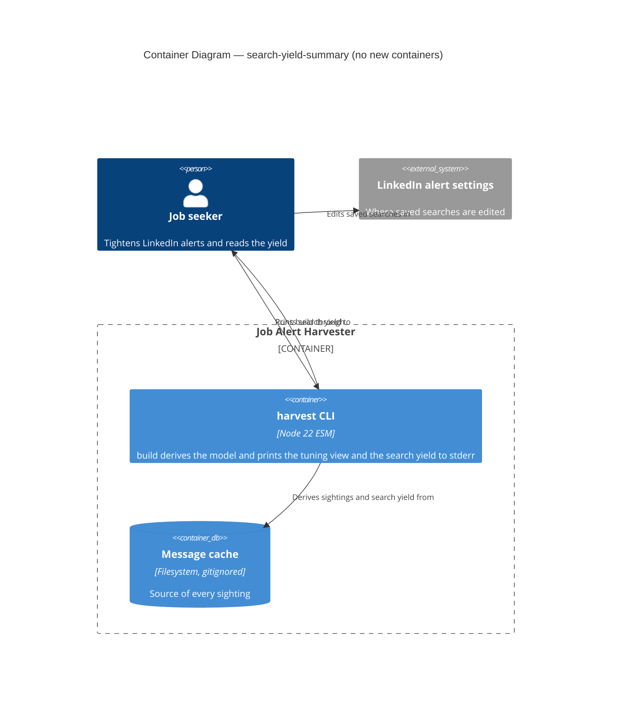
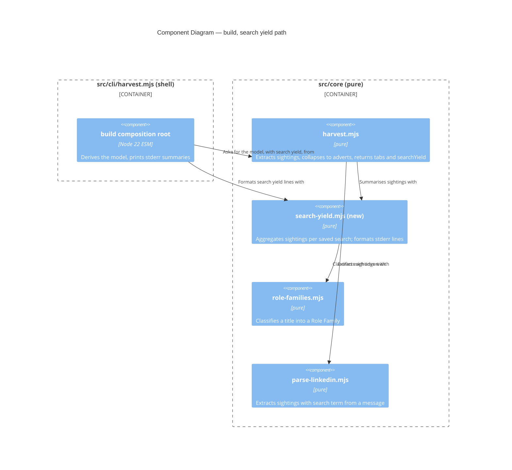

# Feature Delta — search-yield-summary

Narrative record of the DESIGN wave for `search-yield-summary`. Architecture summary: `docs/product/architecture/brief.md` (`## Application Architecture`, section 15). Mode: propose. The items under *Open Questions* were **ratified by the human on 2026-10-05**. Nothing was built at DESIGN time.

Doc type: Explanation plus Reference (same mix as the sibling `role-family-column` delta). Assumed background: `build` derives a harvest model from the whole local message cache (DR-0009, build derives from the whole cache), merges it into a tracker, and prints stderr summaries; the Role Family column and its tuning view are DR-0014 (Role Family derived from title).

Warnings carried by this wave:

- DISCUSS and DISCOVER were skipped by instruction (the human decided "Yes, add the per-search yield summary"). No story exists, so story-to-scenario traceability is absent. Acceptance criteria below are derived from the DESIGN brief.
- DEVOPS is `NOT_APPLICABLE:` (local CLI, one operator).
- Figures from the operator's ad-hoc analysis (about 17 distinct searches; per-search `other` share 6% to 77%; 8 searches cover 97% of on-target adverts; 25 adverts without a parsable search term) are aggregates taken from the brief of this wave. They were not recomputed here: no shell was available and `.cache/` holds personal data. No search string, employer or title from the cache appears in this file; every example is synthetic.
- No shell was available, so `git worktree list --porcelain` was not run. A file search under `/Users/danielosborne/projects` found no `DR-0015` file. DR-0015 was allocated on 2026-10-05; `git worktree list` shows the only sibling worktree holds DR-0001 to DR-0011.
- `nwave-ai outcomes check-delta` was not run (no shell; `docs/product/outcomes/registry.yaml` does not exist).

---

## Wave: DESIGN / [REF] Upstream Consultation

| Input | Status | Bearing |
|---|---|---|
| Human brief (feature, four metrics, stderr only, same three print sites) | read | Fixed: summary beside the tuning view; nothing stored; no tab, column, file or report change |
| `docs/product/architecture/brief.md` (sections 11, 14) | read | Extended with section 15 |
| `docs/feature/role-family-column/feature-delta.md` | read (first 457 of 627 lines; DESIGN and DISTILL sections) | Format; tuning-view design (Q5, OQ-5); Role Family from title only |
| DR-0014 (Role Family derived from title) | read in full | Family definition, tuning view settled in feature-delta, not a new DR |
| DR-0001, DR-0004, DR-0006, DR-0009, DR-0013 | not re-read; constraints taken from DR-0014 and the role-family delta, which quote them | Derive, do not persist; whole-cache derivation; layering |
| `src/core/{harvest,parse-linkedin,role-families,cli-options,merge}.mjs`, `src/cli/harvest.mjs`, `src/adapters/xlsx-*.mjs` (grepped for model use) | read or grepped | Basis of every finding below |
| `tests/` | grepped for whole-model assertions (one hit, `model.jobs.columns`) | Adding a key to the harvest model is unlikely to break a deep-equal; not exhaustively verified |
| `.cache/` | **not read** | Personal data |

---

## Wave: DESIGN / [REF] Domain Language

| Term | Meaning here |
|---|---|
| **Saved search** | The `searchTerm` of a LinkedIn alert, parsed from the "Your job alert for ..." line (`parse-linkedin.mjs:6`, `:20-23`). Identified by its exact trimmed string; no case folding, as in the Sources tab |
| **Sighting** | One advert card in one alert message: a raw row from `extractJobs` carrying `searchTerm`, `dedupKey`, `seenAt`, `title` |
| **Advert** | One distinct `dedupKey` (one Jobs row). A repost under a new LinkedIn id is a different advert |
| **Found by** | A saved search found an advert when at least one sighting of it carries that search's term, within the scope being counted |
| **Found** (column) | Distinct adverts found by a saved search |
| **Other** | Found adverts whose Role Family is `other` |
| **On-target** | Found adverts whose Role Family is any family except `other` (`found = other + on-target`) |
| **Unique** | On-target adverts found by that saved search and by no other named saved search, within the scope being counted |
| **Scope** | Either *all cached alerts* or the *recent window*: the 28 calendar dates ending at the latest sighting date in the cache |
| **Unparsed bucket** | Sightings whose message has no parsable search term (`searchTerm` is `null`). Labelled `(no search term)` |
| **Search yield** | The per-saved-search table of the four counts, in one block per scope |

Differences from existing columns, so they are not confused: the Sources tab `Jobs Found` is **already** a count of distinct adverts per search term, all-time (`harvest.mjs:152,164`, `dedupKeys.size`). The new `found` column equals it for every named search in the all-time block. The Sources tab `Messages` counts distinct alert emails (digests) per term. The Jobs tab `Times Seen` counts sightings per advert. The summary adds what the Sources tab lacks: the `other` and on-target split, the unique contribution, and a recent scope.

Bounded context: one (the harvester's derivation). No DDD pass.

---

## Wave: DESIGN / [REF] Component Decomposition

Style unchanged: Pure Core / Imperative Shell (ports-and-adapters), functional paradigm. No new adapter, port or I/O.

| Component | Path | Layer | Change | Contract shape |
|---|---|---|---|---|
| Search-yield summary and formatter | `src/core/search-yield.mjs` | core | **new** | pure-function (return-only). Summary: sightings plus collapsed adverts in, `{ allTime, recent }` blocks out. Formatter: blocks in, array of stderr lines out. Exports its constants (window days, row cap, term width, label) |
| Harvest model | `src/core/harvest.mjs` | core | extend: `harvest()` (`:196-207`) calls the summary on the `rawRows` it already holds and returns it as a fourth key, `searchYield`, beside `sources`, `companies`, `jobs` | pure |
| Composition root | `src/cli/harvest.mjs` | shell | extend: one `printSearchYield(model)` beside `printTuningView` at the three print sites; `reportDryRun` gains the `model` argument | imperative; stderr writes only |
| Merge planning, tab planners, adapters, change report, import check | various | core, shell | **unchanged** | as before |

Why the model key is safe: `planMergeAll` only plans tabs whose key is `in` the model (`merge.mjs:224`), and both xlsx writers read `model.sources`, `.companies`, `.jobs` by name (`xlsx-target-sheet.mjs:263-265`, `xlsx-workbook-writer.mjs:13-15`). An extra key is ignored by all of them.

Effect isolation. Both new functions are pure and return values. The only new effect is `console.error` in the existing shell. `--dry-run` still returns a plan and receives no write capability. Nothing reaches a target, the receipt store or the `--report` file.

---

## Wave: DESIGN / [REF] Driving Ports

| Surface | Effect |
|---|---|
| `harvest build --out <f> --merge <f>` | stderr gains the search-yield block(s) after the tuning view; the merge is unchanged |
| `harvest build --target sheets` | Same |
| `harvest build --dry-run` (either target) | Same; still writes nothing |
| `harvest build --out <f>` (create) and `harvest --in <dir> --out <f>` (rebuild) | **No change**: these do not print the tuning view either |
| stdout, `--report <f>` | **Never** carries search yield. An empty report still means nothing changed |

No new subcommand, option, tab, column or file. `src/core/cli-options.mjs` is untouched. Read/write split unchanged.

## Wave: DESIGN / [REF] Driven Ports

Unchanged, with their probes. Earned Trust (what happens if the environment lies): the summary is a pure function over data already in memory, so there is nothing to probe. Two input assumptions are stated and pinned by tests: (1) `seenAt` begins with an ISO date (already relied on by `toJobsRow`, `harvest.mjs:106`); the summary treats a sighting with an unreadable date as outside the recent window and never throws. (2) The cache may be partial; see Q6.

---

## Wave: DESIGN / [REF] Findings from the Code

### Q1. Where per-search membership lives, and the smallest change

`harvest()` extracts `rawRows` (`harvest.mjs:197`), then `upsertByDedupKey` collapses them to one row per `dedupKey` (`:69-91`). The collapsed row spreads the earliest sighting, so it keeps one `searchTerm` and the rest are lost. `rawRows` is local to `harvest()`: it is not returned and nothing at the three print sites can see it. They hold only `model` (`deriveHarvestModel`, `cli/harvest.mjs:299-302`) or `plans`.

| Option | What | Trade-offs |
|---|---|---|
| **A. Compute in a new pure module, called by `harvest()`, returned as `model.searchYield` (recommended)** | Smallest change: one call and one key in `harvest()`, one print function in the shell. `rawRows` stays internal. The family is classified from the collapsed advert's title, the same title and function as `toJobsRow` | One new module; `harvest()` return shape grows by one additive key |
| B. The CLI re-derives from `messages` | The shell would call `extractJobs` again | Parses every message twice; moves derivation into the shell, against `harvest.mjs`'s own header ("dedup, upsert ... never in an adapter"); the two derivations can drift. Rejected |
| C. A new core module taking `rawRows`, called by the shell | Needs `harvest()` to expose `rawRows` or the shell to re-parse | Exposes an internal intermediate to the shell; no benefit over A. Rejected |

Recommended: A. The summary needs both inputs `harvest()` has in scope: the sightings (`rawRows`) and the collapsed adverts (first-sighting title).

### Q2. Metric definitions, exactly

For a scope S (all sightings, or the sightings in the recent window):

- **Per-advert family.** The Role Family of the advert's collapsed row: `classifyRoleFamily(title)` on the first-sighting title (`upsertByDedupKey` sorts by `seenAt` and keeps the earliest, `harvest.mjs:72-79`; DR-0014 rule 2, title only). This is the same value as the Jobs `Role Family` cell, so the summary agrees with the column by construction. The family does not depend on scope: a recent-window advert first seen long ago keeps its original family.
- **found(search)** = distinct `dedupKey` among sightings in S whose `searchTerm` equals the search.
- **other(search)** = found adverts whose family is `other`. **on-target(search)** = found minus other.
- **other share** = `round(100 * other / found)`, integer, half up (`Math.round`). Found is at least 1 for every listed search, so no division by zero.
- **unique(search)** = on-target adverts found by this search whose set of *named* searches in S is exactly this one. Over the scope: all-time in the all-time block, recent-window sightings only in the recent block. An advert found by this search and also by an unparsed sighting still counts as unique, because the unparsed bucket is not a search the operator can tighten.
- **Unparsed bucket.** Sightings with `searchTerm` of `null` (also an empty string) form one row labelled `(no search term)`. Found, other and on-target are computed as above. Its `unique` is shown as `-`. It never counts as "another search" in anyone's unique reckoning.
- **Total row** `all searches`: distinct adverts in S (including unparsed-only adverts), with other and on-target. `unique` is `-`. All-time total equals the Jobs row count of the model.
- **Edited searches.** LinkedIn alerts keyed by exact string: an edited search appears as a new row beside the old one, as it does in the Sources tab. To see the effect of a change, compare the old row aging out of the recent block with the new row.
- **Reposts.** A repost under a new id is a distinct advert and is counted twice. The summary measures what the alerts delivered, not de-duplicated roles.

### Q3. Window

| Option | What | Trade-offs |
|---|---|---|
| All-time only | One block | Simplest. Hides a recent change: after months of history a tightened search keeps its old numbers. Fails the stated purpose (see the effect of each change) |
| **All-time plus a fixed recent window (recommended): 28 calendar dates, constant in `search-yield.mjs`** | Two blocks, from the same function | No contract change. 28 days spans four whole weeks, so weekday patterns balance. The constant is a one-line edit if wrong. Costs a second table of output |
| `--since <date>` option | Operator-chosen window | Needs an entry in the `build` option table (`cli-options.mjs:20`), the unknown-option guard, `docs/reference/cli.md`, tests and a decision record. A contract change for a tuning loop that a fixed window already serves. Defer; revisit if 28 days proves wrong for the operator's change cadence |

**Window anchor.** The window ends at the latest sighting date in the cache, not at the system clock. The core stays pure (no clock), the result depends only on the cache, and the block heading prints the end date, so a stale cache is visible rather than silently reading as "recent". The alternative, injecting `now` from the shell (`nowIso` exists, `cli/harvest.mjs:146`), is a small addition but makes the output vary with the day it is run (OQ-2).

**Window membership** is by sighting: an advert counts under a search in the recent block when that search sent it in the window, even if the advert was first seen earlier.

The recent block is omitted when the whole cache fits inside the window (earliest sighting date on or after the window start), because it would repeat the first block.

### Q4. Output

Block order after the existing stderr lines: `summarizeChanges`, `printTuningView`, then `printSearchYield`. Every heading line is prefixed `harvest build: `; table lines are indented two spaces, as in the tuning view (`role-families.mjs:68-70`).

Rules (constants exported from `search-yield.mjs`):

- Columns: search, `found`, `other` (`n (p%)`), `on-target`, `unique`. Search left-aligned in a 40-character field, numbers right-aligned (found 5, other 9, on-target 9, unique 6), two spaces between columns.
- Search label longer than 40 characters: the first 37 characters then `...`. Length counts characters as in `String.length`.
- Named searches ordered by `found` descending, then search ascending by code unit (not `localeCompare`, so the order does not vary by locale; the Sources tab uses `localeCompare`).
- At most 20 named searches are shown. If more exist, a line `  ... and <n> more search(es) not shown` follows the last row. The unparsed row (when present) and the total row are always shown, and the total counts every search.
- A block is printed only when it has at least 2 named searches with at least 1 advert in its scope; otherwise it is omitted. A one-search cache has nothing to compare, and an empty cache has no rows.
- Printed by the same three commands as the tuning view; never on stdout; never in `--report`.

Synthetic example. Operator has four saved searches; the two broad ones carry most unique adverts; the last is fully redundant (unique 0); the third is noisy and its long label is truncated:

```
harvest build: search yield, all cached alerts (distinct adverts per saved search)
  search                                    found      other  on-target  unique
  agile coach in Examplestan                  412   31 (8%)        381     120
  scrum master in Exampleshire                260  41 (16%)        219      15
  contract engineering manager in Examp...    143  70 (49%)         73       5
  agile coach (remote) in Examplestan          88   9 (10%)         79       0
  (no search term)                             25   3 (12%)         22       -
  all searches                                700 130 (19%)        570       -
harvest build: search yield, last 28 days to 2026-10-04
  search                                    found      other  on-target  unique
  agile coach in Examplestan                   90    7 (8%)         83      22
  scrum master in Exampleshire                 61   8 (13%)         53       3
  contract engineering manager in Examp...     30  14 (47%)         16       1
  agile coach (remote) in Examplestan          20   2 (10%)         18       0
  all searches                                150  25 (17%)        125       -
```

(Column alignment in this example is illustrative; the exact widths are the rule above and are pinned by DISTILL.) The recent block has no `(no search term)` row because no sighting in that window lacks a term: zero-found unparsed rows are not printed.

### Q5. Layering and purity

`search-yield.mjs` imports only `role-families.mjs` (for `classifyRoleFamily` and `OTHER_FAMILY`), a core-to-core import allowed by DR-0013 (dependency-cruiser layering). It uses no `node:` builtin, class or mutation of its inputs (internal accumulation follows the existing style: `reduce` and `Map`/`Set` construction as in `toSourcesRows`). The shell change is stderr writes only. Driving ports: the existing `build` surfaces. Driven ports: none touched. The C4 diagrams are at the end of this file.

### Q6. Persistence and partial caches

Nothing is stored (DR-0001, persist what cannot be re-derived): the summary is recomputed from the whole cache on each run (DR-0009), so it changes only when the cache changes and never depends on earlier runs or on the target's contents. Two risks, both stated here rather than hidden:

1. **Partial cache.** The summary does not read the coverage ledger. A gap in fetched days lowers `found` for every search in it and can inflate `unique`: if the email that would show an advert under a second search is missing, the first search looks like its only finder. Read the unique column as an upper bound on a cache with gaps.
2. **Recent window across a gap.** If the last 28 days are partly unfetched, the recent block under-counts. The printed end date shows how fresh the cache is; whether the window is fully covered is not shown.

### Q7. Is a decision record needed?

**Yes (OQ-6, resolved by the human on 2026-10-05): DR-0015.** Adding a key to what `harvest()` returns changes a core interface, which is the case that earns a record. Precedent for the contrary view: the tuning view was settled in the feature-delta only. A `--since` option or persisting any history would each raise a further record.

### Q8. Test approach for DISTILL

See *Handoff to DISTILL*.

---

## Wave: DESIGN / [REF] Technology Choices

| Choice | Version | License | Status |
|---|---|---|---|
| Plain pure functions over arrays, `Map` and `Set`, in `src/core` | Node 22 | none | no dependency |
| `fast-check`, `vitest` | existing | MIT | properties and examples |
| `dependency-cruiser` (DR-0013) | existing | MIT | no rule change |

No new runtime or dev dependency. Cognitive Load Tax: one module and one shell print function. A table-rendering library was rejected: two `padStart`/`padEnd` calls do the work.

### Architecture enforcement

Style: Pure Core / Imperative Shell. Language: JavaScript (ESM). Tool: `dependency-cruiser` (`.dependency-cruiser.cjs`, `npm run check:arch`). Rule unchanged and sufficient: `src/core/**` imports no `node:` builtin and nothing from adapters or cli. `search-yield.mjs` may import only core modules.

---

## Wave: DESIGN / [REF] Design Decisions

| ID | Decision | Rationale | Source |
|---|---|---|---|
| SY-01 | Search yield is derived, printed to stderr by `build` (merge, Sheets, `--dry-run`), never stored, never on stdout, never in `--report` | DR-0001 and DR-0009; an empty report keeps meaning "nothing changed" | Human brief |
| SY-02 | Computed by a new pure core module called from `harvest()` and returned as `model.searchYield` | `rawRows` stays internal; same first-sighting title as the Role Family cell (Q1) | this wave |
| SY-03 | On-target means any family except `other`; unique means on-target and found by no other named search, in the scope counted | Matches the operator's definition | Human brief |
| SY-04 | The unparsed bucket is a labelled row, excluded from unique reckoning, `unique` shown `-` | It is not a search the operator can edit | this wave |
| SY-05 | Two scopes: all cached alerts, and the 28 calendar dates ending at the latest sighting date; no new option | Shows the effect of a recent change without a contract change | this wave |
| SY-06 | Omit a block with fewer than 2 named searches; cap 20 named searches; truncate labels to 40 characters | Stable, bounded stderr | this wave |
| SY-07 | `found` equals the Sources tab `Jobs Found` for named searches (all-time) | Reconciliation; the two must not diverge | Q2 |
| SY-08 | A decision record, DR-0015, records where search yield is derived; the rest lives in this table | Adding a key to what `harvest()` returns changes a core interface | OQ-6 (human, 2026-10-05) |

---

## Wave: DESIGN / [REF] Reuse Analysis

**Hard gate.** Default is EXTEND.

| Capability | Existing code | Verdict | Evidence, contract shape, assertion |
|---|---|---|---|
| Per-search membership | `rawRows` in `harvest()` (`harvest.mjs:197`) | **EXTEND** `harvest()` | Already holds `searchTerm`, `dedupKey`, `seenAt`; one added call. Pure. Assertion: `found` equals Sources `Jobs Found` |
| Distinct counts per term | `toSourcesRows` (`harvest.mjs:134-166`) | **EXTEND** by reuse of the idea, **CREATE NEW** code | It keys by term and counts `dedupKeys.size`, but carries no family and no windowing; changing it would change a Sources-tab contract. Pure |
| Family of an advert | `classifyRoleFamily`, `OTHER_FAMILY` (`role-families.mjs`) | **EXTEND** (import) | Same function and same title as `toJobsRow`, so the summary agrees with the column. Assertion: totals equal the Jobs `other` count |
| Stderr view beside the tuning view | `formatTuningView`, `printTuningView` (`role-families.mjs:63`, `cli/harvest.mjs:371`) | **EXTEND** the pattern | Pure formatter returning lines; shell prints them |
| Summary and formatter | none | **CREATE NEW** `src/core/search-yield.mjs` | Justified: no existing module holds per-search aggregates. Challenged `role-families.mjs` (kept to classification and the title tuning view) and `harvest.mjs` (already assembles three tabs; adding a fourth concern there grows it). Pure-function; assertion: the properties in the handoff |
| Print sites | `reportDryRun`, `runMergeBuild`, `runSheetsBuild` | **EXTEND** | One added print each; `reportDryRun` gains `model` |
| Option table | `cli-options.mjs` | **unchanged** | No option |

**1 CREATE NEW module, 5 EXTEND rows.** Nothing discarded.

---

## Wave: DESIGN / [REF] Open Questions

All nine were **ratified by the human on 2026-10-05** as recommended, except OQ-6, which the human resolved to "write a decision record" (DR-0015, accepted). OQ-10 (title-match share, the share of adverts whose title contains the search phrase) was raised and **deferred** by the human.

| # | Question | Recommendation | If the human chooses otherwise |
|---|---|---|---|
| OQ-1 | Window | All-time plus a fixed 28-day recent block | All-time only: drop the second block and the anchor logic, but the effect of a change stays hidden. `--since`: add an option, guard entry, docs, tests and a decision record |
| OQ-2 | Window anchor | Latest sighting date in the cache (pure, deterministic) | System clock injected from the shell: `harvest()` gains a parameter and tests inject a date; output then varies with run day |
| OQ-3 | Unparsed sightings | A `(no search term)` row, excluded from unique reckoning, `unique` shown `-` | Hide the row (the total would then not reconcile to Jobs rows), or count it as a search (unique then shrinks for adverts also seen without a term) |
| OQ-4 | Ordering, cap, truncation | `found` descending then search ascending; 20 named searches; 40-character label with `...` | Order by `other` count descending to put noisiest first; different cap or width. Constants only |
| OQ-5 | Omission rule | Omit a block with fewer than 2 named searches | Always print when any search exists; one-row tables carry no comparison |
| OQ-6 | Decision record | Resolved by the human: write DR-0015 (accepted 2026-10-05) | Decision table only, as for the tuning view |
| OQ-7 | Where computed | Inside `harvest()`, returned as `searchYield` | The shell derives it from messages (rejected in Q1) |
| OQ-8 | Total row | Print `all searches` row (distinct adverts, not a sum) | Omit it; the operator then cannot see overlap |
| OQ-9 | Reposts under new ids | Count as distinct adverts (unchanged `dedupKey` semantics) | A repost-aware key is a separate feature touching DR-0009 and Jobs rows |

---

## Wave: DESIGN / [REF] External Integrations

No new external integration; the Sheets API surface is unchanged. The existing contract-test annotation in brief section 13 stands.

---

## Wave: DESIGN / [REF] C4 Level 2: Container

No new container.



## Wave: DESIGN / [REF] C4 Level 3: Component (build path, pure core)



---

## Wave: DESIGN / [REF] Handoff to DISTILL

Acceptance criteria are derived from the DESIGN brief; story traceability is absent (no DISCUSS). Scenarios run through the driving port `build` in a real CLI subprocess with an isolated workspace and a synthetic cache of several searches with overlapping adverts. Contract shape in brackets.

**Acceptance scenarios (through `build`)**

- Y1. `build --out <f> --merge <f>` on an xlsx tracker prints, on stderr, the all-time block with the four counts per search, ordered and rounded as specified; stdout and the `--report` file contain no yield line. [bounded-change; read-only for the yield]
- Y2. The same through `build --target sheets` against the loopback fake, and through `build --dry-run` for both targets; the dry-run issues no write-class request and writes no file. [unbounded-preservation]
- Y3. `build --out <f>` (create) and the `--in` rebuild print no search yield.
- Y4. Reconciliation: for each named search, `found` equals the Sources tab `Jobs Found`; the `all searches` found equals the Jobs row count; the `all searches` other equals the number of Jobs rows whose `Role Family` is `other`.
- Y5. An advert found by two searches counts under both for found, other and on-target, and under neither for unique.
- Y6. An advert resent by the same search many times counts once; a repost under a new id counts twice.
- Y7. The family counted is the first sighting's: given two sightings with different titles that classify differently, the summary agrees with the Jobs `Role Family` cell.
- Y8. Sightings without a parsable term appear as `(no search term)` with `unique` `-` and do not reduce another search's unique count; the total includes them.
- Y9. Edge: one named search prints nothing; an empty cache prints nothing (and the existing empty-cache behaviour is unchanged); a cache entirely within 28 days prints no recent block.
- Y10. Recent block: given sightings spread over more than 28 days, only the 28 dates ending at the latest sighting date are counted; the heading shows that end date; an advert first seen earlier but resent in the window counts under the resending search.
- Y11. Presentation: a label over 40 characters is cut to 37 plus `...`; more than 20 named searches print 20 plus the `... and <n> more` line while the total still counts all.
- Y12. Idempotence and independence: two consecutive builds print identical yield; the output does not change when the target tracker's contents change (only the cache matters).
- Y13. An empty `--report` stays empty when nothing changed, with the yield printed.

**Property tests (pure core, `fast-check`)**

- P1. `other + onTarget = found` for every search and the total.
- P2. `unique <= onTarget <= found`.
- P3. Every advert is counted under every named search that sent it: the sum over searches of `found` equals the number of distinct (advert, search) pairs.
- P4. Order-invariance: shuffling the sightings leaves the summary unchanged (generator constraint: sightings of one advert carry distinct `seenAt`, or the same title, since first-sighting selection otherwise depends on input order, exactly as the Jobs row does).
- P5. Recent block is a subset: per search, recent `found` is at most all-time `found`; total likewise.
- P6. Totality: any sighting list (including `null` terms, unreadable dates, empty list) returns a summary and never throws.
- P7. Percent: `0 <= share <= 100` and an integer; an all-`other` search shows 100.

**Structural tests**: `search-yield.mjs` imports nothing outside `src/core` (existing `layering.test.mjs` and `check:arch`); `cli-options.mjs` option tables unchanged (a guard that `build` accepts exactly its current options).

**Docs that go stale at DELIVER** (standing staleness check each wave): `docs/reference/cli.md` (the stderr summary lines for `build`, beside the tuning view lines); `docs/how-to/build-the-tracker-workbook.md` (stderr description); README design table (this feature, no DR); `docs/product/architecture/brief.md` section 15 status.

---

## Wave: DEVOPS / [REF] Skipped

`NOT_APPLICABLE:` no deployment target; a local CLI run by one operator.

## Validation

- `nwave-ai outcomes check-delta`: **not run** (no shell; no `docs/product/outcomes/registry.yaml`).
- Peer review by `nw-solution-architect-reviewer`: **not run** in this session (the invoking instruction named no reviewer dispatch and subagent mode returns to the caller). The caller should dispatch it.

---

## Wave: DISTILL / [REF] Reconciliation and Inputs

Reconciliation passed: 0 contradictions. No `wave-decisions.md` exists for any wave of this feature. The DESIGN sections of this file, DR-0015 (accepted) and the nine open questions ratified by the human on 2026-10-05 are the only upstream decisions. They agree with one another and with DR-0001 (persist what cannot be re-derived), DR-0009 (build derives from the whole cache), DR-0013 (layering) and DR-0014 (Role Family from title; its rule that an advert has one family whichever sighting supplied its title is read as the first-sighting title of the collapsed row, which is what DESIGN Q2 and the Jobs `Role Family` cell both use). OQ-10 (title-match share) is deferred by the human, so no scenario tests it and the scaffold has no export for it. Warnings: DISCUSS is absent by instruction, so acceptance criteria are derived from the DESIGN handoff (Y1 to Y13, P1 to P7) and story-to-scenario traceability is skipped; DEVOPS is `NOT_APPLICABLE:` (local CLI), so the default environment matrix does not apply, an empty HOME is used and the offline target needs no credential.

Inputs: `+` read, `-` not found.

- `+` this file (DESIGN), `docs/decisions/DR-0015`, `DR-0014`, `DR-0009`, `DR-0001`, `docs/product/architecture/brief.md` (section 15), `docs/architecture/atdd-infrastructure-policy.md` (inherited; no new port, so no row added)
- `+` `docs/feature/role-family-column/feature-delta.md` (DISTILL sections, the convention template) and its `distill/red-classification.md`
- `+` `tests/acceptance/role-family-column/**`, including `support/red-gate.mjs` as it stood before commit `6544323` removed it (`git show 6544323^:tests/acceptance/role-family-column/support/red-gate.mjs`), `tests/acceptance/job-alert-harvester/support/domain-types.mjs`, `tests/acceptance/sheets-api-target/support/{sheets-fake,sheets-domain-types,property}.mjs`, `tests/acceptance/gmail-api-source/support/{gmail-domain-types,property}.mjs`, `tests/common/state-delta.mjs`, `tests/architecture/layering.test.mjs`
- `+` `src/cli/harvest.mjs`, `src/core/{harvest,parse-linkedin,role-families,cli-options}.mjs`, `.dependency-cruiser.cjs`, `vitest.config.mjs`
- `-` `discuss/`, `devops/`, `docs/product/kpi-contracts.yaml` (so no `@kpi` scenario), `docs/product/journeys/`, `docs/product/outcomes/`
- Not read, by design: `.cache/` (personal data). Every search, title and company in the tests is invented (`agile coach in Examplestan`, `Acme Ltd`); none was copied from the cache.

Language: JavaScript (ESM), `vitest`, `fast-check`. The role-family-column convention is followed: vitest `describe` and a pending-scenario helper, no `.feature` files, tags in scenario titles, `@contract-shape:` as a header comment per file or block, universe-bound `assertStateDelta` from `tests/common/state-delta.mjs` at the subprocess layer, `fast-check` at the pure layer only.

## Wave: DISTILL / [REF] Scenario List

110 scenarios in 4 files, plus 19 unskipped tests of the builders, vocabulary, oracle and generators. Every scenario is pending at DISTILL time through `scenario` from `support/red-gate.mjs` (`it.skip` unless `RED_GATE=1`), so `npm test` exits 0. 80 are tagged `@error` (73%, edge and sad paths), 23 `@property` (`fast-check`, pure layer only: layers 1 and 2), 1 `@walking_skeleton`, 41 run through the real CLI in a subprocess (31 against the xlsx tracker, 10 against the Sheets fake), 3 `@structural`. Counts are from the vitest JSON report, not hand-added.

| File | Layer | Contract shape | Scenarios | `@error` | `@property` | Covers |
|---|---|---|---|---|---|---|
| `search-yield-summary.test.mjs` | pure core, in memory | pure-function | 46 | 39 | 0 | the cohort's figures and order, overlap, resends, reposts, first-sighting family (both directions, and across scopes), unparsed row and blank term, one search or none or empty, the 28-date window (inclusive both ends, exactly 28 or 29 dates, clock never read, fewer than two searches in the window, unique within a scope, unreadable dates), `harvest()` carrying `searchYield` and agreeing with Sources and Jobs, the exact lines, 40 and 41 character labels, the cap at 20 (20, 21, 23), the unparsed and total rows after the cap line, wide figures, seven rounding cases, three structural guards |
| `search-yield-properties.test.mjs` | pure core, in memory | pure-function | 23 | 3 | 23 | P1 to P7, the oracle equality over the summary and over the printed lines, order invariance through `harvest()` (P4), found equals Sources `Jobs Found` over generated alerts, totality, translation invariance of the window, unparsed never changes a named row |
| `search-yield-build-workbook.test.mjs` | subprocess, real xlsx | bounded-change (4 dry-run scenarios unbounded-preservation) | 31 | 29 | 0 | merge prints the yield, stdout and `--report` free of it, empty report, tracker cell-for-cell identical and only declared tabs and columns, ordering after the role-family view, idempotence, independence from the tracker's contents, dry-run with and without `--merge`, create and `--in` rebuild print nothing, `--since` refused, Sources and Jobs reconciliation, overlap, resend and repost, retitled adverts, unparsed and blank terms, one named search, none, empty cache, 28 and 29 dates, the recent block and the stopped clock, a stale cache, truncation, 23 and exactly 20 searches |
| `search-yield-build-sheets.test.mjs` | subprocess, loopback fake | bounded-change (3 dry-run scenarios unbounded-preservation) | 10 | 9 | 0 | the walking skeleton, independence from the Sheet's contents, empty report with a Sheet that already holds everything, only allowed request kinds and declared columns, second build sends nothing, one named search, empty cache (build and preview), the preview writes nothing and prints what the build then prints |
| `support-builders.test.mjs` | test infrastructure | n/a | 19 (active) | n/a | n/a | the production classifier agrees with the vocabulary; the oracle against the cohort figures worked out by hand and its constants against production; synthetic alerts read back through the real `extractJobs` and `harvest()`; trackers and a Sheet that match the cache change nothing when merged; the stopped clock; the generators reach two or more searches, a recent block, more than 20 searches, retitled adverts and unparsed alerts |

RED classification (`distill/red-classification.md`): 107 RED for the right reason (59 reach the scaffold's throw, 48 assert against an existing module that lacks the behaviour), 3 GREEN today (guards), 0 BROKEN. A throw-away reference implementation in a scratch copy of the repository (not committed) passed all 129 new tests and left the 1,040 existing tests green; three deliberate mutations of it failed 15, 32 and 8 scenarios.

DESIGN handoff to scenario map (no stories exist, so this is the only traceability):

| DESIGN item | Scenarios |
|---|---|
| Y1 merge prints all-time block; stdout and `--report` clean | workbook: merge prints the all-time yield; stdout and the report never carry a yield line; ordering after the change summary and the role-family view |
| Y2 Sheets, and `--dry-run` for both targets | Sheets: the walking skeleton, the dry-run pair, the empty-report scenario; workbook: the four dry-run scenarios |
| Y3 create and `--in` rebuild print nothing | workbook: "creating a new workbook prints no yield and neither does the rebuild form" |
| Y4 reconciliation to Sources and Jobs | workbook: found equals Sources `Jobs Found`; pure: `harvest()` agreement (two); properties: found equals Sources over generated alerts |
| Y5 overlap | workbook and pure: an advert two searches found |
| Y6 resends and reposts | workbook and pure |
| Y7 family of the first sighting | workbook (two directions), pure (four), properties (oracle through `harvest()`) |
| Y8 unparsed bucket | workbook (unparsed row, blank name), pure (three), properties (unparsed never changes a named row) |
| Y9 one search, empty cache, cache inside the window | workbook (four chained scenarios), Sheets (three), pure |
| Y10 recent block | workbook (three), pure (ten), properties (P5, window end, translation) |
| Y11 truncation and cap | workbook (three), pure (three), properties (two) |
| Y12 idempotence and independence | workbook (two), Sheets (two) |
| Y13 empty report | workbook and Sheets: the empty-report scenarios |
| P1 to P7 | `search-yield-properties.test.mjs`, titles beginning `@property P1` to `@property P7` |
| Structural | pure file: imports, option table; workbook: `--since` refused |

## Wave: DISTILL / [REF] Walking Skeleton Strategy

One `@walking_skeleton`: `search-yield-build-sheets.test.mjs`, "Operator builds into their Google Sheet and sees which saved searches earn their place: found, other, on-target and unique, all-time and the last 28 days". `build --target sheets` as an asynchronously spawned subprocess through the production composition root, against the loopback `sheets-fake.mjs` (Driven external), a Sheet holding only its headers, a synthetic two-month cache of three overlapping searches, real temp-HOME credential files. Per the Architecture of Reference this follows from port class, not a per-feature choice: the real CLI, the real cache directory and the real parser are real; only the Sheets API is faked. The Sheets target is chosen because the operator works in the Sheet (DR-0014 and DR-0015 context) and it exercises the most adapters; the xlsx path is covered by the milestone scenarios in the workbook file.

Deviation from the skill, following the precedent of the two previous features: the skill asks for a walking skeleton that is green before hand-off, which is impossible when the feature is unbuilt and the deliverable may not edit `src/` beyond the scaffold. The skeleton is pending like every other scenario (`scenario`, `it.skip`), is the first scenario DELIVER enables after the pure core, and was run once under `RED_GATE=1` to confirm it fails for the right reason (the yield lines are absent from stderr). The hand-off suite is green by construction. The human may overrule this choice.

## Wave: DISTILL / [REF] Adapter Coverage

| Adapter | Real-I/O scenario | Covered by |
|---|---|---|
| `json-message-reader` (cache, existing) | YES (real month-sharded cache on disk) | every scenario that runs `build` |
| `xlsx-target-sheet` read and apply (existing) | YES (real `.xlsx` file in an isolated workspace) | every merge and dry-run scenario in `search-yield-build-workbook.test.mjs` |
| `xlsx-workbook-writer` create (existing) | YES | the create and rebuild scenario, and the Sources reconciliation scenario (creates, then merges) |
| `sheets-target` reader and writer (existing) | YES (loopback fake behind a real socket) | the walking skeleton and every scenario of `search-yield-build-sheets.test.mjs` |
| `credential-store` Sheets slot and target record (existing) | YES (real files under a temp HOME) | every Sheets scenario |
| `change-report-writer` (`--report`, existing) | YES | the report scenarios in both build files: the report never mentions the yield and stays empty when nothing changed |
| `receipt-store` (stale-upload warning, existing) | YES | every xlsx merge scenario passes through it unchanged |
| stderr surface of the composition root (new `printSearchYield`) | YES (captured from the subprocess) | every CLI scenario |

No new driven adapter exists, so no new adapter-integration scenario and no `tests/integration/` file are needed. What the fake cannot model, and the scenarios therefore do not prove: whether a real Sheet behaves differently for a build that sends no data batch (the existing live checks cover the batch itself; this feature changes no request).

## Wave: DISTILL / [REF] Scaffolds

At DISTILL time `src/core/search-yield.mjs` exports `__SCAFFOLD__ = true`; the six constants with their real values (`YIELD_WINDOW_DAYS` 28, `YIELD_NAMED_SEARCH_LIMIT` 20, `YIELD_LABEL_WIDTH` 40, `UNPARSED_SEARCH_LABEL` `(no search term)`, `TOTAL_ROW_LABEL` `all searches`, `UNIQUE_NOT_SHOWN` `-`, which are contracts); and `summariseSearchYield(sightings, adverts)` and `formatSearchYield(searchYield)` with their final signatures, each throwing `RED scaffold: <name> is not implemented`. It imports nothing, declares no class and mutates nothing, so the `core-imports-no-node-builtin` rule and `npm run check:arch` stay green (verified). DELIVER removes `__SCAFFOLD__` when it replaces the module. No other file in `src/` was edited: `harvest()` (the `searchYield` key) and `src/cli/harvest.mjs` (`printSearchYield`, and `reportDryRun` gaining `model`) are DELIVER's.

## Wave: DISTILL / [REF] Test Placement

`tests/acceptance/search-yield-summary/` for pure-core, structural and subprocess scenarios (precedent: `tests/acceptance/role-family-column/`). Support in `support/`: `search-yield-domain-types.mjs` (nouns re-exported from production, the alert and cache builders, the cohorts, trackers, the CLI runners, the observers of a tracker, a Sheet and stderr), `yield-vocabulary.mjs` (invented searches, titles and the family each title is known to have), `yield-oracle.mjs` (the DESIGN's definition restated, independent of `src/`), `yield-generators.mjs` (`fast-check` arbitraries), `fixed-clock.mjs` (a `node --import` preload that stops the clock in a subprocess, so "another day" needs no seam in production), `property.mjs`, `red-gate.mjs`. The Sheets work extends `sheets-api-target/support` without editing it: `sheets-fake.mjs`, `sheets-domain-types.mjs` and `property.mjs` are imported and used as they are; the feature adds only builders and observers beside them (`aSheetHoldingTheCache`, `anEmptySheet`, `observeSheet`). No parallel fake was written and the existing fake needed no change.

## Wave: DISTILL / [REF] Driving Adapter Coverage

| Driving port | Subprocess scenarios |
|---|---|
| `harvest build --out <f> --merge <f>` | the all-time block and its exact lines, stdout and report clean, empty report, tracker cell-for-cell identical, declared tabs and columns only, ordering, idempotence, independence from the tracker, reconciliation, overlap, resends, reposts, retitled adverts, unparsed and blank terms, one named search, none, the empty cache, 28 and 29 dates, the recent block, the stopped clock, a stale cache, truncation, 20 and 23 searches |
| `harvest build --dry-run` (with and without `--merge`) | yield printed, plan on stdout, workspace byte-identical, same lines as the build, ordering |
| `harvest build --target sheets` | the walking skeleton, independence from the Sheet, empty report and no data batch, allowed request kinds, second build sends nothing, one named search, empty cache |
| `harvest build --target sheets --dry-run` | yield printed, zero write requests, same lines as the build, empty cache |
| `harvest build --out <new>` (create) and `harvest --in <dir> --out <f>` (rebuild) | print no yield, then a merge into the result does |
| `build --report <f>` | no yield line in the report; empty when nothing changed |
| `build ... --since <date>` | refused as an unknown option: no new option exists |

No new subcommand, flag, tab, column or file exists (SY-01, SY-05), so none is added.

## Wave: DISTILL / [REF] Pre-requisites and Decisions Pinned by Tests

Environment: Node 22 (`engines`), `vitest`, `fast-check` and `xlsx` already installed, no new dependency. Offline scenarios run with an empty temp HOME; Sheets scenarios use a temp HOME with credential files. DEVOPS matrix not applicable. The hand-off full suite is `npm test`: 1,059 passed, 110 skipped (the new scenarios), exit 0; `npm run check:arch` green.

Suggested DELIVER order (one scenario enabled at a time): (1) the real `search-yield.mjs` against `search-yield-summary.test.mjs` and `search-yield-properties.test.mjs` (the pure scenarios, scaffold removed); (2) `harvest()` adding `searchYield` (the `harvest()` scenarios and the three `harvest`-level properties); (3) the walking skeleton, which needs `printSearchYield` at the Sheets print site, then the workbook and remaining Sheets scenarios (the merge and `--dry-run` sites; the create and rebuild paths stay silent); (4) remove `support/red-gate.mjs` and the `scenario` indirection once every scenario is active, as the previous feature did; (5) the stale-docs list in *Handoff to DISTILL*. No existing test collides with the feature: the full existing suite (1,040 tests) stayed green against the reference implementation.

Decisions the tests pin. DESIGN named the module, the model key `searchYield`, the shell function `printSearchYield(model)`, the four constants' meanings, the behaviours and the format rules, but not the export names, the return shape or several wordings, so every row below was new detail. The human ratified them all on 2026-10-05, with an instruction given before the list was shown ("Ratify the pinned decisions, start DELIVER"); the orchestrator then listed the main choices and invited objections. DELIVER may rename one only with a recorded reason.

| Pinned | Where | Status |
|---|---|---|
| Exports from `src/core/search-yield.mjs`: `summariseSearchYield(sightings, adverts)`, `formatSearchYield(searchYield)`, and constants `YIELD_WINDOW_DAYS` (28), `YIELD_NAMED_SEARCH_LIMIT` (20), `YIELD_LABEL_WIDTH` (40), `UNPARSED_SEARCH_LABEL` (`(no search term)`), `TOTAL_ROW_LABEL` (`all searches`), `UNIQUE_NOT_SHOWN` (`-`) | scaffold, pure and property files, builders | **to ratify** (DESIGN named the constants' meanings, not their names) |
| Inputs: `sightings` are the `extractJobs` rows (`searchTerm` string or null, `dedupKey`, `seenAt`, `title`); `adverts` are the collapsed rows (`dedupKey`, `title` of the first sighting). The family is `classifyRoleFamily` of the **advert's** title, never a sighting's; the summary never mutates either list; it reads no clock | pure and property files | **to ratify** |
| Return shape: `{ allTime, recent }`, each a block or `null`. A block is `{ scope: 'all' \| 'recent', endDate (recent only, `YYYY-MM-DD`, the latest readable sighting date), searches: [{ search, found, other, onTarget, unique }] (every named search in the scope, found descending then search ascending by code unit), unparsed: { found, other, onTarget } or null, total: { found, other, onTarget } }`. The cap is the formatter's: the summary keeps every named search | pure, property and Sheets/workbook (through the printed lines) | **to ratify** |
| `null` block means omitted: fewer than two named searches with at least one advert in the scope; for `recent` also when the earliest readable sighting date is on or after the window start (cache within 28 dates) or no date is readable. An empty-string term counts as no term. An unparsed row is `null` when no sighting in the scope lacks a term | pure and property files, workbook | **to ratify** (DESIGN Q4 says "printed only when"; the omission lives in the summary so the formatter is a pure renderer) |
| Window: the 28 calendar dates ending at the latest readable sighting date (inclusive at both ends); a sighting whose `seenAt` does not begin with `YYYY-MM-DD` is outside it, counted all-time only, and never throws; the family and unique are judged in the scope counted | pure, property, workbook (stopped clock) | matches DESIGN Q3, detail pinned |
| `harvest(messages)` returns `searchYield` as a fourth key beside `sources`, `companies`, `jobs`; with no messages it is `{ allTime: null, recent: null }` | pure and property files | matches SY-02, detail pinned |
| Heading lines, verbatim: `harvest build: search yield, all cached alerts (distinct adverts per saved search)` and `harvest build: search yield, last 28 days to <YYYY-MM-DD>` | pure, workbook, Sheets | **to ratify** (DESIGN's example, taken literally; the window length is `YIELD_WINDOW_DAYS`) |
| Column header line, then one row per line: two spaces; label left-aligned in 40 columns; two spaces; `found` right-aligned in 5; two spaces; other as `<n> (<p>%)` right-aligned in 9; two spaces; on-target right-aligned in 9; two spaces; `unique` right-aligned in 6. The header line is `  search`, then `found`, `other`, `on-target`, `unique` in those columns. A figure wider than its column is printed in full, never cut. The DESIGN example row is declared illustrative and is one space tighter than this rule in the `other` column; the tests follow the stated rule | pure (literal lines), workbook, Sheets (`THE_COHORT_YIELD_LINES`, `THE_SPREAD_YIELD_LINES`) | **to ratify** |
| Percentages: `round(100 * other / found)` half up (1 of 8 is 13%, 3 of 8 is 38%, 1 of 200 is 1%); 0% when none is other; 100% when all are | pure and property files | matches DESIGN Q2 |
| Labels: longer than 40 characters is the first 37 characters then `...` (the 40-character label is printed whole; length is `String.length`). Order: found descending, then search ascending by code unit. At most 20 named searches are listed; more give `  ... and <n> more search(es) not shown` after the last listed row and before the unparsed and total rows. The unparsed row (`(no search term)`, unique `-`) appears only when its found is at least 1; the total row (`all searches`, unique `-`) always appears and counts distinct adverts, not a sum | pure, workbook, Sheets | matches DESIGN Q4, detail pinned |
| Printing: stderr only, one line per `console.error`, after `summarizeChanges` and the role-family view, at the merge, Sheets and `--dry-run` (either target) sites; blocks printed all-time first; nothing printed when both are `null`; never on stdout, never in the `--report` file (an empty report stays empty); not on the create path or the `--in` rebuild | workbook, Sheets | matches SY-01, order pinned |
| `build` accepts no option for this feature (`--since` is refused as `cli.unknown-option`); `OPTION_TABLES.build` stays `out`, `merge`, `report`, `target`, `dry-run` | pure and workbook files | matches SY-05 |
| Reconciliation contract: for every named search the all-time `found` equals the Sources `Jobs Found`; the total row's found equals the Jobs row count and its `other` equals the Jobs rows whose `Role Family` is `other` | workbook, pure, properties | matches SY-07 |

## Wave: DISTILL / [REF] Upstream Issues

1. **Export names, input and return shapes were not named in DESIGN.** The hand-off asked for "the exports named in the DESIGN", but DESIGN names only the module path, `model.searchYield` and `printSearchYield`; the two function names, the six constant names, the block shape and the arguments are DISTILL's proposal, pinned above for ratification. DESIGN Component Decomposition should record them once ratified.
2. **Where the omission rules live.** DESIGN Q4 says a block "is printed only when" it has two named searches and the recent block is omitted when the cache fits the window. The tests put the rule in the summary (`null` block) so the formatter only renders; if the human prefers the formatter to decide, the pure-file shape changes, the CLI scenarios do not.
3. **Unreadable dates and the "fits the window" test.** DESIGN says a sighting with an unreadable date is outside the recent window and never throws. It does not say whether such a sighting counts as "earliest" for the rule that omits the recent block. The tests pin only the first half; the oracle ignores unreadable dates when judging fit, and the one scenario that mixes them has readable dates that make both readings agree. A string of the shape `YYYY-MM-DD` that is not a calendar date (for example `2026-13-45`) is covered by totality only.
4. **Heading wording.** The DESIGN example is the only source for the two heading lines and the column header; they are pinned verbatim, with the DESIGN's example row one space tighter than its own width rule (the example is declared illustrative).
5. **P4 and the generator constraint.** The pure summary receives the collapsed adverts as an argument, so shuffling its sightings cannot change an advert's family. The meaningful order-invariance property therefore runs through `harvest()`, with every alert at a distinct minute (the DESIGN's constraint); the pure-level shuffle is also stated and holds trivially.
6. **A cache with unparsed adverts but one named search.** DESIGN Q4 and OQ-3 imply the block is omitted (fewer than two named searches) even though an unparsed row exists; pinned by the "one named search" scenarios, which chain a second search so the absence is not vacuous.
7. **Y2 for the xlsx dry-run.** DESIGN Y2 says the dry-run "issues no write-class request"; for the offline target that is a byte-identical workspace (a request log exists only for Sheets, where the fake records zero write requests).
8. **The clock.** DESIGN OQ-2 chose the latest sighting date over an injected clock, so the production code has no clock seam. The scenario "same cache, two different days" therefore stops the clock in the subprocess with a `node --import` preload instead of a seam; it would fail an implementation that read the clock for the window.

## Wave: DISTILL / [REF] AT Completeness Audit

Mechanical 15-item check (`nw-at-completeness-check`). Six items are not applicable to a stateless pure function behind a CLI that adds no I/O; each is passing with its rationale. 15 of 15 pass, so the verdict is COMPLETE.

| Item | Result |
|---|---|
| C1a empty, zero, minimum input | covered: empty cache (build refuses, preview prints nothing), empty sighting list, one named search, caches of only unparsed alerts |
| C1b boundaries | covered: 28 and 29 dates, the 27th and 28th day before the latest, 40 and 41 character labels, exactly 20 and 21 and 23 searches, rounding at one half |
| C2a, C2b state machine | n/a: the summary and the build have no state; idempotence and "chained until a second search arrives" stand in for it |
| C3 zero, one, many | covered: no, one, two and 23 searches; no, one and many unparsed adverts; no adverts to 11 |
| C4a apply twice | covered: a second merge and a second Sheets build print the same yield and change nothing |
| C4b inverse without prerequisite | n/a: no inverse operation exists |
| C5a, C5b flag combinations and orthogonality | covered: `--dry-run` with and without `--merge`, `--report`, both targets, create and rebuild; the preview prints exactly what the build then prints. Gap accepted: `--dry-run --report` together on the new view is existing report behaviour and is not combined here |
| C6a, C6b, C6c malformed input and error set | covered: unreadable dates, empty and blank terms, null terms, odd titles (totality property), `--since` refused, empty-cache refusal |
| C7a degraded resource, C7b interruption, C7c concurrency | n/a: no new I/O; nothing is written; not claimed concurrent-safe |

`SPECIFICATION_AMBIGUITY` findings: none blocks DISTILL; the open points are the Upstream Issues above. Two risks DESIGN records (Q6: a partial cache under-counts and can overstate `unique`; the recent window may span unfetched days) are properties of the cache, not of the code, and are not testable as behaviour. Telemetry rows: `(search-yield-summary, C1, 0, none)`, `(…, C5, 1 accepted gap, low)`, other categories zero.

## Wave: DISTILL / [REF] Outcome Registry

`nwave-ai outcomes` exists but `docs/product/outcomes/` does not, so registration is skipped. Contract surfaces that would register: the per-search yield view on `build` (operation), found equals Sources `Jobs Found` (invariant), the family counted is the first sighting's (invariant), the yield never reaches stdout, the report file or the tracker (invariant).

## Wave: DISTILL / [REF] Mandate-12 Evidence and Step-Reuse Ratio

- Types module: `support/search-yield-domain-types.mjs` re-exports the production nouns (constants, column lists) and adds the builders and observers; `support/yield-vocabulary.mjs` holds the test-side nouns (the invented searches and titles, with the family each title is known to have). Both read as one vocabulary.
- Composition helpers take typed inputs and delegate: `aCacheOfAlerts`, `anAlert`, `aTrackerHoldingTheCache`, `anEmptyTracker`, `aSheetHoldingTheCache`, and the CLI runners `operatorMerges`, `operatorMergesOnAnotherDay`, `operatorPreviews`, `operatorBuildsNewWorkbook`, `operatorRebuildsFromTheCache`, `operatorBuildsIntoTheSheet`; observers `observeTracker`, `observeSheet`, `yieldLinesIn`, `yieldBlocksIn` return port-exposed names only (tabs, headers, cell values, stderr lines, the fake's request count), never an internal field. The builders are proven against the real parser and the real `harvest()` in `support-builders.test.mjs`.
- State-delta (Mandate 8): every subprocess scenario that could mutate a tracker, a Sheet or the workspace asserts through `assertStateDelta` over those observers; the pure layer uses direct assertions. PBT (`@property`) appears only in `search-yield-properties.test.mjs`, which never starts a subprocess (Mandate 9); every subprocess sad path is a named example (Mandate 11). Tier B is not declared: the journey is one build whose input space is covered by the layer-2 properties.
- The AST criterion (at most two statements ending in a service call) is not met literally: scenario bodies are arrange, act and assert blocks, the same shape as the two previous features, in an `it`-style project with no step decorators.
- Informational step-reuse ratio: 571 helper call sites over 76 distinct helpers, about 7.5x. Not a gate.
- Pillar 2 (chained narrative): the absence scenarios chain a first run to a second that makes the yield appear (create then merge; one search then two; empty cache then alerts; first merge then second).
