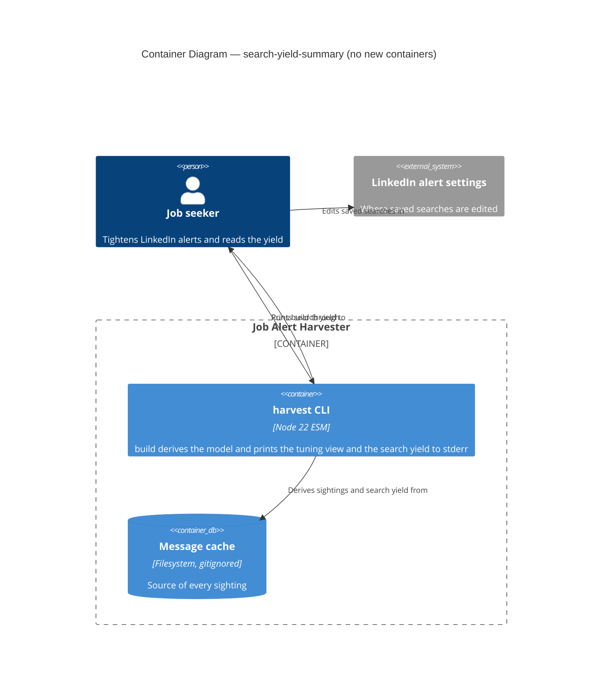
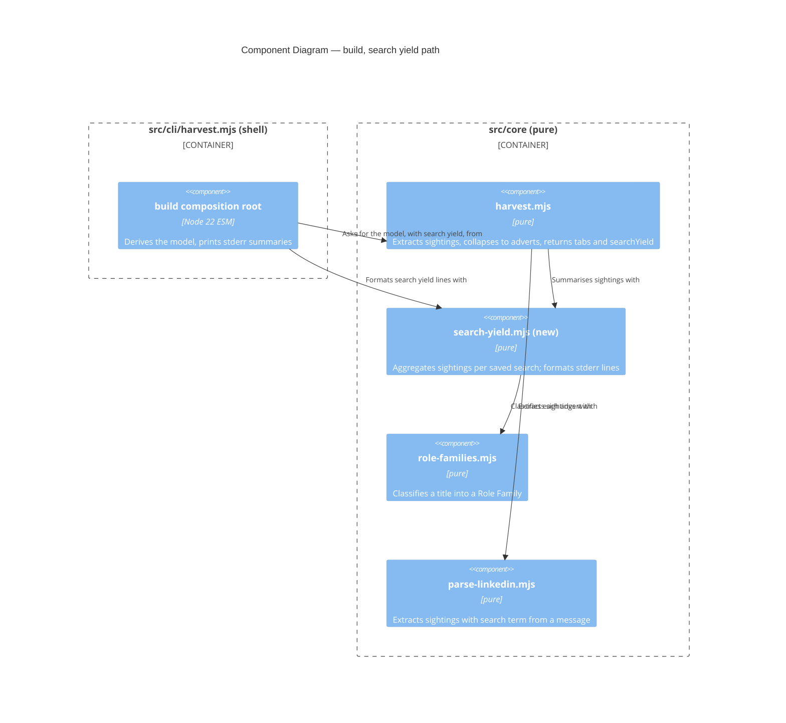

# Feature Delta — search-yield-summary

Narrative record of the DESIGN wave for `search-yield-summary`. Architecture summary: `docs/product/architecture/brief.md` (`## Application Architecture`, section 15). Mode: propose. The items under *Open Questions* were **ratified by the human on 2026-10-05**. Nothing was built at DESIGN time.

Doc type: Explanation plus Reference (same mix as the sibling `role-family-column` delta). Assumed background: `build` derives a harvest model from the whole local message cache (DR-0009, build derives from the whole cache), merges it into a tracker, and prints stderr summaries; the Role Family column and its tuning view are DR-0014 (Role Family derived from title).

Warnings carried by this wave:

- DISCUSS and DISCOVER were skipped by instruction (the human decided "Yes, add the per-search yield summary"). No story exists, so story-to-scenario traceability is absent. Acceptance criteria below are derived from the DESIGN brief.
- DEVOPS is `NOT_APPLICABLE:` (local CLI, one operator).
- Figures from the operator's ad-hoc analysis (about 17 distinct searches; per-search `other` share 6% to 77%; 8 searches cover 97% of on-target adverts; 25 adverts without a parsable search term) are aggregates taken from the brief of this wave. They were not recomputed here: no shell was available and `.cache/` holds personal data. No search string, employer or title from the cache appears in this file; every example is synthetic.
- No shell was available, so `git worktree list --porcelain` was not run. A file search under `/Users/danielosborne/projects` found no `DR-0015` file. DR-0015 was allocated on 2026-10-05; `git worktree list` shows the only sibling worktree holds DR-0001 to DR-0011.
- `nwave-ai outcomes check-delta` was not run (no shell; `docs/product/outcomes/registry.yaml` does not exist).

---

## Wave: DESIGN / [REF] Upstream Consultation

| Input | Status | Bearing |
|---|---|---|
| Human brief (feature, four metrics, stderr only, same three print sites) | read | Fixed: summary beside the tuning view; nothing stored; no tab, column, file or report change |
| `docs/product/architecture/brief.md` (sections 11, 14) | read | Extended with section 15 |
| `docs/feature/role-family-column/feature-delta.md` | read (first 457 of 627 lines; DESIGN and DISTILL sections) | Format; tuning-view design (Q5, OQ-5); Role Family from title only |
| DR-0014 (Role Family derived from title) | read in full | Family definition, tuning view settled in feature-delta, not a new DR |
| DR-0001, DR-0004, DR-0006, DR-0009, DR-0013 | not re-read; constraints taken from DR-0014 and the role-family delta, which quote them | Derive, do not persist; whole-cache derivation; layering |
| `src/core/{harvest,parse-linkedin,role-families,cli-options,merge}.mjs`, `src/cli/harvest.mjs`, `src/adapters/xlsx-*.mjs` (grepped for model use) | read or grepped | Basis of every finding below |
| `tests/` | grepped for whole-model assertions (one hit, `model.jobs.columns`) | Adding a key to the harvest model is unlikely to break a deep-equal; not exhaustively verified |
| `.cache/` | **not read** | Personal data |

---

## Wave: DESIGN / [REF] Domain Language

| Term | Meaning here |
|---|---|
| **Saved search** | The `searchTerm` of a LinkedIn alert, parsed from the "Your job alert for ..." line (`parse-linkedin.mjs:6`, `:20-23`). Identified by its exact trimmed string; no case folding, as in the Sources tab |
| **Sighting** | One advert card in one alert message: a raw row from `extractJobs` carrying `searchTerm`, `dedupKey`, `seenAt`, `title` |
| **Advert** | One distinct `dedupKey` (one Jobs row). A repost under a new LinkedIn id is a different advert |
| **Found by** | A saved search found an advert when at least one sighting of it carries that search's term, within the scope being counted |
| **Found** (column) | Distinct adverts found by a saved search |
| **Other** | Found adverts whose Role Family is `other` |
| **On-target** | Found adverts whose Role Family is any family except `other` (`found = other + on-target`) |
| **Unique** | On-target adverts found by that saved search and by no other named saved search, within the scope being counted |
| **Scope** | Either *all cached alerts* or the *recent window*: the 28 calendar dates ending at the latest sighting date in the cache |
| **Unparsed bucket** | Sightings whose message has no parsable search term (`searchTerm` is `null`). Labelled `(no search term)` |
| **Search yield** | The per-saved-search table of the four counts, in one block per scope |

Differences from existing columns, so they are not confused: the Sources tab `Jobs Found` is **already** a count of distinct adverts per search term, all-time (`harvest.mjs:152,164`, `dedupKeys.size`). The new `found` column equals it for every named search in the all-time block. The Sources tab `Messages` counts distinct alert emails (digests) per term. The Jobs tab `Times Seen` counts sightings per advert. The summary adds what the Sources tab lacks: the `other` and on-target split, the unique contribution, and a recent scope.

Bounded context: one (the harvester's derivation). No DDD pass.

---

## Wave: DESIGN / [REF] Component Decomposition

Style unchanged: Pure Core / Imperative Shell (ports-and-adapters), functional paradigm. No new adapter, port or I/O.

| Component | Path | Layer | Change | Contract shape |
|---|---|---|---|---|
| Search-yield summary and formatter | `src/core/search-yield.mjs` | core | **new** | pure-function (return-only). Summary: sightings plus collapsed adverts in, `{ allTime, recent }` blocks out. Formatter: blocks in, array of stderr lines out. Exports its constants (window days, row cap, term width, label) |
| Harvest model | `src/core/harvest.mjs` | core | extend: `harvest()` (`:196-207`) calls the summary on the `rawRows` it already holds and returns it as a fourth key, `searchYield`, beside `sources`, `companies`, `jobs` | pure |
| Composition root | `src/cli/harvest.mjs` | shell | extend: one `printSearchYield(model)` beside `printTuningView` at the three print sites; `reportDryRun` gains the `model` argument | imperative; stderr writes only |
| Merge planning, tab planners, adapters, change report, import check | various | core, shell | **unchanged** | as before |

Why the model key is safe: `planMergeAll` only plans tabs whose key is `in` the model (`merge.mjs:224`), and both xlsx writers read `model.sources`, `.companies`, `.jobs` by name (`xlsx-target-sheet.mjs:263-265`, `xlsx-workbook-writer.mjs:13-15`). An extra key is ignored by all of them.

Effect isolation. Both new functions are pure and return values. The only new effect is `console.error` in the existing shell. `--dry-run` still returns a plan and receives no write capability. Nothing reaches a target, the receipt store or the `--report` file.

---

## Wave: DESIGN / [REF] Driving Ports

| Surface | Effect |
|---|---|
| `harvest build --out <f> --merge <f>` | stderr gains the search-yield block(s) after the tuning view; the merge is unchanged |
| `harvest build --target sheets` | Same |
| `harvest build --dry-run` (either target) | Same; still writes nothing |
| `harvest build --out <f>` (create) and `harvest --in <dir> --out <f>` (rebuild) | **No change**: these do not print the tuning view either |
| stdout, `--report <f>` | **Never** carries search yield. An empty report still means nothing changed |

No new subcommand, option, tab, column or file. `src/core/cli-options.mjs` is untouched. Read/write split unchanged.

## Wave: DESIGN / [REF] Driven Ports

Unchanged, with their probes. Earned Trust (what happens if the environment lies): the summary is a pure function over data already in memory, so there is nothing to probe. Two input assumptions are stated and pinned by tests: (1) `seenAt` begins with an ISO date (already relied on by `toJobsRow`, `harvest.mjs:106`); the summary treats a sighting with an unreadable date as outside the recent window and never throws. (2) The cache may be partial; see Q6.

---

## Wave: DESIGN / [REF] Findings from the Code

### Q1. Where per-search membership lives, and the smallest change

`harvest()` extracts `rawRows` (`harvest.mjs:197`), then `upsertByDedupKey` collapses them to one row per `dedupKey` (`:69-91`). The collapsed row spreads the earliest sighting, so it keeps one `searchTerm` and the rest are lost. `rawRows` is local to `harvest()`: it is not returned and nothing at the three print sites can see it. They hold only `model` (`deriveHarvestModel`, `cli/harvest.mjs:299-302`) or `plans`.

| Option | What | Trade-offs |
|---|---|---|
| **A. Compute in a new pure module, called by `harvest()`, returned as `model.searchYield` (recommended)** | Smallest change: one call and one key in `harvest()`, one print function in the shell. `rawRows` stays internal. The family is classified from the collapsed advert's title, the same title and function as `toJobsRow` | One new module; `harvest()` return shape grows by one additive key |
| B. The CLI re-derives from `messages` | The shell would call `extractJobs` again | Parses every message twice; moves derivation into the shell, against `harvest.mjs`'s own header ("dedup, upsert ... never in an adapter"); the two derivations can drift. Rejected |
| C. A new core module taking `rawRows`, called by the shell | Needs `harvest()` to expose `rawRows` or the shell to re-parse | Exposes an internal intermediate to the shell; no benefit over A. Rejected |

Recommended: A. The summary needs both inputs `harvest()` has in scope: the sightings (`rawRows`) and the collapsed adverts (first-sighting title).

### Q2. Metric definitions, exactly

For a scope S (all sightings, or the sightings in the recent window):

- **Per-advert family.** The Role Family of the advert's collapsed row: `classifyRoleFamily(title)` on the first-sighting title (`upsertByDedupKey` sorts by `seenAt` and keeps the earliest, `harvest.mjs:72-79`; DR-0014 rule 2, title only). This is the same value as the Jobs `Role Family` cell, so the summary agrees with the column by construction. The family does not depend on scope: a recent-window advert first seen long ago keeps its original family.
- **found(search)** = distinct `dedupKey` among sightings in S whose `searchTerm` equals the search.
- **other(search)** = found adverts whose family is `other`. **on-target(search)** = found minus other.
- **other share** = `round(100 * other / found)`, integer, half up (`Math.round`). Found is at least 1 for every listed search, so no division by zero.
- **unique(search)** = on-target adverts found by this search whose set of *named* searches in S is exactly this one. Over the scope: all-time in the all-time block, recent-window sightings only in the recent block. An advert found by this search and also by an unparsed sighting still counts as unique, because the unparsed bucket is not a search the operator can tighten.
- **Unparsed bucket.** Sightings with `searchTerm` of `null` (also an empty string) form one row labelled `(no search term)`. Found, other and on-target are computed as above. Its `unique` is shown as `-`. It never counts as "another search" in anyone's unique reckoning.
- **Total row** `all searches`: distinct adverts in S (including unparsed-only adverts), with other and on-target. `unique` is `-`. All-time total equals the Jobs row count of the model.
- **Edited searches.** LinkedIn alerts keyed by exact string: an edited search appears as a new row beside the old one, as it does in the Sources tab. To see the effect of a change, compare the old row aging out of the recent block with the new row.
- **Reposts.** A repost under a new id is a distinct advert and is counted twice. The summary measures what the alerts delivered, not de-duplicated roles.

### Q3. Window

| Option | What | Trade-offs |
|---|---|---|
| All-time only | One block | Simplest. Hides a recent change: after months of history a tightened search keeps its old numbers. Fails the stated purpose (see the effect of each change) |
| **All-time plus a fixed recent window (recommended): 28 calendar dates, constant in `search-yield.mjs`** | Two blocks, from the same function | No contract change. 28 days spans four whole weeks, so weekday patterns balance. The constant is a one-line edit if wrong. Costs a second table of output |
| `--since <date>` option | Operator-chosen window | Needs an entry in the `build` option table (`cli-options.mjs:20`), the unknown-option guard, `docs/reference/cli.md`, tests and a decision record. A contract change for a tuning loop that a fixed window already serves. Defer; revisit if 28 days proves wrong for the operator's change cadence |

**Window anchor.** The window ends at the latest sighting date in the cache, not at the system clock. The core stays pure (no clock), the result depends only on the cache, and the block heading prints the end date, so a stale cache is visible rather than silently reading as "recent". The alternative, injecting `now` from the shell (`nowIso` exists, `cli/harvest.mjs:146`), is a small addition but makes the output vary with the day it is run (OQ-2).

**Window membership** is by sighting: an advert counts under a search in the recent block when that search sent it in the window, even if the advert was first seen earlier.

The recent block is omitted when the whole cache fits inside the window (earliest sighting date on or after the window start), because it would repeat the first block.

### Q4. Output

Block order after the existing stderr lines: `summarizeChanges`, `printTuningView`, then `printSearchYield`. Every heading line is prefixed `harvest build: `; table lines are indented two spaces, as in the tuning view (`role-families.mjs:68-70`).

Rules (constants exported from `search-yield.mjs`):

- Columns: search, `found`, `other` (`n (p%)`), `on-target`, `unique`. Search left-aligned in a 40-character field, numbers right-aligned (found 5, other 9, on-target 9, unique 6), two spaces between columns.
- Search label longer than 40 characters: the first 37 characters then `...`. Length counts characters as in `String.length`.
- Named searches ordered by `found` descending, then search ascending by code unit (not `localeCompare`, so the order does not vary by locale; the Sources tab uses `localeCompare`).
- At most 20 named searches are shown. If more exist, a line `  ... and <n> more search(es) not shown` follows the last row. The unparsed row (when present) and the total row are always shown, and the total counts every search.
- A block is printed only when it has at least 2 named searches with at least 1 advert in its scope; otherwise it is omitted. A one-search cache has nothing to compare, and an empty cache has no rows.
- Printed by the same three commands as the tuning view; never on stdout; never in `--report`.

Synthetic example. Operator has four saved searches; the two broad ones carry most unique adverts; the last is fully redundant (unique 0); the third is noisy and its long label is truncated:

```
harvest build: search yield, all cached alerts (distinct adverts per saved search)
  search                                    found      other  on-target  unique
  agile coach in Examplestan                  412   31 (8%)        381     120
  scrum master in Exampleshire                260  41 (16%)        219      15
  contract engineering manager in Examp...    143  70 (49%)         73       5
  agile coach (remote) in Examplestan          88   9 (10%)         79       0
  (no search term)                             25   3 (12%)         22       -
  all searches                                700 130 (19%)        570       -
harvest build: search yield, last 28 days to 2026-10-04
  search                                    found      other  on-target  unique
  agile coach in Examplestan                   90    7 (8%)         83      22
  scrum master in Exampleshire                 61   8 (13%)         53       3
  contract engineering manager in Examp...     30  14 (47%)         16       1
  agile coach (remote) in Examplestan          20   2 (10%)         18       0
  all searches                                150  25 (17%)        125       -
```

(Column alignment in this example is illustrative; the exact widths are the rule above and are pinned by DISTILL.) The recent block has no `(no search term)` row because no sighting in that window lacks a term: zero-found unparsed rows are not printed.

### Q5. Layering and purity

`search-yield.mjs` imports only `role-families.mjs` (for `classifyRoleFamily` and `OTHER_FAMILY`), a core-to-core import allowed by DR-0013 (dependency-cruiser layering). It uses no `node:` builtin, class or mutation of its inputs (internal accumulation follows the existing style: `reduce` and `Map`/`Set` construction as in `toSourcesRows`). The shell change is stderr writes only. Driving ports: the existing `build` surfaces. Driven ports: none touched. The C4 diagrams are at the end of this file.

### Q6. Persistence and partial caches

Nothing is stored (DR-0001, persist what cannot be re-derived): the summary is recomputed from the whole cache on each run (DR-0009), so it changes only when the cache changes and never depends on earlier runs or on the target's contents. Two risks, both stated here rather than hidden:

1. **Partial cache.** The summary does not read the coverage ledger. A gap in fetched days lowers `found` for every search in it and can inflate `unique`: if the email that would show an advert under a second search is missing, the first search looks like its only finder. Read the unique column as an upper bound on a cache with gaps.
2. **Recent window across a gap.** If the last 28 days are partly unfetched, the recent block under-counts. The printed end date shows how fresh the cache is; whether the window is fully covered is not shown.

### Q7. Is a decision record needed?

**Yes (OQ-6, resolved by the human on 2026-10-05): DR-0015.** Adding a key to what `harvest()` returns changes a core interface, which is the case that earns a record. Precedent for the contrary view: the tuning view was settled in the feature-delta only. A `--since` option or persisting any history would each raise a further record.

### Q8. Test approach for DISTILL

See *Handoff to DISTILL*.

---

## Wave: DESIGN / [REF] Technology Choices

| Choice | Version | License | Status |
|---|---|---|---|
| Plain pure functions over arrays, `Map` and `Set`, in `src/core` | Node 22 | none | no dependency |
| `fast-check`, `vitest` | existing | MIT | properties and examples |
| `dependency-cruiser` (DR-0013) | existing | MIT | no rule change |

No new runtime or dev dependency. Cognitive Load Tax: one module and one shell print function. A table-rendering library was rejected: two `padStart`/`padEnd` calls do the work.

### Architecture enforcement

Style: Pure Core / Imperative Shell. Language: JavaScript (ESM). Tool: `dependency-cruiser` (`.dependency-cruiser.cjs`, `npm run check:arch`). Rule unchanged and sufficient: `src/core/**` imports no `node:` builtin and nothing from adapters or cli. `search-yield.mjs` may import only core modules.

---

## Wave: DESIGN / [REF] Design Decisions

| ID | Decision | Rationale | Source |
|---|---|---|---|
| SY-01 | Search yield is derived, printed to stderr by `build` (merge, Sheets, `--dry-run`), never stored, never on stdout, never in `--report` | DR-0001 and DR-0009; an empty report keeps meaning "nothing changed" | Human brief |
| SY-02 | Computed by a new pure core module called from `harvest()` and returned as `model.searchYield` | `rawRows` stays internal; same first-sighting title as the Role Family cell (Q1) | this wave |
| SY-03 | On-target means any family except `other`; unique means on-target and found by no other named search, in the scope counted | Matches the operator's definition | Human brief |
| SY-04 | The unparsed bucket is a labelled row, excluded from unique reckoning, `unique` shown `-` | It is not a search the operator can edit | this wave |
| SY-05 | Two scopes: all cached alerts, and the 28 calendar dates ending at the latest sighting date; no new option | Shows the effect of a recent change without a contract change | this wave |
| SY-06 | Omit a block with fewer than 2 named searches; cap 20 named searches; truncate labels to 40 characters | Stable, bounded stderr | this wave |
| SY-07 | `found` equals the Sources tab `Jobs Found` for named searches (all-time) | Reconciliation; the two must not diverge | Q2 |
| SY-08 | A decision record, DR-0015, records where search yield is derived; the rest lives in this table | Adding a key to what `harvest()` returns changes a core interface | OQ-6 (human, 2026-10-05) |

---

## Wave: DESIGN / [REF] Reuse Analysis

**Hard gate.** Default is EXTEND.

| Capability | Existing code | Verdict | Evidence, contract shape, assertion |
|---|---|---|---|
| Per-search membership | `rawRows` in `harvest()` (`harvest.mjs:197`) | **EXTEND** `harvest()` | Already holds `searchTerm`, `dedupKey`, `seenAt`; one added call. Pure. Assertion: `found` equals Sources `Jobs Found` |
| Distinct counts per term | `toSourcesRows` (`harvest.mjs:134-166`) | **EXTEND** by reuse of the idea, **CREATE NEW** code | It keys by term and counts `dedupKeys.size`, but carries no family and no windowing; changing it would change a Sources-tab contract. Pure |
| Family of an advert | `classifyRoleFamily`, `OTHER_FAMILY` (`role-families.mjs`) | **EXTEND** (import) | Same function and same title as `toJobsRow`, so the summary agrees with the column. Assertion: totals equal the Jobs `other` count |
| Stderr view beside the tuning view | `formatTuningView`, `printTuningView` (`role-families.mjs:63`, `cli/harvest.mjs:371`) | **EXTEND** the pattern | Pure formatter returning lines; shell prints them |
| Summary and formatter | none | **CREATE NEW** `src/core/search-yield.mjs` | Justified: no existing module holds per-search aggregates. Challenged `role-families.mjs` (kept to classification and the title tuning view) and `harvest.mjs` (already assembles three tabs; adding a fourth concern there grows it). Pure-function; assertion: the properties in the handoff |
| Print sites | `reportDryRun`, `runMergeBuild`, `runSheetsBuild` | **EXTEND** | One added print each; `reportDryRun` gains `model` |
| Option table | `cli-options.mjs` | **unchanged** | No option |

**1 CREATE NEW module, 5 EXTEND rows.** Nothing discarded.

---

## Wave: DESIGN / [REF] Open Questions

All nine were **ratified by the human on 2026-10-05** as recommended, except OQ-6, which the human resolved to "write a decision record" (DR-0015, accepted). OQ-10 (title-match share, the share of adverts whose title contains the search phrase) was raised and **deferred** by the human.

| # | Question | Recommendation | If the human chooses otherwise |
|---|---|---|---|
| OQ-1 | Window | All-time plus a fixed 28-day recent block | All-time only: drop the second block and the anchor logic, but the effect of a change stays hidden. `--since`: add an option, guard entry, docs, tests and a decision record |
| OQ-2 | Window anchor | Latest sighting date in the cache (pure, deterministic) | System clock injected from the shell: `harvest()` gains a parameter and tests inject a date; output then varies with run day |
| OQ-3 | Unparsed sightings | A `(no search term)` row, excluded from unique reckoning, `unique` shown `-` | Hide the row (the total would then not reconcile to Jobs rows), or count it as a search (unique then shrinks for adverts also seen without a term) |
| OQ-4 | Ordering, cap, truncation | `found` descending then search ascending; 20 named searches; 40-character label with `...` | Order by `other` count descending to put noisiest first; different cap or width. Constants only |
| OQ-5 | Omission rule | Omit a block with fewer than 2 named searches | Always print when any search exists; one-row tables carry no comparison |
| OQ-6 | Decision record | Resolved by the human: write DR-0015 (accepted 2026-10-05) | Decision table only, as for the tuning view |
| OQ-7 | Where computed | Inside `harvest()`, returned as `searchYield` | The shell derives it from messages (rejected in Q1) |
| OQ-8 | Total row | Print `all searches` row (distinct adverts, not a sum) | Omit it; the operator then cannot see overlap |
| OQ-9 | Reposts under new ids | Count as distinct adverts (unchanged `dedupKey` semantics) | A repost-aware key is a separate feature touching DR-0009 and Jobs rows |

---

## Wave: DESIGN / [REF] External Integrations

No new external integration; the Sheets API surface is unchanged. The existing contract-test annotation in brief section 13 stands.

---

## Wave: DESIGN / [REF] C4 Level 2: Container

No new container.



## Wave: DESIGN / [REF] C4 Level 3: Component (build path, pure core)



---

## Wave: DESIGN / [REF] Handoff to DISTILL

Acceptance criteria are derived from the DESIGN brief; story traceability is absent (no DISCUSS). Scenarios run through the driving port `build` in a real CLI subprocess with an isolated workspace and a synthetic cache of several searches with overlapping adverts. Contract shape in brackets.

**Acceptance scenarios (through `build`)**

- Y1. `build --out <f> --merge <f>` on an xlsx tracker prints, on stderr, the all-time block with the four counts per search, ordered and rounded as specified; stdout and the `--report` file contain no yield line. [bounded-change; read-only for the yield]
- Y2. The same through `build --target sheets` against the loopback fake, and through `build --dry-run` for both targets; the dry-run issues no write-class request and writes no file. [unbounded-preservation]
- Y3. `build --out <f>` (create) and the `--in` rebuild print no search yield.
- Y4. Reconciliation: for each named search, `found` equals the Sources tab `Jobs Found`; the `all searches` found equals the Jobs row count; the `all searches` other equals the number of Jobs rows whose `Role Family` is `other`.
- Y5. An advert found by two searches counts under both for found, other and on-target, and under neither for unique.
- Y6. An advert resent by the same search many times counts once; a repost under a new id counts twice.
- Y7. The family counted is the first sighting's: given two sightings with different titles that classify differently, the summary agrees with the Jobs `Role Family` cell.
- Y8. Sightings without a parsable term appear as `(no search term)` with `unique` `-` and do not reduce another search's unique count; the total includes them.
- Y9. Edge: one named search prints nothing; an empty cache prints nothing (and the existing empty-cache behaviour is unchanged); a cache entirely within 28 days prints no recent block.
- Y10. Recent block: given sightings spread over more than 28 days, only the 28 dates ending at the latest sighting date are counted; the heading shows that end date; an advert first seen earlier but resent in the window counts under the resending search.
- Y11. Presentation: a label over 40 characters is cut to 37 plus `...`; more than 20 named searches print 20 plus the `... and <n> more` line while the total still counts all.
- Y12. Idempotence and independence: two consecutive builds print identical yield; the output does not change when the target tracker's contents change (only the cache matters).
- Y13. An empty `--report` stays empty when nothing changed, with the yield printed.

**Property tests (pure core, `fast-check`)**

- P1. `other + onTarget = found` for every search and the total.
- P2. `unique <= onTarget <= found`.
- P3. Every advert is counted under every named search that sent it: the sum over searches of `found` equals the number of distinct (advert, search) pairs.
- P4. Order-invariance: shuffling the sightings leaves the summary unchanged (generator constraint: sightings of one advert carry distinct `seenAt`, or the same title, since first-sighting selection otherwise depends on input order, exactly as the Jobs row does).
- P5. Recent block is a subset: per search, recent `found` is at most all-time `found`; total likewise.
- P6. Totality: any sighting list (including `null` terms, unreadable dates, empty list) returns a summary and never throws.
- P7. Percent: `0 <= share <= 100` and an integer; an all-`other` search shows 100.

**Structural tests**: `search-yield.mjs` imports nothing outside `src/core` (existing `layering.test.mjs` and `check:arch`); `cli-options.mjs` option tables unchanged (a guard that `build` accepts exactly its current options).

**Docs that go stale at DELIVER** (standing staleness check each wave): `docs/reference/cli.md` (the stderr summary lines for `build`, beside the tuning view lines); `docs/how-to/build-the-tracker-workbook.md` (stderr description); README design table (this feature, no DR); `docs/product/architecture/brief.md` section 15 status.

---

## Wave: DEVOPS / [REF] Skipped

`NOT_APPLICABLE:` no deployment target; a local CLI run by one operator.

## Validation

- `nwave-ai outcomes check-delta`: **not run** (no shell; no `docs/product/outcomes/registry.yaml`).
- Peer review by `nw-solution-architect-reviewer`: **not run** in this session (the invoking instruction named no reviewer dispatch and subagent mode returns to the caller). The caller should dispatch it.
