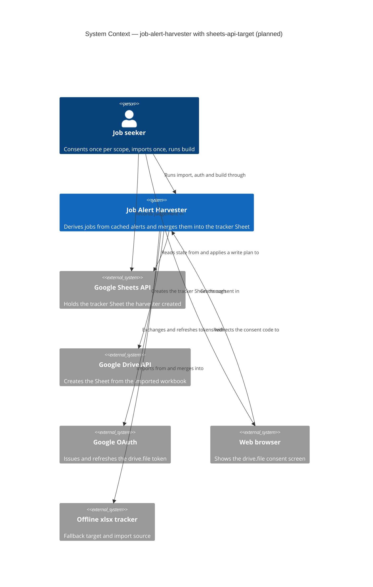
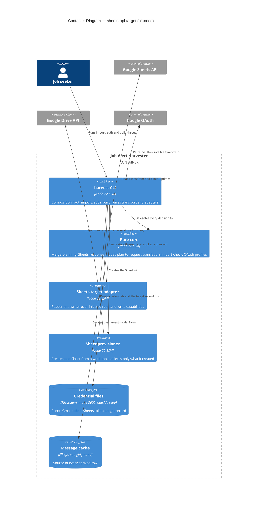

# Feature Delta — sheets-api-target

Narrative record of the DESIGN wave for `sheets-api-target`. Architecture summary lives in
`docs/product/architecture/brief.md` (`## Application Architecture`, section 13). Decisions live in
`docs/decisions/DR-NNNN-*.md`. Mode: propose. Items under *Open Questions* await the human; nothing there is
decided, and no DR file is written for them. Everything here is **planned**; nothing is built.

Doc type: Explanation plus Reference (the sibling `gmail-api-source` delta uses the same mix).

Convention: a claim about Google's API behaviour beyond what the spike proved is tagged **ASSUMPTION (An)** and
collected in *API Assumptions*. Nothing tagged is stated as fact.

---

## Wave: DESIGN / [REF] Upstream Consultation

| Input | Status | Bearing |
|---|---|---|
| `docs/decisions/DR-0012-sheets-target-uses-drive-file-scope.md` | read | Constraints: `drive.file`, harvester-created Sheet, own consent and token, one-off import, owned columns only, single-batch plan, refuse if unreadable |
| `docs/feature/sheets-api-target/spike/findings.md`, `wave-decisions.md` | read | PROVEN list and the one NOT-proven item (write through a metadata address) |
| `docs/feature/sheets-api-target/spike/runbook.md` | listed, not read | Probe is discarded; findings carry the result |
| DR-0005 (plan-executing port), DR-0010 (per-tab merge), DR-0004 (one owner per column), DR-0011 (Gmail credential) | read in full | Port, plan shape, ownership, credential rules |
| DR-0001 (persist what cannot be re-derived), DR-0009 (build derives from whole cache) | not read in full; constraints taken as quoted in DR-0004, DR-0010, DR-0012 | Unaffected: derivation does not change |
| `docs/product/architecture/brief.md` | read | Extended, not recreated |
| `docs/architecture/atdd-infrastructure-policy.md` | read | Sheets row says "deferred; no fake yet"; this wave supplies the row |
| `docs/feature/gmail-api-source/feature-delta.md`, `docs/evolution/2026-09-29-gmail-api-source.md` | read | Style, reuse-table and test-seam precedent |
| `src/adapters/xlsx-target-sheet.mjs`, `src/core/merge.mjs`, `src/cli/harvest.mjs`, `src/adapters/change-report-writer.mjs`, `src/core/oauth.mjs`, `src/core/endpoints.mjs`, `src/core/retry-policy.mjs`, `src/adapters/credential-store.mjs`, `src/adapters/google-token-source.mjs`, `src/cli/auth.mjs` | read | Basis of the Reuse Analysis |
| `src/adapters/gmail-api-source.mjs` | read first 80 lines | Its private `send` loop (401 refresh once, `decideRetry`) is the pattern the transport generalises |
| `src/adapters/oauth-loopback.mjs` | not read | Reused unchanged by design |
| `tests/acceptance/gmail-api-source/support/gmail-fake.mjs` | read | Fake pattern |
| `tests/acceptance/job-alert-harvester/target-sheet-apply.test.mjs` | scenario titles only (grep) | What the port is pinned to do |
| `tests/acceptance/job-alert-harvester/merge-plan.test.mjs` | not read | Plan shape is treated as unchanged (DR-0010 pins it) |
| DISCUSS | skipped by instruction | DESIGN is the only upstream source; story-to-scenario traceability is therefore absent |
| DEVOPS | not applicable (`NOT_APPLICABLE:` local CLI, one operator) | Environment matrix defaults to clean HOME |

---

## Wave: DESIGN / [REF] Domain Language

| Term | Meaning here |
|---|---|
| **Tracker Sheet** | The native Google Sheet the harvester created and owns; the successor to the `.xlsx` tracker |
| **Recorded Sheet** | The Sheet named by the target record (`sheets-target.json`) beside the credentials |
| **Row key** | A row's identity: `Dedup Key` (Jobs), `Company` (Companies), `Source` plus `Search Term` (Sources) |
| **Row-key metadata** | Developer metadata on a row's dimension, key `harvester.row-key`, value = the row key (composite keys as a JSON array of the ordered values, never a joined string; DR-0010 Option 2 reason) |
| **Resolution** | The apply-time step that maps every planned row to a current row index and every planned column to a current column index |
| **Refusal** | A named dotted code; namespaces `sheets.*`, `drive.*`, `import.*`, plus existing `auth.*` |
| **Write class / read class** | A request's effect, decided by one pure function over method and path, so a read-only capability is structural |

Anti-corruption layer: `core/sheets-model.mjs` is the only place that knows the Sheets response shape; core
merge logic sees only `SheetState` as today. Drive's file-resource shape is confined to the provisioner adapter.

---

## Wave: DESIGN / [REF] Component Decomposition

Style unchanged: Pure Core / Imperative Shell (ports-and-adapters), functional paradigm.

| Component | Path | Layer | Change | Contract shape |
|---|---|---|---|---|
| Sheets response to `SheetState` and resolution (tab ids, column index by header, row index by key, grid size) | `src/core/sheets-model.mjs` | core | new | pure |
| Plan plus resolution to one `spreadsheets.batchUpdate` body; metadata-bind body; request classifier (read/write class); request-type allow-list | `src/core/sheets-requests.mjs` | core | new | pure; **allow-list: `updateCells`, `appendCells`, `appendDimension`, `addSheet`, `createDeveloperMetadata`. No delete, clear or sort request is constructable** |
| Import verdict (recognisable headers, duplicate keys, conversion fidelity) | `src/core/import-check.mjs` | core | new | pure |
| OAuth helpers parameterised by scope profile | `src/core/oauth.mjs` | core | extended | pure |
| Endpoint table gains Sheets and Drive bases | `src/core/endpoints.mjs` | core | extended | pure |
| Retry decision gains a refusal namespace | `src/core/retry-policy.mjs` | core | extended | pure |
| Merge planning | `src/core/merge.mjs` | core | **unchanged** | pure, returns Plan |
| Sheets `TargetSheet` (reader factory: `probe`, `read`; writer factory: adds `apply`) | `src/adapters/sheets-target.mjs` | shell | new | reader: bounded-read. Writer: bounded-change, universe = the recorded Sheet's harvester-owned cells, appended rows and columns, new tabs, row-key metadata |
| Sheet provisioner (Drive create with conversion; delete of a file created in this process) | `src/adapters/sheet-provisioner.mjs` | shell | new | bounded-change: creates exactly one file; may delete only the id it just created |
| Credential store gains the Sheets token slot and the target record | `src/adapters/credential-store.mjs` | shell | extended | bounded-change: `~/.config/job-alert-harvester/{token,sheets-token,sheets-target}.json` plus tmp; client file read-only |
| Authorised transport (bearer, one 401 refresh, `decideRetry`, timeout, read/write capability split) | `src/cli/google-transport.mjs` | shell | new | imperative; hands adapters two capabilities |
| `auth` orchestration | `src/cli/auth.mjs` | shell | extended | takes a scope profile; the mailbox lookup is a Gmail-profile step only |
| `import` orchestration | `src/cli/import.mjs` | shell | new | imperative |
| Composition root | `src/cli/harvest.mjs` | shell | extended: `import`, `auth --target`, `build --target sheets`; `build` becomes async | imperative |
| xlsx target, ledger, cache, token source, loopback, `merge`-related core | — | — | **unchanged** | — |

Adapters do not import each other. `sheets-target` and `sheet-provisioner` receive their transport capability,
`sleep`, `jitter`, `now` as arguments; `harvest.mjs` wires them.

Effect isolation: `build --dry-run` receives a reader built on the **read capability only**. The write
capability is never constructed on that path, so "the preview wrote to the Sheet" is not representable.

---

## Wave: DESIGN / [REF] Driving Ports

| Surface | Effect |
|---|---|
| `harvest auth --target sheets` | Separate consent for `drive.file`; writes `sheets-token.json` (0600). `--target gmail` and no flag behave as today. Prints the consent URL; never a token |
| `harvest import --from <file.xlsx>` | One-off: creates the native Sheet from the workbook, verifies it, records its id, binds row-key metadata. Never overwrites |
| `harvest build --target sheets [--dry-run] [--report <f>]` | Merge into the recorded Sheet. Mutually exclusive with `--out` and `--merge` (see OQ-2) |
| `harvest build --out/--merge` | Unchanged: offline `.xlsx`, stale-upload warning, receipts |
| `fetch`, `plan-fetch`, `ingest`, `--in/--out` | Unchanged |

Read/write split: `build --dry-run` reads and plans; only the non-dry-run path constructs the writer.

---

## Wave: DESIGN / [REF] Driven Ports and Adapters

### Q1. The `TargetSheet` port today, and what changes

Today (`xlsx-target-sheet.mjs`): `read() -> { tabs: { name: { columns[], rows[] } } }` (rows are objects keyed by
header, `null` for blanks; no row address), `apply(plan | plan[]) -> { appliedAt, cellsWritten, inputDigest,
outputDigest }`, `probe()`, and `create(model)` (create-new; xlsx only).

A Sheets adapter must implement `probe`, `read` and `apply` with the same shapes. Changes to the port, all
additive or relaxations:

| Change | Why | Blast radius |
|---|---|---|
| Any operation may return a Promise (as `MessageSource`, gmail OQ-1) | Network | `runBuild` and its helpers become async; `main` already awaits. The xlsx adapter stays synchronous and is `await`ed harmlessly. No test edit needed |
| `Receipt.inputDigest` / `outputDigest` are `null` for Sheets | A remote Sheet has no file bytes; a digest of read values would not identify a revision (no revision precondition exists; spike E) | `receipt-store` and `evaluateFreshness` are xlsx-only and not called on the Sheets path |
| `Receipt` gains optional `appendsSkippedAsPresent`, `metadataPending` | Report idempotent skips and non-fatal metadata lag | additive; `summarizeApply` ignores unknown fields |
| `create(model)` stays xlsx-only | The Sheet is created by `import`, never by `build` | none |
| Read-side split: `TargetSheetReader { probe, read }` is what `--dry-run` receives | Effect isolation | new type only; xlsx adapter satisfies both |

The plan (`{ tab, appendColumns, updates[{key, match?, cells}], appends, changes }`) is **unchanged**. Nothing in
`merge.mjs` changes.

**What the Sheets adapter reads, and when.** Reading is by ranges, never per cell:

| When | Calls | Purpose |
|---|---|---|
| Probe | `spreadsheets.get` (fields: id, title, tab properties incl. `sheetId`, grid size); Drive `files.get` (fields: `trashed`); one `values.batchGet` of each tab's header row | Sheet readable, not trashed, expected tabs, header sanity |
| `read()` | `spreadsheets.get` (tab properties) then one `values.batchGet` of every existing tab's used range, `UNFORMATTED_VALUE` | Builds `SheetState`. Header is row 1; `rows[i]` is sheet row `i+2`, blank interior rows kept so indices stay aligned |
| Start of `apply()` (Resolution) | The same three calls again, plus `developerMetadata.search` for key `harvester.row-key` | Fresh values, fresh indices, fresh grid size, and the second row locator. **This is mandatory even though `read()` just ran**: the plan was computed from state that may be seconds old |

Cost per run: about five read calls plus one write and (only when rows lack metadata) one more write. Reads
are quota-visible; there is no quota introspection (stated, as in the Gmail probe).

ASSUMPTION A1 (`UNFORMATTED_VALUE` returns booleans, numbers and text faithfully, so `existing[column] !== to`
in `changedCells` stays meaningful) and A2 (an `.xlsx` date cell converts to a serial number and reads back as
a number, not the ISO text the harvester writes) need a live check on the real tracker: if Date columns are
real dates, the first run reports a type-change "correction" on every row and overwrites the cell with text.
Harvester columns are harvester-owned, so this is correct but noisy; DELIVER measures it.

### Q2. Atomic multi-tab apply

Options for expressing one plan across Jobs, Companies and Sources:

| Option | Shape | Atomic across tabs | Address-safe at write time | Verdict |
|---|---|---|---|---|
| **A** | One `spreadsheets.batchUpdate`, cell-level requests (`updateCells` per contiguous owned-column run, `appendCells`, `appendDimension`, `addSheet`) with indices from Resolution | Documented as all-or-nothing (**A3**, unproven here) | No. Indices are resolved milliseconds earlier by two locators that must agree | Recommended (OQ-1) |
| **B** | `values.batchUpdateByDataFilter` with a row-metadata filter for updates; appends and header columns separately | Unknown for a values batch (**A4**); appends and new columns cannot be in it | Yes for updates, if the write path works (NOT proven) | Not viable alone; kept as a DELIVER probe |
| **C** | `values.batchUpdate` with A1 ranges from Resolution | Unknown (**A4**) | No | Rejected: no atomicity advantage over A, weaker typing of cell values |

Recommendation: **A**, and this is where DR-0012 needs a flag (see *DR Flags*): the record asks for a single
atomic batch **and** metadata-addressed writes, and to my knowledge no cell-level request inside
`spreadsheets.batchUpdate` accepts a data filter (**A5**). Metadata-addressed writes exist only in the values
API, which cannot carry appends, new columns or new tabs. So under A metadata is the **second locator and a
tripwire**, not the write address; DR-0012's own fallback ("re-read the key column immediately before the
write") becomes the primary path.

Why A's residual race is tolerable, stated plainly rather than hidden:

- The window is one HTTP round trip after Resolution. A human sort or insert inside it can misdirect a write.
- What a misdirected write can touch is bounded: **harvester-owned, non-key columns only** (below). It cannot
  touch a human cell, an unknown column, or a row key. Every harvester-owned value is re-derived from the cache
  and rewritten on the next run, so the worst outcome is transiently wrong derived cells, not lost judgement.
- The adapter never writes a tab's key columns on an existing row (they equal the match by construction, so
  skipping loses nothing). This closes the one path where a misdirect could change a row's identity (Companies'
  `Company` is both key and a harvester column).

Apply sequence (verify-then-write on **every** attempt, first or retried):

1. Resolution (Q1 table). Pure: `sheets-model` turns the four responses into `{tabs: {name: {sheetId, columnIndex, rowIndexByKey, rowCount, columnCount, metadataByKey}}}`.
2. Pure checks (Q3, Q4 refusals). Any failure writes nothing.
3. Idempotent-append filter: drop every append whose row key already exists in the fresh key column (counted in `appendsSkippedAsPresent`).
4. Pure `sheets-requests` builds one body. Optional minimisation: skip cells whose fresh value already equals the planned value (smaller payload, smaller race, fewer quota units; `cellsWritten` then counts real writes). DELIVER may take it or not.
5. One `spreadsheets.batchUpdate`. No `requiredRevisionId`, no `If-Match` (accepted-when-bogus per spike; sending them would be theatre).
6. Non-fatal: bind row-key metadata for appended rows and for keyed rows lacking it (one further `batchUpdate` after a key re-read). Failure warns `sheets.metadata-pending`; the next `build` heals it.

**Idempotency under retry.** A retry never replays a body. It repeats steps 1-5, so a batch that was applied
but whose response was lost (network error, timeout, 5xx) is detected by step 3 as "rows already present" and
not double-appended. Updates are overwrites of the same values, idempotent by nature. Attempts are bounded by
`decideRetry` (three). If the final attempt ends ambiguous (transport failure or 5xx with no response), the
refusal is `sheets.apply-outcome-unknown` telling the operator a re-run is safe; it is not reported as failure
of an unapplied plan.

**One batch, no chunking.** Chunking would break the cross-tab atomicity that DR-0005 and DR-0010 require. If a
plan exceeds a byte threshold the adapter refuses `sheets.plan-too-large` rather than split (OQ-4). The
threshold is unknown (**A6**); DELIVER measures against the real tracker size (about 3,000 Jobs rows).

DELIVER must verify (live, against a scratch Sheet imported from a synthetic workbook, then deleted; the
fake encodes these assumptions and so cannot prove them):

1. A batch containing one invalid request applies **nothing** (A3), including across two tabs.
2. `appendCells` lands below a row a human added after Resolution and never overwrites it.
3. `appendDimension` is needed and sufficient when new columns exceed the grid (A7).
4. `updateCells` with `fields: userEnteredValue` leaves formatting, validation and notes on the cell untouched (A8).
5. A `null` planned value clears the cell (DR-0004 overwrite semantics, as the xlsx `writeCell`) and an untouched human cell is not in the request.
6. The payload ceiling for the real tracker (A6).
7. `values.batchUpdateByDataFilter` through a row-metadata filter: what range it writes, whether `null` entries are skipped (A9). This is the one PROVEN-gap from the spike; the result decides whether OQ-1 option B becomes an optional hardening.

### Q3. Row identity

Rule: **the key column is the truth; metadata is the second locator.** Existence, and the plan itself, come
from the key column (as `merge.mjs` already does). Metadata guards against a sort or insert between two reads.

| Situation at Resolution | Behaviour |
|---|---|
| Key-column index and metadata index agree | Write |
| Row has a key but no metadata (a human-appended row is never keyed; a row appended by a failed bind; a pre-import row) | Write by key index; bind metadata afterwards (heal) |
| Key found, metadata points to a different row | Refuse `sheets.row-identity-conflict` naming the key, nothing written (OQ-3) |
| Same key twice in the key column | Refuse `sheets.duplicate-key` naming the key, nothing written (OQ-3) |
| Blank key | Never matched, never given metadata (DR-0004 rule 2) |
| Metadata lookup call fails (non-auth error, malformed body) | Fall back to key-column-only resolution for this run, warn `sheets.metadata-unavailable`; auth and quota failures still refuse |

Fallback order for the write address, in the order DELIVER should try, each pinned by acceptance tests:

1. Row index from the key column re-read in the same Resolution (primary, option A).
2. Second locator (metadata) must agree; disagreement refuses.
3. Write through a metadata address (`values.batchUpdateByDataFilter`): **not proven**; only as optional hardening after DELIVER item 7.

Metadata is created at `import` (every keyed row) and on append (step 6). Because it is created after the row
exists, an append never depends on a predicted row index (a predicted index could bind the wrong row if a human
inserted a row in the gap). Metadata value size limits and visibility mode (**A10**) are unverified; the
spike's probe did not record which visibility it used.

### Q4. Column identity and ownership on a live Sheet

Columns are located by header text in row 1, exact match, every Resolution. Column order is the human's.

| Event | Behaviour | Why |
|---|---|---|
| Human reorders columns | Nothing: located by name | |
| Human adds a column | Preserved, never written (DR-0004 unknown-column rule) | |
| Human renames or deletes a **harvester-owned** header | `planMerge` sees the column absent and appends a fresh header at the right (DR-0004 rule 3); the renamed column is now an unknown column and is preserved | No named refusal needed: existing core behaviour, visible in the Sheet |
| Human renames or deletes the **key** column of a tab that has data rows, or the **Jobs** tab has no `Dedup Key` header at all (including an empty Jobs tab; human decision 2026-09-29) | Refuse `sheets.key-column-missing` naming the tab, in `probe` and again in Resolution | Merging without a key appends every row again and doubles the tab. Stronger than xlsx, which checks Jobs only; Companies and Sources have the same hazard |
| Duplicate header for a key or harvester-owned column | Refuse `sheets.duplicate-header` | Ownership would be ambiguous |
| A column the plan expects to update has vanished **between `read()` and `apply()`** | Refuse `sheets.header-changed`, nothing written | xlsx `continue`s silently; on a live Sheet that would under-write invisibly. Fail closed |
| Jobs tab missing | Refuse `sheets.tab-missing` | Companies and Sources absent are created by `addSheet` on apply (DR-0010 rule 5) |
| Empty **Companies** or **Sources** tab (no header) | Treated as new: header written, then rows | mirrors xlsx create-tab branch; an empty Jobs tab is NOT treated as new (see the key-column row above) |

Write rule, enforced structurally by the request builder and asserted by a property test over generated
plans: every `updateCells` target is (row resolved by key) × (column in the tab's harvester-owned set) and is
not a key column; every `appendCells` row is a new row; the only header writes are `appendColumns`. A
human-owned cell, an unknown column and an existing key cell are never a write target because no request
that could address them can be built.

### Q5. Auth

`auth --target sheets` runs the DR-0011 flow (loopback, PKCE, `state`) with scope `drive.file` and the same
Desktop client file. It writes `sheets-token.json`; the Gmail token is untouched.

Parameterising `core/oauth.mjs` without weakening Gmail:

- Introduce two frozen scope profiles, `GMAIL` and `SHEETS`, each `{ scope, namespace }` with the exact scope URL and the refusal-code prefix (`gmail`, `sheets`).
- `buildConsentUrl`, `checkGrantedScope`, `parseTokenResponse` take an optional `profile`, defaulting to `GMAIL`. Every existing call and every existing oauth scenario behaves byte-for-byte as today. A caller that wants Sheets must pass `SHEETS`; there is no "any scope" path.
- The granted-scope check stays **set equality**: exactly one scope, exactly the profile's. No prefix match, no superset, no allow-list of "either".
- A token file is bound to its slot: reading `token.json` must yield a Gmail-scope file, `sheets-token.json` a Drive-file-scope file; a crossed file refuses `<ns>.scope-mismatch`.
- The Sheets token file omits `emailAddress` (a `drive.file`-only token has no proven way to identify the account; **A11**). `parseTokenFile` is profile-aware on that one field. The wrong-account check is subsumed by "the recorded Sheet is readable" in the probe.
- `runAuth` gains a profile; the `users/me/profile` mailbox step runs for the Gmail profile only.

**Who owns the file id: extend `credential-store` (recommended), not a sibling.** The store is the only module
allowed to touch `~/.config`, a rule held by convention and by the structural checks in `sheets-probe-presence.test.mjs` (`dependency-cruiser` is proposed in the brief but not installed); a sibling
would need that rule loosened. It gains `readTarget()` and `writeTarget()`, where `writeTarget` uses exclusive
create (`wx`) and refuses an existing record, so "never overwrite an existing Sheet" is enforced at the storage
layer as well as by `import`. Record shape: `{ version, spreadsheetId, importedAt }`. The id is not a secret but
is personal, so it gets the credential rules (0600, directory 0700, symlink refused) and never enters the repo.
The store's declared change universe grows by two named files.

### Q6. `import`

`harvest import --from <file.xlsx>`. It creates a new Sheet and never updates an existing one: the provisioner
has no update operation, and the record refuses to be overwritten.

Sequence (wire, probe, use; every refusal before the first network write unless stated):

1. Probe: client file and Sheets token (0600, scope exact), no target record, workbook exists and is a workbook.
2. Local read via the existing xlsx adapter's `read()`; pure `import-check` decides the verdict.
3. Drive `files.create`, multipart, target type native Sheet (PROVEN, spike 1).
4. Read the new Sheet back (`spreadsheets.get`, `values.batchGet`) and compare tabs, headers, row counts and key sets with the local workbook (`import.conversion-mismatch`, fidelity of conversion is otherwise unchecked).
5. On mismatch: best-effort `files.delete` of the file created in this process (PROVEN works), then refuse. Never delete any other id.
6. Write the target record (exclusive create). If that fails: best-effort delete, refuse `import.record-failed`; if the delete also fails print the file id (not a secret) for manual removal.
7. Bind row-key metadata for every keyed row, in chunks (idempotent: search first, skip existing). Not atomic by design and non-fatal: the record already exists and `build` heals stragglers.

| Refusal | Condition |
|---|---|
| `import.already-imported` | a target record exists (before any network call) |
| `import.file-missing`, `import.not-a-workbook` | `--from` absent or not an `.xlsx` (zip signature, as `target.not-a-workbook`) |
| `import.no-dedup-key-column` | Jobs tab missing or without `Dedup Key` |
| `import.key-column-missing` | Companies or Sources present without `Company`, or without `Source` and `Search Term` |
| `import.unrecognised-headers` | Jobs tab shares no header with the harvester-owned, human-owned or key column sets |
| `import.duplicate-key` | two rows share a key in one tab (metadata would be ambiguous) |
| `import.conversion-mismatch`, `import.record-failed` | steps 4 and 6 |
| `drive.*` | quota, storage full, unauthorised, server error |

Unknown extra columns and unknown extra tabs are allowed and preserved (DR-0004). A crash between step 3 and
step 6 leaves an orphan Sheet in Drive that no run knows about (accepted; optional hardening: `files.generateIds`
to pre-record the id, **A12**, unverified under `drive.file`).

### Q7. `build` wiring and CLI surface

Targeting: see OQ-2 (recommendation: explicit `build --target sheets`).

| Concern | Behaviour |
|---|---|
| `--merge`, `--out` | Refused together with `--target sheets` (`build.target-conflict`); they remain xlsx-only |
| No recorded Sheet | `sheets.not-imported`, pointing at `harvest import` |
| `--dry-run` | Reader on the read capability only; probe, read, plan, print. **No write-class request is issued** (asserted on the fake's request log), and no metadata heal, no tab creation |
| `--report <f>` | Unchanged; plans carry `changes` exactly as today |
| Empty cache | Unchanged refusal |
| Stale-upload warning, `.cache/receipts` | **Obsolete for the Sheets target**: they exist because a downloaded file has no revision; a live Sheet is read fresh every run. Not called, no receipt appended. Kept unchanged for the xlsx path |
| Offline `.xlsx` path | Unchanged and still the fallback (DR-0012) |
| Concurrency | No server-side precondition exists (spike E). Protection is the write shape (Q2, Q4), stated in the CLI summary as "harvester-owned columns only" |

### Q8. Endpoints

`resolveEndpoints` returns three more bases: `sheetsBase` (`https://sheets.googleapis.com/v4`), `driveBase`
(`https://www.googleapis.com/drive/v3`), `driveUploadBase` (`https://www.googleapis.com/upload/drive/v3`). The
loopback override `HARVEST_API_BASE_URL` maps them to `<base>/sheets/v4`, `<base>/drive/v3`,
`<base>/upload/drive/v3`, one variable for all bases, loopback hosts only, otherwise refuse. No adapter accepts
a URL from data: `spreadsheetUrl`, `webViewLink` and any `Location` header are never followed. Bearer-carrying
requests use `redirect: 'error'` (recommended hardening) so a redirect cannot carry a token off-machine.

Naming wart, flagged not fixed: the refusal for a non-loopback override is `gmail.base-url-not-loopback`
(ratified in DR-0011 0.4.0 and pinned by twelve tests). A Sheets command reports that code. Renaming would
break pinned tests for cosmetic gain; it stays.

### Q9. Retry, fail-closed, probe

**Retry.** `decideRetry` is reused. It gains an optional `namespace` (default `gmail`, so its six pinned
properties are unchanged) and returns `<ns>.quota-exhausted`, `<ns>.server-error`, `<ns>.unauthorized`,
`<ns>.request-rejected` (the `gmail` namespace keeps its existing `gmail.query-rejected`). Namespaces: `sheets`
for Sheets calls, `drive` for Drive calls. Rate detection: 429, or 403 with a rate reason; the reason shapes
for Sheets and Drive are **A13** (Drive documents `errors[].reason`; Sheets 429 bodies may carry the reason
only in `details`), so the reason list may need extending from **captured real bodies** (DR-0007 rule).

Writes are not blindly replayed (see Q2): every attempt re-verifies.

**Probe** (wire, then probe, then use; `--dry-run` runs the same read-only probe):

| Proves | Call | Refusal |
|---|---|---|
| Client and Sheets token files present, parseable, 0600, directory 0700 | filesystem | `sheets.credential-missing`, `-invalid`, `-permissions` |
| Target record present and valid | filesystem | `sheets.not-imported`, `sheets.target-record-invalid` |
| Token refreshes | token endpoint | `sheets.reauth-required` (`invalid_grant`, message names `harvest auth --target sheets`), `sheets.token-endpoint-error` |
| Granted scope is exactly `drive.file` | token response | `sheets.scope-mismatch` |
| Recorded Sheet readable and is the recorded id | `spreadsheets.get` | `sheets.spreadsheet-unreadable` (403/404), `sheets.id-mismatch`, `sheets.unauthorized` (401), `sheets.quota-exhausted` |
| Recorded Sheet not trashed | Drive `files.get` fields `trashed` (available under `drive.file`, spike) | `sheets.spreadsheet-trashed` |
| Jobs tab present; every existing tab with data has its key column(s); no duplicate key or owned header | `values.batchGet` of header rows | `sheets.tab-missing`, `sheets.key-column-missing`, `sheets.duplicate-header` |

The probe is read-only. DR-0005's Sheets row asked for "a no-op `batchUpdate`" to prove write scope; that would
be a write in `--dry-run`. Write ability is instead proven by the atomic apply itself: a scope or permission
failure at apply is `sheets.unauthorized` with nothing written. Flagged for amendment.

Self-application of Earned Trust (three orthogonal checks, as the sibling feature): (1) the probe-presence
test gains `sheets-target` and `sheet-provisioner`; (2) a fault suite per adapter against the fake, one
scenario per refusal above, plus "the environment lies" cases: a 200 whose body is not a Sheet, a values body
with missing `values`, a `spreadsheetId` that differs from the recorded one, an apply that succeeds but drops
the response; (3) the existing sentinel test seeds a recognisable Sheets token and asserts it appears in no
stdout, stderr or file.

**Must never happen**, each with a test: a partial write across tabs (batch rejected leaves the fake grid
byte-identical); a write to a human-owned cell, unknown column or existing key cell (property test over the
request builder); any delete, clear or sort request (allow-list); a write-class request during `--dry-run`; a
second Sheet created by a re-run of `import`; a token or client secret in any output.

### Q10. Test seam

Injected `fetch` for adapter, transport, provisioner and auth fault suites; one CLI scenario subprocess
against a loopback fake (`spawn`, not `spawnSync`, as `runHarvestAsync`). Recommended (OQ-5): a **sibling**
`sheets-fake.mjs` that reuses the Gmail fake's exported `json`, `rateLimited`, `forbiddenFor`, `serverError`,
token endpoint, `startLoopbackFake`, `withLoopbackFake`, `consentUrlIn`, `consentRedirect` and `aFakeBrowser`,
leaving the 193 shipped Gmail scenarios untouched.

What the fake must model:

- A spreadsheet: tabs with `sheetId`, a values grid with a header row, grid dimensions.
- `spreadsheets.get`, `values:batchGet`, `developerMetadata:search`, and `spreadsheets:batchUpdate` with **all-or-nothing validation** over the allow-listed request types (the encoded assumption A3).
- Developer metadata bound to a row dimension that **moves** with `sortRange` and `insertDimension` (spike 3b), with a hook `beforeNext('batchUpdate', mutate)` so a scenario can sort, insert or edit a human cell between Resolution and write.
- Drive `files.create` multipart with conversion (parse the boundary, read the xlsx part, seed the grid), `files.get` (`trashed`), `files.delete`.
- Failure injection: 429 with `Retry-After`; 503; a 403 with a rate reason versus a 403 authorisation reason versus a 404; 401 (expired access token, one refresh); apply-then-drop (the batch applies, the response is lost) for idempotent-append tests; a 200 with a malformed body.
- Payloads are copied from real responses captured from a scratch Sheet (DR-0007: models composed from memory are how a contract goes wrong). The spike probe is discarded and no response samples were kept, so DELIVER's first task is capturing them.

Proposed row for `docs/architecture/atdd-infrastructure-policy.md` (DISTILL owns the edit): `TargetSheet — Sheets API | sheets-fake at the HTTP boundary (injected fetch; same handler behind a loopback server for the CLI seam) | fixtures copied from real responses`, replacing "deferred; no fake yet".

Live verification (not part of `npm test`, like `scripts/gmail-parity-check.mjs`): a script that imports a
synthetic workbook, runs the DELIVER verify list from Q2, and deletes the file. It is the only evidence for
A3 to A9.

---

## Wave: DESIGN / [REF] Technology Choices

| Choice | Version | License | Status |
|---|---|---|---|
| Native `fetch`, `node:crypto`, `node:fs` | Node 22 | — | existing; **no new dependency** |
| Sheets API v4 (`spreadsheets.get`, `values.batchGet`, `spreadsheets.batchUpdate`, `developerMetadata.search`) | v4 | — | hand-written REST |
| Drive API v3 (`files.create` multipart with conversion, `files.get`, `files.delete`) | v3 | — | hand-written REST; multipart body and boundary are ours to build and test |
| OAuth 2.0 loopback + PKCE, scope `drive.file` | — | — | DR-0012 |
| `googleapis`, `google-auth-library` | — | Apache-2.0 | **not adopted**; the brief's "Sheets adapter only, undecided" row is corrected |
| SheetJS `xlsx` | ^0.18.5 | Apache-2.0 | existing; also reads the local workbook at import |
| `fast-check`, `vitest` | existing | MIT | properties below (`dependency-cruiser` is proposed but NOT installed; see Architecture enforcement) |

Cognitive Load Tax: about seven hand-written endpoints on top of the four already carried. Runtime
dependencies stay at one. Revisit `googleapis` only if error mapping or multipart handling starts to dominate
maintenance (DR-0011 Exception 3 concerns the token handling, which is unchanged).

### Architecture enforcement

Style: Pure Core / Imperative Shell. Language: JavaScript (ESM). Tool: none installed. `dependency-cruiser` was named here and in earlier waves but was never added to the repo; as delivered, the rules below are enforced by the structural tests in `tests/acceptance/sheets-api-target/sheets-probe-presence.test.mjs` and by review.
Rules: existing four (core imports no `node:` builtin, none of core imports an adapter or cli, adapters import no
adapter, no cycles) plus: `sheets-target` and `sheet-provisioner` import no `node:*` module; only `credential-store`
touches `~/.config`; `cli/google-transport.mjs` is the only module that attaches a bearer header for the new
adapters. In addition: a property test that no plan generates a request outside the allow-list or
an unowned cell; an AST check that `sheets-target` never references global `fetch`; a behavioural check that a
`--dry-run` run issues zero write-class requests; the probe-presence test extended to both new adapters.

---

## Wave: DESIGN / [REF] Design Decisions

Settled by an accepted DR or by this wave on ground already fixed; recorded as constraints for DISTILL.

| ID | Decision | Rationale | Source |
|---|---|---|---|
| SD-01 | `drive.file`, harvester-created Sheet, separate consent and token from Gmail | Least authority | DR-0012 |
| SD-02 | Port plan shape unchanged; port operations may be async; Sheets receipt digests are null | Swap touches wiring only | DR-0005, DR-0010 |
| SD-03 | Apply re-resolves rows and columns from fresh reads on every attempt; a retry never replays a body | Idempotent appends without server support | this wave |
| SD-04 | Key column is truth, row-key metadata the second locator; metadata created after the row exists, healed by `build` | No predicted row index; no dependence on the unproven write-by-metadata path | DR-0012 fallback |
| SD-05 | Existing key cells are never written; only harvester-owned non-key columns on existing rows | A misdirected write cannot change identity or touch human data | DR-0004 |
| SD-06 | Only `updateCells`, `appendCells`, `appendDimension`, `addSheet`, `createDeveloperMetadata` are constructable | "Never delete a row", "never write a human cell" become structural | DR-0004 rule 1, effect isolation |
| SD-07 | Missing key column on any tab with data refuses; renamed or deleted owned header re-appends; header change between read and apply refuses | Doubling and silent under-writing are the two failure shapes | DR-0004 rule 3 |
| SD-08 | Reader/writer split; `--dry-run` receives no write capability | "Preview wrote" unrepresentable | DR-0005 |
| SD-09 | Probe is read-only; write ability is proven by the atomic apply | `--dry-run` must write nothing | DR-0012 |
| SD-10 | Scope profiles in `core/oauth.mjs`, exact-set scope check, default `GMAIL`; token file bound to its slot | Gmail checks not weakened | DR-0011 |
| SD-11 | `credential-store` extended with the Sheets token slot and an exclusive-create target record | Only module touching `~/.config` | DR-0011 |
| SD-12 | One shared authorised transport in `cli/`, giving adapters a read and a write capability | Adapters cannot import each other; three adapters need the same 401/retry logic | GD-08 pattern |
| SD-13 | Stale-upload warning and receipts unchanged for xlsx, not used for Sheets | No downloaded copy exists | DR-0005 |
| SD-14 | `import` never updates a Sheet; creates, verifies, records, then binds metadata; deletes only what it created | Never overwrite | DR-0012 |
| SD-15 | One `HARVEST_API_BASE_URL` covers Sheets and Drive bases; loopback only; refusal code name unchanged | No exfiltration; pinned tests | DR-0011 |

---

## Wave: DESIGN / [REF] Reuse Analysis

**Hard gate.** Default is EXTEND.

| Capability | Existing code | Verdict | Evidence, contract shape, assertion |
|---|---|---|---|
| Merge planning (per-tab, key, ownership) | `src/core/merge.mjs` | **EXTEND**, unchanged | Plan shape suffices; `planMergeAll` already yields one plan per tab. Pure, returns Plan; pinned by merge-plan scenarios |
| Port contract and refusals | `src/adapters/xlsx-target-sheet.mjs` | **EXTEND** (contract reused, adapter not) | Same `probe/read/apply`; its `TargetRefusal` style and the Jobs-key probe informs `sheets.*`. Unbounded-preservation: must return Plan, never mutate (dry-run) |
| Offline path | `xlsx-target-sheet.mjs`, `receipt-store`, `receipts.mjs` | **EXTEND**, unchanged | Stay for `--out/--merge` |
| OAuth helpers | `src/core/oauth.mjs` | **EXTEND** | Add profile param; `buildConsentUrl` scope constant becomes profile scope; `checkGrantedScope` exact-set kept. Gmail scenarios must pass unchanged. Pure |
| Endpoints | `src/core/endpoints.mjs` | **EXTEND** | Three more fields; loopback rule shared. Pure |
| Retry decision | `src/core/retry-policy.mjs` | **EXTEND** | Namespace param, default preserves pinned behaviour. Pure |
| Credential files | `src/adapters/credential-store.mjs` | **EXTEND** | Second token slot and a target record; challenged a sibling module (breaks the only-module-touching-config rule). Bounded-change, named files |
| Token refresh / code exchange | `src/adapters/google-token-source.mjs` | **EXTEND** (reuse, config only) | Built per slot with its profile; already in the design as reusable "so a Sheets adapter can reuse it later" |
| Consent listener | `src/adapters/oauth-loopback.mjs` | **EXTEND**, unchanged | |
| `auth` orchestration | `src/cli/auth.mjs` | **EXTEND** | Profile plumbed through; mailbox step Gmail-only. Note its own code-exchange duplicate stays |
| Composition root | `src/cli/harvest.mjs` | **EXTEND** | `import`, `auth --target`, `build --target sheets`; async build. `warnIfStale` and receipt append skipped on the Sheets branch. `summarizePlan`, `summarizeApply`, `summarizeChanges`, `writeReportIfRequested` reused as-is |
| Change report | `src/adapters/change-report-writer.mjs`, `core/changes.mjs` | **EXTEND**, unchanged | Report is plan-derived |
| Fetch-call loop with 401 refresh and retry | private `send` in `gmail-api-source.mjs` | **CREATE NEW** `cli/google-transport.mjs` | Challenged against reusing it: it is module-private and adapters cannot import each other. Extracting it out of shipped Gmail code is a refactor outside this scope; Gmail keeps its copy, noted as a later consolidation. Shell; read and write capabilities |
| Sheets response ACL | none | **CREATE NEW** `core/sheets-model.mjs` | No existing module knows Sheets shapes; analogous to `gmail-message.mjs`. Pure |
| Plan to request translation and classifier | none | **CREATE NEW** `core/sheets-requests.mjs` | DR-0012 expects this. Pure; allow-list |
| Import verdict | none | **CREATE NEW** `core/import-check.mjs` | Decisions over `SheetState` pairs must be pure and testable without I/O. Could fold into `sheets-model`; kept apart because import is one-off and the model is per-run |
| Sheets TargetSheet adapter | `xlsx-target-sheet.mjs` (same port) | **CREATE NEW** `adapters/sheets-target.mjs` | Same port, different substrate |
| Drive provisioner | none | **CREATE NEW** `adapters/sheet-provisioner.mjs` | Challenged against folding into `sheets-target`: different scope of change (create/delete a file vs edit cells); separate so the writer cannot create or delete files |
| `import` orchestration | none | **CREATE NEW** `cli/import.mjs` | Multi-step imperative flow, injected collaborators like `auth.mjs` |
| Loopback fake | `gmail-fake.mjs` | **EXTEND** by a sibling `sheets-fake.mjs` (OQ-5) | Shares helpers; adds Sheets and Drive routes |

**7 CREATE NEW modules** (`sheets-model`, `sheets-requests`, `import-check`, `sheets-target`,
`sheet-provisioner`, `google-transport`, `import`), **12 EXTEND rows**. No existing module is discarded.

---

## Wave: DESIGN / [REF] Open Questions

Resolved by the human on 2026-09-29 unless marked otherwise.

| # | Question | Resolution |
|---|---|---|
| OQ-1 | The apply write shape | **Resolved: option A.** One `spreadsheets.batchUpdate` with indices resolved just before the write; the key column is the truth and row metadata is a second locator. Metadata-addressed writes (option B) stay an optional hardening only if DELIVER's write-by-metadata probe passes. DR-0012 amended to say so |
| OQ-2 | How the operator targets the Sheet | **Resolved: option A.** Explicit `build --target sheets`; plain `build` keeps writing xlsx |
| OQ-3 | Duplicate row keys or a key/metadata disagreement | **Resolved: option A.** Refuse the whole apply, naming the key; nothing written |
| OQ-4 | A plan larger than one batch allows | **Resolved: option A.** Skip unchanged cells first; if still too large refuse `sheets.plan-too-large`; the real limit is measured in DELIVER |
| OQ-5 | Test seam | **Taken as recommended, not yet ratified: option B.** Sibling `sheets-fake.mjs` plus one loopback CLI scenario; the shipped Gmail scenarios are untouched |

---

## Wave: DESIGN / [REF] DR Flags

Flags 1, 2, 3, 4, 5 and 7 are addressed by the DR-0012 1.1.0 and DR-0005 1.2.0 amendments of 2026-09-29; 6 and 8 need no action.

1. **DR-0012 pairs two goals no known single call satisfies**: "single atomic batch" and "rows addressed by metadata so a sort between read and write cannot misdirect". Under A, metadata is a tripwire and the key-column re-read is the write address, which DR-0012 itself names as the fallback. Amend the wording once the human settles OQ-1.
2. **DR-0012 Consequences: "`src/core` unchanged apart from pure plan-to-request translation" is inaccurate.** Core also gains a response ACL and an import check, and three existing pure modules change (`oauth`, `endpoints`, `retry-policy`). `merge.mjs`, `harvest.mjs` (core) and `slim` are indeed unchanged.
3. **DR-0012 and DR-0011 on the store's universe**: DR-0011's "bounded to the token file" wording widens to two more files; the recorded Sheet id lives beside the credentials as DR-0012 says, so this is an amendment, not a conflict.
4. **DR-0005 Limitation 1 says Sheets "has ETags and revision ids"** to lean on. The spike found none usable for writes. DR-0005's Exception 3 (multiple writers need an expected-revision argument) is therefore not achievable on Sheets; the port stays as is.
5. **DR-0005 Sheets probe row "attempt a no-op `batchUpdate`"** conflicts with `--dry-run` writing nothing; this design replaces it with a read-only probe (SD-09). Also DR-0005 Receipt fields for Sheets are null (SD-02).
6. **DR-0004 and DR-0010** hold. DR-0004's "human can edit any human-owned cell mid-run" holds by construction; the one new exposure is a human sort or insert inside the write window, bounded to harvester-owned non-key cells (Q2). DR-0010 rule 4 "one plan per tab, one write" maps to one batch (A); rule 5 (create absent tab) maps to `addSheet`.
7. **DR-0001**: the Sheet becomes the sole home of human-typed columns. The harvester never deletes, but a Drive deletion or lost `drive.file` grant orphans them. No backup exists; not designed here, worth a line in DR-0012's Exceptions.
8. **The brief's stale rows** (googleapis "Sheets adapter only, undecided", DR-0011 `proposed`, DR-0010 missing from the decision index) are corrected in the brief.

---

## Wave: DESIGN / [REF] API Assumptions

To be verified by DISTILL (fixtures) or DELIVER (live run). None is stated as fact above.

| # | Assumption | Where it matters |
|---|---|---|
| A1 | `values.batchGet` with `UNFORMATTED_VALUE` returns typed values so unchanged cells compare equal | change report, minimisation |
| A2 | Converted `.xlsx` dates read back as numbers, not ISO text | first-run noise on Date columns |
| A3 | `spreadsheets.batchUpdate` is all-or-nothing when one request is invalid | the atomicity claim, DR-0005/DR-0010 |
| A4 | Atomicity of `values.batchUpdate` and `batchUpdateByDataFilter` is unknown | rejects option C |
| A5 | No cell-level request in `spreadsheets.batchUpdate` accepts a data filter | why B cannot carry the whole plan |
| A6 | Request payload ceiling for one batch | `sheets.plan-too-large`, OQ-4 |
| A7 | `appendDimension` is needed and sufficient when new header columns exceed the grid | column append |
| A8 | `updateCells` with `fields: userEnteredValue` leaves other cell properties alone | fidelity |
| A9 | Write via a row-metadata data filter: which range it writes, and that `null` entries are skipped | OQ-1 option B |
| A10 | Developer-metadata value length limit and which visibility works under `drive.file` | composite keys, Jobs keys |
| A11 | A `drive.file`-only token cannot cheaply identify the account | token file without `emailAddress` |
| A12 | `files.generateIds` is allowed under `drive.file` | optional import hardening |
| A13 | Real 429 and 403 body shapes for Sheets and Drive (reason fields) | rate-vs-authorisation classification |
| A14 | Sheets quotas (writes per minute per user) leave headroom for import's metadata chunks | import |

DISTILL adds five proposed assumptions, A15 to A19 (L14 to L18 in the Fake fidelity ledger below): row-append behaviour, a leading `=` stored as text, duplicate or orphan metadata, caller-chosen `sheetId`, and metadata search across tabs. They follow the same rule: verified by the DELIVER live check, never stated as fact.

---

## Wave: DESIGN / [REF] External Integrations

```
External Integrations Requiring Contract Tests:
- Google Sheets API v4 (spreadsheets.get, values.batchGet, spreadsheets.batchUpdate, developerMetadata.search):
  sheet/tab shape, value typing, batch atomicity, developer-metadata movement
  Recommended: fixtures copied from real responses first, plus the live verification script;
  consumer-driven contracts via Pact-JS in the CI acceptance stage as the later step
- Google Drive API v3 (files.create multipart with conversion, files.get, files.delete):
  conversion result and trashed flag
  Recommended: same
- Google OAuth 2.0 token endpoint (drive.file grant): scope echo, invalid_grant
  Recommended: same fixtures-first approach
```

---

## Wave: DESIGN / [REF] C4 Level 1: System Context



## Wave: DESIGN / [REF] C4 Level 2: Container



L3 is not drawn: `sheets-target` is one adapter whose logic is the pure `sheets-model` and `sheets-requests`
already listed.

---

## Wave: DESIGN / [REF] Handoff to DISTILL

Scenarios worth pinning (behaviour, not HTTP). Layer and contract shape in brackets.

- Plan to requests [pure, property]: for any plan, no request outside the allow-list, no cell outside harvester-owned non-key columns of resolved rows, no existing key cell, header writes only for `appendColumns`.
- Resolution [pure]: header located by name after reorder; rename re-appends; missing key column on a tab with data refuses; duplicate header refuses; duplicate key and key/metadata disagreement refuse (per OQ-3).
- Apply [adapter, injected fetch, bounded-change]: one batch for three tabs; a rejected batch leaves the fake byte-identical; human `Status` untouched; a sort or insert **between read and apply** does not misdirect (Resolution is fresh); apply-then-drop plus retry does not double-append; a human-added row after Resolution is not overwritten; unknown column preserved; missing tab created.
- Read-only [adapter, unbounded-preservation]: `--dry-run` issues zero write-class requests; the reader has no `apply`.
- Probe [adapter]: one scenario per refusal in Q9, credentials byte-identical after a refusal, no secret in any message.
- Auth [pure, orchestration]: Gmail checks unchanged (existing scenarios pass unmodified); exactly `drive.file` accepted, wider or narrower refused; a crossed token file refused; separate token file, Gmail token untouched.
- Import [orchestration, subprocess]: creates and records; second run refuses before any call; unreadable workbook, unrecognised headers, duplicate keys, conversion mismatch (created file deleted, nothing recorded) each refuse; never updates an existing Sheet.
- Transport [adapter]: 401 refreshes once; 429 with `Retry-After` and 403 rate reason retry; 403 authorisation reason does not; exhaustion names `sheets.*` or `drive.*`.
- CLI [subprocess, walking skeleton]: `import`, then `build --target sheets --dry-run` writes nothing, then `build --target sheets` writes the planned cells to the fake, with `--report`.
- Endpoints [pure]: override maps all three new bases; non-loopback refuses.

Contract-test annotation is in *External Integrations*. Fixtures come from a real scratch Sheet, not from memory.

---

## Wave: DEVOPS / [REF] Skipped

`NOT_APPLICABLE:` no deployment target; a local CLI run by one operator. GCP prerequisites (Sheets API and Drive API
enabled, `drive.file` on the consent screen) are operator setup recorded in the spike findings, not infrastructure design.

---

## Wave: DISTILL / [REF] Reconciliation and Inputs

Reconciliation passed: 0 contradictions. DISCUSS artifacts are absent by instruction, so acceptance criteria are derived from DESIGN and story-to-scenario traceability is skipped (warning). DEVOPS is not applicable, so the default environment matrix (clean HOME) applies (warning). No `wave-decisions.md` exists for any wave; the DESIGN sections of this file, the resolved OQ-1..OQ-5 and DR-0012 v1.1.0 are the only upstream decisions and agree with one another.

Inputs: `+` read, `-` not found.

- `+` `feature-delta.md` (DESIGN), `spike/findings.md`, DR-0012 v1.1.0, DR-0005 v1.2.0, `atdd-infrastructure-policy.md`, `gmail-api-source/feature-delta.md` (DISTILL sections), `docs/evolution/2026-09-29-gmail-api-source.md`
- `+` `src/adapters/{xlsx-target-sheet,credential-store,google-token-source}.mjs`, `src/core/{merge,harvest,oauth,endpoints,retry-policy}.mjs`, `src/cli/{harvest,auth}.mjs`, `src/core/changes.mjs`
- `+` `tests/acceptance/gmail-api-source/support/{gmail-fake,gmail-domain-types,property}.mjs`, `fetch-cli.test.mjs`, `probe-presence.test.mjs`, `tests/common/state-delta.mjs`, `tests/acceptance/job-alert-harvester/support/domain-types.mjs`
- Not re-read in full this run (constraints taken as quoted in DR-0012 and the DESIGN sections): DR-0010, DR-0004, DR-0001, DR-0011, `brief.md` section 13, `src/adapters/{oauth-loopback,gmail-api-source}.mjs`, and the job-alert-harvester tests `target-sheet-apply`, `merge-plan`, `merge-every-tab`, `stale-upload-warning`.
- `-` `discuss/`, `devops/`, `docs/product/kpi-contracts.yaml`, `docs/product/journeys/`, `docs/product/outcomes/`

**Audit of the earlier, uncommitted partial output.** Every file was read against the DESIGN. Kept (sound): all nine acceptance test files, `support/{property,red-gate,sheets-domain-types,sheets-fake,request-model}.mjs`, and every scaffold. Discarded: none. Fixed: (1) `sheets-model.mjs` scaffold comment said `rows[i]` is sheet row `i+1`; the DESIGN and the tests say `i+2`; (2) `sheets-fake.mjs` and `sheets-domain-types.mjs` imported each other; the shared constants moved to `support/sheets-constants.mjs`; (3) one contrived expression in `oauth-profiles.test.mjs`; (4) the probe and model tests were reversed and extended for the empty-Jobs decision (see Decisions pinned by tests, human-approved). Checked and holding: every scaffold throws an error containing `RED scaffold`; the six new `src/core` modules import no `node:` builtin, use no global fetch, no class, no mutation; refusal enums are real values; `sheets-fake.test.mjs` tests only the fake and runs unskipped; `git diff` shows no modification to any tracked file. Two new modules hold constants only and carry no `__SCAFFOLD__` marker: `scope-profiles.mjs` and `sheets-refusals.mjs`.

## Wave: DISTILL / [REF] Scenario List

361 scenarios in 15 files (plus 12 unskipped tests of the fake itself), every one pending via `scenario` from `support/red-gate.mjs` (`it.skip` unless `RED_GATE=1`). 242 tagged `@error` (67%), 25 tagged `@property` (fast-check, pure core only: layers 1-2), 1 `@walking_skeleton`, 25 `@driving_adapter` (subprocess). Counts are from the vitest JSON report of the files, not hand-added. Each file opens with its `@contract-shape:` tag.

| File | Layer | Contract shape | Scenarios | `@error` | `@property` | Covers |
|---|---|---|---|---|---|---|
| `endpoints-sheets.test.mjs` | pure core | pure-function | 13 | 9 | 1 | three new bases, loopback-only override, disguised hosts refused |
| `retry-namespace.test.mjs` | pure core | pure-function | 8 | 5 | 6 | `sheets`/`drive` namespaces, Gmail default unchanged, 403 rate reason versus authorisation reason |
| `oauth-profiles.test.mjs` | pure core | pure-function | 23 | 16 | 2 | scope profiles, exact-set scope check, token file bound to its slot, Gmail defaults unchanged |
| `sheets-model.test.mjs` | pure core | pure-function | 43 | 24 | 3 | response ACL, resolution by header and key, duplicate key, key/metadata conflict, missing key column, duplicate header |
| `sheets-requests.test.mjs` | pure core | pure-function | 36 | 17 | 11 | allow-list of five request types, owned-non-key cells only, header writes, grid widening, unchanged-cell skip, oversize, classifier |
| `import-check.test.mjs` | pure core | pure-function | 21 | 14 | 2 | import verdict, conversion fidelity |
| `google-transport.test.mjs` | adapter, injected fetch | bounded-change | 16 | 13 | 0 | bearer, one refresh, retry by `decideRetry`, read/write capability split, redirect refused, Drive namespace |
| `sheets-target-probe.test.mjs` | adapter, injected fetch | unbounded-preservation | 39 | 35 | 0 | every probe refusal in the DESIGN table, credentials byte-identical after refusal, no secret leaked |
| `sheets-target-apply.test.mjs` | adapter, injected fetch | bounded-change | 45 | 21 | 0 | one batch for three tabs, atomicity, idempotent retry, duplicates, header rename/reorder/delete, human edits mid-run, oversize, metadata bind and heal, reader without `apply` |
| `sheet-provisioner.test.mjs` | adapter, injected fetch | bounded-change | 22 | 16 | 0 | create once, delete only what it created, Drive failures, probe |
| `sheets-token-source.test.mjs` | adapter, injected fetch, real files | bounded-change | 7 | 4 | 0 | Sheets slot refresh, rotation, scope, revoked, crossed file |
| `import-flow.test.mjs` | orchestration over the fake | bounded-change | 22 | 20 | 0 | create, verify, record, bind; refuses an existing target; cleanup of only its own file |
| `sheets-probe-presence.test.mjs` | static and factory | unbounded-preservation | 14 | 9 | 0 | probe on every new adapter; no `node:`, no global fetch, no bearer outside the transport; core purity |
| `sheets-cli.test.mjs` | subprocess against loopback fake | bounded-change | 27 | 20 | 0 | walking skeleton, dry-run, `build.target-conflict`, refusals, `import`, `auth --target sheets`, revoke and recover |
| `tests/integration/sheets-api-target/sheets-credential-store.test.mjs` | adapter, real filesystem | bounded-change | 25 | 19 | 0 | exclusive-create record, mode matrix, symlinks, slot isolation |
| `sheets-fake.test.mjs` | test infrastructure | pure-function | 12 (active) | n/a | n/a | the fake's own behaviour; tests no production module |

RED classification (`distill/red-classification.md`): 327 RED for the right reason (259 reach a scaffold throw, 68 assert against an unchanged existing module that lacks the behaviour), 34 GREEN today. The GREEN ones pin what already holds and stay as regression pins: existing endpoint refusals, Gmail defaults in `oauth-profiles` and `retry-namespace`, the allow-list constant, the structural source-text checks, `build --out` writing xlsx, and the empty-cache refusal. No scenario failed for an import, fixture or setup reason.

## Wave: DISTILL / [REF] Walking Skeleton Strategy

One `@walking_skeleton`: `sheets-cli.test.mjs`, "Operator merges this week alerts into their own Google Sheet and finds their notes untouched". `build --target sheets` as an asynchronously spawned subprocess through the production composition root, against the loopback-only `sheets-fake.mjs` (Driven external), a synthetic tracker with a Status and a note against the alerted job, real temp-HOME credential files, a real cache, and `--report`. Per the Architecture of Reference this follows from port class, not a per-feature choice. The `@driving_adapter` subprocess scenarios for `import` and `auth --target sheets` sit beside it. The skeleton is pending because nothing it needs is implemented; it is the first scenario DELIVER enables.

## Wave: DISTILL / [REF] Adapter Coverage

| Adapter | Real-IO or injected-fetch scenario | Covered by |
|---|---|---|
| `sheets-target` (reader, writer) | YES (loopback fake, real socket) | walking skeleton; injected fetch in `sheets-target-probe`, `sheets-target-apply` |
| `sheet-provisioner` | YES | `import` subprocess scenarios; `sheet-provisioner.test.mjs` |
| `google-transport` | YES | every adapter suite runs through it; `google-transport.test.mjs` |
| `credential-store` (Sheets slot, target record) | YES (real filesystem) | `tests/integration/sheets-api-target/sheets-credential-store.test.mjs`; every CLI scenario |
| `google-token-source` (Sheets profile) | YES | `sheets-token-source.test.mjs`; walking skeleton refreshes through the loopback fake |
| `import` and `auth --target sheets` orchestration | YES | `import-flow.test.mjs`, `sheets-cli.test.mjs` |
| `oauth-loopback` | YES, existing | `auth --target sheets` subprocess scenarios |
| `xlsx-target-sheet` | YES, existing | `import` reads the local workbook through it |

## Wave: DISTILL / [REF] Scaffolds

Every scaffold exports `__SCAFFOLD__ = true` and its behavioural functions throw `RED scaffold: <name> is not implemented`. Refusal-code enums are real values (they are the contract). Factories return objects whose methods throw, so imports and construction succeed.

- Pure core (no `node:` import, no global fetch, no class): `src/core/sheets-model.mjs`, `sheets-requests.mjs`, `import-check.mjs`. Constants only, no marker: `scope-profiles.mjs`, `sheets-refusals.mjs`.
- Adapters: `src/adapters/sheets-target.mjs` (reader and writer factories), `sheet-provisioner.mjs`, `sheets-credential-store.mjs`.
- CLI: `src/cli/google-transport.mjs`, `src/cli/import.mjs`.

Deviation from DESIGN, forced by "no edit to an existing production file in DISTILL": the profiles belong in `core/oauth.mjs` and the Sheets slot and target record in `credential-store.mjs` (DESIGN Q5). They live in `scope-profiles.mjs` and `sheets-credential-store.mjs` for now. DELIVER folds each into its DESIGN home, deletes the interim file, and updates the four test imports that name them (`support/sheets-domain-types.mjs`, `sheets-token-source.test.mjs`, `sheets-probe-presence.test.mjs`, `sheets-credential-store.test.mjs`): human-approved test-import edits, as in the sibling feature.

## Wave: DISTILL / [REF] Test Placement

`tests/acceptance/sheets-api-target/` for pure core, injected-fetch adapter, orchestration and subprocess scenarios (precedent: `tests/acceptance/gmail-api-source/`). `tests/integration/sheets-api-target/` for the credential store over the real filesystem (precedent: `tests/integration/gmail-api-source/credential-store.test.mjs`). Support: `support/sheets-domain-types.mjs` (nouns re-exported from production, builders, composition helpers, observers), `sheets-constants.mjs`, `sheets-fake.mjs`, `request-model.mjs` (batch decoder and tracker generators), `property.mjs`, `red-gate.mjs`. `gmail-fake.mjs` is reused, not modified.

## Wave: DISTILL / [REF] Driving Adapter Coverage

| Driving port | Subprocess scenarios |
|---|---|
| `harvest build --target sheets` | walking skeleton; `--dry-run` with zero write requests; `build.target-conflict` for `--out` and `--merge`; unknown `--target`; `sheets.not-imported`; wide-mode token; revoked grant; trashed Sheet; duplicate key; missing key column; empty cache; non-loopback override; plain `build --out` unchanged |
| `harvest import` | creates, records privately, prints no secret; second import refused; file missing; conversion mismatch cleaned up; import, preview, merge chain |
| `harvest auth --target sheets` | consent with `drive.file` only, no mailbox lookup, Gmail token untouched; PKCE proved on the wire; wider scope, no refresh token, denial, forged state, no code, unknown target each write nothing; revoke, re-auth, build chain |

`--target gmail` and no flag are Gmail behaviour that shipped: the existing `fetch-cli.test.mjs` auth scenarios pin them and must stay green.

## Wave: DISTILL / [REF] Pre-requisites and Decisions Pinned by Tests

Environment: clean HOME only; Node 22; `fast-check`, `vitest` and `xlsx` already installed; no new dependency.

**DELIVER changes to existing modules** (none made in DISTILL):

| Module | Change |
|---|---|
| `src/core/oauth.mjs` | optional `profile` (default `GMAIL`) on `buildConsentUrl`, `checkGrantedScope`, `parseTokenResponse`, `parseTokenFile`, `fileModeRefusal`, `directoryModeRefusal`, `parseClientFile`; namespaced refusals; Sheets token file needs no `emailAddress`; fold in `scope-profiles.mjs` |
| `src/core/endpoints.mjs` | `sheetsBase`, `driveBase`, `driveUploadBase`; override maps them to `/sheets/v4`, `/drive/v3`, `/upload/drive/v3` |
| `src/core/retry-policy.mjs` | `namespace` (default `gmail`), `<ns>.request-rejected`; the Gmail six properties unchanged |
| `src/adapters/credential-store.mjs` | `sheetsSlot`, `readTarget`, `writeTarget` (exclusive create), Sheets token slot; fold in `sheets-credential-store.mjs` |
| `src/adapters/google-token-source.mjs` | `profile` option; error namespace and re-auth message follow it |
| `src/cli/auth.mjs` | profile plumbing; mailbox step for Gmail only |
| `src/cli/harvest.mjs` | `import`, `auth --target`, `build --target sheets`; `build` async; no stale-upload warning or receipt on the Sheets branch; `--dry-run` receives the reader only |

Decisions the tests pin that DESIGN left open. The human ratified all of them on 2026-09-29; DELIVER may rename one only with a recorded reason:

| Pinned | Where | Status |
|---|---|---|
| An empty or key-less Jobs tab refuses `sheets.key-column-missing`; empty Companies and Sources tabs are treated as new and created on apply | `sheets-model`, `sheets-target-probe` | **human-approved** (2026-09-29) |
| New refusal codes: `sheets.response-malformed`, `sheets.write-not-permitted`, `drive.storage-full`, `drive.response-malformed`, `drive.not-created-here`, `build.unknown-target`, `auth.unknown-target` (`sheets.redirect-refused` is enumerated but unasserted) | `sheets-refusals.mjs` | **human-approved** (2026-09-29) |
| A metadata lookup key that no longer stands in the key column is ignored; a human-owned or unknown column named twice is not refused | `sheets-model` | **human-approved** (2026-09-29) |
| Transport: the read capability retries by `decideRetry` and throws named refusals; a 403 authorisation reason and a 404 are returned as they are for the adapter to name; a lost connection is status 0; the write capability sends once (refreshing a 401 once), never replaying a write; every bearer request carries `redirect: 'error'` | `google-transport` | **human-approved** (2026-09-29) |
| Apply re-resolves before every attempt; an empty settled plan sends no data batch; `cellsWritten` counts written cells only; 429 exhaustion is `sheets.quota-exhausted`, 5xx or lost-response exhaustion is `sheets.apply-outcome-unknown` with a message saying a re-run is safe | `sheets-target-apply` | **human-approved** (2026-09-29) |
| Receipt gains `warnings` (array of `sheets.metadata-pending`, `sheets.metadata-unavailable`) beside `appendsSkippedAsPresent` and `metadataPending` | `sheets-target-apply` | **human-approved** (2026-09-29) |
| `bindRowKeys` returns `{ bound, pending }`, chunks at most 100 requests per batch, and counts a rejected chunk as pending rather than throwing | `sheets-target-apply` | **human-approved** (2026-09-29) |
| Drive create is sent once and never replayed; delete accepts only an id created by the same provisioner instance; the provisioner probe refreshes a token and touches no API | `sheet-provisioner` | **human-approved** (2026-09-29) |
| Target record: a symlink or non-regular path reads as `sheets.credential-invalid`; `writeTarget` over anything existing refuses `import.already-imported` | `sheets-credential-store` | **human-approved** (2026-09-29) |
| Import compares tabs, headers, row counts and key sets, never cell values (A2); an unknown extra tab and column are preserved | `import-check`, `import-flow` | matches DESIGN Q6, detail pinned |
| Module signatures: `createGoogleTransport`, `createSheetsTargetReader/Writer`, `createSheetProvisioner`, `runImport`, `resolveTabs`, `buildApplyBody`, `settlePlans`, `checkWorkbook`, `checkConversion` | scaffolds | pinned |

## Wave: DISTILL / [REF] Fake Fidelity Ledger

One ledger, at the top of `tests/acceptance/sheets-api-target/support/sheets-fake.mjs`, mirrored here. Each entry stands for a Google behaviour the spike did not prove; the DELIVER live check (a scratch Sheet imported from a synthetic workbook, then deleted) confirmed or refuted each on 2026-09-30. Twenty entries. Evidence per assumption and the body-by-body comparison: `docs/feature/sheets-api-target/deliver/live-findings.md`.

| Id | Assumption | Behaviour the fake encodes | Live result (2026-09-30) |
|---|---|---|---|
| L01 | A1 | `values:batchGet` with `UNFORMATTED_VALUE` returns booleans, numbers and text as typed; an interior blank cell reads `''` | **Verified** |
| L02 | A2 | a converted `.xlsx` date is the serial number SheetJS hands over; no date conversion is performed | **Verified** |
| L03 | A3 | `spreadsheets:batchUpdate` is all-or-nothing across every request and every tab | **Verified**; real 400 body captured |
| L04 | A4 | `values:batchUpdate` and `batchUpdateByDataFilter` are not modelled (404) | **Verified**: `values.batchUpdate` is all-or-nothing too; write through a row-metadata filter works (A9), recorded as OQ-1 option B input; still not modelled |
| L05 | A5 | no cell-level request accepts a data filter (a request carrying `dataFilter` is a 400) | **Verified** |
| L06 | A6 | no payload ceiling is modelled; `sheets.plan-too-large` is the adapter's own decision | **Verified**: 4.5 MB and 9.0 MB batches accepted, no ceiling found; `MAX_BATCH_BYTES` is now 9 MiB |
| L07 | A7 | `updateCells` or `appendCells` beyond the grid columns is a 400; `appendDimension` COLUMNS makes room | **Verified** |
| L08 | A8 | `updateCells` with `fields=userEnteredValue` keeps the cell format; `*` resets it | **Verified** |
| L09 | A10 | developer metadata: no value-length limit and no visibility rule is modelled | **Verified**: 20,000 characters accepted, 100,000 refused (400); `PROJECT` and `DOCUMENT` visibility both accepted; the fake still models no limit |
| L10 | A11 | a `drive.file` token has no profile route | **Verified**: 403 `ACCESS_TOKEN_SCOPE_INSUFFICIENT`; the fake now serves that body instead of a 404 |
| L11 | A12 | `files.generateIds` is not modelled (404) | **Deferred**: the probe used the wrong path (`files:generateIds`, an HTML 404); the real path is `GET /drive/v3/files/generateIds?count=1`; optional import hardening; the narrow re-run settles it |
| L12 | A13 | 429 and 403 bodies are composed from memory | **Verified for 404 and 429**: a file this app never created answers 404 (not 403) in the real Sheets and Drive shapes; the real 429 is `RESOURCE_EXHAUSTED` with `RATE_LIMIT_EXCEEDED` in `details[]`. The fake is corrected. The 403 rate-reason shape was not observed and stays composed |
| L13 | A14 | no Sheets write quota is modelled | **Partly verified, partly deferred**: a 429 came after about 57 rapid writes (60 write requests per minute per user) with no `Retry-After`. 4 of 6 import-sized metadata chunks (500 rows) returned 400 and the cause was not captured: deferred to the narrow re-run |
| L14 | proposed A15 | `appendCells` adds rows after the last row holding data, growing the grid if needed | **Verified** |
| L15 | proposed A16 | a `stringValue` starting with `=` is stored as literal text, never a formula | **Verified** |
| L16 | proposed A17 | a second metadata with the same key on one row, or on a row that does not exist, is a 400 | **Refuted and corrected**: Google accepts (200) a second same-key binding on one row and a binding on an empty row inside the grid. The fake accepts both; a row beyond the grid stays a 400 (not measured). The adapter's read-back disagreement check is the only guard |
| L17 | proposed A18 | `addSheet` accepts a `sheetId` and rejects a duplicate title or id | **Verified** |
| L18 | proposed A19 | `developerMetadata:search` by `metadataKey` returns every match across tabs as ROW locations | **Verified** |
| L19 | DR-0007 | every response body shape is composed from memory, not captured | **Gate passed**: every captured body was compared with the fake's and the divergences corrected; not modelled: `properties.defaultFormat`, `spreadsheetTheme`, data-filter bodies |
| L20 | spike | `files.create` with conversion, `files.get` trashed and `files.delete` (204), and metadata following a row through `sortRange`/`insertDimension` are spike-proven | **Verified live again**; detail per L19 |

### Live check results (2026-09-30)

The operator ran `scripts/sheets-live-check.mjs` against a scratch Sheet (deleted afterwards). 16 of the 19 assumptions held as written, one was refuted (A17), one is deferred (A12, wrong probe path) and one is partly verified (A14, quota measured, metadata-chunk 400 cause not captured). Of the 20 ledger entries, 16 are verified, one is refuted and corrected (L16), two are deferred (L11, and L13 for the chunk 400), and the L19 gate passed (the limits of what it compared are listed above). The OQ-1 decision (one `spreadsheets.batchUpdate`, indices resolved just before the write) stands. Two findings change nothing built so far and feed Stage B: a not-granted file answers **404**, not 403, and a quota 429 carries **no `Retry-After`**, so the backoff must not depend on it. Write-by-metadata works (`values.batchUpdateByDataFilter` through a row-metadata filter), recorded as input for OQ-1 option B (optional hardening), not reopened.

## Wave: DISTILL / [REF] Upstream Issues

1. **Empty or key-less Jobs tab** (DESIGN Q4, line 234, versus Q9, line 343): the plan's `appendColumns` for Jobs never include `Dedup Key` (it is not in `HARVESTER_COLUMNS`), so appended Jobs rows on a header-less tab would have no key column and the next run would double them. Resolved by the human: refuse `sheets.key-column-missing`, matching the xlsx adapter. DESIGN Q4 should say "empty Companies or Sources tab" where it says "empty tab".
2. DESIGN Q5 places the scope profiles in `core/oauth.mjs` and the Sheets slot in `credential-store.mjs`; DISTILL may not edit either, hence the two interim files (see Scaffolds).
3. DESIGN names no code for: a malformed 200 body, a write attempted through the read capability, a full Drive, an unrecognised `--target`, or deleting an id the provisioner did not create. Added as pinned above.
4. DESIGN Q9 lists `sheets.metadata-pending` and `sheets.metadata-unavailable` as warnings without saying where they surface; pinned as `receipt.warnings`.
5. DESIGN promises fixtures copied from real responses; none exist. Every body is composed from memory (L19); the spike probe was discarded. Capturing them is DELIVER's first task.
6. DR-0012 lists write-by-metadata as a test obligation on the adapter. DESIGN moved it to optional hardening (OQ-1, option A), so no scenario exercises `values.batchUpdateByDataFilter`; the fake returns 404 for it (L04).

## Wave: DISTILL / [REF] Outcome Registry

`nwave-ai outcomes` exists but `docs/product/outcomes/` does not, so registration is skipped. Contract surfaces that would register: `harvest import` (operation), `harvest auth --target sheets` (operation), `harvest build --target sheets` (operation), the request allow-list (invariant), `--dry-run` issues no write-class request (invariant), the never-overwrite target record (invariant).

## Wave: DISTILL / [REF] Mandate-12 Evidence and Step-Reuse Ratio

- Types module: `support/sheets-domain-types.mjs` re-exports production refusal enums, scope profiles, request classes and column ownership; the only test-side nouns are builders and the sentinel secrets.
- Composition helpers take typed inputs and delegate: `aSheetsTarget`, `aProvisioner`, `aTransport`, `aSheetsCredentialHome`, `aTrackerFake`, `mergeHarvest`, `observeTracker`, and the CLI runners `operatorBuilds`, `operatorImports`, `operatorConsents`. Scenario bodies hold arrange, act and assert only. Contract shape and state-delta over port-exposed names (`observeTracker` returns cells by key, headers, tab names, row-key bindings, Drive files) apply at layers 1-3; PBT appears only in pure-core files.
- Informational step-reuse ratio: 608 helper call sites over 40 distinct helpers, about 15x. Not a gate.

---

## Wave: DELIVER / [REF] Progress and Deviations (Stage A, 2026-09-29)

Stage A shipped: the operator-run live-check script (04-01), endpoints (01-01), retry namespace (01-02), OAuth scope profiles (01-03), import check (01-04), request builder (01-05), credential store (02-01) and Sheets token source (02-03). 530 tests run, 228 remain pending for Stage B. Stage B (sheets model, transport, provisioner, target probe and apply, probe presence, import flow, CLI, then the live findings) waits on the operator running `scripts/sheets-live-check.mjs`.

Deviations from the DISTILL hand-off, all recorded here so the tests and the record agree:

1. **Two shipped Gmail tests edited, human-approved.** `tests/acceptance/gmail-api-source/endpoints.test.mjs` asserted the endpoint table was exactly three keys; the Sheets work grows it to six. Only the two expected objects gained the three new keys; both stay exact `toEqual`. A DISTILL oversight: the new tests and the shipped tests could not both hold.
2. **Import-path repoints in this feature's own test support**, no assertion changed: `sheets-domain-types.mjs` and `sheets-constants.mjs` (scope profiles folded into `oauth.mjs`), `sheets-token-source.test.mjs` and `sheets-probe-presence.test.mjs` (credential store folded into `credential-store.mjs`). The `SHEETS_CORE` list in `sheets-probe-presence.test.mjs` still names the deleted `scope-profiles` module; it is repointed in step 02-07, which activates that test.
3. **Target-record shape parser lives in `core/oauth.mjs`**, not in a new module, following the DESIGN's placement of credential-file shape.
4. **The live-check script imported the interim `scope-profiles.mjs`** and broke when step 01-03 deleted it; repointed the same day, and every later step now runs the script's `--self-test`.
5. **`createSheetsCredentialStore` is a separate factory in `credential-store.mjs`** rather than an option on the Gmail store, so the Gmail store keeps its `gmail.*` refusals unchanged.
