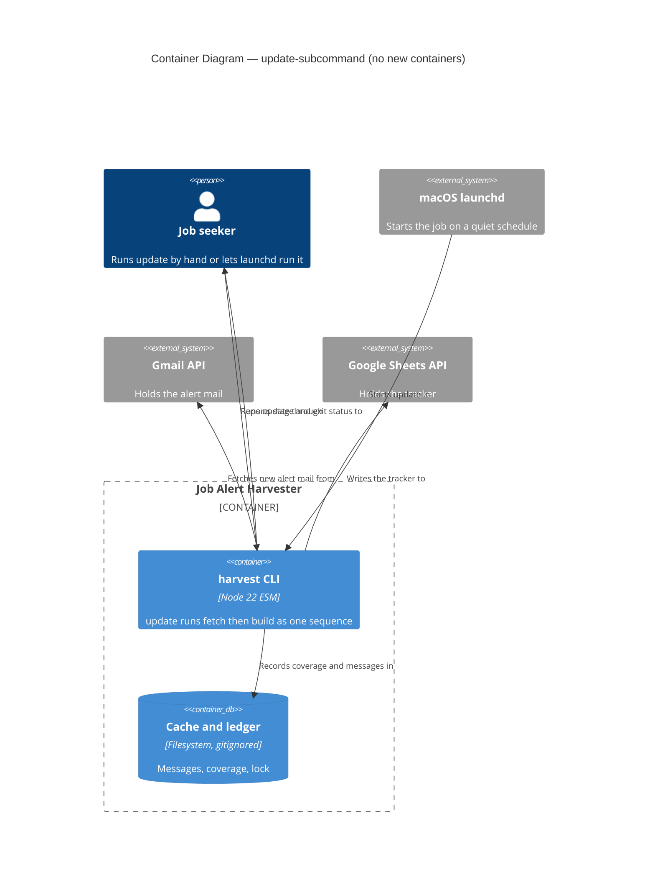
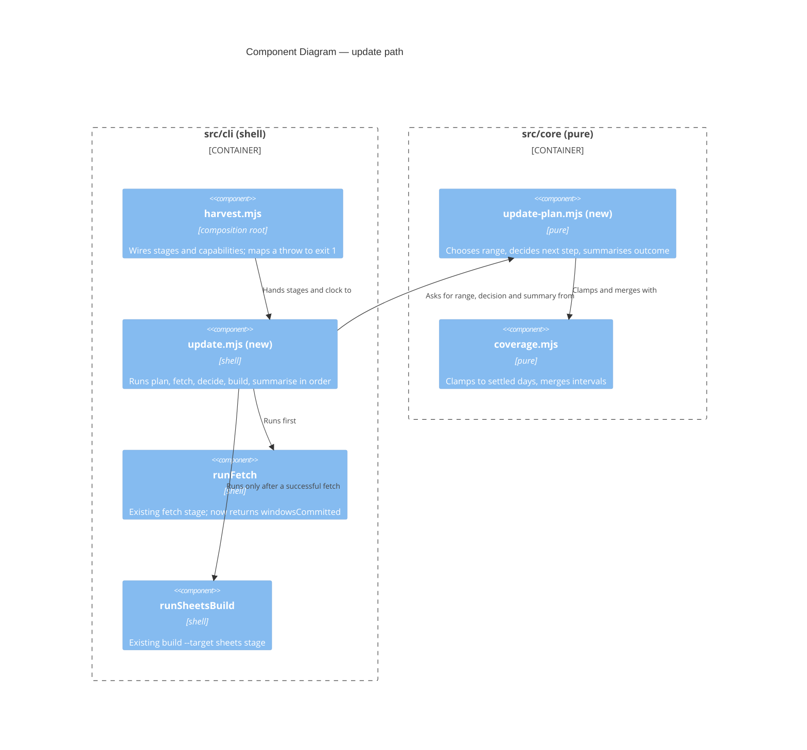

# Feature Delta — update-subcommand (DESIGN)

Doc type: Explanation plus Reference (same mix as `docs/feature/search-yield-summary/feature-delta.md`). Assumed background: `fetch` pulls LinkedIn alert mail from Gmail into a local cache and records covered UTC days in a ledger (DR-0002, coverage intervals); `build --target sheets` derives the tracker from the whole cache and writes it to the operator's Google Sheet (DR-0009, DR-0012).

Mode: propose. The human decided the shape ("Option B": one subcommand owns the sequence). Every item under *Open Questions* was ratified as recommended on 2026-10-05 and is recorded in DR-0016 (update subcommand owns the sequence). Nothing was built.

Warnings carried by this wave:

- DISCUSS and DISCOVER were skipped by instruction; acceptance criteria are derived from the brief.
- DEVOPS is not skipped in substance: the launchd how-to is a DELIVER documentation slice, but no pipeline or deployment target exists.
- Placement: one `feature-delta.md` at the feature root, matching the previous feature.
- `.cache/` and `~/.config/job-alert-harvester/` were not read. Every example is synthetic; paths in the how-to are placeholders.
- `nwave-ai outcomes check-delta` was not run (no shell). Peer review by `nw-solution-architect-reviewer` was not run; the caller should dispatch it.

---

## Upstream consultation

| Input | Bearing |
|---|---|
| `src/cli/harvest.mjs` (read in full) | `runFetch` `:165-203`, `runSheetsBuild` `:479-500`, dispatcher `:522-529`, top-level catch `:535-543` |
| `src/cli/fetch-loop.mjs` (full) | fail-closed loop, per-day commit `:67-75`, returns `{ windowsCommitted }` only |
| `src/core/cli-options.mjs` (full), `src/core/coverage.mjs:100-120` | option tables `:16-24`; `clampToSettledDays` `:115-120` |
| `docs/reference/cli.md`, `refusals.md`, DR-0012, DR-0015, search-yield-summary delta | exit-code table `cli.md:30-38`; refusal format; shape and depth |
| `src/adapters/gmail-api-source.mjs:17,149-150`; `src/core/oauth.mjs:18,117` | `gmail.reauth-required` already carries the instruction "run `harvest auth` to authorise again" |
| Both loopback fakes (`gmail-fake.mjs:41-67`, `sheets-fake.mjs:276-309`) | route classification; both claim `/token` (see Contradictions) |

## Findings from the code

1. **The relative `.cache/` matters to a scheduler.** Ledger, cache and receipts resolve against the working directory (`harvest.mjs:12-13`, `:63-65`). A launchd job without `WorkingDirectory` would read an empty ledger and write a cache in the wrong place.
2. **`harvest.mjs` cannot be imported.** It dispatches at top level (`:535-558`). The existing pattern is a `src/cli/*.mjs` module that receives capabilities as arguments (`runAuth`, `runImport`, `runFetchLoop`). `update` follows it: `src/cli/update.mjs` takes the two stages as injected functions; `harvest.mjs` passes `runFetch` and `runSheetsBuild`.
3. **`runFetch` returns nothing.** It prints and returns `undefined` on its two early exits (`:173-176`, `:182-185`), and `runFetchLoop` returns `{ windowsCommitted }`. The update needs a result value from the fetch stage; this is the only change to existing behaviour (no output change).
4. **Credentials are read only when there is something to fetch.** The covered-range early exit (`:182-185`) precedes `credentialStore()` (`:187`). A fully covered run touches no credential and makes no Gmail call, so `gmail.reauth-required` surfaces only on a run that has a new day to fetch.
5. **Error shapes are not uniform.** Most refusals carry `.code`; `refuseEmptyCache` throws a plain `Error` (`:469-473`). The stage wrapper must handle both. The top-level catch maps every throw to exit 1 (`:541-542`).
6. **Fetch is partial-safe, not atomic.** Days commit one at a time (`fetch-loop.mjs:67-75`), so a mid-range failure leaves earlier days committed and the cache usable; the next run resumes.
7. **A build with nothing to change sends no data batch** (search-yield-summary delta, scenario "second build sends nothing"). This is what makes build-always safe under DR-0012 (Q-c).

---

## Component decomposition

Style unchanged: Pure Core / Imperative Shell, functional paradigm. One new core module, one new shell module, one new adapter only if Q-f is ratified.

| Component | Path | Layer | Change | Contract shape |
|---|---|---|---|---|
| Update planning | `src/core/update-plan.mjs` | core | **new** | pure-function (return-only). (1) `planUpdateRange(ledgerIntervals, source, nowIso, fromOverride)` returns `{ from, to }` or a refusal value (`update.no-baseline`); date arithmetic lives here and reuses `clampToSettledDays` and `mergeIntervals`. (2) `decideAfterFetch(fetchResult)` returns the next step. (3) `summariseUpdate(outcome)` returns stdout lines and the exit status. (4) `UpdateRefusal` enum |
| Update orchestration | `src/cli/update.mjs` | shell | **new** | imperative, capability-injected: receives `now`, `readLedger`, `fetchStage`, `buildStage`, `print` (and `lock` if Q-f). Wire, probe, use; `--dry-run` receives no `fetchStage` at all, so a preview cannot fetch |
| Stage results | `src/cli/harvest.mjs` | shell | extend: `runFetch` returns `{ windowsCommitted }`; new `update` case in `runSubcommand` (`:522`) and in `SUBCOMMANDS` (`:54`) | bounded-change |
| Option table | `src/core/cli-options.mjs` | core | extend: one entry (below) | pure |
| Run lock | `src/adapters/run-lock.mjs` | adapter | **new, only if Q-f taken as recommended** | bounded-change: creates and removes `.cache/update.lock`; probe: directory writable, stale lock detectable |
| Notification, logging | none in `src/` | n/a | by design (Q-d, Q-e) | n/a |

Pure versus I/O:

| Pure (core) | I/O (shell or adapter) |
|---|---|
| Choosing `--from` and `--to` from ledger intervals and the clock value | Reading the clock (`nowIso`, existing `harvest.mjs:147`) |
| The post-fetch decision (always build after a successful fetch; stop on failure) | Reading the ledger; the Gmail and Sheets calls inside the existing stages |
| Exit status and summary lines from an outcome value | Lock file, log files (launchd), notification (wrapper) |
| Mapping a thrown error to `update.stage-failed` detail | Printing |

Dependency rules: `update-plan.mjs` imports only core modules (`coverage.mjs`); `update.mjs` imports core and cli peers only. `npm run check:arch` (dependency-cruiser, DR-0013) needs no rule change; `run-lock.mjs` must import only `node:fs` and nothing from a sibling adapter (`adapter-imports-no-sibling-adapter`).

**Proposed option table entry** (`cli-options.mjs:16-24`):

```
update: Object.freeze({ from: VALUE, 'dry-run': FLAG })
```

`DATE_OPTIONS.update = { from: asOneDay }` so `--from` gets `cli.invalid-date` like `fetch`. No `--to` (the clock owns it), no `--source` (single source today; `DEFAULT_SOURCE` `harvest.mjs:62`), no `--report`. Each omission is a later addition with its own table entry, not a hidden default.

Effect isolation. The sequence is plan (pure), fetch (effect), decide (pure), build (effect), summarise (pure). `--dry-run` returns a plan value and holds no fetch capability; it may read the Sheet through the existing reader-only wiring (`harvest.mjs:486`, `wiring.reader()`), as `build --dry-run` already does.

Earned Trust (what happens if the environment lies): the lock probe must survive a stale lock left by a killed process (liveness check on the recorded pid) and an unwritable `.cache/`; the existing stage probes (ledger, cache, Gmail, Sheets target) are unchanged and still run before any write. The scheduler environment lies in two known ways: minimal `PATH` (Q-j) and a different working directory (Finding 1). The how-to's smoke step (`launchctl kickstart`, then read the log) is the empirical probe.

## Driving ports

| Surface | Effect |
|---|---|
| `harvest update [--from <d>] [--dry-run]` | New. Fetch, then (on success) `build --target sheets`. stdout carries stage progress and a final summary line; stderr carries refusals and the build's existing role-family and search-yield views |
| `harvest update --dry-run` | New. Prints the planned range and how many days are uncovered; runs `build --target sheets --dry-run` on the existing cache; no Gmail call, no write |
| All existing subcommands | Unchanged |

## C4 Level 2: Container

No new container.



## C4 Level 3: Component (update path)



## Reuse analysis

| Capability | Existing | Verdict | Evidence, contract shape |
|---|---|---|---|
| Settled-day clamp | `clampToSettledDays` (`coverage.mjs:115`) | EXTEND (reuse via `runFetch`) | `update` passes `to` = today's UTC day; the fetch stage clamps. Pure |
| Skip covered days | ledger + `nextUncoveredDay` in `runFetch` (`:182`) | EXTEND (reuse) | A fixed `--from` is safe; verified at `:182-185` |
| Fetch stage | `runFetch` | EXTEND | Add a return value only |
| Build stage | `runSheetsBuild` | EXTEND (reuse unchanged) | Called with `{ flags: new Set() }` (or `dry-run`); parse shape is `{ ...values, flags: Set }` (`cli-options.mjs:119`) |
| Orchestration with injected capabilities | `runAuth`, `runImport`, `runFetchLoop` | EXTEND the pattern | New `update.mjs` |
| Option parsing and refusals | `parseCommandLine`, `CliRefusal` | EXTEND | One table entry |
| Acceptance fakes | `gmail-fake.mjs`, `sheets-fake.mjs` | EXTEND, never parallel | Need one origin serving both; see Contradictions |
| Range planning, decision, summary | none | CREATE NEW `update-plan.mjs` | No module holds sequencing; `coverage.mjs` stays about intervals |
| Run lock | none | CREATE NEW (conditional) | Q-f |

**2 CREATE NEW (1 conditional), 5 EXTEND rows.**

## Walking skeleton and slices

Walking skeleton: `harvest update` as a real subprocess in an isolated workspace with empty HOME and fake credentials, against one loopback origin serving Gmail and Sheets: the ledger covers up to two days ago, the fake mailbox holds yesterday's alert, the Sheet holds the headers. After the run the cache and ledger gain yesterday and the Sheet gains the rows; stdout names both stages; exit 0.

| Slice | Content | Done when |
|---|---|---|
| 1. Skeleton | `update-plan.mjs` range and decision, `update.mjs`, option table, wiring, `runFetch` result, composed fake | skeleton AT green |
| 2. Fail closed | fetch refusal means no build and exit 1 with `update.stage-failed`; build refusal after a good fetch says the fetch is kept; a `gmail.reauth-required` run | scenarios green, no Sheets write request after a fetch failure |
| 3. Nothing new and recovery | covered range still builds; a previous build failure heals on the next run | scenarios green |
| 4. `--dry-run`, `--from`, `update.no-baseline` | preview holds no fetch capability | zero Gmail requests and zero write requests asserted |
| 5. Lock (conditional on Q-f) | second concurrent run refuses; stale lock recovered | scenarios green |
| 6. Docs | `cli.md` (command, exit codes, files), `refusals.md` (`update.*`), launchd how-to, README table | staleness check passes |

Property tests (pure layer, `fast-check`): any ledger, clock and override yield `from <= to` or a refusal and never throw; `to` is never later than the last settled day once clamped; the decision is "build" for every successful fetch result and "stop" for every failure; the exit status is 0 only for a fully successful outcome.

## Decision record

**Recommend yes: DR-0016 (update subcommand owns the fetch-then-build sequence).** Reasons: it adds a command contract (exit and refusal codes `update.*`, the fail-closed rule that a build runs only after a fetch succeeds, and build-always) and changes the return value of an existing stage. These are the cases that earned DR-0015. Next free number is DR-0016 (`docs/decisions/` ends at DR-0015). The lock (Q-f) and the log and notification approach (Q-d, Q-e) can ride in the same record. Written: DR-0016.

---

## Open questions

All ratified as recommended by the human on 2026-10-05 (DR-0016, update subcommand owns the sequence).

**Q-a. Exit codes and refusal codes.**

| Option | Trade-offs |
|---|---|
| A. Exit 1 for every failure; one code `update.stage-failed`, detail names the stage and carries the inner code (`update.stage-failed: fetch stopped at gmail.quota-exhausted: ...`) | Matches `cli.md:35` (1 is any refusal); inner code stays greppable; a scheduler wrapper reads the last stderr line |
| B. Distinct exit codes per stage (3 fetch, 4 build) | A wrapper can branch without parsing; adds a second exit-code vocabulary and ties scripts to numbers |
| C. Propagate the inner refusal unchanged | No new code, but the operator cannot tell which stage failed from the code alone |

**Recommend A.** Also `update.no-baseline` (Q-g), and `update.already-running` if Q-f. A build failure after a successful fetch reads `update.stage-failed: build failed after fetch succeeded; the fetch is kept, run update again`.

**Q-b. Nothing new from Gmail.**

| Option | Trade-offs |
|---|---|
| A. Print `harvest update: nothing new from Gmail`, then continue to the build (Q-c), exit 0 | Honest, quiet, one line |
| B. Print nothing | Hides whether the run did anything |
| C. Exit a distinct non-zero code | Makes a healthy quiet day look like a failure to a scheduler |

**Recommend A.**

**Q-c. Build when the fetch fetched nothing.**

| Option | Trade-offs |
|---|---|
| A. Always build after a successful fetch | Heals the case where a previous run fetched fine and its build failed (otherwise the Sheet stays stale until new mail arrives). A build with no changes sends no data batch, so the DR-0012 window is not entered; cost is one Sheet read |
| B. Build only if the fetch committed a window | Fewer Sheet reads; leaves the Sheet stale after any earlier build failure |
| C. Build only if the cache changed since the last receipt | Needs a new receipt or state file (DR-0001 pushes against persisting this) |

**Recommend A.** This is the one case where the human's "build only if fetch succeeded" needs no refinement but a naive "skip when nothing new" would be a defect.

**Q-d. Logging.**

| Option | Trade-offs |
|---|---|
| A. launchd redirects stdout and stderr to files under `.cache/logs/` (`StandardOutPath`, `StandardErrorPath`); no harvester code | Zero code and zero tests; manual runs are not logged; launchd does not create the directory, so the how-to has a `mkdir`; the files grow without rotation (a few lines a day) |
| B. `update` writes `.cache/logs/update-<date>.log` through a new adapter | Manual and scheduled runs logged alike; a new adapter, probe, tests and retention rule |
| C. No logs; rely on notification | Nothing to read after a failure |

**Recommend A.** `.cache/` is already gitignored (`.gitignore:7`).

**Q-e. macOS notification on non-zero exit.**

| Option | Trade-offs |
|---|---|
| A. A short `sh` wrapper in the how-to runs `update`, and on non-zero calls `osascript -e 'display notification ...'` with the last stderr line | Nothing darwin-specific in `src/`; the exit status is the interface; the wrapper is untested documentation |
| B. `update --notify` and a notifier adapter spawning `osascript` | Tested and uniform; platform-specific code and a flag in a general CLI |
| C. No notification | A silent failure for days |

**Recommend A.** Either way `osascript` stays out of `src/core`.

**Q-f. Lock against overlapping runs.**

| Option | Trade-offs |
|---|---|
| A. No lock | launchd does not start a second instance of one label, but a manual `update` can overlap a scheduled one. Two concurrent builds could both read before either writes; I did not verify whether that duplicates rows, but `sheets.duplicate-key` (`refusals.md:84`) would then refuse every later build until the operator deletes a row |
| B. Exclusive-create lock file `.cache/update.lock` with the pid, stale lock recovered by liveness check, `update.already-running` on contention | Removes the worst case; one small adapter with a probe |
| C. Lock only around the build stage | Narrower, but the fetch race (two ledger read-modify-writes losing a commit) remains, harmless but wasteful |

**Recommend B.** Weakest recommendation of the set: if the human prefers fewer parts, A is defensible given a quiet schedule and a single operator.

**Q-g. `--from` when the ledger is empty.**

| Option | Trade-offs |
|---|---|
| A. Default `--from` is the earliest covered day for the source in the ledger (a fixed point, so covered days are skipped); an empty ledger refuses `update.no-baseline` and points to `fetch --from <d>` | A first backfill is a deliberate, watched act (it can hit quota); no operator-specific date is hardcoded in a public repo |
| B. Hardcode a constant first day | Operator-specific; wrong for any other cache |
| C. Empty ledger fetches the last N days | Silent partial history that looks complete |

**Recommend A**, with `--from <d>` as an explicit override. Note: a gap earlier than the first covered day is not noticed by A; `--from` covers it.

**Q-h. `--dry-run`.**

| Option | Trade-offs |
|---|---|
| A. Yes: plan range, count uncovered days (ledger only), run `build --target sheets --dry-run` | Reuses the reader-only wiring; no Gmail call; answers "what would a scheduled run do" |
| B. No `--dry-run` | Less surface; an operator tests a plist only by running it for real |
| C. Dry-run includes a Gmail listing | Needs a new list-only path in the fetch adapter; larger change |

**Recommend A.**

**Q-i. Partial fetch (quota or mid-range failure).**

| Option | Trade-offs |
|---|---|
| A. Fail closed: no build, exit 1, committed days kept | Matches the brief; the Sheet lags by at most one run; next run resumes (Finding 6) |
| B. Build on what was fetched, still exit 1 | Fresher Sheet, but writes a tracker from a cache known to have a gap (search yield `unique` can overstate on gaps, DR-0015 Q6) and writes to the Sheet on a failing run |
| C. Build only if at least one day committed | A hybrid with the same gap risk |

**Recommend A.** Q-c(A) means the next successful run builds.

**Q-j. launchd plist example.** Content, not a decision between options, but its parts are proposals:

- `ProgramArguments`: absolute path to `node`, then absolute path to `src/cli/harvest.mjs`, then `update`. launchd's `PATH` is minimal and a version-manager `node` is not on it, so a bare `node` fails. The how-to says to find it with `command -v node` and warns that a version-pinned path breaks on a node upgrade (use the manager's stable shim path where one exists).
- `WorkingDirectory`: the repository root (Finding 1). Mandatory.
- `StartCalendarInterval`: an early-morning local time the operator is not in the Sheet (DR-0012). The sample uses 05:30; the how-to explains the choice, not a rule. launchd runs a missed calendar job on wake, and `update` is idempotent, so a sleeping Mac is tolerated.
- `StandardOutPath` and `StandardErrorPath` under `.cache/logs/` (Q-d), with `mkdir -p` beforehand.
- It is a LaunchAgent in `~/Library/LaunchAgents`, so it runs only while the operator is logged in and the credential files under the home directory are readable. Load with `launchctl bootstrap gui/$(id -u) <plist>`; test with `launchctl kickstart -k gui/$(id -u)/<label>`.
- Paths and the label are placeholders; no real path or employer appears.

If Q-e is taken as recommended, `ProgramArguments` points at the wrapper script instead of `node` directly. **Recommend: how-to with the wrapper and the plist, one Explanation-free How-To page.**

**Q-k. Surfacing `gmail.reauth-required` unattended.**

| Option | Trade-offs |
|---|---|
| A. Nothing special: the refusal already says "run `harvest auth` to authorise again" (`gmail-api-source.mjs:17,150`); `update.stage-failed` carries it as the last stderr line; the Q-e notification shows that line | No new code; depends on Q-e and Q-a |
| B. A dedicated exit code for reauth | Lets a wrapper write a tailored message; second exit vocabulary (Q-a B) |
| C. `update` itself notifies | Platform code in the CLI (Q-e B) |

**Recommend A.** Because credentials are read only when a day needs fetching (Finding 4), the failure appears on the first run after the token dies, never silently on a covered day. `sheets.reauth-required` is raised by the build stage and reaches the operator the same way.

---

## Contradictions and gaps found

1. **Two fakes, one origin.** `HARVEST_API_BASE_URL` redirects every Google endpoint to one origin (`cli.md:207`), but the Gmail and Sheets fakes are separate servers, and both claim `/token` (`gmail-fake.mjs:48`, `sheets-fake.mjs:285`). A single `update` subprocess cannot reach both as they stand. DISTILL must extend the existing fakes with a path-routing front (routing `/token` by the refresh token in the form body) rather than write a parallel fake.
2. **`runFetch` returns nothing**, so "fetched nothing" cannot be read from it today (Finding 3). Not a contradiction of the brief; a required small change.
3. **Line reference**: the brief puts `clampToSettledDays` at `harvest.mjs` ~l.170; the call is `:172`, the function is `coverage.mjs:115`.
4. No other fact in the brief contradicts the code. Verified: covered range prints "already covered" and exits 0 before any credential or Gmail call (`harvest.mjs:182-185`, `:187`); `.cache/` is gitignored (`.gitignore:7`); `gmail.reauth-required` is raised at `oauth.mjs:117` and re-thrown with an instruction at `gmail-api-source.mjs:149-150`; next free record is DR-0016.

## Technology and enforcement

No new dependency. `dependency-cruiser` (DR-0013, MIT) enforces layering; no rule change. If the lock is taken, `run-lock.mjs` is covered by the existing `adapter-imports-no-sibling-adapter` and `capability-adapter-imports-no-node-module` rules, which the crafter must check against the adapter's `node:fs` use before writing it.

External integrations: none new. The existing contract-test annotation (brief section 13: Gmail and Sheets APIs, consumer-driven contracts recommended) stands.

## Docs that go stale at DELIVER

`docs/reference/cli.md` (new command; exit-code table; files table gains the lock if Q-f), `docs/reference/refusals.md` (new `update.*` section and its source list), new how-to for the launchd job, README design table, `docs/product/architecture/brief.md` (new section 16 for this feature; not written in this wave pending ratification).
