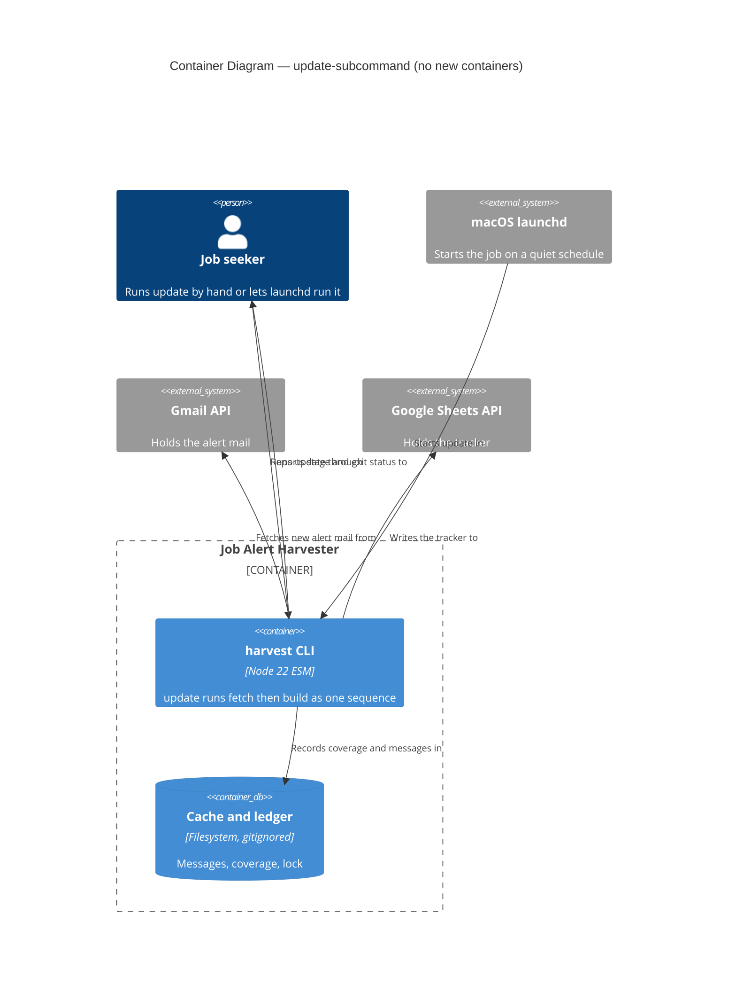
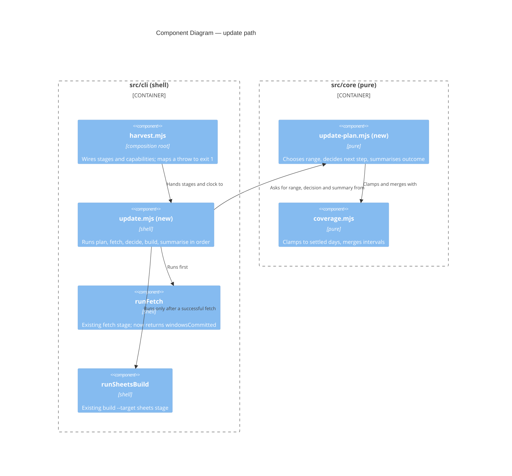

# Feature Delta — update-subcommand (DESIGN)

Doc type: Explanation plus Reference (same mix as `docs/feature/search-yield-summary/feature-delta.md`). Assumed background: `fetch` pulls LinkedIn alert mail from Gmail into a local cache and records covered UTC days in a ledger (DR-0002, coverage intervals); `build --target sheets` derives the tracker from the whole cache and writes it to the operator's Google Sheet (DR-0009, DR-0012).

Mode: propose. The human decided the shape ("Option B": one subcommand owns the sequence). Every item under *Open Questions* was ratified as recommended on 2026-10-05 and is recorded in DR-0016 (update subcommand owns the sequence). Nothing was built.

Warnings carried by this wave:

- DISCUSS and DISCOVER were skipped by instruction; acceptance criteria are derived from the brief.
- DEVOPS is not skipped in substance: the launchd how-to is a DELIVER documentation slice, but no pipeline or deployment target exists.
- Placement: one `feature-delta.md` at the feature root, matching the previous feature.
- `.cache/` and `~/.config/job-alert-harvester/` were not read. Every example is synthetic; paths in the how-to are placeholders.
- `nwave-ai outcomes check-delta` was not run (no shell). Peer review by `nw-solution-architect-reviewer` was not run; the caller should dispatch it.

---

## Upstream consultation

| Input | Bearing |
|---|---|
| `src/cli/harvest.mjs` (read in full) | `runFetch` `:165-203`, `runSheetsBuild` `:479-500`, dispatcher `:522-529`, top-level catch `:535-543` |
| `src/cli/fetch-loop.mjs` (full) | fail-closed loop, per-day commit `:67-75`, returns `{ windowsCommitted }` only |
| `src/core/cli-options.mjs` (full), `src/core/coverage.mjs:100-120` | option tables `:16-24`; `clampToSettledDays` `:115-120` |
| `docs/reference/cli.md`, `refusals.md`, DR-0012, DR-0015, search-yield-summary delta | exit-code table `cli.md:30-38`; refusal format; shape and depth |
| `src/adapters/gmail-api-source.mjs:17,149-150`; `src/core/oauth.mjs:18,117` | `gmail.reauth-required` already carries the instruction "run `harvest auth` to authorise again" |
| Both loopback fakes (`gmail-fake.mjs:41-67`, `sheets-fake.mjs:276-309`) | route classification; both claim `/token` (see Contradictions) |

## Findings from the code

1. **The relative `.cache/` matters to a scheduler.** Ledger, cache and receipts resolve against the working directory (`harvest.mjs:12-13`, `:63-65`). A launchd job without `WorkingDirectory` would read an empty ledger and write a cache in the wrong place.
2. **`harvest.mjs` cannot be imported.** It dispatches at top level (`:535-558`). The existing pattern is a `src/cli/*.mjs` module that receives capabilities as arguments (`runAuth`, `runImport`, `runFetchLoop`). `update` follows it: `src/cli/update.mjs` takes the two stages as injected functions; `harvest.mjs` passes `runFetch` and `runSheetsBuild`.
3. **`runFetch` returns nothing.** It prints and returns `undefined` on its two early exits (`:173-176`, `:182-185`), and `runFetchLoop` returns `{ windowsCommitted }`. The update needs a result value from the fetch stage; this is the only change to existing behaviour (no output change).
4. **Credentials are read only when there is something to fetch.** The covered-range early exit (`:182-185`) precedes `credentialStore()` (`:187`). A fully covered run touches no credential and makes no Gmail call, so `gmail.reauth-required` surfaces only on a run that has a new day to fetch.
5. **Error shapes are not uniform.** Most refusals carry `.code`; `refuseEmptyCache` throws a plain `Error` (`:469-473`). The stage wrapper must handle both. The top-level catch maps every throw to exit 1 (`:541-542`).
6. **Fetch is partial-safe, not atomic.** Days commit one at a time (`fetch-loop.mjs:67-75`), so a mid-range failure leaves earlier days committed and the cache usable; the next run resumes.
7. **A build with nothing to change sends no data batch** (search-yield-summary delta, scenario "second build sends nothing"). This is what makes build-always safe under DR-0012 (Q-c).

---

## Component decomposition

Style unchanged: Pure Core / Imperative Shell, functional paradigm. One new core module, one new shell module, one new adapter only if Q-f is ratified.

| Component | Path | Layer | Change | Contract shape |
|---|---|---|---|---|
| Update planning | `src/core/update-plan.mjs` | core | **new** | pure-function (return-only). (1) `planUpdateRange(ledgerIntervals, source, nowIso, fromOverride)` returns `{ from, to }` or a refusal value (`update.no-baseline`); date arithmetic lives here and reuses `clampToSettledDays` and `mergeIntervals`. (2) `decideAfterFetch(fetchResult)` returns the next step. (3) `summariseUpdate(outcome)` returns stdout lines and the exit status. (4) `UpdateRefusal` enum |
| Update orchestration | `src/cli/update.mjs` | shell | **new** | imperative, capability-injected: receives `now`, `readLedger`, `fetchStage`, `buildStage`, `print` (and `lock` if Q-f). Wire, probe, use; `--dry-run` receives no `fetchStage` at all, so a preview cannot fetch |
| Stage results | `src/cli/harvest.mjs` | shell | extend: `runFetch` returns `{ windowsCommitted }`; new `update` case in `runSubcommand` (`:522`) and in `SUBCOMMANDS` (`:54`) | bounded-change |
| Option table | `src/core/cli-options.mjs` | core | extend: one entry (below) | pure |
| Run lock | `src/adapters/run-lock.mjs` | adapter | **new, only if Q-f taken as recommended** | bounded-change: creates and removes `.cache/update.lock`; probe: directory writable, stale lock detectable |
| Notification, logging | none in `src/` | n/a | by design (Q-d, Q-e) | n/a |

Pure versus I/O:

| Pure (core) | I/O (shell or adapter) |
|---|---|
| Choosing `--from` and `--to` from ledger intervals and the clock value | Reading the clock (`nowIso`, existing `harvest.mjs:147`) |
| The post-fetch decision (always build after a successful fetch; stop on failure) | Reading the ledger; the Gmail and Sheets calls inside the existing stages |
| Exit status and summary lines from an outcome value | Lock file, log files (launchd), notification (wrapper) |
| Mapping a thrown error to `update.stage-failed` detail | Printing |

Dependency rules: `update-plan.mjs` imports only core modules (`coverage.mjs`); `update.mjs` imports core and cli peers only. `npm run check:arch` (dependency-cruiser, DR-0013) needs no rule change; `run-lock.mjs` must import only `node:fs` and nothing from a sibling adapter (`adapter-imports-no-sibling-adapter`).

**Proposed option table entry** (`cli-options.mjs:16-24`):

```
update: Object.freeze({ from: VALUE, 'dry-run': FLAG })
```

`DATE_OPTIONS.update = { from: asOneDay }` so `--from` gets `cli.invalid-date` like `fetch`. No `--to` (the clock owns it), no `--source` (single source today; `DEFAULT_SOURCE` `harvest.mjs:62`), no `--report`. Each omission is a later addition with its own table entry, not a hidden default.

Effect isolation. The sequence is plan (pure), fetch (effect), decide (pure), build (effect), summarise (pure). `--dry-run` returns a plan value and holds no fetch capability; it may read the Sheet through the existing reader-only wiring (`harvest.mjs:486`, `wiring.reader()`), as `build --dry-run` already does.

Earned Trust (what happens if the environment lies): the lock probe must survive a stale lock left by a killed process (liveness check on the recorded pid) and an unwritable `.cache/`; the existing stage probes (ledger, cache, Gmail, Sheets target) are unchanged and still run before any write. The scheduler environment lies in two known ways: minimal `PATH` (Q-j) and a different working directory (Finding 1). The how-to's smoke step (`launchctl kickstart`, then read the log) is the empirical probe.

## Driving ports

| Surface | Effect |
|---|---|
| `harvest update [--from <d>] [--dry-run]` | New. Fetch, then (on success) `build --target sheets`. stdout carries stage progress and a final summary line; stderr carries refusals and the build's existing role-family and search-yield views |
| `harvest update --dry-run` | New. Prints the planned range and how many days are uncovered; runs `build --target sheets --dry-run` on the existing cache; no Gmail call, no write |
| All existing subcommands | Unchanged |

## C4 Level 2: Container

No new container.



## C4 Level 3: Component (update path)



## Reuse analysis

| Capability | Existing | Verdict | Evidence, contract shape |
|---|---|---|---|
| Settled-day clamp | `clampToSettledDays` (`coverage.mjs:115`) | EXTEND (reuse via `runFetch`) | `update` passes `to` = today's UTC day; the fetch stage clamps. Pure |
| Skip covered days | ledger + `nextUncoveredDay` in `runFetch` (`:182`) | EXTEND (reuse) | A fixed `--from` is safe; verified at `:182-185` |
| Fetch stage | `runFetch` | EXTEND | Add a return value only |
| Build stage | `runSheetsBuild` | EXTEND (reuse unchanged) | Called with `{ flags: new Set() }` (or `dry-run`); parse shape is `{ ...values, flags: Set }` (`cli-options.mjs:119`) |
| Orchestration with injected capabilities | `runAuth`, `runImport`, `runFetchLoop` | EXTEND the pattern | New `update.mjs` |
| Option parsing and refusals | `parseCommandLine`, `CliRefusal` | EXTEND | One table entry |
| Acceptance fakes | `gmail-fake.mjs`, `sheets-fake.mjs` | EXTEND, never parallel | Need one origin serving both; see Contradictions |
| Range planning, decision, summary | none | CREATE NEW `update-plan.mjs` | No module holds sequencing; `coverage.mjs` stays about intervals |
| Run lock | none | CREATE NEW (conditional) | Q-f |

**2 CREATE NEW (1 conditional), 5 EXTEND rows.**

## Walking skeleton and slices

Walking skeleton: `harvest update` as a real subprocess in an isolated workspace with empty HOME and fake credentials, against one loopback origin serving Gmail and Sheets: the ledger covers up to two days ago, the fake mailbox holds yesterday's alert, the Sheet holds the headers. After the run the cache and ledger gain yesterday and the Sheet gains the rows; stdout names both stages; exit 0.

| Slice | Content | Done when |
|---|---|---|
| 1. Skeleton | `update-plan.mjs` range and decision, `update.mjs`, option table, wiring, `runFetch` result, composed fake | skeleton AT green |
| 2. Fail closed | fetch refusal means no build and exit 1 with `update.stage-failed`; build refusal after a good fetch says the fetch is kept; a `gmail.reauth-required` run | scenarios green, no Sheets write request after a fetch failure |
| 3. Nothing new and recovery | covered range still builds; a previous build failure heals on the next run | scenarios green |
| 4. `--dry-run`, `--from`, `update.no-baseline` | preview holds no fetch capability | zero Gmail requests and zero write requests asserted |
| 5. Lock (conditional on Q-f) | second concurrent run refuses; stale lock recovered | scenarios green |
| 6. Docs | `cli.md` (command, exit codes, files), `refusals.md` (`update.*`), launchd how-to, README table | staleness check passes |

Property tests (pure layer, `fast-check`): any ledger, clock and override yield `from <= to` or a refusal and never throw; `to` is never later than the last settled day once clamped; the decision is "build" for every successful fetch result and "stop" for every failure; the exit status is 0 only for a fully successful outcome.

## Decision record

**Recommend yes: DR-0016 (update subcommand owns the fetch-then-build sequence).** Reasons: it adds a command contract (exit and refusal codes `update.*`, the fail-closed rule that a build runs only after a fetch succeeds, and build-always) and changes the return value of an existing stage. These are the cases that earned DR-0015. Next free number is DR-0016 (`docs/decisions/` ends at DR-0015). The lock (Q-f) and the log and notification approach (Q-d, Q-e) can ride in the same record. Written: DR-0016.

---

## Open questions

All ratified as recommended by the human on 2026-10-05 (DR-0016, update subcommand owns the sequence).

**Q-a. Exit codes and refusal codes.**

| Option | Trade-offs |
|---|---|
| A. Exit 1 for every failure; one code `update.stage-failed`, detail names the stage and carries the inner code (`update.stage-failed: fetch stopped at gmail.quota-exhausted: ...`) | Matches `cli.md:35` (1 is any refusal); inner code stays greppable; a scheduler wrapper reads the last stderr line |
| B. Distinct exit codes per stage (3 fetch, 4 build) | A wrapper can branch without parsing; adds a second exit-code vocabulary and ties scripts to numbers |
| C. Propagate the inner refusal unchanged | No new code, but the operator cannot tell which stage failed from the code alone |

**Recommend A.** Also `update.no-baseline` (Q-g), and `update.already-running` if Q-f. A build failure after a successful fetch reads `update.stage-failed: build failed after fetch succeeded; the fetch is kept, run update again`.

**Q-b. Nothing new from Gmail.**

| Option | Trade-offs |
|---|---|
| A. Print `harvest update: nothing new from Gmail`, then continue to the build (Q-c), exit 0 | Honest, quiet, one line |
| B. Print nothing | Hides whether the run did anything |
| C. Exit a distinct non-zero code | Makes a healthy quiet day look like a failure to a scheduler |

**Recommend A.**

**Q-c. Build when the fetch fetched nothing.**

| Option | Trade-offs |
|---|---|
| A. Always build after a successful fetch | Heals the case where a previous run fetched fine and its build failed (otherwise the Sheet stays stale until new mail arrives). A build with no changes sends no data batch, so the DR-0012 window is not entered; cost is one Sheet read |
| B. Build only if the fetch committed a window | Fewer Sheet reads; leaves the Sheet stale after any earlier build failure |
| C. Build only if the cache changed since the last receipt | Needs a new receipt or state file (DR-0001 pushes against persisting this) |

**Recommend A.** This is the one case where the human's "build only if fetch succeeded" needs no refinement but a naive "skip when nothing new" would be a defect.

**Q-d. Logging.**

| Option | Trade-offs |
|---|---|
| A. launchd redirects stdout and stderr to files under `.cache/logs/` (`StandardOutPath`, `StandardErrorPath`); no harvester code | Zero code and zero tests; manual runs are not logged; launchd does not create the directory, so the how-to has a `mkdir`; the files grow without rotation (a few lines a day) |
| B. `update` writes `.cache/logs/update-<date>.log` through a new adapter | Manual and scheduled runs logged alike; a new adapter, probe, tests and retention rule |
| C. No logs; rely on notification | Nothing to read after a failure |

**Recommend A.** `.cache/` is already gitignored (`.gitignore:7`).

**Q-e. macOS notification on non-zero exit.**

| Option | Trade-offs |
|---|---|
| A. A short `sh` wrapper in the how-to runs `update`, and on non-zero calls `osascript -e 'display notification ...'` with the last stderr line | Nothing darwin-specific in `src/`; the exit status is the interface; the wrapper is untested documentation |
| B. `update --notify` and a notifier adapter spawning `osascript` | Tested and uniform; platform-specific code and a flag in a general CLI |
| C. No notification | A silent failure for days |

**Recommend A.** Either way `osascript` stays out of `src/core`.

**Q-f. Lock against overlapping runs.**

| Option | Trade-offs |
|---|---|
| A. No lock | launchd does not start a second instance of one label, but a manual `update` can overlap a scheduled one. Two concurrent builds could both read before either writes; I did not verify whether that duplicates rows, but `sheets.duplicate-key` (`refusals.md:84`) would then refuse every later build until the operator deletes a row |
| B. Exclusive-create lock file `.cache/update.lock` with the pid, stale lock recovered by liveness check, `update.already-running` on contention | Removes the worst case; one small adapter with a probe |
| C. Lock only around the build stage | Narrower, but the fetch race (two ledger read-modify-writes losing a commit) remains, harmless but wasteful |

**Recommend B.** Weakest recommendation of the set: if the human prefers fewer parts, A is defensible given a quiet schedule and a single operator.

**Q-g. `--from` when the ledger is empty.**

| Option | Trade-offs |
|---|---|
| A. Default `--from` is the earliest covered day for the source in the ledger (a fixed point, so covered days are skipped); an empty ledger refuses `update.no-baseline` and points to `fetch --from <d>` | A first backfill is a deliberate, watched act (it can hit quota); no operator-specific date is hardcoded in a public repo |
| B. Hardcode a constant first day | Operator-specific; wrong for any other cache |
| C. Empty ledger fetches the last N days | Silent partial history that looks complete |

**Recommend A**, with `--from <d>` as an explicit override. Note: a gap earlier than the first covered day is not noticed by A; `--from` covers it.

**Q-h. `--dry-run`.**

| Option | Trade-offs |
|---|---|
| A. Yes: plan range, count uncovered days (ledger only), run `build --target sheets --dry-run` | Reuses the reader-only wiring; no Gmail call; answers "what would a scheduled run do" |
| B. No `--dry-run` | Less surface; an operator tests a plist only by running it for real |
| C. Dry-run includes a Gmail listing | Needs a new list-only path in the fetch adapter; larger change |

**Recommend A.**

**Q-i. Partial fetch (quota or mid-range failure).**

| Option | Trade-offs |
|---|---|
| A. Fail closed: no build, exit 1, committed days kept | Matches the brief; the Sheet lags by at most one run; next run resumes (Finding 6) |
| B. Build on what was fetched, still exit 1 | Fresher Sheet, but writes a tracker from a cache known to have a gap (search yield `unique` can overstate on gaps, DR-0015 Q6) and writes to the Sheet on a failing run |
| C. Build only if at least one day committed | A hybrid with the same gap risk |

**Recommend A.** Q-c(A) means the next successful run builds.

**Q-j. launchd plist example.** Content, not a decision between options, but its parts are proposals:

- `ProgramArguments`: absolute path to `node`, then absolute path to `src/cli/harvest.mjs`, then `update`. launchd's `PATH` is minimal and a version-manager `node` is not on it, so a bare `node` fails. The how-to says to find it with `command -v node` and warns that a version-pinned path breaks on a node upgrade (use the manager's stable shim path where one exists).
- `WorkingDirectory`: the repository root (Finding 1). Mandatory.
- `StartCalendarInterval`: an early-morning local time the operator is not in the Sheet (DR-0012). The sample uses 05:30; the how-to explains the choice, not a rule. launchd runs a missed calendar job on wake, and `update` is idempotent, so a sleeping Mac is tolerated.
- `StandardOutPath` and `StandardErrorPath` under `.cache/logs/` (Q-d), with `mkdir -p` beforehand.
- It is a LaunchAgent in `~/Library/LaunchAgents`, so it runs only while the operator is logged in and the credential files under the home directory are readable. Load with `launchctl bootstrap gui/$(id -u) <plist>`; test with `launchctl kickstart -k gui/$(id -u)/<label>`.
- Paths and the label are placeholders; no real path or employer appears.

If Q-e is taken as recommended, `ProgramArguments` points at the wrapper script instead of `node` directly. **Recommend: how-to with the wrapper and the plist, one Explanation-free How-To page.**

**Q-k. Surfacing `gmail.reauth-required` unattended.**

| Option | Trade-offs |
|---|---|
| A. Nothing special: the refusal already says "run `harvest auth` to authorise again" (`gmail-api-source.mjs:17,150`); `update.stage-failed` carries it as the last stderr line; the Q-e notification shows that line | No new code; depends on Q-e and Q-a |
| B. A dedicated exit code for reauth | Lets a wrapper write a tailored message; second exit vocabulary (Q-a B) |
| C. `update` itself notifies | Platform code in the CLI (Q-e B) |

**Recommend A.** Because credentials are read only when a day needs fetching (Finding 4), the failure appears on the first run after the token dies, never silently on a covered day. `sheets.reauth-required` is raised by the build stage and reaches the operator the same way.

---

## Contradictions and gaps found

1. **Two fakes, one origin.** `HARVEST_API_BASE_URL` redirects every Google endpoint to one origin (`cli.md:207`), but the Gmail and Sheets fakes are separate servers, and both claim `/token` (`gmail-fake.mjs:48`, `sheets-fake.mjs:285`). A single `update` subprocess cannot reach both as they stand. DISTILL must extend the existing fakes with a path-routing front (routing `/token` by the refresh token in the form body) rather than write a parallel fake.
2. **`runFetch` returns nothing**, so "fetched nothing" cannot be read from it today (Finding 3). Not a contradiction of the brief; a required small change.
3. **Line reference**: the brief puts `clampToSettledDays` at `harvest.mjs` ~l.170; the call is `:172`, the function is `coverage.mjs:115`.
4. No other fact in the brief contradicts the code. Verified: covered range prints "already covered" and exits 0 before any credential or Gmail call (`harvest.mjs:182-185`, `:187`); `.cache/` is gitignored (`.gitignore:7`); `gmail.reauth-required` is raised at `oauth.mjs:117` and re-thrown with an instruction at `gmail-api-source.mjs:149-150`; next free record is DR-0016.

## Technology and enforcement

No new dependency. `dependency-cruiser` (DR-0013, MIT) enforces layering; no rule change. If the lock is taken, `run-lock.mjs` is covered by the existing `adapter-imports-no-sibling-adapter` and `capability-adapter-imports-no-node-module` rules, which the crafter must check against the adapter's `node:fs` use before writing it.

External integrations: none new. The existing contract-test annotation (brief section 13: Gmail and Sheets APIs, consumer-driven contracts recommended) stands.

## Docs that go stale at DELIVER

`docs/reference/cli.md` (new command; exit-code table; files table gains the lock if Q-f), `docs/reference/refusals.md` (new `update.*` section and its source list), new how-to for the launchd job, README design table, `docs/product/architecture/brief.md` (new section 16 for this feature; not written in this wave pending ratification).

---

## Wave: DISTILL / [REF] Reconciliation and Inputs

Reconciliation passed: 0 contradictions. No `wave-decisions.md` exists for any wave of this feature. The DESIGN sections of this file, DR-0016 (accepted) and the eleven open questions ratified by the human on 2026-10-05 are the only upstream decisions, and they agree with one another and with DR-0002 (coverage intervals), DR-0009 (build derives from the whole cache), DR-0012 (Sheets writes) and DR-0013 (layering). Warnings: DISCUSS is absent by instruction, so acceptance criteria are derived from the DESIGN (slices 1 to 6, the four properties, DR-0016 decisions 1 to 13) and story-to-scenario traceability is skipped; DEVOPS is `NOT_APPLICABLE:` (a local CLI; the launchd how-to is a documentation slice), so the default environment matrix does not apply.

Inputs: `+` read, `-` not found.

- `+` this file (DESIGN), `docs/decisions/DR-0016`, `docs/feature/search-yield-summary/feature-delta.md` (DISTILL sections, the convention template) and its `distill/red-classification.md`
- `+` `tests/acceptance/search-yield-summary/**`, including `support/red-gate.mjs` as it stood before commit `b7946d3` removed it, and the earlier copy at `git show 6544323^:tests/acceptance/role-family-column/support/red-gate.mjs`
- `+` `tests/acceptance/gmail-api-source/support/{gmail-fake,gmail-domain-types,property}.mjs`, `tests/acceptance/sheets-api-target/support/{sheets-fake,sheets-domain-types,sheets-constants,property}.mjs`, `tests/acceptance/job-alert-harvester/support/domain-types.mjs`, `tests/common/state-delta.mjs`, `tests/regression/job-alert-harvester/unknown-options-refused.test.mjs`
- `+` `src/cli/harvest.mjs`, `src/cli/fetch-loop.mjs`, `src/core/{cli-options,coverage,gmail-query,endpoints,retry-policy,oauth}.mjs`, `src/adapters/{ledger-store,gmail-api-source,google-token-source}.mjs`, `.dependency-cruiser.cjs`, `vitest.config.mjs`
- `-` `discuss/`, `devops/`, `docs/product/kpi-contracts.yaml` (so no `@kpi` scenario), `docs/product/journeys/`, `docs/product/outcomes/`
- Not read, by design: `.cache/` and `~/.config/job-alert-harvester/`. No scenario touches the real CLI's real credentials or the real Gmail and Sheets: every run is a subprocess in an isolated temp workspace with a temp HOME holding fake credentials, against loopback fakes. Every search, title, company and message in the tests is invented (`agile coach in Examplestan`, `Acme Ltd`).

Language: JavaScript (ESM), `vitest`, `fast-check`. The search-yield-summary convention is followed: vitest `describe` and a pending-scenario helper, no `.feature` files, tags in scenario titles, `@contract-shape:` as a header comment per file, universe-bound `assertStateDelta` from `tests/common/state-delta.mjs` at the subprocess layer, `fast-check` at the pure layer only. The DISTILL narrative lives in this file, as the two previous features did; `distill/red-classification.md` holds the per-scenario classification.

## Wave: DISTILL / [REF] Scenario List

100 scenarios in 6 files, plus 22 unskipped tests of the builders, the composed fake, the scripted faults, the lock helpers, the oracle and the generators. Every scenario is pending at DISTILL time through `scenario` from `support/red-gate.mjs` (`it.skip` unless `RED_GATE=1`), so `npm test` exits 0. 83 are tagged `@error` (83%, edge and sad paths), 17 `@property` (`fast-check`, pure layer only: layers 1 and 2), 1 `@walking_skeleton`, 56 run the real CLI as a subprocess, 2 `@structural`. Counts are from `vitest list`, not hand-added.

| File | Layer | Contract shape | Scenarios | `@error` | `@property` | Covers |
|---|---|---|---|---|---|---|
| `update-sequence.test.mjs` | subprocess, loopback origin | bounded-change | 9 | 8 | 0 | the walking skeleton; nothing new (no Gmail request, build still runs); a quiet day is progress; a second run is quiet; several days in order; never fetches today; new adverts appended after the old; stdout versus stderr; the hour of the day does not matter |
| `update-fails-closed.test.mjs` | subprocess, loopback origin | bounded-change | 10 | 10 | 0 | fetch stopped by quota, by `gmail.reauth-required`, by `gmail.unauthorized`, by a missing credential (no build, zero Sheets requests); a partial fetch keeps its days and the next run resumes; a build failure says the fetch is kept; the heal on the next run; `sheets.reauth-required`; `sheets.not-imported`; a failure never reaches stdout |
| `update-options.test.mjs` | subprocess, loopback origin | bounded-change (refusals unbounded-preservation) | 32 | 32 | 0 | `--from` default, reaching back, inside the covered range, today, tomorrow, a year ahead; five invalid dates; missing value (two); duplicates (two); five unknown options; a misspelt `--dry-run`; a bare word; no baseline (four) and the backfill that cures it; `--dry-run` (five) |
| `update-lock.test.mjs` | subprocess, loopback origin | bounded-change | 5 | 5 | 0 | a live lock refuses `update.already-running`; a dead holder is recovered; the lock names a live pid while the run is in flight; a failed run releases it; a refused command line takes none |
| `update-plan.test.mjs` | pure core, in memory | pure-function | 27 | 21 | 0 | range choice (baseline, gaps, other sources, override, day edges, month, year and leap day, future `--from`, clamp), the decision after the fetch, the closing lines and status of an outcome, two structural guards |
| `update-plan-properties.test.mjs` | pure core, in memory | pure-function | 17 | 7 | 17 | the DESIGN's four properties, the plan against a calendar oracle, order and other-source invariance, translation invariance, the status and lines of every generated outcome |
| `support-builders.test.mjs` | test infrastructure | n/a | 22 (active) | n/a | n/a | the one origin routes by path and by refresh token; the existing `fetch` and `build --target sheets` reach both services through it; the stopped clock; the week builder; the scripted faults; the lock helpers; the oracle; the generators reach their cases |

RED classification (`distill/red-classification.md`): 99 RED for the right reason (42 reach the scaffold's throw, 57 assert against a CLI with no `update` subcommand), 1 GREEN today (a purity guard), 0 BROKEN. A throw-away reference implementation in a scratch copy of the repository (not committed) passed all 122 tests in the directory; seven deliberate mutations of it failed 5, 6, 8, 2, 3, 1 and 5 scenarios.

DESIGN to scenario map (no stories exist, so this is the only traceability):

| DESIGN item | Scenarios |
|---|---|
| Slice 1 skeleton, DR-0016 decision 1 | `update-sequence`: the walking skeleton, several days, never today, new adverts appended; pure: range, decision, summary |
| Slice 2 fail closed (decisions 2, 5, 11) | `update-fails-closed`: the four fetch stops, partial fetch and resume, build failure, `sheets.reauth-required`, `sheets.not-imported`, nothing on stdout |
| Slice 3 nothing new and recovery (decisions 3, 4) | `update-sequence`: nothing new, quiet day, second run; `update-fails-closed`: the heal |
| Slice 4 `--dry-run`, `--from`, `update.no-baseline` (decisions 6, 7) | `update-options`: all four describe blocks |
| Slice 5 lock (decision 8) | `update-lock` |
| Slice 6 docs (decisions 9, 10, 12) | no scenario: no harvester code and no behaviour; the staleness check at DELIVER is the gate |
| Decision 13 streams | `update-sequence`: stdout versus stderr; `update-fails-closed`: a failure never reaches stdout; `update-options`: the dry-run views |
| The four properties | `update-plan-properties.test.mjs` (the first, the fifth, the decision trio, the status property) |
| Contradictions 1 and 2 (two fakes, `runFetch` returns nothing) | `support/google-front.mjs` and `support-builders.test.mjs`; "nothing new" observes the stage result without naming its shape |

## Wave: DISTILL / [REF] Walking Skeleton Strategy

One `@walking_skeleton`: `update-sequence.test.mjs`, "Operator runs update and finds yesterday's alerts fetched and their Google Sheet brought up to date, both stages named on stdout". `harvest update` as an asynchronously spawned subprocess through the production composition root, in an isolated workspace with a temp HOME holding fake credentials, a synthetic cache and ledger running to the 8th, a Sheet holding that cache, yesterday's alert waiting in the mailbox, and one loopback origin serving the existing Gmail and Sheets fakes. Per the Architecture of Reference this follows from port class: the CLI, the cache directory, the ledger, the parser and the credential files are real; only Gmail, Sheets and the token endpoint are faked, and the clock is stopped by a preload (see Pinned Decisions). It asserts the exit status, both stages on stdout in order, the closing line, and a universe-bound delta over the cache, the ledger, the Sheet's keys and the request counts.

Deviation from the skill, following the precedent of the three previous features: the skill asks for a walking skeleton that is green before hand-off, which is impossible when the feature is unbuilt and the deliverable may not edit `src/` beyond the scaffold. The skeleton is pending like every other scenario, is the first scenario DELIVER enables after the pure core and the wiring, and was run once under `RED_GATE=1` to confirm it fails for the right reason (`update` is not a subcommand). The hand-off suite is green by construction. The human may overrule this choice.

## Wave: DISTILL / [REF] Adapter Coverage

| Adapter | Real-I/O scenario | Covered by |
|---|---|---|
| `ledger-store` (existing) | YES (real `.cache/coverage.json`) | every scenario that fetches or plans |
| `message-cache` and `json-message-reader` (existing) | YES (real month-sharded cache) | the walking skeleton and every build |
| `gmail-api-source` and `google-token-source` (existing) | YES (loopback fake behind a real socket) | every fetching scenario; the failure scenarios script quota, reauth, forbidden and a missing credential |
| `credential-store`, Gmail and Sheets slots and target record (existing) | YES (real files under a temp HOME) | every scenario; two scenarios remove a file |
| `sheets-target` reader and writer and `google-transport` (existing) | YES (loopback fake) | every building scenario; two scripted failures (a rejected data batch, a revoked token) |
| `run-lock` (new, `node:fs` only) | YES (a real `.cache/update.lock`, a live pid, a dead pid) | `update-lock.test.mjs` |
| `src/cli/update.mjs` (new shell) and the `update` case of the composition root | YES | every subprocess scenario |

No new driven adapter other than the lock exists, so no `tests/integration/` file is needed. What the fakes cannot model, and the scenarios therefore do not prove: whether launchd provides the working directory and minimal `PATH` the how-to promises (the DESIGN's smoke step, `launchctl kickstart`, is the probe); whether a real Sheet behaves differently for a build that sends no data batch (the existing live checks cover the batch); `auth --target sheets` through the composed origin (its authorisation-code exchange carries no refresh token, so it cannot be routed).

## Wave: DISTILL / [REF] Scaffolds

At DISTILL time `src/core/update-plan.mjs` exports `__SCAFFOLD__ = true`; two constants with their real values (`UpdateRefusal`: `update.no-baseline`, `update.stage-failed`, `update.already-running`; `Next`: `build`, `stop`, which are contracts); and `planUpdateRange(ledgerIntervals, source, nowIso, fromOverride)`, `decideAfterFetch(fetchResult)` and `summariseUpdate(outcome)` with their final signatures, each throwing `RED scaffold: <name> is not implemented`. It imports nothing, declares no class and mutates nothing, so the `core-imports-no-node-builtin` rule and `npm run check:arch` stay green (verified). DELIVER removes `__SCAFFOLD__` when it replaces the module. No other file in `src/` was edited: the `update` option-table entry, `runFetch` returning `{ windowsCommitted }`, `src/cli/update.mjs`, `src/adapters/run-lock.mjs` and the `update` case in `harvest.mjs` are DELIVER's.

## Wave: DISTILL / [REF] Test Placement

`tests/acceptance/update-subcommand/` for subprocess, pure-core and structural scenarios (precedent: `tests/acceptance/search-yield-summary/`). Support in `support/`: `update-domain-types.mjs` (nouns re-exported from production, the week builder, the runners, the scripted faults, the lock helpers, the observers, the pinned wording), `update-oracle.mjs` (calendar arithmetic restated, sharing no code with `src/`), `update-generators.mjs` (`fast-check` arbitraries), `property.mjs`, `red-gate.mjs`. Reused unchanged from earlier features: `search-yield-summary/support/fixed-clock.mjs` (the stopped clock; referenced by path, so it must move with its owner if that feature's support is ever relocated), the alert, Sheet and workspace builders in `search-yield-summary/support/search-yield-domain-types.mjs`, and everything in `gmail-api-source/support` and `sheets-api-target/support`.

Fake composition. The one new file outside the feature directory is `tests/acceptance/sheets-api-target/support/google-front.mjs`: a path-routing front over `createGmailFake` and `createSheetsFake`, which resolves Contradiction 1 of the DESIGN. It contains no Google behaviour: every answer, request record and fault still comes from the two existing fakes. **No existing file was edited**, support or test, so no existing suite needed re-proving beyond the full run (1,191 tests passed). The front is served through the existing binary-safe `startLoopbackFake` of `sheets-fake.mjs`.

## Wave: DISTILL / [REF] Driving Adapter Coverage

| Driving port | Subprocess scenarios |
|---|---|
| `harvest update` | the walking skeleton, nothing new, a quiet day, a second run, several days, never today, appended rows, streams, the hour of the day; every failure and heal scenario; every lock scenario; `--from` default, override and the three late dates; no baseline |
| `harvest update --from <d>` | reaching back, inside the covered range, today, tomorrow, a year ahead; five invalid dates, missing value (two), duplicate |
| `harvest update --dry-run` | the preview and its zero requests, the stderr views, `--from` counting, zero uncovered days, the preview then the real run, duplicate, no baseline |
| refused command lines | five unknown options, a misspelt `--dry-run`, a bare word |
| `harvest fetch` and `harvest build --target sheets` (existing, used by the infrastructure tests to prove the composed origin) | `support-builders.test.mjs` |

No flag or subcommand beyond `update [--from <d>] [--dry-run]` exists (DR-0016 decision 1), so none is added.

## Wave: DISTILL / [REF] Pre-requisites and Decisions Pinned by Tests

Environment: Node 22 (`engines`), `vitest`, `fast-check` and `xlsx` already installed, no new dependency. Every run uses a temp HOME with fake credentials and `HARVEST_API_BASE_URL` set to a loopback origin; the real credential directory is never read and no real service is contacted. DEVOPS matrix not applicable. The hand-off full suite is `npm test`: 1,191 passed, 100 skipped (the new scenarios), exit 0; `npm run check:arch` green (50 modules).

Suggested DELIVER order (one scenario enabled at a time): (1) the real `update-plan.mjs` against `update-plan.test.mjs` and `update-plan-properties.test.mjs`, scaffold marker removed; (2) the option-table entry (and extend the existing list in `tests/regression/job-alert-harvester/unknown-options-refused.test.mjs:275` with `update`), `runFetch` returning `{ windowsCommitted }`, `src/cli/update.mjs` and the `update` case, then the walking skeleton; (3) slice 2 (`update-fails-closed`); (4) slice 3 (nothing new, quiet day, second run, the heal); (5) slice 4 (`update-options`); (6) slice 5, `run-lock.mjs` (`update-lock`); (7) slice 6 docs and the staleness check; (8) remove `support/red-gate.mjs` and the `scenario` indirection and the scaffold marker as the last step, as the previous feature did.

Decisions the tests pin. DESIGN named the module, three functions in prose, the enum, the codes, the stream rule and the behaviours, but not the export arguments, the result shapes or most wording, so every row below is new detail. The human ratified all 15 rows as recommended on 2026-10-05, and approved extending the list at `tests/regression/job-alert-harvester/unknown-options-refused.test.mjs:275` with `update` during DELIVER. Upstream Issues 1 and 6 (`--from` on an empty ledger, a preview while a lock is held, an unreadable lock or cache) stay open and are settled before the slices that need them.

| # | Pinned | Where | Status |
|---|---|---|---|
| 1 | Exports of `src/core/update-plan.mjs`: `planUpdateRange(ledgerIntervals, source, nowIso, fromOverride)`, `decideAfterFetch(fetchResult)`, `summariseUpdate(outcome)`, `UpdateRefusal` (`update.no-baseline`, `update.stage-failed`, `update.already-running`) and `Next` (`build`, `stop`) | scaffold, pure and property files | ratified as recommended 2026-10-05 |
| 2 | Shapes. Plan: `{ from, to }` or `{ refusal: 'update.no-baseline' }`. Fetch result: `{ ok: true, windowsCommitted }` or `{ ok: false, code (string or null), detail, windowsCommitted? }`. Build result: `{ ok: true }` or `{ ok: false, code, detail }`. Outcome: `{ fetch, build }` with `build` null when the fetch failed. Summary: `{ stdout: string[], stderr: string[], status: 0 \| 1 }` | pure and property files | ratified as recommended 2026-10-05 |
| 3 | Range. `from` is `--from` if given, else the earliest `from` among the ledger's intervals for the source (other sources ignored). `to` is the UTC day of the clock, but never earlier than `from`, so a `--from` after today is a one-day range that the fetch stage clamps away as "nothing settled" and update reports as nothing new | pure, property, `update-options` (today, tomorrow, a year ahead) | ratified as recommended 2026-10-05 |
| 4 | "Nothing new" means this run committed **zero windows** (the range was covered, or nothing had settled). A settled day with no mail is progress: it commits a window, prints its own `0 message(s)` line and is counted in the closing line. The nothing-new line is DR-0016's wording, printed once, before the build's output | `update-sequence` (nothing new, quiet day, second run), `update-fails-closed` (the heal) | ratified as recommended 2026-10-05 |
| 5 | Closing line on success: `harvest update: complete, fetched <n> day(s), built the Sheet`, where `<n>` is the windows this run committed (one per settled day); last line of stdout; exactly one | pure, property, subprocess | ratified as recommended 2026-10-05 |
| 6 | Stage failure line: `update.stage-failed: <stage> stopped at <code>[: <detail>]` (no code: `<stage> stopped: <detail>`), and for the build `; the fetch is kept, run update again` appended. The tests pin the prefix, the stage word, the inner code, the detail text, the phrases `the fetch is kept` and `run update again`, and that it is the only such line and the last on stderr; they do not pin the whole line. DESIGN Q-a's example for the build omits the inner code while decision 2 says the detail carries it; the tests follow decision 2 | pure, property, `update-fails-closed` | ratified as recommended 2026-10-05 |
| 7 | Preview line: `harvest update --dry-run: would fetch <from>..<to>, <n> uncovered day(s)`, where `<to>` is the end clamped to settled days and `<n>` counts the days of that range the ledger does not cover for the source (`--from 2026-09-01` over a ledger covering the 5th to the 8th, run on the 10th, is five). It is followed by the build's own dry-run output, unchanged. A preview makes zero Gmail requests (not even a token request), zero write requests, leaves `.cache/` byte-identical, and with an empty ledger refuses `update.no-baseline` like a real run | `update-options` (dry-run block) | ratified as recommended 2026-10-05 |
| 8 | Streams. stdout: the fetch's progress lines, the nothing-new line, the build's merge summary, the closing line; for a preview the preview line and the build's plan. stderr: refusals (the stage-failed line last), the build's change summary, role-family view and search-yield view. A refused or failed run prints no `update.*` text on stdout, and a refused run prints nothing on stdout at all | `update-sequence`, `update-fails-closed`, `update-options` | ratified as recommended 2026-10-05 |
| 9 | Exit codes: only 0 and 1 are pinned. Every failure exits 1: the option-table refusals, `update.no-baseline`, `update.already-running` and `update.stage-failed`. The tests do not pin any other number | every subprocess scenario | ratified as recommended 2026-10-05 |
| 10 | Lock. File `.cache/update.lock`; content is the holder's pid as decimal digits (trailing whitespace tolerated). A live holder refuses `update.already-running` as the last stderr line with nothing else touched and the lock left as it was; a dead pid is recovered; the lock is released after a success and after a failure; a refused command line (option table) takes no lock. Not pinned: whether a preview takes or honours the lock (it is only required to leave `.cache/` byte-identical), what an unreadable lock holds, and the wording after the code | `update-lock`, `update-options` | ratified as recommended 2026-10-05 |
| 11 | How the clock is injected in a subprocess. No clock seam in production (precedent: search-yield's stopped clock). `NODE_OPTIONS=--import=<fixed-clock.mjs>` with `FIXED_CLOCK_ISO=2026-09-10T07:30:00.000Z`, so "yesterday" is the 9th. The fetch tests use the real clock and `utcDay(offset)`, which cannot make a run reproducible across midnight, so update's scenarios do not | every subprocess scenario | ratified as recommended 2026-10-05 |
| 12 | Fake composition shape: `google-front.mjs` in `sheets-api-target/support`, composing the two existing fakes behind one origin. By path (`/gmail/v1`, `/sheets/v4`, `/drive/v3`, `/upload/drive/v3`); `/token` by the refresh token in the form body (the Sheets credential's tokens go to Sheets, any other, including an unknown one, goes to Gmail, which refuses it); one ordered trace of `{ service, route, method }`. Its limit: an authorisation-code exchange cannot reach Sheets | `support/google-front.mjs`, `support-builders.test.mjs` | ratified as recommended 2026-10-05 |
| 13 | The fetch stage result is `{ windowsCommitted }` on every path, 0 on the two early exits ("already covered", "nothing settled"). Tests observe it only through "nothing new", never by its shape | DESIGN finding 3 | ratified as recommended 2026-10-05 |
| 14 | Option table. `update` accepts exactly `--from` and `--dry-run`; `--from` is validated like `fetch` (`cli.invalid-date`); `--to`, `--source`, `--report` and `--target` are `cli.unknown-option`; a bare word is `cli.unexpected-argument`; a duplicate or valueless `--from` and a duplicate `--dry-run` are refused by the existing codes. These refusals reach no service and change nothing | `update-options`, `update-plan` (structural) | ratified as recommended 2026-10-05 |
| 15 | Inner codes the failure scenarios expect, all existing: `gmail.quota-exhausted` (a 429 retried to exhaustion, about two seconds), `gmail.reauth-required` (carries "run `harvest auth`"), `gmail.unauthorized`, `gmail.credential-missing`, `sheets.request-rejected`, `sheets.reauth-required` (carries "run harvest auth --target sheets"), `sheets.not-imported` | `update-fails-closed`, `update-lock` | ratified as recommended 2026-10-05 |

## Wave: DISTILL / [REF] Upstream Issues

1. **`--from` on an empty ledger.** DR-0016 decision 6 says "An empty ledger refuses with `update.no-baseline` and points to `fetch --from <d>`" and "`--from <d>` overrides". It does not say whether an override rescues an empty ledger. The pointer to `fetch --from` suggests not, but the planner has no reason to refuse once it has a start. The tests pin neither: `update --from` on an empty ledger has no scenario, and the properties only require a range or the refusal. DESIGN should say which.
2. **A `--from` after today.** Not covered by DESIGN. Pinned (decision 3 above) as a one-day range that the fetch stage clamps away, which keeps "a range or a refusal, never an inverted range" true without inventing a refusal code.
3. **Q-a's build example omits the inner code.** DR-0016 decision 2 says one code carries the inner code "in its detail"; Q-a's example for a build failure reads `build failed after fetch succeeded; the fetch is kept, run update again`. The tests require the inner code (pinned decision 6). If the human prefers the example verbatim, the build failure scenarios lose one `toContain`.
4. **An existing test pins the list of option tables.** `tests/regression/job-alert-harvester/unknown-options-refused.test.mjs:275` expects exactly `auth, build, fetch, import, ingest, plan-fetch, rebuild`. Adding `update` to `OPTION_TABLES` (decision 1 of DR-0016) turns it red. DELIVER must add `update` to that list. That is an extension the feature requires, not a weakened test; it is recorded here because the DISTILL brief forbids editing existing tests.
5. **A mailbox with no mail from the sender refuses the fetch.** `gmail.sender-matches-nothing` is raised by the Gmail source's probe when the sender has never written. A first `update` on a mailbox with no LinkedIn alert at all would stop at the fetch stage. The scenarios therefore give every mailbox one old alert. No DESIGN change is needed; DELIVER's how-to should not promise a quiet first run on an empty mailbox.
6. **Behaviour DESIGN is silent on, left unpinned.** A preview while a lock is held; an unreadable lock file; an unreadable or unwritable ledger or `.cache/` (whether it is a stage failure or a plain refusal before any stage); the preview line when `--from` is after the last settled day.
7. **Slice 6 has no scenario.** Documentation and a how-to are not behaviour. Per the standing orders the staleness check at DELIVER is the gate (`cli.md`, `refusals.md`, the how-to, the README table and brief section 16, as DESIGN listed).

## Wave: DISTILL / [REF] AT Completeness Audit

Mechanical 15-item check (`nw-at-completeness-check`). 13 of 15 pass fully and 2 pass with a documented gap, so the verdict is COMPLETE (13 or more).

| Item | Result |
|---|---|
| C1a empty, zero, minimum input | covered: no ledger, empty ledger, other-source ledger, an empty mailbox but for one old alert, a fully covered range |
| C1b boundaries | covered: the first and last millisecond of a UTC day, month, year and leap-day ends, `--from` today, tomorrow and a year ahead, `--from` inside and before the covered range |
| C2a, C2b state machine | covered: the lock (absent, live, dead, in flight, released after success and failure) and the fetch, build, heal chain |
| C3 zero, one, many | covered: zero, one, two and four days fetched; one and several adverts |
| C4a apply twice | covered: a second `update` is quiet and changes nothing |
| C4b inverse without prerequisite | n/a: no inverse operation exists |
| C5a flag combinations | partial, gap accepted: `--dry-run` with `--from` and with an empty ledger are covered; `--dry-run` with a held lock is unpinned (Upstream Issue 6) |
| C5b orthogonality | covered: the preview counts what the real run then fetches |
| C6a malformed input | covered: five invalid dates, a valueless `--from`, a bare word |
| C6b, C6c error set | covered: every code in DR-0016 (`update.stage-failed` for each stage, `update.no-baseline`, `update.already-running`) and every option-table refusal |
| C7a degraded resource | partial, gap accepted: Gmail quota and refusal, Sheets rejection and reauth, missing credentials are covered; an unwritable `.cache/` and a corrupt ledger are not (Upstream Issue 6) |
| C7b interruption | covered: a fetch that stops partway, and the stale lock a killed run leaves |
| C7c concurrency | covered: a live lock refuses a second run |

`SPECIFICATION_AMBIGUITY` findings: none blocks DISTILL; the open points are the Upstream Issues above, routed to DESIGN for the human. Telemetry rows: `(update-subcommand, C5, 1 accepted gap, low)`, `(update-subcommand, C7, 1 accepted gap, low)`, other categories zero.

## Wave: DISTILL / [REF] Outcome Registry

`nwave-ai outcomes` exists but `docs/product/outcomes/` does not, so registration is skipped. Contract surfaces that would register: `harvest update [--from <d>] [--dry-run]` (operation), a build runs only after a successful fetch (invariant), a failed or partial fetch writes nothing to the Sheet (invariant), a build that failed on an earlier run is healed by the next even when nothing is new (invariant), at most one update runs at a time (invariant).

## Wave: DISTILL / [REF] Mandate-12 Evidence and Step-Reuse Ratio

- Types module: `support/update-domain-types.mjs` re-exports the production nouns (refusal codes, enums) and adds the builders, runners, faults, lock helpers and observers; `support/update-oracle.mjs` holds the calendar arithmetic. Both read as one vocabulary with the pinned wording (`NOTHING_NEW_LINE`, `summaryLineFor`, `dryRunLineFor`), so ratifying a different wording changes one place.
- Composition helpers take typed inputs and delegate: `anOperatorsWeek`, `theUsualWeek`, `operatorRuns`, `operatorRunsUpdate`, `gmailListingFailsFrom`, `sheetRejectsTheDataBatch`, `aLockHeldBy`, `aDeadPid`; observers `observeWeek`, `observeWeekFiles`, `daysGmailWasAskedFor`, `coveredDays` return port-exposed names only (cache message ids, ledger intervals, Sheet keys, request counts, file digests), never an internal field.
- State-delta (Mandate 8): every subprocess scenario that could mutate the cache, the ledger, the Sheet or `.cache/` asserts through `assertStateDelta` over those observers, or through direct reads of the same names. PBT (`@property`) appears only in `update-plan-properties.test.mjs`, which never starts a subprocess (Mandate 9); every subprocess sad path is a named example, with loops only over distinct invalid values and unknown options (Mandate 11). Tier B is not declared: the journey has no domain-rich input beyond the two pure inputs the layer-2 properties already cover.
- The AST criterion (at most two statements ending in a service call) is not met literally: scenario bodies are arrange, act and assert blocks, the same shape as the previous features, in an `it`-style project with no step decorators.
- Informational step-reuse ratio: 425 helper call sites over 50 distinct helpers used (63 exported), about 8.5x. Not a gate.
- Pillar 2 (chained narrative): the fail-closed and heal scenarios chain a failed run to a healed one; the partial fetch chains a stop to a resume; `--from` reaching back chains a default run to an override; the backfill scenario chains a refusal to the fetch it asked for; the preview chains to the real run.

## Wave: DELIVER / Rulings on cases DESIGN left open (2026-10-05)

The human ruled on all four, each as recommended, and DR-0016 version 1.1.0 records them.

| Case | Ruling | Pinned by |
|---|---|---|
| `--from` on an empty ledger (Upstream Issue 1) | The override rescues it | A ratified property already forces it at the planner; a subprocess scenario is to be added |
| A preview while a lock is held (Upstream Issue 6) | The preview ignores the lock | A scenario is to be added |
| An unreadable lock, ledger or `.cache/` (Upstream Issue 6) | A stage failure through `update.stage-failed`, exit 1 | A scenario is to be added |
| The nothing-new line when the build fails | Not printed | Existing behaviour; a scenario is to be added |
