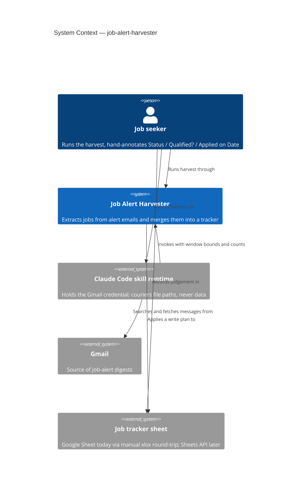
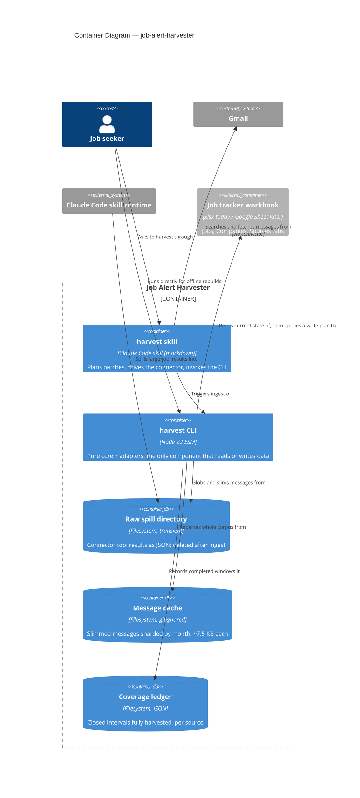
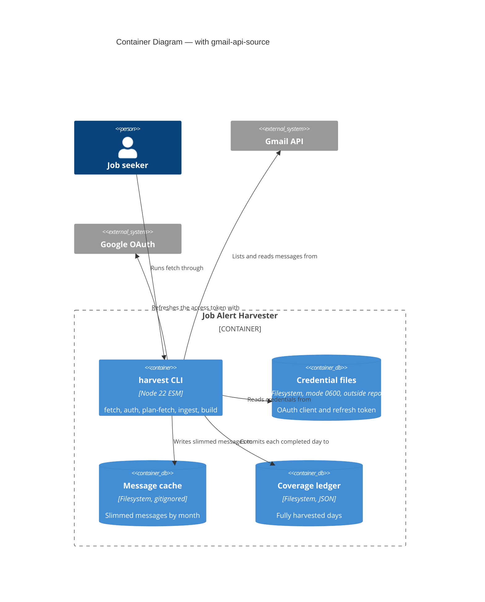
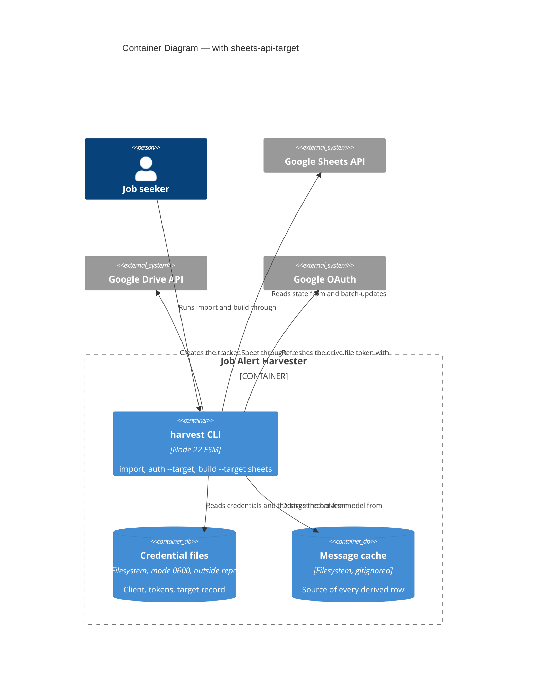
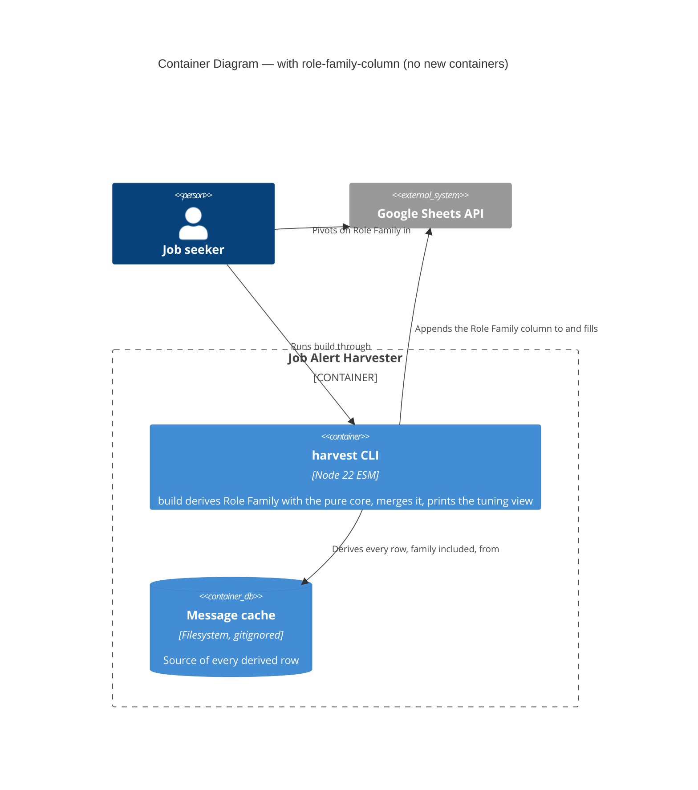
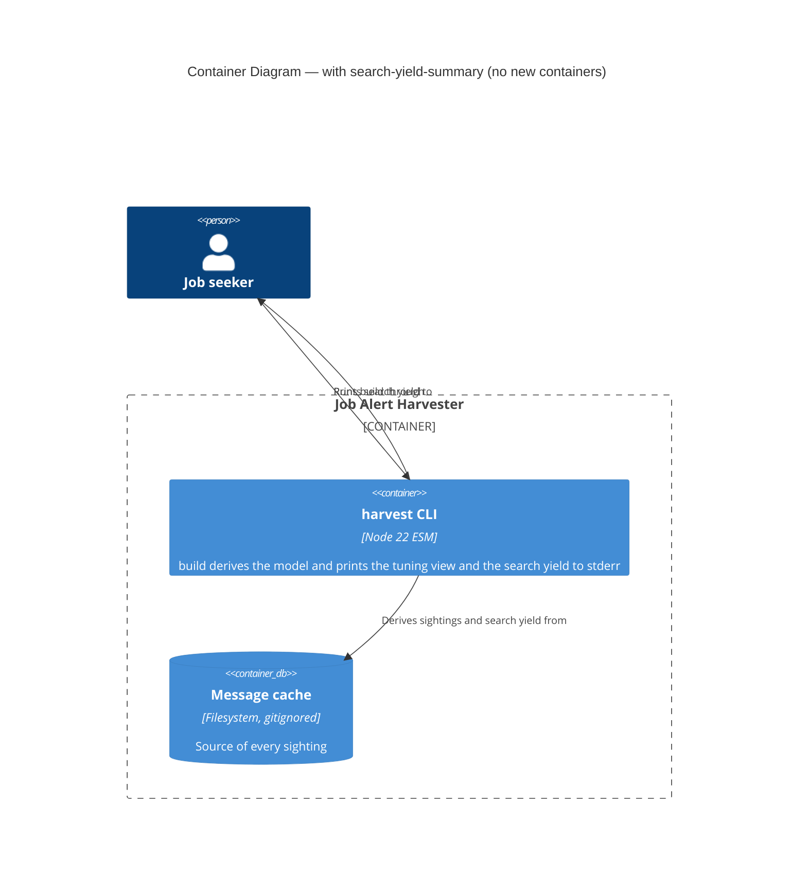

# Architecture Brief — job-search

Single source of truth for architecture across features. Each architect writes one section.
Decision records live in `docs/decisions/DR-NNNN-<slug>.md` (project convention, predates this file).

| Section | Owner | Status |
|---|---|---|
| Application Architecture | solution-architect (Morgan) | drafted 2026-08-01; extended 2026-09-29 (gmail-api-source, section 12, shipped; sheets-api-target, section 13, shipped 2026-09-30; role-family-column, section 14, shipped 2026-10-02; search-yield-summary, section 15, shipped 2026-10-05; update-subcommand, section 16, shipped 2026-10-05; install-subcommand, section 17, added 2026-10-06) |
| System Architecture | — | not yet needed (single local process) |
| Domain Model | — | folded into Application Architecture; no separate DDD pass warranted |

---

## Application Architecture

**Feature**: job-alert-harvester
**Style**: Pure Core / Imperative Shell (ports-and-adapters), functional paradigm — confirmed, not re-litigated
**Deployment**: one local Node 22 process, invoked by a human, by a Claude Code skill, or by a scheduled macOS LaunchAgent (`update`, section 16, whose files `install` generates, section 17)

### 1. System context and capabilities

The harvester turns a mailbox full of LinkedIn job-alert digests into one row per real job in a
tracking spreadsheet, without ever destroying the columns the user fills in by hand.

Capabilities in this iteration:

| # | Capability | Notes |
|---|---|---|
| C1 | Fetch alert emails from Gmail in bounded, resumable batches | ~400 messages / 90 days |
| C2 | Cache slimmed messages so history can be reparsed offline | per DR-0001 (persist what cannot be re-derived) |
| C3 | Extract every job from every digest, dedup on a canonical key | SPIKE F1/F2 — all LinkedIn alerts are digests |
| C4 | Score fit as a derived value; capture all jobs, filter none | constraint |
| C5 | Merge into an existing sheet, preserving human judgement columns | DR-0001 third application |
| C6 | Record which time windows have been fully harvested | DR-0002 |

Out of scope this iteration: the other seven sources (registry seam designed, adapters not built);
resolving recruiters to end employers; fixing the two known parser gaps.

### 2. C4 Level 1 — System Context



The Claude Code skill runtime is drawn as an external system deliberately: it is a **bridge, not a
component we own**. Its presence is a consequence of the Gmail credential living in a connector
rather than in the CLI. See DR-0003 (agent couriers paths, never data).

### 3. C4 Level 2 — Container



### 4. Component boundaries

Dependencies point inward. `src/core/**` imports no `node:` builtin, no adapter, and no SDK.

| Module | Layer | Responsibility | Contract shape |
|---|---|---|---|
| `core/sources/registry.mjs` | core | Maps a message to its source descriptor | pure |
| `core/sources/linkedin.mjs` | core | Descriptor: match predicate, extractor, dedup key | pure |
| `core/parse-linkedin.mjs` | core | Digest body → raw job rows | pure |
| `core/dedup.mjs` | core | Canonical-id and fuzzy-hash key strategies | pure |
| `core/harvest.mjs` | core | Raw rows → Jobs / Companies / Sources row models | pure |
| `core/classify.mjs` | core | Advertiser → employer \| recruiter \| aggregator | pure |
| `core/fit.mjs` | core | Title → derived fit score and reason | pure |
| `core/slim.mjs` | core | Connector raw payload → cached record shape | pure |
| `core/merge.mjs` | core | (sheet state, harvest model) → `WritePlan` | pure, returns Plan |
| `core/coverage.mjs` | core | Interval algebra over harvested windows | pure |
| `adapters/json-message-reader.mjs` | shell | Reads cached/fixture records (read-only port) | bounded-read |
| `adapters/message-cache.mjs` | shell | Writes slimmed records (write-only port) | bounded-change: `cacheRoot/**` |
| `adapters/raw-spill-source.mjs` | shell | Globs and parses connector spill files | bounded-read |
| `adapters/ledger-store.mjs` | shell | Reads/writes the coverage ledger | bounded-change: `ledger.json` |
| `adapters/xlsx-target-sheet.mjs` | shell | Reads a workbook; executes a `WritePlan` | bounded-change: target path + sibling tmp |
| `core/gmail-message.mjs` | core | Gmail resource → cache record (anti-corruption layer) | pure |
| `core/endpoints.mjs` | core | Google endpoint table; only override is a loopback base URL | pure |
| `core/oauth.mjs` | core | Consent URL, callback parse, token request/response parse, expiry, PKCE challenge | pure |
| `core/retry-policy.mjs` | core | (status, attempt, headers) → retry delay or refusal | pure |
| `adapters/credential-store.mjs` | shell | Client and token files, mode-0600 enforcement | bounded-change: `~/.config/job-alert-harvester/**` |
| `adapters/google-token-source.mjs` | shell | Refresh and code exchange against the token endpoint | bounded-read + one POST |
| `adapters/gmail-api-source.mjs` | shell | Lists and reads messages; receives a GET-only capability | bounded-read |
| `adapters/oauth-loopback.mjs` | shell | One-shot `127.0.0.1` callback listener | bounded-change: one socket |
| `cli/fetch-loop.mjs` | shell | Credential-owning fetch loop; fail-closed coverage commit | orchestration |
| `cli/auth.mjs` | shell | One-off consent flow | imperative |
| `cli/harvest.mjs` | shell | Composition root; wire → probe → use | imperative |

Read and write are **separate ports** on the cache and on the target sheet. The core receives only
the reader. A component that "just reads" cannot be handed an object with a write method on it.

### 5. Ports

| Port | Direction | Operations | Interim adapter | Target adapter |
|---|---|---|---|---|
| `MessageSource` | driven | `list(window)`, `read(id)`, `probe()` (any may return a Promise) | `raw-spill-source` (agent in the data path) | `gmail-api-source` (Internal OAuth Desktop client, read-only; DR-0011 proposed) |
| `CredentialStore` | driven | `readClient()`, `readToken()`, `writeToken()`, `probe()` | — | `credential-store` (mode-0600 files outside the repo) |
| `AccessTokenSource` | driven | `get()`, `exchangeCode()`, `probe()` | — | `google-token-source` |
| `MessageCacheReader` | driven | `ids()`, `read(id)`, `probe()` | `json-message-reader` | same |
| `MessageCacheWriter` | driven | `put(record)`, `probe()` | `message-cache` | same |
| `CoverageLedger` | driven | `read()`, `commit(interval)`, `probe()` | `ledger-store` | same |
| `TargetSheet` | driven | `read()`, `apply(plan) → Receipt`, `probe()` (any may return a Promise once the Sheets adapter lands) | `xlsx-target-sheet` | `sheets-target` (shipped, section 13) |
| CLI subcommands | driving | `plan-fetch`, `ingest`, `build`, `--dry-run`, `fetch`, `auth`, `import`, `update`, `install`, `uninstall`, `status` | `cli/harvest.mjs` | same |

Every driven port carries `probe()`. The composition root wires, probes, then uses; a failed probe
refuses to start and emits a structured `health.startup.refused` line. Probe scenarios are catalogued
in the relevant decision records.

`build --dry-run` returns and prints a `WritePlan` and writes nothing. It is pure by construction:
the plan is computed in `core/merge.mjs`, and only `TargetSheet.apply` can write. "Preview wrote to
the sheet" is not a representable state.

### 6. Technology stack

| Choice | Version | License | Rationale |
|---|---|---|---|
| Node | 22 LTS | — | already the project runtime |
| ESM `.mjs`, no build step | — | — | Cognitive Load Tax: a bundler buys nothing here |
| SheetJS `xlsx` | ^0.18.5 | Apache-2.0 | already in use, writes real workbooks, no alternative needed |
| Vitest | ^3 | MIT | already in use |
| dependency-cruiser (adopted, DR-0013) | ^18 | MIT | enforce the layering rules |
| googleapis | — | Apache-2.0 | **not adopted**: native `fetch` for Gmail (DR-0011) and for the Sheets and Drive calls (section 13) |

No proprietary dependency. No new runtime dependency is added by this design; `dependency-cruiser`
is dev-only.

### 7. Integration patterns

- **Agent ↔ CLI**: filesystem hand-off. The agent transmits only low-entropy control values (window
  bounds, counts, booleans) and never a record. Every control value is verified against the ingested
  data before it is trusted. DR-0003.
- **CLI ↔ Gmail (interim)**: indirect, via the connector's spill directory. Failure mode is designed
  to be "nothing ingested", never "partially ingested".
- **CLI ↔ target sheet**: read-plan-apply. The plan is data; the adapter executes it.
- **Retry semantics**: re-running a batch is idempotent — the cache short-circuits re-fetch, and
  coverage is committed only when a window completes.

### 8. Quality attributes

| Attribute (ISO 25010) | Priority | Strategy |
|---|---|---|
| Functional correctness / integrity | **dominant** | one owner per column; agent never carries records; ids verified by round-trip; nothing is ever deleted |
| Maintainability, testability | high | pure core, no `node:` imports; every decision testable without I/O |
| Reliability, recoverability | high | coverage intervals + idempotent re-fetch; full reparse from cache is the default path |
| Portability / replaceability | medium | every agent-mediated port ships with its named API successor |
| Security, confidentiality | medium | ~7.5 MB personal history at rest, gitignored, unencrypted — accepted in DR-0001 |
| Performance efficiency | low | ~10 ms/message; a full-year reparse is ~10 s |

Trade-off point: **integrity vs freshness** on the interim xlsx path. A downloaded file has no
revision identity, so edits made in the Google Sheet between download and re-upload are invisible to
the merge. Mitigated by a merge receipt, not solved. DR-0005.

### 9. Architecture enforcement

Style: Pure Core / Imperative Shell (hexagonal)
Language: JavaScript (ESM, Node 22)
Tool: **dependency-cruiser**, adopted per DR-0013. Config: `.dependency-cruiser.cjs`. Run by `npm run check:arch`, by `pretest`, and by `tests/architecture/layering.test.mjs`, which also proves each rule reports when broken

Rules to enforce:
- `src/core/**` must not import any `node:` builtin
- `src/core/**` must not import from `src/adapters/**` or `src/cli/**`
- `src/adapters/**` must not import from other adapters
- no circular dependencies anywhere in `src/`
- `gmail-api-source`, `sheets-target` and `sheet-provisioner` must not import any `node:` module
- only `launchctl` and `git-checkout` may import `child_process` (DR-0018, install generates the scheduler files)

Two further checks belong with the crafter, not with dependency-cruiser:
- **probe presence** — a test asserting every adapter that owns durable state, a credential or a network boundary exports a `probe` (`raw-spill-source`, `ledger-store`, `message-cache`, `xlsx-target-sheet`, `credential-store`, `google-token-source`, `gmail-api-source`); the pure readers and writers (`json-message-reader`, `receipt-store`, `change-report-writer`, `xlsx-workbook-writer`) are out of scope
- **probe behaviour** — a fault-injection suite per adapter (scenarios listed in DR-0003 and DR-0005)

### 10. External integrations

| Service | Consumed | Contract testing |
|---|---|---|
| Gmail (via Claude Code connector) | message search + fetch payload shape | Schema-shape test over committed sample spill files. The coupling is to an undocumented harness behaviour — see DR-0003 for the honest fragility assessment. |
| Gmail REST API v1 (gmail-api-source) | `users.messages.list`, `users.messages.get`, `users/me/profile` | Fixtures copied from real responses first; Pact-JS consumer contracts later. Fake at the HTTP boundary; see `docs/feature/gmail-api-source/feature-delta.md` |
| Google OAuth 2.0 token endpoint | `refresh_token` and `authorization_code` grants | Same fixtures-first approach; pin `invalid_grant` and the no-refresh-token response |
| Google Sheets API v4 and Drive API v3 (section 13) | `spreadsheets.get`, `values.batchGet`, `spreadsheets.batchUpdate` (`developerMetadata.search` retired 2026-09-30); Drive `files.create` (conversion), `files.get`, `files.delete` | Fixtures copied from real responses plus a live verification script; Pact-JS later. |

Handoff annotation for platform-architect:

```
External Integrations Requiring Contract Tests:
- Claude Code Gmail connector (tool-result spill files): raw message payload shape
  Recommended: golden-file schema tests over committed spill samples; fail loudly on drift
- Google Sheets API v4 (REST): values.get, spreadsheets.batchUpdate
  Recommended: consumer-driven contracts via Pact-JS in CI, once the adapter exists
```

### 11. Decision index

| DR | Title | Status |
|---|---|---|
| DR-0001 | Persist what cannot be re-derived; recompute what can | accepted (refinedBy DR-0002) |
| DR-0002 | Coverage intervals persist; processed ids derive from the cache | accepted |
| DR-0003 | The agent couriers paths and control values, never records — refined by DR-0007 | accepted |
| DR-0004 | Every column has exactly one owner | accepted |
| DR-0005 | The target sheet is a plan-executing port | accepted |
| DR-0006 | Source registry: descriptors are data, extractors return arrays | accepted |
| DR-0007 | The spill contract is what the harness actually writes | accepted |
| DR-0009 | `build` derives every row from the whole cache | accepted |
| DR-0010 | Every derived tab merges by its own key | accepted |
| DR-0011 | The CLI's Gmail credential is an Internal OAuth Desktop client, read-only, over native fetch | accepted |
| DR-0012 | The Sheets target is a harvester-created Sheet under the `drive.file` scope | accepted |
| DR-0014 | Role Family is a derived column, classified from the title by a data table (DR-0008 and DR-0013 are also absent from this index; not added here) | accepted |
| DR-0015 | Search yield is derived inside `harvest()` and printed to stderr, never stored | accepted |
| DR-0016 | `harvest update` owns the fetch-then-build sequence and fails closed | accepted (version 1.2.1, four rulings and a plan stage for previews; pointer to DR-0018) |
| DR-0018 | `install`, `uninstall` and `status` generate and manage the scheduler files | accepted |

### 12. gmail-api-source (added 2026-09-29; shipped)

Detail: `docs/feature/gmail-api-source/feature-delta.md`; delivery record `docs/evolution/2026-09-29-gmail-api-source.md`.
This section records what is settled. Real-response parity (`scripts/gmail-parity-check.mjs`) was run on 2026-09-29 and DR-0011 is now `accepted`.

The CLI gains its own Gmail credential, so the agent leaves the data path. `MessageSource` is unchanged;
`gmail-api-source` is its second adapter. Sections 2 and 3 above describe the interim (agent) path, which
stays until the operator retires the skill; the shipped state is:



Settled: `list`/`read`/`probe` shape and `{id, date}` parity with the spill adapter; `format=full`
decoded in a pure anti-corruption module; the source's own listing is the expected set, checked against
the cache's own view; `probe()` refusals are named (`gmail.*`, `auth.*`) and cover credentials, token
refresh, scope, mailbox, query, quota, and "the sender matches something" (an empty window commits
coverage); the Gmail source receives a GET-only capability; adapters never import each other; access token
in memory only; `build`, `plan-fetch`, `ingest` and the skill are unchanged. The fetch loop is now
async; its logic is otherwise reused as-is.

Fetch flow: `fetch` clamps the range → wires credential store, token source, Gmail source → the loop
probes ledger, cache, source → per UTC day: list to exhaustion, read uncached ids, slim, cache, verify every
listed id is cached or quarantined, commit coverage.

External integration annotation for platform-architect:

```
External Integrations Requiring Contract Tests:
- Gmail REST API v1 (users.messages.list/get, users/me/profile): message ids, internalDate, parts tree
  Recommended: fixtures copied from real responses first; consumer-driven contracts via Pact-JS in CI
- Google OAuth 2.0 token endpoint: refresh_token and authorization_code grants, invalid_grant
  Recommended: same
```

### 13. sheets-api-target (added 2026-09-29; **shipped 2026-09-30; live check run; first real import and build run on 2026-09-30 with 0 cell changes, so the update and append paths are not yet exercised on real changes**)

Detail: `docs/feature/sheets-api-target/feature-delta.md`. Settled by DR-0012 (accepted) and the spike. Every Google API behaviour beyond the spike's PROVEN list was an
assumption; the live check of 2026-09-30 answered 17 of 19 (delta, *API Assumptions*; `deliver/live-findings.md`).

`TargetSheet` gains a second adapter, `sheets-target`, over a harvester-created native Sheet under `drive.file`.
The plan shape is unchanged; `core/merge.mjs` is unchanged. The xlsx adapter, stale-upload warning and receipts stay
for the offline path and are not used for the Sheets target.

| Module | Layer | Status | Contract shape |
|---|---|---|---|
| `core/sheets-model.mjs` (Sheets JSON to `SheetState` and resolution) | core | shipped | pure |
| `core/sheets-requests.mjs` (plan plus resolution to one batch body; request classifier; allow-list) | core | shipped (step 01-05); allow-list is four kinds after the 2026-09-30 retirement, and the code lists four | pure; no delete, clear or sort request constructable |
| `core/import-check.mjs` | core | shipped (step 01-04) | pure |
| `core/oauth.mjs`, `core/endpoints.mjs`, `core/retry-policy.mjs` | core | shipped (steps 01-01 to 01-03) | pure; scope profile, Sheets and Drive bases, refusal namespace, target-record shape; Gmail behaviour unchanged |
| `adapters/sheets-target.mjs` | shell | shipped; metadata binding retired 2026-09-30 and removed from the code | reader: bounded-read; writer: bounded-change (harvester-owned cells, appended rows and columns, new tabs; row-key metadata removed from the universe) |
| `adapters/sheet-provisioner.mjs` | shell | shipped | bounded-change: creates one file, deletes only what it created |
| `adapters/credential-store.mjs` | shell | shipped (step 02-01) | adds `sheets-token.json` and an exclusive-create `sheets-target.json` (hard-linked into place, so an existing record is never overwritten); `google-token-source.mjs` gains a Sheets profile (step 02-03) |
| `cli/google-transport.mjs`, `cli/import.mjs` | shell | shipped | imperative; transport hands adapters separate read and write capabilities |
| `cli/auth.mjs`, `cli/harvest.mjs` | shell | shipped extension | `auth --target sheets`, `import`, `build --target sheets`, async `build` |

Settled: apply re-resolves rows and columns from fresh reads on every attempt and never replays a body (idempotent
appends); the key column is the truth and the only locator (row-key developer metadata, a second locator created
after a row exists and healed by `build`, is retired: superseded by the 2026-09-30 amendment, see below); only harvester-owned non-key columns are written to existing rows, so a misdirected
write cannot touch a human cell or a row key; a probe that is read-only (`--dry-run` gets no write capability);
named refusals `sheets.*`, `drive.*`, `import.*`; `HARVEST_API_BASE_URL` covers the new bases, loopback only.

Amendment 2026-09-30 (human decision): row-key developer metadata is retired. Google caps the developer metadata a Sheet can hold (refused at about 1,200 entries in the test Sheet); the operator's Sheet holds 541 entries and grows about 19 a day, so the cap would arrive in about five weeks. Nothing creates, binds, reads, searches or checks row-key metadata; the request allow-list is `updateCells`, `appendCells`, `appendDimension`, `addSheet`; `sheets.row-identity-conflict`, `sheets.metadata-pending` and `sheets.metadata-unavailable` and the receipt fields `warnings` and `metadataPending` go; `import` no longer binds. Duplicate keys still refuse (`sheets.duplicate-key`, from the key column). Accepted residual risk: a human sort, insert or delete inside the single write window can misdirect a harvester-owned-column write to another row (human-owned cells are still never targeted); nothing on Google's side can close the window, and the removed tripwire did not either. The follow-up change has landed: `src/` no longer mentions developer metadata (`docs/feature/sheets-api-target/deliver/metadata-retirement-inventory.md` lists what was removed).

Resolved by the human on 2026-09-29: one `spreadsheets.batchUpdate` write shape, explicit `--target sheets`,
refuse the whole apply on duplicate keys, refuse an oversize plan after skipping unchanged cells. The
test-seam layout (sibling `sheets-fake.mjs`) was taken as recommended and ratified on 2026-09-30.



External integration annotation for platform-architect:

```
External Integrations Requiring Contract Tests:
- Google Sheets API v4 (spreadsheets.get, values.batchGet, spreadsheets.batchUpdate; developerMetadata.search retired 2026-09-30)
  Recommended: fixtures copied from real responses plus a live verification script; Pact-JS consumer contracts later
- Google Drive API v3 (files.create with conversion, files.get, files.delete): same
- Google OAuth 2.0 token endpoint (drive.file grant): same
```

### 14. role-family-column (added 2026-09-30; **shipped 2026-10-02**)

Detail: `docs/feature/role-family-column/feature-delta.md`. Decision: `docs/decisions/DR-0014-role-family-is-a-derived-column-classified-from-title-by-a-data-table.md` (accepted).

A harvester-owned derived Jobs column, `Role Family`, holds one family per advert: `agile coach`, `scrum master`, `engineering/delivery manager`, `product/product ops`, `transformation/change`, `AI transformation` or `other`. A pure classifier derives it from the title alone, by first match over an ordered data table (DR-0006 style), and nothing is persisted (DR-0001, DR-0009). No Trends tab, no report command, no new subcommand.

| Module | Layer | Change | Contract shape |
|---|---|---|---|
| `core/role-families.mjs` (ordered family table, title normaliser, classifier, tuning summary) | core | new | pure-function, total |
| `core/harvest.mjs` (`JOBS_COLUMNS`, `toJobsRow`), `core/merge.mjs` (`HARVESTER_COLUMNS`) | core | extend: name and fill the column | pure |
| `cli/harvest.mjs` | shell | extend: print the most frequent `other` titles beside the change summary | imperative |
| merge planning, `sheets-model`, `sheets-requests`, both target adapters, `changes`, `import-check` | core, shell | unchanged | as before |

Settled by the code, not by new design: an existing target whose Jobs header lacks the column gains it through the existing append-missing-harvester-column path (DR-0004 rule 3), in both the xlsx and the Sheets target, at the far right of the header, with no header migration. The first population is not itemised as derived corrections (the existing report excludes columns the run appends); later re-classification is, one line per changed row. Residual risks, all recorded in the delta: the first real `updateCells` and `appendDimension` on the real tracker, the request count of about 3,050 single-cell updates in one batch (bytes fit; count unverified), a pre-existing hand-typed `Role Family` header, and filters or pivots that may not extend to the new column (unverified). Enforcement: no rule change; `dependency-cruiser` already keeps `core/role-families.mjs` free of `node:` imports, and the table's own rules (no shadowed or duplicate pattern, every pattern exercised) are tests.



External integration annotation for platform-architect: no new integration. Contract tests recommended for Google Sheets API v4 stay as in section 13, with one addition: extend the live verification script to the real grid width and about 3,050 single-cell updates before the first real run (feature-delta OQ-7).

### 15. search-yield-summary (added 2026-10-05; **shipped 2026-10-05**)

Detail: `docs/feature/search-yield-summary/feature-delta.md`. Decision: `docs/decisions/DR-0015-search-yield-is-derived-in-harvest-and-printed-never-stored.md` (accepted).

`build` (merge, Sheets, `--dry-run`; not create or `--in` rebuild) prints, on stderr only, a per-saved-search yield table beside the Role Family tuning view: distinct adverts found, how many are `other` (with share), on-target adverts (any other family) and the on-target adverts found by no other search. Two blocks: all cached alerts, and the 28 calendar dates ending at the latest sighting date. Derived from the whole cache each run (DR-0001, DR-0009); nothing is stored; never on stdout or in `--report`. No new option, tab, column or file.

| Module | Layer | Change | Contract shape |
|---|---|---|---|
| `core/search-yield.mjs` (per-search summary, stderr formatter) | core | new | pure-function, total |
| `core/harvest.mjs` (`harvest()` returns `searchYield` beside the three tabs) | core | extend | pure |
| `cli/harvest.mjs` (`printSearchYield` at the three print sites) | shell | extend | imperative, stderr only |
| merge planning, targets, `cli-options`, change report | core, shell | unchanged | as before |

Settled by the code: the Sources tab `Jobs Found` is already a distinct-advert count per term (`harvest.mjs:152,164`), so the new `found` column reconciles to it; membership per search exists only in `rawRows` inside `harvest()`, which is why the summary is computed there. Known limits: the summary does not read the coverage ledger, so a partial cache under-counts and can overstate `unique`.



External integration annotation for platform-architect: no new integration.

### 16. update-subcommand (added 2026-10-05; **shipped 2026-10-05**)

Detail: `docs/feature/update-subcommand/feature-delta.md`. Decision: `docs/decisions/DR-0016-update-subcommand-owns-the-fetch-then-build-sequence.md` (accepted, version 1.2.0). Operator guide: `docs/how-to/run-update-on-a-schedule.md`.

This section assumes the reader knows that `fetch` copies LinkedIn alert mail from Gmail into a local cache and records the covered UTC days in a coverage ledger (DR-0002, coverage intervals), and that `build --target sheets` derives the tracker from the whole cache and writes it to the operator's Sheet (DR-0009, derive from whole cache; DR-0012, Sheets write window risk).

Before this feature the operator brought the Sheet up to date with two commands and a start day worked out by hand. `harvest update [--from <d>] [--dry-run]` replaces that with one command that owns the sequence, so a scheduler and a person run the same thing. It adds one subcommand, three refusal codes (`update.no-baseline`, `update.stage-failed`, `update.already-running`) and one file, `.cache/update.lock`. No tab, column or Sheet behaviour changes.

The sequence is plan, fetch, decide, build, summarise. Planning chooses the start day from the earliest day the ledger covers for the source, or from `--from`, and the end day from the clock. The fetch stage clamps the end day to the last UTC day that has ended. The decision is pure: build after every successful fetch, stop after any failure. Summarising maps the outcome to the closing lines and the exit status.

The build always runs after a successful fetch, including one that committed no day. A build that failed on an earlier run then heals on the next run without new mail. A build with nothing to change sends no data batch to the Sheet, so the extra build does not open the write window DR-0012 warns about.

The command fails closed. A failed or partial fetch stops the run before the build, so the Sheet is never built from a cache known to have a gap. Days the fetch committed stay committed and the next run resumes. Every failure exits 1 through one code, `update.stage-failed`, which names the stage (`lock`, `plan`, `fetch` or `build`) and carries the inner code. The alternative, a distinct exit code per stage, would let a scheduler branch without parsing text. It was not taken because nothing branches on it today.

Four rulings made during delivery settle cases the design left open (DR-0016 version 1.2.0). `--from` overrides the ledger and also rescues an empty or missing one. A preview ignores the run lock. An unreadable ledger, lock file or `.cache/` is a stage failure, and a preview that cannot read the ledger fails at the `plan` stage because it never fetches. The nothing-new line precedes the build's output and stays when the build then fails.

The run lock is an exclusive-create `.cache/update.lock` holding the holder's process id. A start-up check proves the adapter can tell a live holder from a dead one, so a lock left by a killed process is recovered and a live holder is refused with `update.already-running`. The lock is released after success and after failure. A preview never takes it. The design called the lock its weakest recommendation: a lock around the build alone would leave the fetch race, and a single operator on a quiet schedule could run without one. Two runs that find the same stale lock in the same instant can each remove the other's fresh lock after retaking it. This is accepted for a single operator on a daily schedule and is recorded in the Exceptions of DR-0016 (update owns the sequence).

`--dry-run` is safe by construction. The preview function is handed no fetch capability, so it cannot call Gmail. It prints the range and the uncovered-day count from the ledger, then runs the build's own preview.

| Module | Layer | Change | Contract shape |
|---|---|---|---|
| `core/update-plan.mjs` (range plan, decision, summary, `UpdateRefusal`) | core | new | pure-function |
| `cli/update.mjs` (`runUpdate`, `runUpdatePreview`; stages, clock and lock injected) | shell | new | imperative, capability-injected |
| `adapters/run-lock.mjs` (`LockRefusal`; imports `node:fs` only) | adapter | new | bounded-change: `.cache/update.lock` and its `.probe` sibling |
| `cli/harvest.mjs` (`update` case; `runFetch` returns `{ windowsCommitted }`) | shell | extend | imperative |
| `core/cli-options.mjs` (`update: { from, dry-run }`) | core | extend | pure |
| fetch loop, build, Sheets target, ledger | shell, core | unchanged | as before |

The shell module cannot import `harvest.mjs`, which dispatches at top level, so `harvest.mjs` passes the fetch and build stages in as functions. `update` itself has no logging, notification or scheduling code. When this section was written the operator wrote the launchd plist and a short `sh` wrapper by hand from the how-to. Section 17 supersedes that: `install` now generates both files, so darwin-specific code does enter `src/`, in `core/launch-agent.mjs` and the adapters.

External integration annotation for platform-architect: no new integration. The scheduler is the operator's own LaunchAgent, which `install` generates (section 17).

### 17. install-subcommand (added 2026-10-06)

Detail: `docs/feature/install-subcommand/feature-delta.md`. Decision: `docs/decisions/DR-0018-install-subcommand-generates-the-scheduler-files.md` (accepted). Operator guide: `docs/how-to/run-update-on-a-schedule.md`. Reference: `docs/reference/cli.md`.

This section assumes the reader knows `harvest update` (section 16) and that macOS runs a scheduled job from a LaunchAgent plist, which launchd loads from `~/Library/LaunchAgents/`.

Section 16 left the plist and a notification wrapper to the operator, with the how-to as the source of the text. Three values in those files are easy to get wrong by hand: the absolute path of `node`, the checkout directory, and the escaping of paths. `harvest install [--at <HH:MM>] [--dry-run] [--load] [--force] [--allow-any-branch]` generates both files for the checkout it runs from. `uninstall [--dry-run] [--force]` removes them, and `status` reports whether the job is installed, loaded, in step with what `install` would write, and likely to fail. The three commands add ten `install.*` refusal codes and no tab, column or Sheet behaviour.

`install` writes files and calls no `launchctl` unless given `--load`. `--dry-run` prints the plan and the text of both files and does nothing else. The job runs whatever the checkout holds when it fires, so `install` refuses a checkout that is not on `main` unless given `--allow-any-branch`. It replaces a plist it generated, found by a marker comment, and refuses a hand-made one without `--force`.

`status` is read-only and exits 0 whenever it can print a report. "Loaded" is the exit status of `launchctl print`, never its text, and the other fields are read from named lines of that text. All three commands exit 0 or 1 only.

DR-0018 (install generates the scheduler files) reverses in part DR-0016's decisions on logging and notification, and the earlier statement that nothing darwin-specific enters `src/`. The alternatives were a pinned dedicated clone, a bundled app and the how-to alone. The dedicated clone would remove the risk that a branch switch changes what the job runs. It would cost a second copy of the code to keep current.

The pure parts live in `src/core` and the effects in the adapters. `child_process` is imported only by the `launchctl` and `git-checkout` adapters, and a dependency-cruiser rule enforces that with a fixture in the layering test proving the rule reports (DR-0013, layering enforced by dependency-cruiser).

| Module | Layer | Change | Contract shape |
|---|---|---|---|
| `core/launch-agent.mjs` (label, `parseAt`, `renderPlist`, `renderWrapper`, `pathsFor`, `chooseNodePath`) | core | new | pure-function |
| `core/install-plan.mjs` (`planInstall`, `planUninstall`, `reportStatus`, `InstallRefusal`) | core | new | pure-function |
| `core/launchd-print.mjs` (`readLaunchdPrint`) | core | new | pure-function |
| `cli/install.mjs` (`runInstall`, `runInstallPreview`, `runUninstall`, `runUninstallPreview`, `runStatus`; effects injected) | shell | new | imperative, capability-injected |
| `adapters/launchctl.mjs` (`createLaunchctl`) | adapter | new | bounded-change: one launchd job |
| `adapters/git-checkout.mjs` (`read`) | adapter | new | bounded-read |
| `adapters/launch-agent-files.mjs` (`createLaunchAgentFiles`) | adapter | new | bounded-change: the plist, the wrapper, their folders |
| `cli/harvest.mjs` (three cases; `readLedgerFromDisk` shared with `update`) | shell | extend | imperative |
| `core/cli-options.mjs` (tables for `install`, `uninstall`, `status`) | core | extend | pure |

External integration annotation for platform-architect: no new integration. `launchd` is the operating system, not a consumed service, and the macOS facts the tests rely on were observed on a real machine on 2026-10-06 (`docs/feature/install-subcommand/feature-delta.md`).
