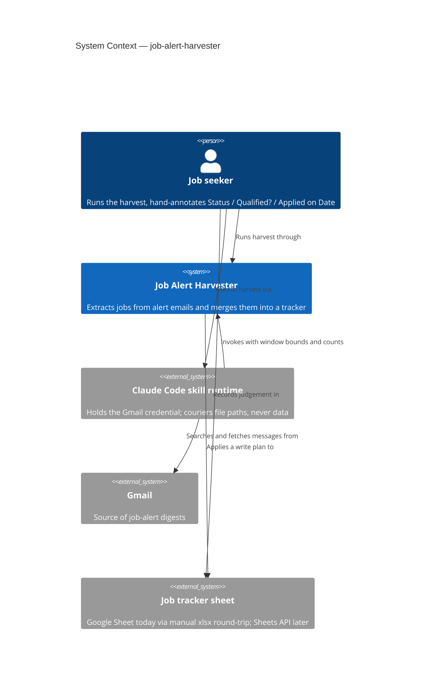
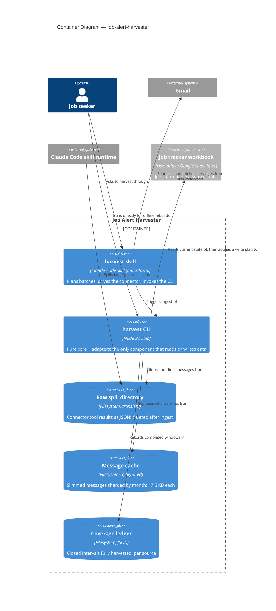
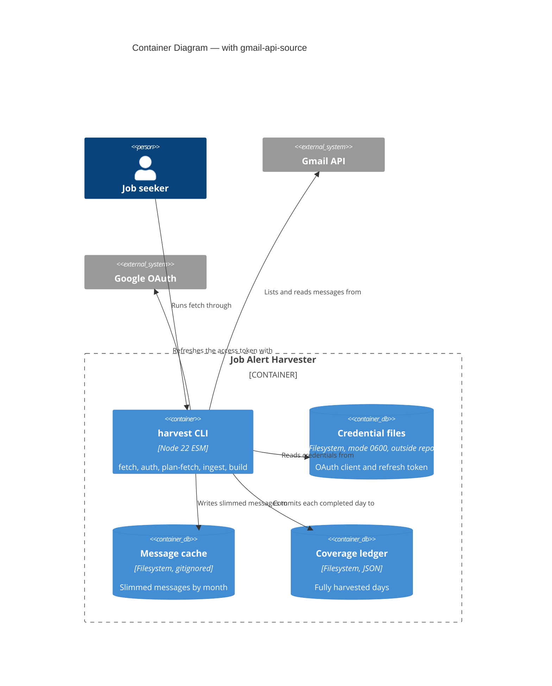
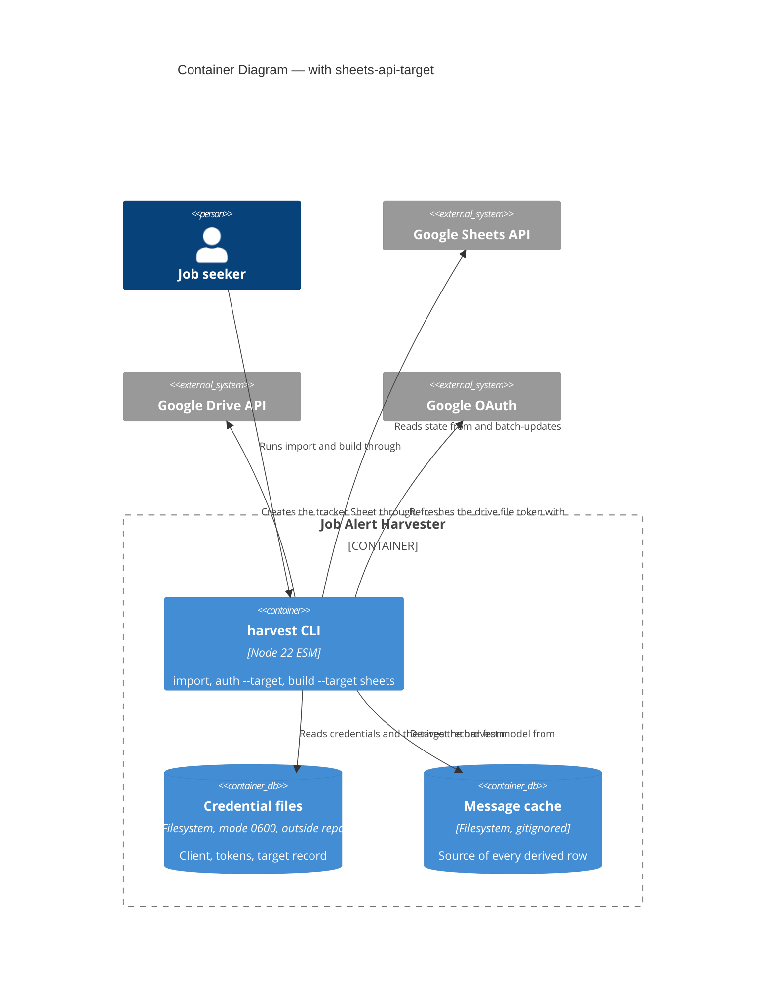

# Architecture Brief — job-search

Single source of truth for architecture across features. Each architect writes one section.
Decision records live in `docs/decisions/DR-NNNN-<slug>.md` (project convention, predates this file).

| Section | Owner | Status |
|---|---|---|
| Application Architecture | solution-architect (Morgan) | drafted 2026-08-01; extended 2026-09-29 (gmail-api-source, section 12, shipped; sheets-api-target, section 13, shipped 2026-09-30) |
| System Architecture | — | not yet needed (single local process) |
| Domain Model | — | folded into Application Architecture; no separate DDD pass warranted |

---

## Application Architecture

**Feature**: job-alert-harvester
**Style**: Pure Core / Imperative Shell (ports-and-adapters), functional paradigm — confirmed, not re-litigated
**Deployment**: one local Node 22 process, invoked by a human or by a Claude Code skill

### 1. System context and capabilities

The harvester turns a mailbox full of LinkedIn job-alert digests into one row per real job in a
tracking spreadsheet, without ever destroying the columns the user fills in by hand.

Capabilities in this iteration:

| # | Capability | Notes |
|---|---|---|
| C1 | Fetch alert emails from Gmail in bounded, resumable batches | ~400 messages / 90 days |
| C2 | Cache slimmed messages so history can be reparsed offline | per DR-0001 (persist what cannot be re-derived) |
| C3 | Extract every job from every digest, dedup on a canonical key | SPIKE F1/F2 — all LinkedIn alerts are digests |
| C4 | Score fit as a derived value; capture all jobs, filter none | constraint |
| C5 | Merge into an existing sheet, preserving human judgement columns | DR-0001 third application |
| C6 | Record which time windows have been fully harvested | DR-0002 |

Out of scope this iteration: the other seven sources (registry seam designed, adapters not built);
resolving recruiters to end employers; fixing the two known parser gaps.

### 2. C4 Level 1 — System Context



The Claude Code skill runtime is drawn as an external system deliberately: it is a **bridge, not a
component we own**. Its presence is a consequence of the Gmail credential living in a connector
rather than in the CLI. See DR-0003 (agent couriers paths, never data).

### 3. C4 Level 2 — Container



### 4. Component boundaries

Dependencies point inward. `src/core/**` imports no `node:` builtin, no adapter, and no SDK.

| Module | Layer | Responsibility | Contract shape |
|---|---|---|---|
| `core/sources/registry.mjs` | core | Maps a message to its source descriptor | pure |
| `core/sources/linkedin.mjs` | core | Descriptor: match predicate, extractor, dedup key | pure |
| `core/parse-linkedin.mjs` | core | Digest body → raw job rows | pure |
| `core/dedup.mjs` | core | Canonical-id and fuzzy-hash key strategies | pure |
| `core/harvest.mjs` | core | Raw rows → Jobs / Companies / Sources row models | pure |
| `core/classify.mjs` | core | Advertiser → employer \| recruiter \| aggregator | pure |
| `core/fit.mjs` | core | Title → derived fit score and reason | pure |
| `core/slim.mjs` | core | Connector raw payload → cached record shape | pure |
| `core/merge.mjs` | core | (sheet state, harvest model) → `WritePlan` | pure, returns Plan |
| `core/coverage.mjs` | core | Interval algebra over harvested windows | pure |
| `adapters/json-message-reader.mjs` | shell | Reads cached/fixture records (read-only port) | bounded-read |
| `adapters/message-cache.mjs` | shell | Writes slimmed records (write-only port) | bounded-change: `cacheRoot/**` |
| `adapters/raw-spill-source.mjs` | shell | Globs and parses connector spill files | bounded-read |
| `adapters/ledger-store.mjs` | shell | Reads/writes the coverage ledger | bounded-change: `ledger.json` |
| `adapters/xlsx-target-sheet.mjs` | shell | Reads a workbook; executes a `WritePlan` | bounded-change: target path + sibling tmp |
| `core/gmail-message.mjs` | core | Gmail resource → cache record (anti-corruption layer) | pure |
| `core/endpoints.mjs` | core | Google endpoint table; only override is a loopback base URL | pure |
| `core/oauth.mjs` | core | Consent URL, callback parse, token request/response parse, expiry, PKCE challenge | pure |
| `core/retry-policy.mjs` | core | (status, attempt, headers) → retry delay or refusal | pure |
| `adapters/credential-store.mjs` | shell | Client and token files, mode-0600 enforcement | bounded-change: `~/.config/job-alert-harvester/**` |
| `adapters/google-token-source.mjs` | shell | Refresh and code exchange against the token endpoint | bounded-read + one POST |
| `adapters/gmail-api-source.mjs` | shell | Lists and reads messages; receives a GET-only capability | bounded-read |
| `adapters/oauth-loopback.mjs` | shell | One-shot `127.0.0.1` callback listener | bounded-change: one socket |
| `cli/fetch-loop.mjs` | shell | Credential-owning fetch loop; fail-closed coverage commit | orchestration |
| `cli/auth.mjs` | shell | One-off consent flow | imperative |
| `cli/harvest.mjs` | shell | Composition root; wire → probe → use | imperative |

Read and write are **separate ports** on the cache and on the target sheet. The core receives only
the reader. A component that "just reads" cannot be handed an object with a write method on it.

### 5. Ports

| Port | Direction | Operations | Interim adapter | Target adapter |
|---|---|---|---|---|
| `MessageSource` | driven | `list(window)`, `read(id)`, `probe()` (any may return a Promise) | `raw-spill-source` (agent in the data path) | `gmail-api-source` (Internal OAuth Desktop client, read-only; DR-0011 proposed) |
| `CredentialStore` | driven | `readClient()`, `readToken()`, `writeToken()`, `probe()` | — | `credential-store` (mode-0600 files outside the repo) |
| `AccessTokenSource` | driven | `get()`, `exchangeCode()`, `probe()` | — | `google-token-source` |
| `MessageCacheReader` | driven | `ids()`, `read(id)`, `probe()` | `json-message-reader` | same |
| `MessageCacheWriter` | driven | `put(record)`, `probe()` | `message-cache` | same |
| `CoverageLedger` | driven | `read()`, `commit(interval)`, `probe()` | `ledger-store` | same |
| `TargetSheet` | driven | `read()`, `apply(plan) → Receipt`, `probe()` (any may return a Promise once the Sheets adapter lands) | `xlsx-target-sheet` | `sheets-target` (shipped, section 13) |
| CLI subcommands | driving | `plan-fetch`, `ingest`, `build`, `--dry-run`, `fetch`, `auth` | `cli/harvest.mjs` | same |

Every driven port carries `probe()`. The composition root wires, probes, then uses; a failed probe
refuses to start and emits a structured `health.startup.refused` line. Probe scenarios are catalogued
in the relevant decision records.

`build --dry-run` returns and prints a `WritePlan` and writes nothing. It is pure by construction:
the plan is computed in `core/merge.mjs`, and only `TargetSheet.apply` can write. "Preview wrote to
the sheet" is not a representable state.

### 6. Technology stack

| Choice | Version | License | Rationale |
|---|---|---|---|
| Node | 22 LTS | — | already the project runtime |
| ESM `.mjs`, no build step | — | — | Cognitive Load Tax: a bundler buys nothing here |
| SheetJS `xlsx` | ^0.18.5 | Apache-2.0 | already in use, writes real workbooks, no alternative needed |
| Vitest | ^3 | MIT | already in use |
| dependency-cruiser (proposed) | ^16 | MIT | enforce the core-purity rule in CI |
| googleapis | — | Apache-2.0 | **not adopted**: native `fetch` for Gmail (DR-0011) and for the Sheets and Drive calls (section 13) |

No proprietary dependency. No new runtime dependency is added by this design; `dependency-cruiser`
is dev-only.

### 7. Integration patterns

- **Agent ↔ CLI**: filesystem hand-off. The agent transmits only low-entropy control values (window
  bounds, counts, booleans) and never a record. Every control value is verified against the ingested
  data before it is trusted. DR-0003.
- **CLI ↔ Gmail (interim)**: indirect, via the connector's spill directory. Failure mode is designed
  to be "nothing ingested", never "partially ingested".
- **CLI ↔ target sheet**: read-plan-apply. The plan is data; the adapter executes it.
- **Retry semantics**: re-running a batch is idempotent — the cache short-circuits re-fetch, and
  coverage is committed only when a window completes.

### 8. Quality attributes

| Attribute (ISO 25010) | Priority | Strategy |
|---|---|---|
| Functional correctness / integrity | **dominant** | one owner per column; agent never carries records; ids verified by round-trip; nothing is ever deleted |
| Maintainability, testability | high | pure core, no `node:` imports; every decision testable without I/O |
| Reliability, recoverability | high | coverage intervals + idempotent re-fetch; full reparse from cache is the default path |
| Portability / replaceability | medium | every agent-mediated port ships with its named API successor |
| Security, confidentiality | medium | ~7.5 MB personal history at rest, gitignored, unencrypted — accepted in DR-0001 |
| Performance efficiency | low | ~10 ms/message; a full-year reparse is ~10 s |

Trade-off point: **integrity vs freshness** on the interim xlsx path. A downloaded file has no
revision identity, so edits made in the Google Sheet between download and re-upload are invisible to
the merge. Mitigated by a merge receipt, not solved. DR-0005.

### 9. Architecture enforcement

Style: Pure Core / Imperative Shell (hexagonal)
Language: JavaScript (ESM, Node 22)
Tool: **dependency-cruiser was proposed here but is NOT installed** (no `.dependency-cruiser.cjs`, no CI, no pretest script as of 2026-09-30). Until an owner decides to adopt it, the rules are held by convention, review, and per-feature structural tests (`tests/acceptance/gmail-api-source/probe-presence.test.mjs`, `tests/acceptance/sheets-api-target/sheets-probe-presence.test.mjs`)

Rules to enforce:
- `src/core/**` must not import any `node:` builtin
- `src/core/**` must not import from `src/adapters/**` or `src/cli/**`
- `src/adapters/**` must not import from other adapters
- no circular dependencies anywhere in `src/`

Two further checks belong with the crafter, not with dependency-cruiser:
- **probe presence** — a test asserting every adapter that owns durable state, a credential or a network boundary exports a `probe` (`raw-spill-source`, `ledger-store`, `message-cache`, `xlsx-target-sheet`, `credential-store`, `google-token-source`, `gmail-api-source`); the pure readers and writers (`json-message-reader`, `receipt-store`, `change-report-writer`, `xlsx-workbook-writer`) are out of scope
- **probe behaviour** — a fault-injection suite per adapter (scenarios listed in DR-0003 and DR-0005)

### 10. External integrations

| Service | Consumed | Contract testing |
|---|---|---|
| Gmail (via Claude Code connector) | message search + fetch payload shape | Schema-shape test over committed sample spill files. The coupling is to an undocumented harness behaviour — see DR-0003 for the honest fragility assessment. |
| Gmail REST API v1 (gmail-api-source) | `users.messages.list`, `users.messages.get`, `users/me/profile` | Fixtures copied from real responses first; Pact-JS consumer contracts later. Fake at the HTTP boundary; see `docs/feature/gmail-api-source/feature-delta.md` |
| Google OAuth 2.0 token endpoint | `refresh_token` and `authorization_code` grants | Same fixtures-first approach; pin `invalid_grant` and the no-refresh-token response |
| Google Sheets API v4 and Drive API v3 (section 13) | `spreadsheets.get`, `values.batchGet`, `spreadsheets.batchUpdate`, `developerMetadata.search`; Drive `files.create` (conversion), `files.get`, `files.delete` | Fixtures copied from real responses plus a live verification script; Pact-JS later. |

Handoff annotation for platform-architect:

```
External Integrations Requiring Contract Tests:
- Claude Code Gmail connector (tool-result spill files): raw message payload shape
  Recommended: golden-file schema tests over committed spill samples; fail loudly on drift
- Google Sheets API v4 (REST): values.get, spreadsheets.batchUpdate
  Recommended: consumer-driven contracts via Pact-JS in CI, once the adapter exists
```

### 11. Decision index

| DR | Title | Status |
|---|---|---|
| DR-0001 | Persist what cannot be re-derived; recompute what can | accepted (refinedBy DR-0002) |
| DR-0002 | Coverage intervals persist; processed ids derive from the cache | accepted |
| DR-0003 | The agent couriers paths and control values, never records — refined by DR-0007 | accepted |
| DR-0004 | Every column has exactly one owner | accepted |
| DR-0005 | The target sheet is a plan-executing port | accepted |
| DR-0006 | Source registry: descriptors are data, extractors return arrays | accepted |
| DR-0007 | The spill contract is what the harness actually writes | accepted |
| DR-0009 | `build` derives every row from the whole cache | accepted |
| DR-0010 | Every derived tab merges by its own key | accepted |
| DR-0011 | The CLI's Gmail credential is an Internal OAuth Desktop client, read-only, over native fetch | accepted |
| DR-0012 | The Sheets target is a harvester-created Sheet under the `drive.file` scope | accepted |

### 12. gmail-api-source (added 2026-09-29; shipped)

Detail: `docs/feature/gmail-api-source/feature-delta.md`; delivery record `docs/evolution/2026-09-29-gmail-api-source.md`.
This section records what is settled. Real-response parity (`scripts/gmail-parity-check.mjs`) was run on 2026-09-29 and DR-0011 is now `accepted`.

The CLI gains its own Gmail credential, so the agent leaves the data path. `MessageSource` is unchanged;
`gmail-api-source` is its second adapter. Sections 2 and 3 above describe the interim (agent) path, which
stays until the operator retires the skill; the shipped state is:



Settled: `list`/`read`/`probe` shape and `{id, date}` parity with the spill adapter; `format=full`
decoded in a pure anti-corruption module; the source's own listing is the expected set, checked against
the cache's own view; `probe()` refusals are named (`gmail.*`, `auth.*`) and cover credentials, token
refresh, scope, mailbox, query, quota, and "the sender matches something" (an empty window commits
coverage); the Gmail source receives a GET-only capability; adapters never import each other; access token
in memory only; `build`, `plan-fetch`, `ingest` and the skill are unchanged. The fetch loop is now
async; its logic is otherwise reused as-is.

Fetch flow: `fetch` clamps the range → wires credential store, token source, Gmail source → the loop
probes ledger, cache, source → per UTC day: list to exhaustion, read uncached ids, slim, cache, verify every
listed id is cached or quarantined, commit coverage.

External integration annotation for platform-architect:

```
External Integrations Requiring Contract Tests:
- Gmail REST API v1 (users.messages.list/get, users/me/profile): message ids, internalDate, parts tree
  Recommended: fixtures copied from real responses first; consumer-driven contracts via Pact-JS in CI
- Google OAuth 2.0 token endpoint: refresh_token and authorization_code grants, invalid_grant
  Recommended: same
```

### 13. sheets-api-target (added 2026-09-29; **shipped 2026-09-30; live check run, first real import and build not yet run by the operator**)

Detail: `docs/feature/sheets-api-target/feature-delta.md`. Settled by DR-0012 (accepted) and the spike. Every Google API behaviour beyond the spike's PROVEN list was an
assumption; the live check of 2026-09-30 answered 17 of 19 (delta, *API Assumptions*; `deliver/live-findings.md`).

`TargetSheet` gains a second adapter, `sheets-target`, over a harvester-created native Sheet under `drive.file`.
The plan shape is unchanged; `core/merge.mjs` is unchanged. The xlsx adapter, stale-upload warning and receipts stay
for the offline path and are not used for the Sheets target.

| Module | Layer | Status | Contract shape |
|---|---|---|---|
| `core/sheets-model.mjs` (Sheets JSON to `SheetState` and resolution) | core | shipped | pure |
| `core/sheets-requests.mjs` (plan plus resolution to one batch body; request classifier; allow-list) | core | shipped (step 01-05) | pure; no delete, clear or sort request constructable |
| `core/import-check.mjs` | core | shipped (step 01-04) | pure |
| `core/oauth.mjs`, `core/endpoints.mjs`, `core/retry-policy.mjs` | core | shipped (steps 01-01 to 01-03) | pure; scope profile, Sheets and Drive bases, refusal namespace, target-record shape; Gmail behaviour unchanged |
| `adapters/sheets-target.mjs` | shell | shipped | reader: bounded-read; writer: bounded-change (harvester-owned cells, appended rows and columns, new tabs, row-key metadata) |
| `adapters/sheet-provisioner.mjs` | shell | shipped | bounded-change: creates one file, deletes only what it created |
| `adapters/credential-store.mjs` | shell | shipped (step 02-01) | adds `sheets-token.json` and an exclusive-create `sheets-target.json` (hard-linked into place, so an existing record is never overwritten); `google-token-source.mjs` gains a Sheets profile (step 02-03) |
| `cli/google-transport.mjs`, `cli/import.mjs` | shell | shipped | imperative; transport hands adapters separate read and write capabilities |
| `cli/auth.mjs`, `cli/harvest.mjs` | shell | shipped extension | `auth --target sheets`, `import`, `build --target sheets`, async `build` |

Settled: apply re-resolves rows and columns from fresh reads on every attempt and never replays a body (idempotent
appends); the key column is the truth and row-key developer metadata the second locator, created after a row
exists and healed by `build`; only harvester-owned non-key columns are written to existing rows, so a misdirected
write cannot touch a human cell or a row key; a probe that is read-only (`--dry-run` gets no write capability);
named refusals `sheets.*`, `drive.*`, `import.*`; `HARVEST_API_BASE_URL` covers the new bases, loopback only.

Resolved by the human on 2026-09-29: one `spreadsheets.batchUpdate` write shape, explicit `--target sheets`,
refuse the whole apply on duplicate keys, refuse an oversize plan after skipping unchanged cells. Taken as
recommended, not yet ratified: the test-seam layout (sibling `sheets-fake.mjs`).



External integration annotation for platform-architect:

```
External Integrations Requiring Contract Tests:
- Google Sheets API v4 (spreadsheets.get, values.batchGet, spreadsheets.batchUpdate, developerMetadata.search)
  Recommended: fixtures copied from real responses plus a live verification script; Pact-JS consumer contracts later
- Google Drive API v3 (files.create with conversion, files.get, files.delete): same
- Google OAuth 2.0 token endpoint (drive.file grant): same
```
