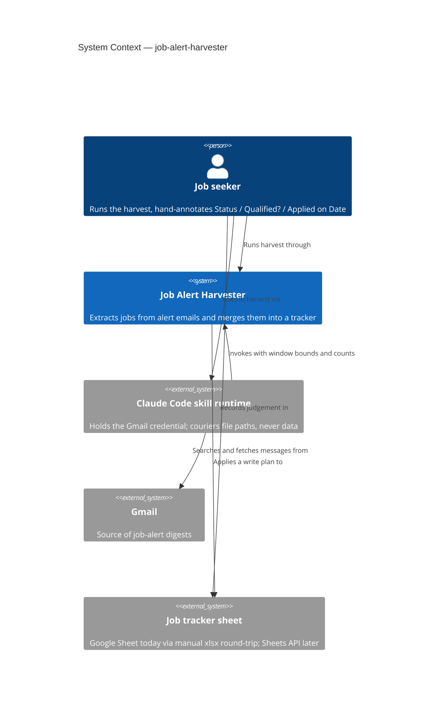
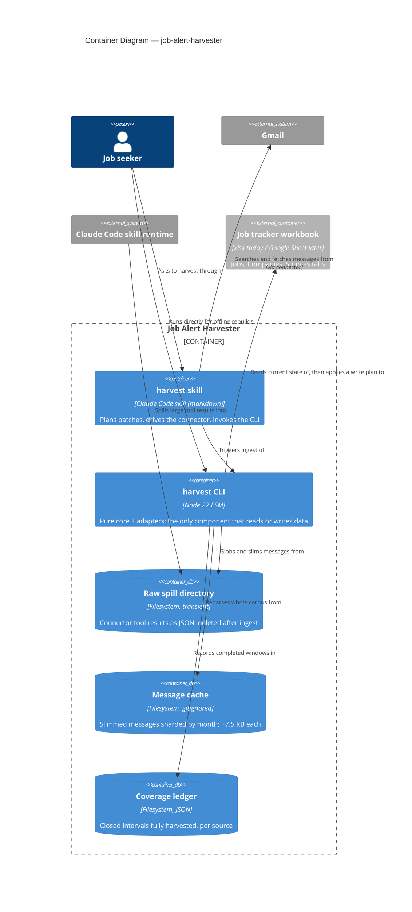

# Architecture Brief — job-search

Single source of truth for architecture across features. Each architect writes one section.
Decision records live in `docs/decisions/DR-NNNN-<slug>.md` (project convention, predates this file).

| Section | Owner | Status |
|---|---|---|
| Application Architecture | solution-architect (Morgan) | drafted 2026-08-01 |
| System Architecture | — | not yet needed (single local process) |
| Domain Model | — | folded into Application Architecture; no separate DDD pass warranted |

---

## Application Architecture

**Feature**: job-alert-harvester
**Style**: Pure Core / Imperative Shell (ports-and-adapters), functional paradigm — confirmed, not re-litigated
**Deployment**: one local Node 22 process, invoked by a human or by a Claude Code skill

### 1. System context and capabilities

The harvester turns a mailbox full of LinkedIn job-alert digests into one row per real job in a
tracking spreadsheet, without ever destroying the columns the user fills in by hand.

Capabilities in this iteration:

| # | Capability | Notes |
|---|---|---|
| C1 | Fetch alert emails from Gmail in bounded, resumable batches | ~400 messages / 90 days |
| C2 | Cache slimmed messages so history can be reparsed offline | per DR-0001 (persist what cannot be re-derived) |
| C3 | Extract every job from every digest, dedup on a canonical key | SPIKE F1/F2 — all LinkedIn alerts are digests |
| C4 | Score fit as a derived value; capture all jobs, filter none | constraint |
| C5 | Merge into an existing sheet, preserving human judgement columns | DR-0001 third application |
| C6 | Record which time windows have been fully harvested | DR-0002 |

Out of scope this iteration: the other seven sources (registry seam designed, adapters not built);
resolving recruiters to end employers; fixing the two known parser gaps.

### 2. C4 Level 1 — System Context



The Claude Code skill runtime is drawn as an external system deliberately: it is a **bridge, not a
component we own**. Its presence is a consequence of the Gmail credential living in a connector
rather than in the CLI. See DR-0003 (agent couriers paths, never data).

### 3. C4 Level 2 — Container



### 4. Component boundaries

Dependencies point inward. `src/core/**` imports no `node:` builtin, no adapter, and no SDK.

| Module | Layer | Responsibility | Contract shape |
|---|---|---|---|
| `core/sources/registry.mjs` | core | Maps a message to its source descriptor | pure |
| `core/sources/linkedin.mjs` | core | Descriptor: match predicate, extractor, dedup key | pure |
| `core/parse-linkedin.mjs` | core | Digest body → raw job rows | pure |
| `core/dedup.mjs` | core | Canonical-id and fuzzy-hash key strategies | pure |
| `core/harvest.mjs` | core | Raw rows → Jobs / Companies / Sources row models | pure |
| `core/classify.mjs` | core | Advertiser → employer \| recruiter \| aggregator | pure |
| `core/fit.mjs` | core | Title → derived fit score and reason | pure |
| `core/slim.mjs` | core | Connector raw payload → cached record shape | pure |
| `core/merge.mjs` | core | (sheet state, harvest model) → `WritePlan` | pure, returns Plan |
| `core/coverage.mjs` | core | Interval algebra over harvested windows | pure |
| `adapters/json-message-reader.mjs` | shell | Reads cached/fixture records (read-only port) | bounded-read |
| `adapters/message-cache.mjs` | shell | Writes slimmed records (write-only port) | bounded-change: `cacheRoot/**` |
| `adapters/raw-spill-source.mjs` | shell | Globs and parses connector spill files | bounded-read |
| `adapters/ledger-store.mjs` | shell | Reads/writes the coverage ledger | bounded-change: `ledger.json` |
| `adapters/xlsx-target-sheet.mjs` | shell | Reads a workbook; executes a `WritePlan` | bounded-change: target path + sibling tmp |
| `cli/harvest.mjs` | shell | Composition root; wire → probe → use | imperative |

Read and write are **separate ports** on the cache and on the target sheet. The core receives only
the reader. A component that "just reads" cannot be handed an object with a write method on it.

### 5. Ports

| Port | Direction | Operations | Interim adapter | Target adapter |
|---|---|---|---|---|
| `MessageSource` | driven | `list(window)`, `read(id)`, `probe()` | `raw-spill-source` (agent in the data path) | `gmail-api-source` (service account) |
| `MessageCacheReader` | driven | `ids()`, `read(id)`, `probe()` | `json-message-reader` | same |
| `MessageCacheWriter` | driven | `put(record)`, `probe()` | `message-cache` | same |
| `CoverageLedger` | driven | `read()`, `commit(interval)`, `probe()` | `ledger-store` | same |
| `TargetSheet` | driven | `read()`, `apply(plan) → Receipt`, `probe()` | `xlsx-target-sheet` | `sheets-api-target` |
| CLI subcommands | driving | `plan-fetch`, `ingest`, `build`, `--dry-run` | `cli/harvest.mjs` | same |

Every driven port carries `probe()`. The composition root wires, probes, then uses; a failed probe
refuses to start and emits a structured `health.startup.refused` line. Probe scenarios are catalogued
in the relevant decision records.

`build --dry-run` returns and prints a `WritePlan` and writes nothing. It is pure by construction:
the plan is computed in `core/merge.mjs`, and only `TargetSheet.apply` can write. "Preview wrote to
the sheet" is not a representable state.

### 6. Technology stack

| Choice | Version | License | Rationale |
|---|---|---|---|
| Node | 22 LTS | — | already the project runtime |
| ESM `.mjs`, no build step | — | — | Cognitive Load Tax: a bundler buys nothing here |
| SheetJS `xlsx` | ^0.18.5 | Apache-2.0 | already in use, writes real workbooks, no alternative needed |
| Vitest | ^3 | MIT | already in use |
| dependency-cruiser (proposed) | ^16 | MIT | enforce the core-purity rule in CI |
| googleapis (future) | ^140 | Apache-2.0 | only when the Sheets/Gmail API adapters land |

No proprietary dependency. No new runtime dependency is added by this design; `dependency-cruiser`
is dev-only and `googleapis` is deferred.

### 7. Integration patterns

- **Agent ↔ CLI**: filesystem hand-off. The agent transmits only low-entropy control values (window
  bounds, counts, booleans) and never a record. Every control value is verified against the ingested
  data before it is trusted. DR-0003.
- **CLI ↔ Gmail (interim)**: indirect, via the connector's spill directory. Failure mode is designed
  to be "nothing ingested", never "partially ingested".
- **CLI ↔ target sheet**: read-plan-apply. The plan is data; the adapter executes it.
- **Retry semantics**: re-running a batch is idempotent — the cache short-circuits re-fetch, and
  coverage is committed only when a window completes.

### 8. Quality attributes

| Attribute (ISO 25010) | Priority | Strategy |
|---|---|---|
| Functional correctness / integrity | **dominant** | one owner per column; agent never carries records; ids verified by round-trip; nothing is ever deleted |
| Maintainability, testability | high | pure core, no `node:` imports; every decision testable without I/O |
| Reliability, recoverability | high | coverage intervals + idempotent re-fetch; full reparse from cache is the default path |
| Portability / replaceability | medium | every agent-mediated port ships with its named API successor |
| Security, confidentiality | medium | ~7.5 MB personal history at rest, gitignored, unencrypted — accepted in DR-0001 |
| Performance efficiency | low | ~10 ms/message; a full-year reparse is ~10 s |

Trade-off point: **integrity vs freshness** on the interim xlsx path. A downloaded file has no
revision identity, so edits made in the Google Sheet between download and re-upload are invisible to
the merge. Mitigated by a merge receipt, not solved. DR-0005.

### 9. Architecture enforcement

Style: Pure Core / Imperative Shell (hexagonal)
Language: JavaScript (ESM, Node 22)
Tool: **dependency-cruiser** (`.dependency-cruiser.cjs`, run in CI and as a pretest script)

Rules to enforce:
- `src/core/**` must not import any `node:` builtin
- `src/core/**` must not import from `src/adapters/**` or `src/cli/**`
- `src/adapters/**` must not import from other adapters
- no circular dependencies anywhere in `src/`

Two further checks belong with the crafter, not with dependency-cruiser:
- **probe presence** — a test asserting every module in `src/adapters/` exports a `probe`
- **probe behaviour** — a fault-injection suite per adapter (scenarios listed in DR-0003 and DR-0005)

### 10. External integrations

| Service | Consumed | Contract testing |
|---|---|---|
| Gmail (via Claude Code connector) | message search + fetch payload shape | Schema-shape test over committed sample spill files. The coupling is to an undocumented harness behaviour — see DR-0003 for the honest fragility assessment. |
| Google Sheets API (future) | `values.get`, `batchUpdate` | Consumer-driven contract via Pact-JS when the adapter lands; record-and-replay fixtures are the cheaper first step for a single-user tool. |

Handoff annotation for platform-architect:

```
External Integrations Requiring Contract Tests:
- Claude Code Gmail connector (tool-result spill files): raw message payload shape
  Recommended: golden-file schema tests over committed spill samples; fail loudly on drift
- Google Sheets API v4 (REST): values.get, spreadsheets.batchUpdate
  Recommended: consumer-driven contracts via Pact-JS in CI, once the adapter exists
```

### 11. Decision index

| DR | Title | Status |
|---|---|---|
| DR-0001 | Persist what cannot be re-derived; recompute what can | accepted (refinedBy DR-0002) |
| DR-0002 | Coverage intervals persist; processed ids derive from the cache | accepted |
| DR-0003 | The agent couriers paths and control values, never records — refined by DR-0007 | accepted |
| DR-0004 | Every column has exactly one owner | accepted |
| DR-0005 | The target sheet is a plan-executing port | accepted |
| DR-0006 | Source registry: descriptors are data, extractors return arrays | accepted |
| DR-0007 | The spill contract is what the harness actually writes | accepted |
